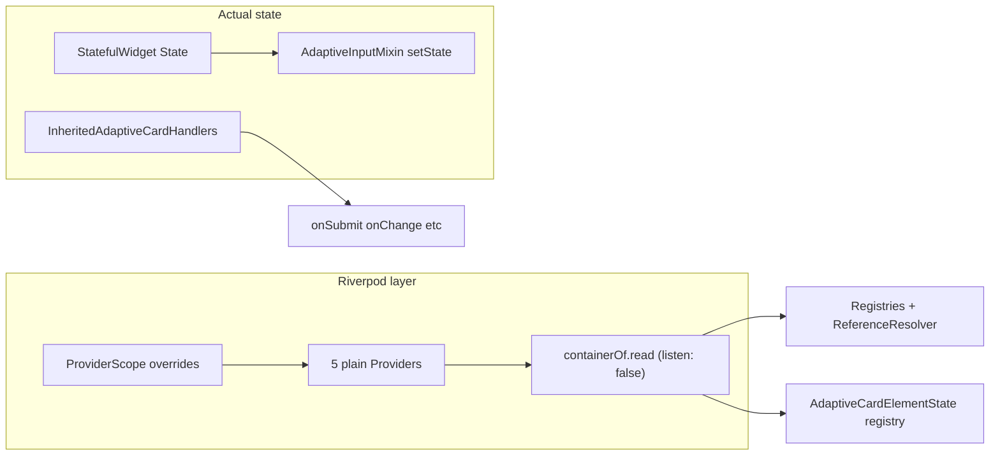

> **⚠️ PLAN STATUS (evaluated 2026-06-16):** This assessment described a **DI-only** Riverpod pattern. The codebase subsequently took the **opposite path** — full reactive Riverpod was adopted. Most findings below are now obsolete or inverted. Remaining open work is in the last section.

---

# Is Riverpod leveraged to its potential?

**Verdict at time of writing: No.** The package uses Riverpod as a **scoped service locator**, not as a state-management framework. That is a valid pattern for this codebase, but it means most of Riverpod's strengths are unused—and you still pay the dependency and API surface cost.

> **~~OBSOLETE~~** — Since this assessment the codebase adopted reactive Riverpod throughout. `NotifierProvider`, `ConsumerStatefulWidget`, `ref.watch`, and `Provider.family` are now in widespread use. See `AGENTS.md` (state management section) and `docs/reactive-riverpod.md`.

---

## What the package actually uses

> **~~OBSOLETE~~** — This table reflected the pre-reactive state. See annotations per row for current status.

| Capability                                     | Was used?                                      | Current status (2026-06-16)                                                                                                                                                                                                                     |
| ---------------------------------------------- | ---------------------------------------------- | ----------------------------------------------------------------------------------------------------------------------------------------------------------------------------------------------------------------------------------------------- |
| `Provider` + `overrideWithValue`               | Yes                                            | ✅ Still yes                                                                                                                                                                                                                                    |
| Nested `ProviderScope`                         | Yes                                            | ✅ Still yes                                                                                                                                                                                                                                    |
| `ProviderScope.containerOf(...).read`          | Yes                                            | ✅ Still yes in some places                                                                                                                                                                                                                     |
| `listen: false` everywhere                     | Yes                                            | ~~OBSOLETE~~ — `ref.watch` now used widely                                                                                                                                                                                                      |
| `ref.watch` / `ConsumerWidget`                 | **No**                                         | ✅ **Now yes** — all input widgets (`choice_set`, `text`, `toggle`, `rating`, `number`, `date`, `time`) and `show_card.dart` use `ConsumerStatefulWidget` / `ConsumerState`; `AdaptiveInputMixin` uses `ref.watch(resolvedElementProvider(id))` |
| `Notifier` / `AsyncNotifier` / `StateNotifier` | **No**                                         | ✅ **Now yes** — `AdaptiveCardDocumentNotifier extends Notifier` (owns overlays, input values, visibility, text, action-enabled state); `ExpandedShowCardIdNotifier`; both via `NotifierProvider`                                               |
| Provider `family` / `autoDispose`              | **No**                                         | ✅ **Now yes** — `resolvedElementProvider` and `resolvedActionProvider` are `Provider.family`                                                                                                                                                   |
| Async/data fetching via providers              | **No**                                         | ➖ Still no                                                                                                                                                                                                                                     |
| Input values / visibility state                | **No** (was `AdaptiveInputMixin` + `setState`) | ✅ **Now yes** — stored in `AdaptiveCardDocumentNotifier` via `setInputValue`, `setVisibility`, `setText`, `setInputError`, `setActionEnabled`; read via `resolvedElementProvider(id)`                                                          |
| Host action callbacks                          | **No** (Riverpod)                              | ➖ Still `InheritedAdaptiveCardHandlers` — intentionally kept on `InheritedWidget` (AGENTS.md policy)                                                                                                                                           |

---

## Misalignment with docs and AGENTS.md

> **✅ COMPLETED** (`docs-align` todo) — All docs updated:
>
> - `AGENTS.md` now documents reactive Riverpod v3.x correctly (see "State management" section).
> - `docs/Architecture-Overview.md` reflects `AdaptiveCardDocumentNotifier`, `resolvedElementProvider`, and scoped `ProviderScope`.
> - `docs/reactive-riverpod.md` is the canonical Riverpod usage guide.
> - The `replace-riverpod.md` path was superseded — removal was not pursued.

---

## Is the current pattern "wrong"?

> **~~PARTIALLY OBSOLETE~~** — The DI-only concerns no longer apply. Items addressed:

- ✅ **Reactive invalidation** — now handled via `ref.watch` + Notifiers; `setState` on `RawAdaptiveCardState` is no longer the sole rebuild trigger for input/overlay changes.
- ✅ **Duplicate DI models reduced** — Riverpod owns document/input/UI state; `InheritedAdaptiveCardHandlers` is intentionally kept for host callbacks only, now documented as policy.
- 🔄 **Imperative `containerOf`** — still exists in some places alongside `ref.watch`.
- ➖ **Transitive dependency** — `flutter_riverpod` remains a transitive dep for all consumers (unchanged).

---

## Would "using Riverpod more" help?

> **~~MOSTLY OBSOLETE~~** — The hypotheticals were acted on:

| Hypothetical adoption                                       | Status                                                                        |
| ----------------------------------------------------------- | ----------------------------------------------------------------------------- |
| Move input state to `NotifierProvider`                      | ✅ Done — `AdaptiveCardDocumentNotifier` owns overlays                        |
| `ref.watch(styleReferenceResolverProvider)` on theme change | ✅ Answered 2026-06-16 — see note below                                       |
| Replace `InheritedAdaptiveCardHandlers` with providers      | ➖ Not done — kept on `InheritedWidget` by AGENTS.md policy                   |
| `ConsumerWidget` for elements                               | ✅ Done — inputs and show-card use `ConsumerStatefulWidget`                   |

**`styleReferenceResolverProvider` theme rebuild (answered 2026-06-16):** Neither `ref.watch` nor `setState`. Propagation is via Flutter's `didChangeDependencies` mechanism: `ProviderScope.containerOf(context)` (default `listen: true`) registers an InheritedWidget dependency; when the override updates, element `didChangeDependencies()` fires and they re-read `styleResolver` fresh. No `ref.watch` conversion needed. **Side-effect bug found:** `ProviderScope(key: ValueKey<Brightness?>(...))` in [`flutter_raw_adaptive_card.dart`](packages/flutter_adaptive_cards_fs/lib/src/flutter_raw_adaptive_card.dart) destroys the `AdaptiveCardDocumentNotifier` (all input values, overlays) on brightness toggle — see `remove-providerscope-key` todo.

---

## Recommendation summary

> **~~OBSOLETE~~** — The "remove Riverpod" and "DI-only" paths were not taken. The project chose "maximize Riverpod" for internal state while intentionally keeping `InheritedAdaptiveCardHandlers` for host callbacks. This is now documented policy in `AGENTS.md`.

---

## Remaining open work (as of 2026-06-16)

### `handler-consolidation` — effectively won't-do

`InheritedAdaptiveCardHandlers` still coexists with the Riverpod scope. AGENTS.md has settled on keeping host callbacks there intentionally as a public-API boundary (not a Riverpod implementation detail). This todo is **deferred / won't-do unless product requirements change**. To formally close it, add a note to `docs/reactive-riverpod.md` explaining the intentional split.

### `styleReferenceResolverProvider` theme rebuild path — new open question

The original plan flagged that theme/`HostConfig` updates rebuilt via `RawAdaptiveCardState.setState`. Now that `ref.watch` is the pattern, verify whether widgets that care about style changes watch `styleReferenceResolverProvider` reactively — or still rely on `setState` as the rebuild trigger. If still `setState`, this is a candidate follow-up for reactive wiring.
