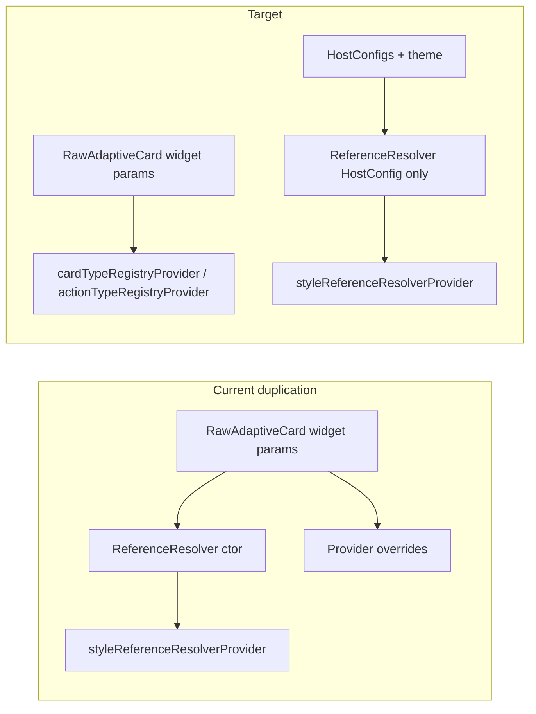

# Decouple registries from ReferenceResolver

## Finding (safe to remove)

[`ReferenceResolver`](packages/flutter_adaptive_cards_fs/lib/src/reference_resolver.dart) stores `cardTypeRegistry` and `actionTypeRegistry` but **never reads them** in any `resolve*` method. They exist only on:

- public/private constructors (lines 43–44, 50–51)
- `final` fields (57–58)
- `copyWith` passthrough (336–337)

All runtime registry usage already goes through Riverpod:

```31:39:packages/flutter_adaptive_cards_fs/lib/src/adaptive_mixins.dart
  CardTypeRegistry get cardTypeRegistry => _container.read(cardTypeRegistryProvider);

  ActionTypeRegistry get actionTypeRegistry =>
      _container.read(actionTypeRegistryProvider);

  ReferenceResolver get styleResolver => _container.read(styleReferenceResolverProvider);
```

The only duplicate is in [`flutter_raw_adaptive_card.dart`](packages/flutter_adaptive_cards_fs/lib/src/flutter_raw_adaptive_card.dart): `_updateResolver()` still passes registries into `ReferenceResolver`, while `build()` already overrides `cardTypeRegistryProvider` / `actionTypeRegistryProvider` from widget params.



## Code changes

### 1. Slim `ReferenceResolver`

In [`reference_resolver.dart`](packages/flutter_adaptive_cards_fs/lib/src/reference_resolver.dart):

- Remove imports: `action_type_registry.dart`, `registry.dart`
- Remove constructor parameters, private ctor parameters, fields, and `copyWith` passthrough for both registries
- Update class-level `///` doc to state: **HostConfig + container-style facade only**; element/action factories come from `cardTypeRegistryProvider` / `actionTypeRegistryProvider`
- Keep `currentContainerStyle`, `hostConfigs`, and `copyWith({String? style})` unchanged (container style inheritance still uses `currentContainerStyle` internally)

**API note:** This is a **breaking change** for any external code that constructed `ReferenceResolver(..., cardTypeRegistry: ..., actionTypeRegistry: ...)`. Repo grep shows **one** construction site (`_updateResolver`); no lib/tests read `resolver.cardTypeRegistry`.

### 2. Stop passing registries into the resolver

In [`flutter_raw_adaptive_card.dart`](packages/flutter_adaptive_cards_fs/lib/src/flutter_raw_adaptive_card.dart) `_updateResolver()`:

```dart
_resolver = ReferenceResolver(hostConfigs: widget.hostConfigs);
```

No change to `ProviderScope` overrides (lines 408–415): registries remain widget-driven overrides; resolver override stays `styleReferenceResolverProvider.overrideWithValue(_resolver)`.

### 3. No element/action churn

Files that call `cardTypeRegistry.getElement` / `actionTypeRegistry.getActionForType` via `ProviderScopeMixin` or `AdaptiveElementMixin` **stay as-is** — they already do not use the resolver for registries.

[`AdaptiveCardsCanvas`](packages/flutter_adaptive_cards_fs/lib/src/adaptive_cards_canvas.dart) continues to accept optional `cardTypeRegistry` / `actionTypeRegistry` constructor params and pass them to `RawAdaptiveCard` (host extension API unchanged).

### 4. Verification

From `packages/flutter_adaptive_cards_fs`:

- `fvm flutter analyze`
- `fvm flutter test` (especially [`test/inherited_reference_resolver_test.dart`](packages/flutter_adaptive_cards_fs/test/inherited_reference_resolver_test.dart) — already asserts registry providers; optional small assertion that `ReferenceResolver` has no registry getters if you add a compile-time check via analyzer only)

Optional grep sanity check after edit: `cardTypeRegistry` / `actionTypeRegistry` should not appear in `reference_resolver.dart`.

---

## Documentation and skills updates

Align all references with: **Riverpod scopes + separate registry providers + HostConfig-only `ReferenceResolver`**. Remove mentions of deleted [`InheritedReferenceResolver`](packages/flutter_adaptive_cards_fs/lib/src/inherited_reference_resolver.dart) (file already removed in the Riverpod migration).

| File                                                                                                                 | What to change                                                                                                                                                                                                                                       |
| -------------------------------------------------------------------------------------------------------------------- | ---------------------------------------------------------------------------------------------------------------------------------------------------------------------------------------------------------------------------------------------------- |
| [`doc/reactive-riverpod.md`](doc/reactive-riverpod.md)                                                               | Clarify bullet: `ReferenceResolver` = HostConfig/theme only; registries are **not** part of the resolver                                                                                                                                             |
| [`doc/Architecture-Overview.md`](doc/Architecture-Overview.md)                                                       | Table row: split “Registries” vs “ReferenceResolver” explicitly                                                                                                                                                                                      |
| [`doc/adaptive-style.md`](doc/adaptive-style.md)                                                                     | Replace `InheritedReferenceResolver.rawCardScopeOf(context).resolver` examples with `ProviderScope.containerOf(context).read(styleReferenceResolverProvider)` or `styleResolver` via mixin                                                           |
| [`.agents/skills/adaptive-cards-hostconfig-theme/SKILL.md`](.agents/skills/adaptive-cards-hostconfig-theme/SKILL.md) | Rewrite “How ReferenceResolver is Created and Distributed”: `ProviderScope` overrides, `_updateResolver()` with **hostConfigs only**, remove `InheritedReferenceResolver` snippets; fix “Reading the Resolver” to `ProviderScopeMixin.styleResolver` |
| [`.agents/skills/adaptive-cards-element-registry/SKILL.md`](.agents/skills/adaptive-cards-element-registry/SKILL.md) | Fix mixin table: registries come from `ProviderScopeMixin` / providers, not `AdaptiveElementMixin`; replace “Do not add Riverpod” note with pointer to [`doc/reactive-riverpod.md`](doc/reactive-riverpod.md); update “Accessing HostConfig” section |
| [`.agents/skills/code-review/SKILL.md`](.agents/skills/code-review/SKILL.md)                                         | Checklist: `styleResolver` / `ProviderScope.containerOf` for theme; registries via providers, not resolver                                                                                                                                           |
| [`packages/flutter_adaptive_cards_fs/README.md`](packages/flutter_adaptive_cards_fs/README.md)                       | Widget hierarchy: `ProviderScope` + named providers (not legacy `Provider<T>`)                                                                                                                                                                       |
| [`packages/flutter_adaptive_cards_fs/CHANGELOG.md`](packages/flutter_adaptive_cards_fs/CHANGELOG.md)                 | Add **Unreleased** (or next version) entry: `ReferenceResolver` no longer carries registries; use `cardTypeRegistryProvider` / `actionTypeRegistryProvider` if integrating at provider level                                                         |
| [`AGENTS.md`](AGENTS.md)                                                                                             | One line under state management: registries and resolver are **separate** scoped providers                                                                                                                                                           |

**Out of scope (optional follow-up):** Rebuild `styleReferenceResolverProvider` as a `Provider` that `ref.watch`es theme + `hostConfigs` instead of `overrideWithValue(_resolver)` — not required to complete registry decoupling.

---

## Success criteria

- `ReferenceResolver` public API contains only HostConfig/style concerns (`hostConfigs`, `currentContainerStyle`, `copyWith(style:)`).
- `RawAdaptiveCard` constructs resolver with `hostConfigs` only; registries supplied solely via Riverpod overrides.
- Docs/skills describe Riverpod scopes and no longer claim registries live on `ReferenceResolver` or `InheritedReferenceResolver`.
- `fvm flutter analyze` and package tests pass.
