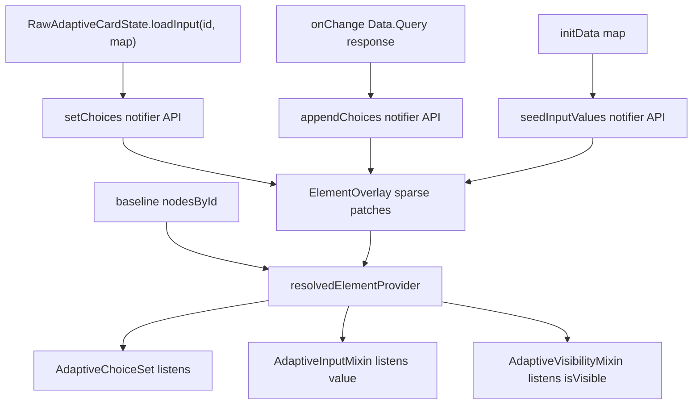

# Extend ElementOverlay for ChoiceSet and Runtime State

## Goal

Move remaining runtime element state out of widget-local fields and element-tree walks into the existing baseline + overlay model documented in [`doc/reactive-riverpod.md`](doc/reactive-riverpod.md).

Today [`ElementOverlay`](packages/flutter_adaptive_cards_fs/lib/src/riverpod/adaptive_card_document.dart) only patches `isVisible` and `inputValue` (`"value"`). Per the [Adaptive Cards schema](https://adaptivecards.io/explorer/Input.ChoiceSet.html), the highest-value addition is **`choices`** on `Input.ChoiceSet`; **`choices.data`** stays mostly baseline with optional session overlays for pagination.

## Architecture (target state)



## Phase 1 — `choices` overlay (core)

### 1. Extend `ElementOverlay`

In [`adaptive_card_document.dart`](packages/flutter_adaptive_cards_fs/lib/src/riverpod/adaptive_card_document.dart):

```dart
class ElementOverlay {
  const ElementOverlay({
    this.isVisible,
    this.inputValue,
    this.choices,           // NEW: List<Map<String, dynamic>> or List<Choice>
  });
  final List<Map<String, dynamic>>? choices;
}
```

Use `List<Map<String, dynamic>>` (serialized `Input.Choice` shape) to keep overlay JSON-mergeable and avoid coupling to widget models in the document layer. Reuse [`Choice.toJson()`](packages/flutter_adaptive_cards_fs/lib/src/models/choice.dart) at the notifier boundary.

### 2. Merge rules in `resolvedElementProvider`

In [`providers.dart`](packages/flutter_adaptive_cards_fs/lib/src/riverpod/providers.dart):

| Field | Merge rule |
|-------|------------|
| `choices` | If overlay `choices != null`, set `merged['choices'] = overlay.choices`. Else use baseline. |

**Replace vs append:** Current [`loadInput`](packages/flutter_adaptive_cards_fs/lib/src/cards/inputs/choice_set.dart) **replaces** the entire choice list. Spec typeahead **appends** dynamic results to static baseline choices. Support both via notifier APIs:

- `setChoices(String id, List<Choice> choices)` — replace effective list (preserves `isVisible` / `inputValue`)
- `appendChoices(String id, List<Choice> choices)` — merge baseline static + overlay + new items (dedupe by `value`)

Default `loadInput` behavior maps to `setChoices`.

### 3. Notifier APIs

In [`adaptive_card_document_notifier.dart`](packages/flutter_adaptive_cards_fs/lib/src/riverpod/adaptive_card_document_notifier.dart):

- `setChoices(String id, List<Choice> choices)`
- `appendChoices(String id, List<Choice> choices)` (for future typeahead; can land in Phase 1 with tests)
- Update `setVisibility` / `setInputValue` to preserve existing `choices` (same pattern as today for cross-field preservation)
- Update `resetAllInputs()` to **clear `choices` overlay** on input ids (fall back to baseline static choices; preserve `isVisible`)

### 4. Refactor `AdaptiveChoiceSet`

In [`choice_set.dart`](packages/flutter_adaptive_cards_fs/lib/src/cards/inputs/choice_set.dart):

- Remove `_choices` as source of truth; derive from `resolvedElementProvider(id)['choices']` via a subscription (mirror [`AdaptiveInputMixin.didChangeDependencies`](packages/flutter_adaptive_cards_fs/lib/src/adaptive_mixins.dart))
- Keep `_selectedChoices` local for UI, synced from resolved `value` via existing `AdaptiveInputMixin` listener + `onDocumentValueChanged`
- Delete or thin `loadInput` override to call notifier (or remove once public API delegates)
- `initState`: still read initial choices from constructor `adaptiveMap`; overlay listener takes over after first frame

### 5. Replace tree walk for `loadInput`

In [`flutter_raw_adaptive_card.dart`](packages/flutter_adaptive_cards_fs/lib/src/flutter_raw_adaptive_card.dart):

```dart
void loadInput(String id, Map map) {
  // Convert title->value map to List<Choice>, call notifier.setChoices
}
```

Requires access to `ProviderContainer` from `RawAdaptiveCardState` (already available via nested `ProviderScope`). **Keep method signature** for backward compatibility; implementation becomes a notifier call.

No external callers exist today (grep confirms library-only), but the public API remains stable.

### 6. Tests

Following [`adaptive-cards-testing` skill](.agents/skills/adaptive-cards-testing/SKILL.md):

- Unit/widget test: `setChoices` updates resolved map and ChoiceSet rebuilds options
- Widget test: `loadInput(id, map)` via `RawAdaptiveCardState` still works (delegates to overlay)
- Widget test: `resetAllInputs` clears dynamic choices, static baseline choices remain
- Widget test: existing [`choice_set_data_query_test.dart`](packages/flutter_adaptive_cards_fs/test/inputs/choice_set_data_query_test.dart) still passes (`choices.data` unchanged on baseline)

### 7. Docs

Update [`doc/reactive-riverpod.md`](doc/reactive-riverpod.md) overlay table and merge snippet to include `choices`.

---

## Phase 2 — `initData` via overlays

Today [`initData`](packages/flutter_adaptive_cards_fs/lib/src/flutter_raw_adaptive_card.dart) walks the element tree in a post-frame callback and calls per-widget `initInput`. This bypasses the overlay model (ChoiceSet `initInput` even skips `setDocumentInputValue`).

### Changes

- Add `seedInputValues(Map<String, Object?> values)` on `AdaptiveCardDocumentNotifier` — for each key matching an indexed input id, call `setInputValue`
- Replace post-frame `initInput(widget.initData!)` with `seedInputValues` on the document notifier
- Keep `initInput` on mixin as **deprecated/no-op or thin delegate** for any direct callers; inputs already listen to `resolvedElementProvider`

Benefits: ChoiceSet and all inputs get consistent reactive seeding; no element-tree walk.

Update existing initData tests under [`test/inputs/`](packages/flutter_adaptive_cards_fs/test/inputs/).

---

## Phase 3 — `Data.Query` session state (optional / follow-up)

Per [Data.Query spec](https://adaptivecards.io/explorer/Data.Query.html), **`dataset` stays baseline**; runtime pagination belongs in session state.

### 3a. Fix `DataQuery` model

[`data_query.dart`](packages/flutter_adaptive_cards_fs/lib/src/models/data_query.dart) is missing spec fields `count` and `skip`. Add them to `fromJson` / `toJson`. Treat `parameters` as a host extension (document but don't require in schema tests).

### 3b. Session overlay (separate from author config)

Add optional session fields to `ElementOverlay` (or a nested `DataQuerySession`):

```dart
final int? queryCount;
final int? querySkip;
final String? querySearchText; // event payload only, not baseline JSON
```

Merge into resolved `choices.data` only for `count`/`skip` when non-null. **`querySearchText` does not merge into resolved element JSON** — pass to `onChange` / future invoke handler only.

Only implement when adding typeahead UI that paginates; Phase 1 `choices` overlay unblocks host-driven `loadInput` / `setChoices` without this.

---

## Explicitly out of scope

| Item | Reason |
|------|--------|
| `label`, `placeholder`, `isRequired`, `style`, etc. | Author-time baseline; refresh via new card payload |
| Body element content (`text`, `items`, `facts`) | Structural; belongs in baseline replacement (`Refresh`) |
| ShowCard expanded state | Already [`expandedShowCardIdProvider`](packages/flutter_adaptive_cards_fs/lib/src/riverpod/show_card_ui_notifier.dart) |
| Validation display flag | UX-only; not spec JSON; defer unless requested |
| Full typeahead / invoke pipeline | Requires host bot contract; Phase 3 prep only |

---

## Implementation order

1. **Phase 1** — unblocks ChoiceSet reactive updates and removes `loadInput` tree walk (highest ROI, aligns with spec Step 4 from [#3924](https://github.com/microsoft/AdaptiveCards/issues/3924))
2. **Phase 2** — consolidates `initData` with overlay model (small diff, high consistency)
3. **Phase 3** — when implementing filtered/typeahead pagination UI

## Risk notes

- **ChoiceSet `loadInput` clears selection today** — preserve that in `setChoices` (clear `inputValue` overlay or let widget reset selection when choices change)
- **Merge key preservation** — every notifier write must copy forward unrelated overlay fields (existing pattern in `setVisibility` / `setInputValue`)
- **`resetInput` on ChoiceSet** — should reset `inputValue` to baseline via mixin; dynamic `choices` overlay unaffected unless `ResetInputs` action fires
