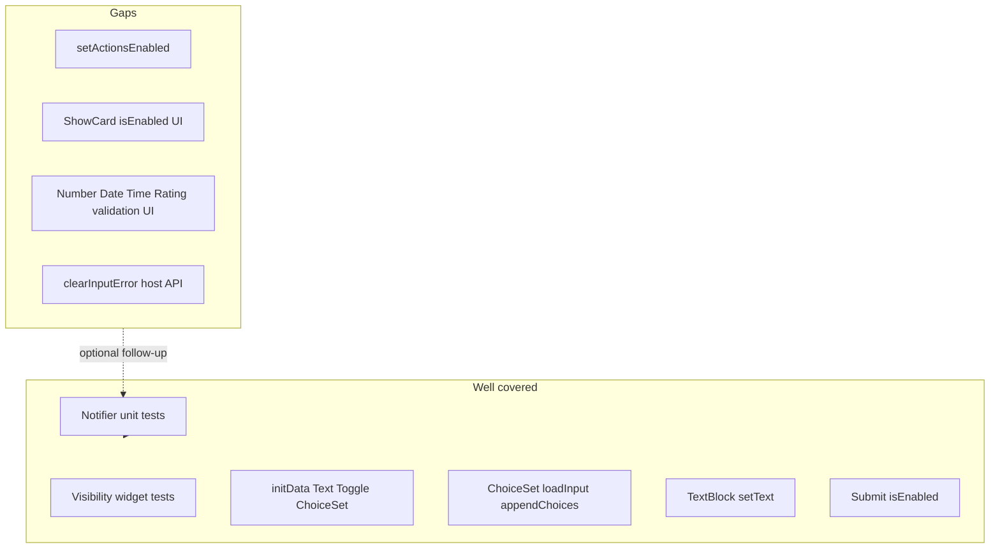

# Overlay test coverage — status and needs

## Summary

| Question | Answer |
| --- | --- |
| **Original plan (Phases 1–5)?** | **Done** — notifier unit tests, initData overlay widgets, extended ChoiceSet/reset tests, testing skill updated. |
| **Enough to validate all overlay fields end-to-end per type?** | **No** — notifier + merge providers are well covered; widget tests are **representative**, not exhaustive per `Input.*` / `Action.*`. |
| **What’s left?** | Document analysis in **element-registry** skill (pending); optional gap-filling tests (low priority unless regressions appear). |

---

## Completed work (original + follow-on)

### Phase 1–5 (original plan) — shipped

- [`test/riverpod/adaptive_card_document_notifier_test.dart`](packages/flutter_adaptive_cards_fs/test/riverpod/adaptive_card_document_notifier_test.dart) — baseline fixture, input/visibility/choices/reset/collect, `setDataQuerySession`, cross-field preservation
- [`test/inputs/init_data_overlay_test.dart`](packages/flutter_adaptive_cards_fs/test/inputs/init_data_overlay_test.dart) — Text, Toggle, ChoiceSet, unknown id, `initInput`
- [`test/inputs/choice_set_overlay_test.dart`](packages/flutter_adaptive_cards_fs/test/inputs/choice_set_overlay_test.dart) — extended with selection clear, dedupe, resolved map
- [`test/inputs/action_reset_inputs_test.dart`](packages/flutter_adaptive_cards_fs/test/inputs/action_reset_inputs_test.dart) — dynamic choices + ResetInputs
- [`adaptive-cards-testing/SKILL.md`](.agents/skills/adaptive-cards-testing/SKILL.md) — **Reactive document tests** section lists overlay files

### Additional overlay features — shipped since original plan

| Feature | Tests | Library |
| --- | --- | --- |
| `errorMessage` / `isInvalid` | `input_error_overlay_test.dart`; notifier **validation and action overlays** group | `AdaptiveInputMixin` |
| `text` (TextBlock) | `text_block_text_overlay_test.dart`; notifier **TextBlock text overlays** group; rebuild survival | `AdaptiveTextBlock` |
| `isEnabled` (actions) | `action_enabled_overlay_test.dart`; `test/samples/v1.5/action_is_enabled.json`; notifier action group | `IconButtonAction` / Submit; `ShowCard` reads provider (untested toggle) |
| Stable baseline on card rebuild | `text overlay survives RawAdaptiveCard rebuild` | [`flutter_raw_adaptive_card.dart`](packages/flutter_adaptive_cards_fs/lib/src/flutter_raw_adaptive_card.dart) `_baselineMap` cache |

### Out of scope / deferred (still medium priority)

- Dedicated `data_query_test.dart` for full typeahead stub
- Filtered ChoiceSet + `data_query_filtered.json` beyond existing [`choice_set_data_query_test.dart`](packages/flutter_adaptive_cards_fs/test/inputs/choice_set_data_query_test.dart). Filtered UI searches/displays **titles**; values used for submit/`onChange` ([form-inputs.md § Filtered ChoiceSet](../../docs/form-inputs.md#filtered-choiceset-style-style-filtered)).

---

## Current overlay surface

From [`adaptive_card_document.dart`](packages/flutter_adaptive_cards_fs/lib/src/riverpod/adaptive_card_document.dart):

**`ElementOverlay`:** `isVisible`, `inputValue`, `choices`, `queryCount` / `querySkip` / `querySearchText`, `errorMessage`, `isInvalid`, `text`

**`ActionOverlay`:** `isEnabled`

**Merge:** [`resolvedElementProvider`](packages/flutter_adaptive_cards_fs/lib/src/riverpod/providers.dart), [`resolvedActionProvider`](packages/flutter_adaptive_cards_fs/lib/src/riverpod/providers.dart)

---

## Coverage matrix (current)

### Element overlays

| Field | Notifier | Widget / integration | Gap |
| --- | --- | --- | --- |
| `isVisible` | Yes | [`is_visible_test.dart`](packages/flutter_adaptive_cards_fs/test/elements/is_visible_test.dart) | — |
| `inputValue` | Yes | init_data (Text, Toggle, ChoiceSet); legacy UI tests in `test/inputs/*` | **Number, Date, Time, Rating** — no overlay-specific widget tests |
| `choices` / append | Yes | choice_set_overlay + reset action | — |
| `queryCount` / `querySkip` | Yes | choice_set_data_query_test | `querySearchText` — notifier only |
| `errorMessage` / `isInvalid` | Yes | **Input.Text only** in input_error_overlay_test | Other input types; `RawAdaptiveCardState.clearInputError` delegate |
| `text` | Yes | **TextBlock only** | Only element type using `text` overlay |

### Action overlays

| API | Notifier | Widget | Gap |
| --- | --- | --- | --- |
| `setActionEnabled` | Yes | **Action.Submit** via IconButtonAction | **Action.ShowCard** UI; other action types |
| `setActionsEnabled` (bulk) | **No** | **No** | Not tested |

### Cross-cutting

| Concern | Status |
| --- | --- |
| `resetAllInputs` preserves visibility, action overlays, TextBlock text | Notifier + widget (ChoiceSet) |
| `collectInputValues` | Notifier only |
| Host APIs (`setText`, `setInputError`, `setActionEnabled`) | Partial delegate tests; not `clearInputError` |
| Rebuild does not wipe overlays | TextBlock widget test + `_baselineMap` fix |



---

## Remaining needs

### 1. Documentation (pending — primary ask from coverage review)

Update [`adaptive-cards-element-registry/SKILL.md`](.agents/skills/adaptive-cards-element-registry/SKILL.md):

- Add **## Overlay test coverage** after **Runtime state: baseline + overlays**
- Include **verdict** (model strong; per-type widget partial)
- Condensed **matrix** (tables above)
- **Gaps** and **how to add tests** when extending overlays (notifier first → widget → host API)
- Link to [`adaptive-cards-testing/SKILL.md`](.agents/skills/adaptive-cards-testing/SKILL.md)

Optional: **Coverage gaps** subsection in testing skill pointing to element-registry (avoid duplicating full matrix).

### 2. Optional tests (only if tightening regressions)

Priority order:

1. `setActionsEnabled` — notifier unit test (2–3 action ids)
2. `Action.ShowCard` — widget: `setActionEnabled` toggles expand control
3. One non–Input.Text validation widget (e.g. `Input.Number`) — proves `AdaptiveInputMixin` wiring
4. `RawAdaptiveCardState.clearInputError` delegate test
5. Rebuild survival with visibility or input overlay (not only TextBlock)

### 3. Widgetbook (separate from library test coverage)

- Text overlay knob demo: [`widgetbook/lib/text_block_overlay_page.dart`](widgetbook/lib/text_block_overlay_page.dart) + `textBlockOverlayPageKey` pattern documented in [`widgetbook/CHANGELOG.md`](widgetbook/CHANGELOG.md)

---

## Verification (regression)

```bash
cd packages/flutter_adaptive_cards_fs
fvm flutter test test/riverpod/adaptive_card_document_notifier_test.dart
fvm flutter test test/inputs/init_data_overlay_test.dart
fvm flutter test test/inputs/choice_set_overlay_test.dart
fvm flutter test test/inputs/input_error_overlay_test.dart
fvm flutter test test/elements/text_block_text_overlay_test.dart
fvm flutter test test/actions/action_enabled_overlay_test.dart
fvm flutter test test/inputs/action_reset_inputs_test.dart
```

---

## Related plan

Broader SKILL documentation draft (archived): [`2026-06-02-overlay_test_coverage_skill_f45d8c5a.plan.md`](../archive/plans/2026-06-02-overlay_test_coverage_skill_f45d8c5a.plan.md) — merge into this file’s doc tasks; do not duplicate execution.
