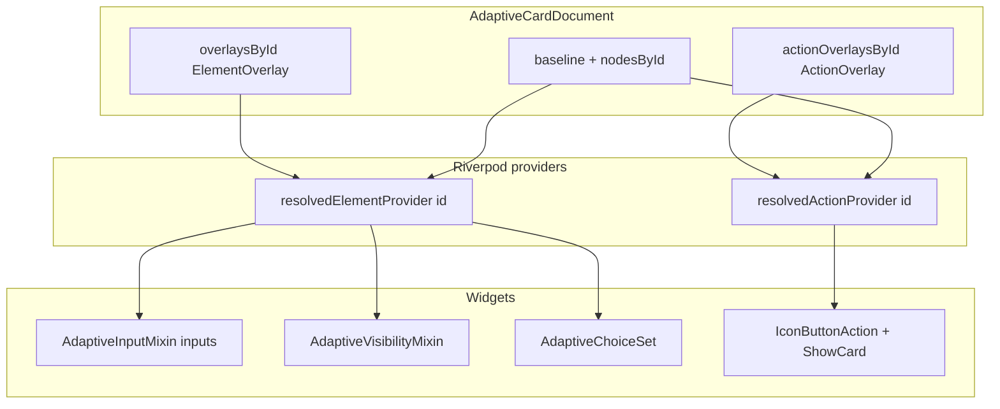

# ElementOverlay + ActionOverlay plan

## Current state

[`ElementOverlay`](packages/flutter_adaptive_cards_fs/lib/src/riverpod/adaptive_card_document.dart) today:

| Field                      | Merged into `resolvedElementProvider` |
| -------------------------- | ------------------------------------- |
| `isVisible`                | `isVisible`                           |
| `inputValue`               | `value`                               |
| `choices`                  | `choices`                             |
| `queryCount` / `querySkip` | `choices.data.count` / `.skip`        |
| `querySearchText`          | _(overlay only, not merged)_          |

[`_indexNodesById`](packages/flutter_adaptive_cards_fs/lib/src/riverpod/adaptive_card_document_notifier.dart) already walks the full baseline tree and indexes **any** map with a natural `id`, including **`Action.*`** nodes—not only body elements.

Actions render via [`IconButtonAction`](packages/flutter_adaptive_cards_fs/lib/src/cards/actions/icon_button.dart) (`ElevatedButton` with `onPressed` always set). **`isEnabled` is not read anywhere** in the package today.

Input `errorMessage` is read once in [`AdaptiveInputMixin.initState`](packages/flutter_adaptive_cards_fs/lib/src/adaptive_mixins.dart); validation UI uses widget-local `stateHasError` only.

---

## Who uses `ElementOverlay` today

### Direct (read/write overlay model)

| Location                                                                                                                           | Role                                                           |
| ---------------------------------------------------------------------------------------------------------------------------------- | -------------------------------------------------------------- |
| [`adaptive_card_document.dart`](packages/flutter_adaptive_cards_fs/lib/src/riverpod/adaptive_card_document.dart)                   | Defines `ElementOverlay` + `AdaptiveCardDocument.overlaysById` |
| [`adaptive_card_document_notifier.dart`](packages/flutter_adaptive_cards_fs/lib/src/riverpod/adaptive_card_document_notifier.dart) | All `_updateOverlay` / `resetAllInputs` / `collectInputValues` |

### Indirect (consume via `resolvedElementProvider` or notifier)

| Location                                                                                                      | Role                                                                    |
| ------------------------------------------------------------------------------------------------------------- | ----------------------------------------------------------------------- |
| [`providers.dart`](packages/flutter_adaptive_cards_fs/lib/src/riverpod/providers.dart)                        | `resolvedElementProvider` merge logic                                   |
| [`adaptive_mixins.dart`](packages/flutter_adaptive_cards_fs/lib/src/adaptive_mixins.dart)                     | `AdaptiveInputMixin` (`value`), `AdaptiveVisibilityMixin` (`isVisible`) |
| [`choice_set.dart`](packages/flutter_adaptive_cards_fs/lib/src/cards/inputs/choice_set.dart)                  | Listens for `choices`                                                   |
| [`flutter_raw_adaptive_card.dart`](packages/flutter_adaptive_cards_fs/lib/src/flutter_raw_adaptive_card.dart) | `initInput` → `seedInputValues`; `loadInput` → `setChoices`             |
| [`default_actions.dart`](packages/flutter_adaptive_cards_fs/lib/src/action/default_actions.dart)              | `resetAllInputs`, `toggleVisibility`, reads `nodesById` on submit       |

### Input widgets using `AdaptiveInputMixin` (will gain error overlay listener)

- [`text.dart`](packages/flutter_adaptive_cards_fs/lib/src/cards/inputs/text.dart)
- [`number.dart`](packages/flutter_adaptive_cards_fs/lib/src/cards/inputs/number.dart)
- [`date.dart`](packages/flutter_adaptive_cards_fs/lib/src/cards/inputs/date.dart)
- [`time.dart`](packages/flutter_adaptive_cards_fs/lib/src/cards/inputs/time.dart)
- [`toggle.dart`](packages/flutter_adaptive_cards_fs/lib/src/cards/inputs/toggle.dart)
- [`choice_set.dart`](packages/flutter_adaptive_cards_fs/lib/src/cards/inputs/choice_set.dart) (also listens for `choices`)

### Tests touching overlays

- [`test/riverpod/adaptive_card_document_notifier_test.dart`](packages/flutter_adaptive_cards_fs/test/riverpod/adaptive_card_document_notifier_test.dart)
- [`test/inputs/init_data_overlay_test.dart`](packages/flutter_adaptive_cards_fs/test/inputs/init_data_overlay_test.dart)
- [`test/inputs/choice_set_overlay_test.dart`](packages/flutter_adaptive_cards_fs/test/inputs/choice_set_overlay_test.dart)
- [`test/inputs/choice_set_data_query_test.dart`](packages/flutter_adaptive_cards_fs/test/inputs/choice_set_data_query_test.dart)
- [`test/elements/is_visible_test.dart`](packages/flutter_adaptive_cards_fs/test/elements/is_visible_test.dart)
- [`test/inputs/action_reset_inputs_test.dart`](packages/flutter_adaptive_cards_fs/test/inputs/action_reset_inputs_test.dart)

**No action overlay type exists yet.** Action widgets do not subscribe to resolved maps.

---

## Target architecture



**Separation rationale:** `ElementOverlay` fields (`inputValue`, `choices`, …) do not apply to `Action.*` nodes. A dedicated [`ActionOverlay`](packages/flutter_adaptive_cards_fs/lib/src/riverpod/adaptive_card_document.dart) avoids polluting input reset/merge logic and keeps `collectInputValues` unchanged.

---

## Phase 1 — Model and providers

### 1.1 Extend `ElementOverlay`

Add (per your preference: **separate** invalid flag + message):

- `errorMessage` (`String?`) → merge into resolved `errorMessage`
- `isInvalid` (`bool?`) → merge into resolved `isInvalid` (new key on merged map for runtime; mirrors host-driven validation, distinct from Flutter `Form` validator)

Update `copyWith` with `clearErrorMessage` / `clearIsInvalid` flags (same pattern as `clearInputValue`).

### 1.2 Add `ActionOverlay`

```dart
class ActionOverlay {
  const ActionOverlay({this.isEnabled});
  final bool? isEnabled; // merged into resolved isEnabled
}
```

### 1.3 Extend `AdaptiveCardDocument`

- `actionOverlaysById: Map<String, ActionOverlay>`
- `copyWith` includes action overlays
- Bump `revision` on any element **or** action overlay change (existing pattern)

### 1.4 Providers ([`providers.dart`](packages/flutter_adaptive_cards_fs/lib/src/riverpod/providers.dart))

**`resolvedElementProvider`** — add merge:

```dart
if (overlay?.errorMessage != null) merged['errorMessage'] = overlay!.errorMessage;
if (overlay?.isInvalid != null) merged['isInvalid'] = overlay!.isInvalid;
```

**New `resolvedActionProvider(id)`**:

- Read `nodesById[id]`; if missing or `type` does not start with `Action.`, return `null`
- Merge `actionOverlaysById[id]?.isEnabled` into `isEnabled` (default baseline `true` when absent, per AC 1.5)

---

## Phase 2 — Notifier APIs ([`adaptive_card_document_notifier.dart`](packages/flutter_adaptive_cards_fs/lib/src/riverpod/adaptive_card_document_notifier.dart))

| API                                                                 | Overlay | Notes                               |
| ------------------------------------------------------------------- | ------- | ----------------------------------- |
| `setInputError(String id, {String? errorMessage, bool? isInvalid})` | Element | Host/server validation after submit |
| `clearInputError(String id)`                                        | Element | Clears both fields                  |
| `setActionEnabled(String id, {required bool enabled})`              | Action  | Runtime enable/disable              |
| `setActionsEnabled(Map<String, bool> states)`                       | Action  | Optional bulk helper for hosts      |

**`resetAllInputs()`** — extend preservation/clear rules:

- Clear `inputValue`, `choices`, **`errorMessage`, `isInvalid`** on input ids (same as today for values/choices)
- **Do not** clear `actionOverlaysById` (actions stay disabled/enabled across input reset unless you explicitly want otherwise—document choice: **preserve action overlays** on reset, matching visibility preservation)

**`collectInputValues()`** — unchanged (no error fields in submit payload per AC).

---

## Phase 3 — Widget integration

### 3.1 Inputs — [`AdaptiveInputMixin`](packages/flutter_adaptive_cards_fs/lib/src/adaptive_mixins.dart)

In `didChangeDependencies`, extend the existing `resolvedElementProvider` listener:

- Resolve `effectiveErrorMessage` = overlay `errorMessage` ?? baseline `errorMessage`
- Resolve `effectiveInvalid` = overlay `isInvalid` ?? `false`
- On change: `setState` updating `errorMessage` and `stateHasError` (or rename to `showValidationError` for clarity)
- Keep local `checkRequired()` / `Form` validator behavior; optionally **also** call `setInputError(id, isInvalid: true)` on required failure so host and UI share one source (recommended for consistency)

All six input types already use `loadErrorMessage(..., stateHasError: stateHasError)` — no per-type layout work beyond mixin.

### 3.2 Actions — [`IconButtonAction`](packages/flutter_adaptive_cards_fs/lib/src/cards/actions/icon_button.dart)

Add **`AdaptiveActionStateMixin`** (or extend `AdaptiveActionMixin`):

- Subscribe to `resolvedActionProvider(id)` in `didChangeDependencies`
- Compute `enabled = resolved?['isEnabled'] != false` (treat missing as `true`)
- `ElevatedButton` / `ElevatedButton.icon`: `onPressed: enabled ? () => widget.onTapped(context) : null`
- Apply disabled styling via `buttonStyle` / theme (muted colors when `onPressed == null`)

**Also update** [`show_card.dart`](packages/flutter_adaptive_cards_fs/lib/src/cards/actions/show_card.dart) (uses `ConsumerState`, not `IconButtonAction`) to respect `isEnabled` on its button.

**ActionSet / card root actions:** No change to structure—each action widget gets the mixin via `IconButtonAction`.

### 3.3 Host API (optional but useful)

On [`RawAdaptiveCardState`](packages/flutter_adaptive_cards_fs/lib/src/flutter_raw_adaptive_card.dart):

- `setInputError(String id, {String? message, bool isInvalid = true})`
- `setActionEnabled(String id, bool enabled)`

Delegates to document notifier (same pattern as `loadInput`).

---

## Phase 4 — Tests

Follow patterns in [`.agents/skills/adaptive-cards-testing/SKILL.md`](.agents/skills/adaptive-cards-testing/SKILL.md).

### 4.1 Notifier unit tests — extend [`adaptive_card_document_notifier_test.dart`](packages/flutter_adaptive_cards_fs/test/riverpod/adaptive_card_document_notifier_test.dart)

| Test                                                    | Assert                                       |
| ------------------------------------------------------- | -------------------------------------------- |
| `setInputError` merges `errorMessage` + `isInvalid`     | `resolvedElementProvider`                    |
| `clearInputError` restores baseline                     | overlay fields null                          |
| `resetAllInputs` clears input errors                    | `isInvalid` / overlay `errorMessage` cleared |
| `setActionEnabled` merges into `resolvedActionProvider` | `isEnabled: false`                           |
| Baseline `isEnabled: false` without overlay             | resolved stays false                         |
| `resetAllInputs` preserves `actionOverlaysById`         | action overlay unchanged                     |

Use a baseline fixture with `Action.Submit` + `Input.Text` both with natural ids (new `_actionAndInputBaseline()` helper).

### 4.2 Widget tests — new [`test/inputs/input_error_overlay_test.dart`](packages/flutter_adaptive_cards_fs/test/inputs/input_error_overlay_test.dart)

- Card with `Input.Text` + baseline `errorMessage`
- After `setInputError` via notifier (through pumped card + `ProviderScope.containerOf`), expect error text visible and field shows error state
- After `clearInputError`, error text hidden
- Tap/edit clears or preserves per chosen rule (recommend: **user edit clears `isInvalid` overlay** via `setDocumentInputValue` path calling `clearInputError`—document in test)

### 4.3 Widget tests — new [`test/actions/action_enabled_overlay_test.dart`](packages/flutter_adaptive_cards_fs/test/actions/action_enabled_overlay_test.dart)

- Sample card v1.5: two `Action.Submit` with ids, one `"isEnabled": false` in JSON
- Assert disabled button has `onPressed == null` (find `ElevatedButton`, inspect via `tester.widget`)
- Call `setActionEnabled` to enable/disable second button; pump; assert tap does/does not invoke handler (mock `onSubmit` or track tap)

Add sample JSON: [`test/samples/v1.5/action_is_enabled.json`](packages/flutter_adaptive_cards_fs/test/samples/v1.5/action_is_enabled.json).

### 4.4 Regression

- Run existing overlay tests (`init_data_overlay`, `choice_set_overlay`, `is_visible`, `action_reset_inputs`) after `resetAllInputs` behavior change for error fields.

---

## Phase 5 — Documentation and changelog

- Update [`doc/reactive-riverpod.md`](doc/reactive-riverpod.md): overlay field tables, `resolvedActionProvider`, reset semantics, host APIs
- Update [`doc/form-inputs.md`](doc/form-inputs.md): host-driven validation via `setInputError`
- [`packages/flutter_adaptive_cards_fs/CHANGELOG.md`](packages/flutter_adaptive_cards_fs/CHANGELOG.md) `[Unreleased]`
- [`.agents/skills/adaptive-cards-testing/SKILL.md`](.agents/skills/adaptive-cards-testing/SKILL.md): new test file references

---

## Out of scope (future `ElementOverlay` / `ActionOverlay` fields)

Defer unless requested in same PR:

| Field                                       | Why defer                                                            |
| ------------------------------------------- | -------------------------------------------------------------------- |
| `choices.data.parameters`                   | Typeahead; separate from this task                                   |
| `querySearchText` merged into resolved JSON | Session-only today                                                   |
| Action `mode`, `tooltip` overlays           | AC 1.5; not prioritized                                              |
| `isEnabled` on **inputs**                   | Not in AC schema for `Input.*` (1.5 `isEnabled` is **actions only**) |
| `placeholder` / `label` overlays            | Lower host demand                                                    |

---

## Implementation order

1. Model + `copyWith` + document fields
2. `resolvedActionProvider` + element merge
3. Notifier APIs + `resetAllInputs` rules
4. `AdaptiveInputMixin` + `IconButtonAction` / ShowCard
5. Host helpers on `RawAdaptiveCardState`
6. Unit tests → widget tests → docs/changelog
7. `fvm flutter test test/riverpod/ test/inputs/ test/actions/` + analyze
