# Overlay test coverage analysis (element-registry skill)

## Verdict

**Not enough** to claim full per-type validation of every element and action that touches overlays. **Enough** to guard the overlay **model**, merge providers, and the main integration paths hosts rely on.

| Layer | Confidence |
| --- | --- |
| **Notifier + `resolvedElementProvider` / `resolvedActionProvider`** | High — [`adaptive_card_document_notifier_test.dart`](packages/flutter_adaptive_cards_fs/test/riverpod/adaptive_card_document_notifier_test.dart) exercises most `AdaptiveCardDocumentNotifier` APIs |
| **Widget / host API per element or action type** | Partial — several types share one input pattern; action `isEnabled` is only fully exercised for **Submit** (via `IconButtonAction`) |

```mermaid
flowchart LR
  subgraph host [Host APIs]
    initData[initData / initInput]
    setText[setText / clearText]
    setErr[setInputError / clearInputError]
    setAct[setActionEnabled]
  end
  subgraph notifier [AdaptiveCardDocumentNotifier]
    elemOverlay[overlaysById]
    actOverlay[actionOverlaysById]
  end
  subgraph merge [Providers]
    resolvedEl[resolvedElementProvider]
    resolvedAct[resolvedActionProvider]
  end
  subgraph widgets [Widgets]
    vis[AdaptiveVisibilityMixin]
    inp[AdaptiveInputMixin]
    txt[AdaptiveTextBlock listener]
    act[IconButtonAction / ShowCard]
  end
  host --> notifier
  notifier --> merge
  merge --> widgets
```

---

## Overlay surface (reference)

From [`adaptive_card_document.dart`](packages/flutter_adaptive_cards_fs/lib/src/riverpod/adaptive_card_document.dart):

**`ElementOverlay`:** `isVisible`, `inputValue`, `choices`, `queryCount` / `querySkip` / `querySearchText`, `errorMessage`, `isInvalid`, `text`

**`ActionOverlay`:** `isEnabled` only

**Reactive wiring (library):**

- Elements: `AdaptiveVisibilityMixin`, `AdaptiveInputMixin`, `AdaptiveTextBlock` → `resolvedElementProvider`
- Actions: `AdaptiveActionStateMixin` on [`icon_button.dart`](packages/flutter_adaptive_cards_fs/lib/src/cards/actions/icon_button.dart) (used by Submit and others); [`show_card.dart`](packages/flutter_adaptive_cards_fs/lib/src/cards/actions/show_card.dart) watches `resolvedActionProvider` directly

---

## Coverage matrix (current tests)

### Element overlays

| Field | Notifier unit tests | Widget / integration tests | Host `RawAdaptiveCardState` |
| --- | --- | --- | --- |
| `isVisible` | `setVisibility`, `toggleVisibility`, preserved on `resetAllInputs` | [`is_visible_test.dart`](packages/flutter_adaptive_cards_fs/test/elements/is_visible_test.dart) — property, `setIsVisible`, `Action.ToggleVisibility` | `setIsVisible` |
| `inputValue` | `seedInputValues`, `setInputValue`, `collectInputValues`, cross-field preservation | [`init_data_overlay_test.dart`](packages/flutter_adaptive_cards_fs/test/inputs/init_data_overlay_test.dart) — **Input.Text**, **Input.Toggle**, **Input.ChoiceSet**; generic `myText` in notifier | `initInput` / `initData` |
| `choices` / append | `setChoices`, `appendChoices`, dedupe | [`choice_set_overlay_test.dart`](packages/flutter_adaptive_cards_fs/test/inputs/choice_set_overlay_test.dart) — `loadInput`, `appendChoices`, `resetAllInputs` | via `loadInput` |
| `queryCount` / `querySkip` | `setDataQuerySession` (2 tests) | [`choice_set_data_query_test.dart`](packages/flutter_adaptive_cards_fs/test/inputs/choice_set_data_query_test.dart) | — |
| `errorMessage` / `isInvalid` | `setInputError`, `clearInputError`, reset/edit behavior | [`input_error_overlay_test.dart`](packages/flutter_adaptive_cards_fs/test/inputs/input_error_overlay_test.dart) — **Input.Text only** | `setInputError` (not `clearInputError`) |
| `text` | `setText`, `clearText`, preserved on `resetAllInputs` | [`text_block_text_overlay_test.dart`](packages/flutter_adaptive_cards_fs/test/elements/text_block_text_overlay_test.dart) — **TextBlock only**; rebuild survival | `setText` |

**Input types without dedicated overlay widget tests:** `Input.Number`, `Input.Date`, `Input.Time`, `Input.Rating` (only covered indirectly if they use the same `AdaptiveInputMixin` path as Text — not asserted per type).

**Non-input elements:** visibility tests use representative elements; no per-container overlay tests (expected — only `isVisible` applies).

### Action overlays

| API / behavior | Notifier | Widget | Notes |
| --- | --- | --- | --- |
| `setActionEnabled` | Yes — `resolvedActionProvider` merge, baseline `isEnabled: false` | [`action_enabled_overlay_test.dart`](packages/flutter_adaptive_cards_fs/test/actions/action_enabled_overlay_test.dart) — **Action.Submit** + `ElevatedButton` `onPressed` | `cardState.setActionEnabled` in widget test |
| `setActionsEnabled` (bulk) | **No** | **No** | Only implemented in notifier |
| `Action.ShowCard` + overlay | **No** | **No** | Code reads `resolvedActionProvider`; no test toggling enabled |
| Other `Action.*` (`OpenUrl`, `Execute`, …) | N/A | **No** | No `AdaptiveActionStateMixin` on all action widgets; `isEnabled` behavior undefined in tests |

### Cross-cutting

| Concern | Covered? |
| --- | --- |
| `resetAllInputs` clears input overlays, keeps visibility / action / TextBlock text | Notifier + ChoiceSet widget + notifier groups |
| Stable baseline across `RawAdaptiveCard.rebuild()` | [`text_block_text_overlay_test.dart`](packages/flutter_adaptive_cards_fs/test/elements/text_block_text_overlay_test.dart) only (recent fix in [`flutter_raw_adaptive_card.dart`](packages/flutter_adaptive_cards_fs/lib/src/flutter_raw_adaptive_card.dart)) |
| Sample JSON | `test/samples/v1.5/action_is_enabled.json` (actions only) |

Existing catalog in [`adaptive-cards-testing/SKILL.md`](.agents/skills/adaptive-cards-testing/SKILL.md) (lines ~220–231) lists main files but does not state gaps — align both skills.

---

## Recommended SKILL.md updates

Edit [`.agents/skills/adaptive-cards-element-registry/SKILL.md`](.agents/skills/adaptive-cards-element-registry/SKILL.md):

1. **Add section** `## Overlay test coverage` after **Runtime state: baseline + overlays** (~line 191), containing:
   - Short **verdict** (model strong; per-type widget coverage partial)
   - **Coverage matrix** (condensed tables above)
   - **Well-covered paths** bullet list (notifier, visibility, Text/Toggle/ChoiceSet inputs, TextBlock text, Submit `isEnabled`)
   - **Gaps / future tests** bullet list (action types, `setActionsEnabled`, ShowCard enabled, Input.Number/Date/Time/Rating validation UI, `clearInputError` host delegate, optional rebuild test for non-text overlays)
   - **Where to add tests** when extending overlays: notifier first → widget test with `getTestWidgetFromMap` / sample JSON → host API on `RawAdaptiveCardState`; link to [`adaptive-cards-testing` skill](.agents/skills/adaptive-cards-testing/SKILL.md)

2. **Extend** `## Testing a New Element` with one paragraph: if the element uses `resolvedElementProvider` for a new overlay field, add notifier tests in `adaptive_card_document_notifier_test.dart` and a focused widget test; do not assume other element types are covered.

3. **Optional (same PR):** Add a **Gaps** subsection under **Reactive document tests** in [`adaptive-cards-testing/SKILL.md`](.agents/skills/adaptive-cards-testing/SKILL.md) pointing back to the element-registry matrix — avoids duplication of the full table.

**Out of scope for this task (unless you want follow-up work):** implementing the listed missing tests; updating `CHANGELOG.md`.

---

## Optional follow-up tests (not in this doc-only task)

Priority if expanding coverage:

1. `setActionsEnabled` — notifier unit test (2–3 action ids)
2. `Action.ShowCard` — widget test: baseline disabled + `setActionEnabled` enables/disables expand control
3. `Input.Number` (or Date) — one `setInputError` / edit-clears-overlay widget test proving mixin wiring
4. `RawAdaptiveCardState.clearInputError` — mirror `setInputError` delegate test
5. Rebuild survival — one test with visibility or input overlay (not only TextBlock)
