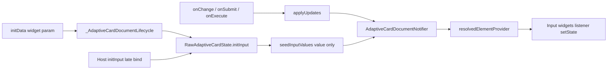
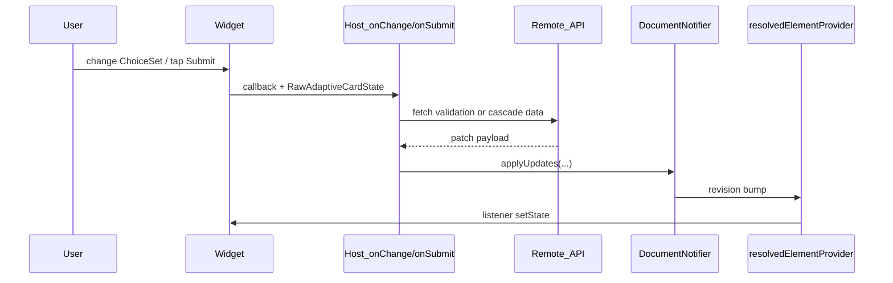

# Dynamic Adaptive Card Property Updates (Design)

## Context

[`flutter_adaptive_cards_fs`](packages/flutter_adaptive_cards_fs) already stores runtime state as **baseline JSON + sparse overlays** ([`doc/reactive-riverpod.md`](doc/reactive-riverpod.md)). Hosts patch individual properties today via scattered methods on [`RawAdaptiveCardState`](packages/flutter_adaptive_cards_fs/lib/src/flutter_raw_adaptive_card.dart):

| Existing API | Overlay field | Merged into |
| --- | --- | --- |
| `setInputValue` / `initInput` / `seedInputValues` | `inputValue` | `"value"` |
| `setVisibility` / `setIsVisible` | `isVisible` | `"isVisible"` |
| `setInputError` / `clearInputError` | `errorMessage`, `isInvalid` | same keys |
| `loadInput` / `setChoices` / `appendChoices` | `choices` | `"choices"` |
| `setText` / `clearText` | `text` | `"text"` |
| `setActionEnabled` / `setActionsEnabled` | `ActionOverlay.isEnabled` | `"isEnabled"` |

**Gap:** Event handlers (Submit, Execute, onChange cascades, remote validation) and **late-bound host data** (`initData` / `initInput`) often need **many property changes at once**. Hosts must call multiple methods manually; `initData`/`initInput` today only seed **`value`** overlays; some useful properties have **no overlay path** yet; Submit/Execute validation reads **baseline-only** `isRequired`.

### initData and initInput (existing load-time path)

Both paths write **only input `value` overlays** — they do not mutate baseline JSON:

| Entry point | When it runs | Implementation today |
| --- | --- | --- |
| `RawAdaptiveCard.initData` / `AdaptiveCardsCanvas.initData` | Post-frame bootstrap via [`_AdaptiveCardDocumentLifecycle`](packages/flutter_adaptive_cards_fs/lib/src/flutter_raw_adaptive_card.dart); re-runs when widget `initData` reference changes | `RawAdaptiveCardState.initInput(map)` → `seedInputValues` |
| `RawAdaptiveCardState.initInput(map)` | Host late-binding after mount (e.g. async fetch completes before user edits) | Same: `seedInputValues` — `{ inputId: value, … }` |
| Per-input `initInput` on `AdaptiveInputMixin` subclasses | Legacy/widget-level hook; card-level seeding is preferred | Some inputs call `setDocumentInputValue` directly |

Reactive sync: inputs listen to `resolvedElementProvider(id)` in `AdaptiveInputMixin` — same path as user typing and `setInputValue`. See [`doc/reactive-riverpod.md`](doc/reactive-riverpod.md#why-initinput-does-not-call-setstate-on-the-card) and [`test/inputs/init_data_overlay_test.dart`](packages/flutter_adaptive_cards_fs/test/inputs/init_data_overlay_test.dart).

**Limitation:** `initData`/`initInput` cannot seed `choices`, `errorMessage`, `isVisible`, etc. Hosts needing richer load-time state must call scattered APIs (`loadInput`, `setText`, …) today.

**User decisions (locked in):**
- **Update model:** partial overlay patches only (baseline stays stable)
- **Handler API:** keep current imperative callbacks; add bulk helper on `RawAdaptiveCardState`

---

## Goals

1. One host-facing entry point to apply multi-id, multi-property updates after async handler work **and** as a superset of `initData`/`initInput` seeding.
2. Extend overlays only where event-driven updates are common and widgets can react via existing `resolved*Provider` listeners.
3. Preserve current per-method APIs (backward compatible); bulk helper delegates to them; **`initData`/`initInput` remain supported** for simple value maps.
4. Document canonical patterns for load-time seeding, validation, cascaded ChoiceSets, and typeahead/search refresh.

## Non-goals

- Full card JSON replacement (Teams `Action.Execute` card swap) — out of scope for this design.
- Changing `InheritedAdaptiveCardHandlers` to async return types.
- Overlaying every Adaptive Card schema property (label, action title, etc.) in v1.

---

## Approaches Considered

| Approach | Pros | Cons |
| --- | --- | --- |
| **A. Bulk imperative `applyUpdates` (recommended)** | Matches existing host style; no breaking callback changes; composes with current notifier methods | Host still orchestrates async → apply manually |
| B. Async handler return type | Cleaner for server-driven flows | Breaking change across all sample apps and tests |
| C. Full baseline replace | Teams parity | Fights overlay model; loses in-flight input state |

**Recommendation:** Approach A — typed patch model + `RawAdaptiveCardState.applyUpdates(...)`.

---

## Property Catalog

### Tier 1 — Already supported (bulk helper wraps existing APIs)

| Property | Element(s) | Host scenarios |
| --- | --- | --- |
| `value` | `Input.*` | Prefill, cascade reset dependent field, server-side correction |
| `errorMessage` | `Input.*` | Remote validation message |
| `isInvalid` | `Input.*` | Remote validation flag (`hasError` in user terms) |
| `isVisible` | Any id | Conditional sections after rules/API |
| `choices` | `Input.ChoiceSet` | Cascaded dropdown, search results |
| `text` | `TextBlock` | Status / i18n messages |
| `isEnabled` | `Action.*` | Disable submit while async work runs |

**Clear semantics:** patch object supports explicit clears (`clearError`, `clearValue`, `clearChoices`, `clearText`) mirroring existing `clear*` methods.

### Tier 2 — New overlays (implement with bulk API)

| Property | Element(s) | Rationale | Widget work |
| --- | --- | --- | --- |
| `isRequired` | `Input.*` | Conditional required fields after cascade/API | Add `ElementOverlay.isRequired`; merge in [`resolvedElementProvider`](packages/flutter_adaptive_cards_fs/lib/src/riverpod/providers.dart); extend `AdaptiveInputMixin` + per-input listeners (today `isRequired` is read once in `initState`, e.g. [`choice_set.dart`](packages/flutter_adaptive_cards_fs/lib/src/cards/inputs/choice_set.dart)) |
| `url` | `Image`, `Media` | Signed URL rotation after auth refresh | Add `ElementOverlay.url`; merge in resolver; `AdaptiveImage` listens to resolved `url` (today reads `adaptiveMap['url']` directly) |

### Tier 3 — Deferred (document in backlog, not v1)

| Property | Notes |
| --- | --- |
| `label`, `placeholder` | UX copy changes; lower priority |
| `choices.data.parameters` | Typeahead param binding (distinct from existing `queryCount`/`querySkip`) |
| Action `title`, `tooltip`, `iconUrl`, `mode`, `style` | Needs `ActionOverlay` expansion + action widget listeners |
| `Badge.text` | Reuse `ElementOverlay.text` if needed later |

---

## Core API Design

### 1. Patch types (library public API)

Add immutable value types in e.g. [`packages/flutter_adaptive_cards_fs/lib/src/models/adaptive_card_update.dart`](packages/flutter_adaptive_cards_fs/lib/src/models/adaptive_card_update.dart):

```dart
/// One element's runtime overlay patch (baseline unchanged).
class AdaptiveElementUpdate {
  const AdaptiveElementUpdate({
    required this.id,
    this.isVisible,
    this.value,
    this.errorMessage,
    this.isInvalid,
    this.isRequired,
    this.url,
    this.text,
    this.choices, // List<Input.Choice> or List<Map> — prefer Choice model
    this.clearValue = false,
    this.clearError = false,
    this.clearChoices = false,
    this.clearText = false,
  });
  final String id;
  // ...
}

/// Action overlay patch.
class AdaptiveActionUpdate {
  const AdaptiveActionUpdate({required this.id, this.isEnabled});
  final String id;
  final bool? isEnabled;
}
```

**Validation rules inside notifier:**
- Ignore unknown ids (or debug-log); never throw in release.
- Route `Action.*` ids in action updates to `actionOverlaysById`.
- Reject property/type mismatches silently (e.g. `choices` on non-ChoiceSet) — optional debug assert.
- Single revision bump per bulk call (one `state = state.copyWith(revision: …)`), not per field.

### 2. Notifier: `applyUpdates`

Add to [`AdaptiveCardDocumentNotifier`](packages/flutter_adaptive_cards_fs/lib/src/riverpod/adaptive_card_document_notifier.dart):

```dart
void applyUpdates({
  Iterable<AdaptiveElementUpdate> elements = const [],
  Iterable<AdaptiveActionUpdate> actions = const [],
});
```

Implementation strategy: for each update, merge into existing overlay via `ElementOverlay.copyWith` / `ActionOverlay.copyWith` using the same semantics as individual setters (e.g. setting `value` clears validation overlays, matching [`setInputValue`](packages/flutter_adaptive_cards_fs/lib/src/riverpod/adaptive_card_document_notifier.dart)).

### 3. Host helper: `RawAdaptiveCardState.applyUpdates`

Delegate from [`flutter_raw_adaptive_card.dart`](packages/flutter_adaptive_cards_fs/lib/src/flutter_raw_adaptive_card.dart):

```dart
void applyUpdates({
  Iterable<AdaptiveElementUpdate> elements = const [],
  Iterable<AdaptiveActionUpdate> actions = const [],
}) { /* read notifier, call applyUpdates */ }
```

Optional convenience for JSON-minded hosts (internal or public):

```dart
void applyUpdatesFromMap(Map<String, Map<String, dynamic>> byId);
```

Maps property names to the same keys as Adaptive Card JSON (`value`, `errorMessage`, `isInvalid`, `isVisible`, `choices`, `text`, `isRequired`, `url`, `isEnabled`). Action ids detected by baseline node type prefix `Action.`.

### 4. Map-based helper shape (for server JSON)

```json
{
  "country": { "value": "US" },
  "state": { "choices": [{"title": "CA", "value": "CA"}], "value": "", "clearError": true },
  "statusText": { "text": "Loading states…" },
  "submitAction": { "isEnabled": false }
}
```

Host parses API response → `applyUpdatesFromMap` — no callback signature change.

### 5. initData / initInput integration

**Relationship:** `applyUpdates` is the **general** overlay writer; `seedInputValues` / `initInput` is the **narrow value-only** writer. All paths converge on the same `overlaysById` + `resolvedElementProvider` reactive pipeline.



**Backward compatibility (Phase 1):**
- `initData` widget parameter shape unchanged: `{ "inputId": value, … }` — still calls `seedInputValues` internally.
- `RawAdaptiveCardState.initInput(map)` unchanged for value-only maps.
- No breaking change to `AdaptiveCardsCanvas` constructors.

**Recommended host patterns after Phase 1:**

| Scenario | API |
| --- | --- |
| Simple prefill at card load | `initData: {'name': 'Jane'}` (unchanged) |
| Async prefill after mount (values only) | `cardState.initInput({'name': fetchedName})` |
| Rich load-time state (values + choices + visibility + errors) | `cardState.applyUpdates(...)` once fetch completes |
| Widget `initData` prop updates (parent rebuild) | Keep value-only re-seed via lifecycle; for richer patches host calls `applyUpdates` in same rebuild |

**Optional Phase 1 enhancement — richer `initData` (additive, not required for v1):**

Allow `initData` entries to be either a scalar value **or** a per-id patch map:

```dart
initData: {
  'country': 'US',                           // shorthand → value overlay
  'state': {'choices': [...], 'value': ''}, // patch map → applyUpdates for that id
}
```

Implementation: `_seedInitData()` normalizes scalars to `{value: scalar}` then delegates to `applyUpdatesFromMap`. Document in README; test in `init_data_overlay_test.dart`.

**Internal refactor (non-breaking):** Implement `seedInputValues` as a thin wrapper:

```dart
void seedInputValues(Map<String, Object?> values) {
  applyUpdates(elements: values.entries.map(
    (e) => AdaptiveElementUpdate(id: e.key, value: e.value),
  ));
}
```

This guarantees identical semantics (value set clears validation overlays per `setInputValue` rules).

**What initData does NOT do (unchanged):**
- Does not replace baseline JSON when `widget.map` changes — baseline refresh is a separate host concern.
- `resetAllInputs()` clears input overlays (values, choices, errors) but preserves visibility/text/action overlays — document that re-seeding via `initInput` after reset restores values.

---

## Event Flow Patterns



### Remote validation (Submit / Execute)

1. Default action collects values via `collectInputValues()` ([`default_actions.dart`](packages/flutter_adaptive_cards_fs/lib/src/action/default_actions.dart)).
2. Host `onSubmit` / `onExecute` receives data + `RawAdaptiveCardState`.
3. After API validation failure, host calls:

```dart
cardState.applyUpdates(elements: [
  AdaptiveElementUpdate(id: 'email', errorMessage: 'Already registered', isInvalid: true),
  AdaptiveElementUpdate(id: 'phone', clearError: true),
]);
```

4. `AdaptiveInputMixin` already listens for `errorMessage` / `isInvalid` — no Submit signature change.

**Follow-up fix (same initiative):** Update default Submit/Execute required-field check to read **resolved** `isRequired` (overlay ?? baseline) so conditional required works client-side before calling host.

### Cascaded ChoiceSet (onChange)

Canonical pattern (extends existing [`choice_set_data_query_test.dart`](packages/flutter_adaptive_cards_fs/test/inputs/choice_set_data_query_test.dart)):

```dart
onChange: (id, value, dataQuery, cardState) async {
  if (id == 'country') {
    final states = await fetchStates(value);
    cardState.applyUpdates(elements: [
      AdaptiveElementUpdate(
        id: 'state',
        choices: states,
        clearValue: true,
        clearError: true,
      ),
    ]);
  }
}
```

Document that `choices` update **clears value** (matches `setChoices` / `loadInput` behavior) unless host explicitly sets `value` in the same batch (last-write wins within single `applyUpdates` merge order).

### Search / typeahead

Keep existing [`setDataQuerySession`](packages/flutter_adaptive_cards_fs/lib/src/riverpod/adaptive_card_document_notifier.dart) for pagination; bulk API may optionally accept `queryCount` / `querySkip` on `AdaptiveElementUpdate` for parity. Primary refresh path remains `choices` overlay after search API returns.

**Filtered ChoiceSet UI (implemented):** modal list and typeahead filter on choice **titles**; `onChange`, submit, and `Data.Query` use choice **values**. Documented in [form-inputs.md § Filtered ChoiceSet](../form-inputs.md#filtered-choiceset-style-style-filtered).

### Local rules in handler

Same `applyUpdates` API — hosts apply visibility, errors, and enabled flags synchronously without network call.

### Load-time / late-binding (initData / initInput)

**Simple values (existing):**

```dart
AdaptiveCardsCanvas(
  map: cardJson,
  initData: {'email': user.email, 'country': user.countryCode},
)
```

**Async profile load (values via initInput, then enrich via applyUpdates):**

```dart
final profile = await fetchProfile();
cardState.initInput({'email': profile.email}); // value-only, same as today

cardState.applyUpdates(elements: [
  AdaptiveElementUpdate(id: 'state', choices: profile.stateChoices),
  AdaptiveElementUpdate(id: 'avatar', url: profile.signedImageUrl), // Phase 2
]);
```

**Single call when host already has full patch (preferred after Phase 1):**

```dart
cardState.applyUpdatesFromMap({
  'email': {'value': profile.email},
  'state': {'choices': stateChoices, 'value': profile.state},
  'statusText': {'text': 'Profile loaded'},
});
```

When parent widget updates `initData`, lifecycle re-seeds **values only**; hosts that need multi-property refresh on parent rebuild should call `applyUpdates` explicitly (e.g. in `didUpdateWidget` of host screen).

---

## Overlay Model Changes

Extend [`ElementOverlay`](packages/flutter_adaptive_cards_fs/lib/src/riverpod/adaptive_card_document.dart):

```dart
final bool? isRequired;
final String? url;
// copyWith: clearIsRequired, clearUrl
```

Extend merge in [`resolvedElementProvider`](packages/flutter_adaptive_cards_fs/lib/src/riverpod/providers.dart):

```dart
if (overlay?.isRequired != null) merged['isRequired'] = overlay!.isRequired;
if (overlay?.url != null) merged['url'] = overlay!.url;
```

Add focused setters: `setIsRequired`, `clearIsRequired`, `setUrl`, `clearUrl` (bulk API uses these internally).

---

## Widget Listener Gaps (required for Tier 2)

| Widget | Change |
| --- | --- |
| All `Input.*` using `AdaptiveInputMixin` | Listen for resolved `isRequired`; update validators / label required indicator |
| [`AdaptiveChoiceSet`](packages/flutter_adaptive_cards_fs/lib/src/cards/inputs/choice_set.dart) | Already listens to choices via separate subscription — ensure `isRequired` in mixin path |
| [`AdaptiveImage`](packages/flutter_adaptive_cards_fs/lib/src/cards/elements/image.dart) | Subscribe to `resolvedElementProvider(id)` for `url` changes |
| `Media` (if applicable) | Same `url` overlay pattern |

Tier 1 properties need **no new listeners** — already wired.

---

## Testing Strategy

Follow [`adaptive-cards-testing`](.agents/skills/adaptive-cards-testing/SKILL.md) and existing overlay test patterns:

| Test | File |
| --- | --- |
| Notifier bulk merge, clear flags, unknown id ignored, single revision | `test/riverpod/adaptive_card_document_notifier_test.dart` |
| `applyUpdates` host delegate | new `test/riverpod/apply_updates_test.dart` |
| `seedInputValues` ≡ `applyUpdates` value-only | extend `test/riverpod/adaptive_card_document_notifier_test.dart` |
| initData + applyUpdates compose (no double-listener issues) | extend `test/inputs/init_data_overlay_test.dart` |
| initInput late bind + applyUpdates enrich | new case in `init_data_overlay_test.dart` |
| Validation batch after mock submit | extend `test/inputs/input_error_overlay_test.dart` |
| Cascade country→state | new `test/inputs/cascade_choice_set_test.dart` |
| `isRequired` overlay | new `test/inputs/is_required_overlay_test.dart` |
| Image `url` overlay | new `test/elements/image_url_overlay_test.dart` |
| Submit uses resolved `isRequired` | `test/actions/submit_required_overlay_test.dart` |

---

## Documentation Deliverables

1. **Spec:** `docs/superpowers/specs/2026-06-03-dynamic-property-updates-design.md` (this design, expanded with examples)
2. Update [`doc/reactive-riverpod.md`](doc/reactive-riverpod.md) — bulk API table, Tier 2 properties, initData/initInput vs `applyUpdates`, cascade/validation recipes
3. Update [`packages/flutter_adaptive_cards_fs/README.md`](packages/flutter_adaptive_cards_fs/README.md) — `applyUpdates` in Runtime overlays section; extend initData docs if patch-map shape added
4. Update [`doc/form-inputs.md`](doc/form-inputs.md) — initData/initInput vs `applyUpdates`, remote validation, cascade patterns

---

## Migration / Compatibility

- All existing methods remain; `applyUpdates` is additive.
- No changes to `InheritedAdaptiveCardHandlers` signatures.
- `loadInput` stays as sugar for `{title: value}` maps; internally could delegate to `applyUpdates(choices: …)`.
- `initData` / `initInput` remain; `seedInputValues` becomes a value-only facade over `applyUpdates` (same behavior, no host migration required).
- Export new types from [`flutter_adaptive_cards_fs.dart`](packages/flutter_adaptive_cards_fs/lib/flutter_adaptive_cards_fs.dart).

---

## Implementation Phases

**Phase 1 — Bulk API (Tier 1 only)**
- `AdaptiveElementUpdate` / `AdaptiveActionUpdate`
- `applyUpdates` on notifier + `RawAdaptiveCardState`
- Optional `applyUpdatesFromMap`
- Refactor `seedInputValues` → delegates to `applyUpdates` (preserve `initData`/`initInput` behavior)
- Document initData/initInput vs applyUpdates; optional richer `initData` patch-map shape
- Tests + docs (include `init_data_overlay_test.dart` extensions)

**Phase 2 — Tier 2 overlays**
- `isRequired`, `url` on `ElementOverlay`
- Widget listeners + Submit/Execute resolved `isRequired`
- Tests + docs

**Phase 3 — Backlog**
- Action title/tooltip, label/placeholder, `choices.data.parameters` — track in [`reactive-riverpod.md` overlay backlog](doc/reactive-riverpod.md#overlay-backlog)
