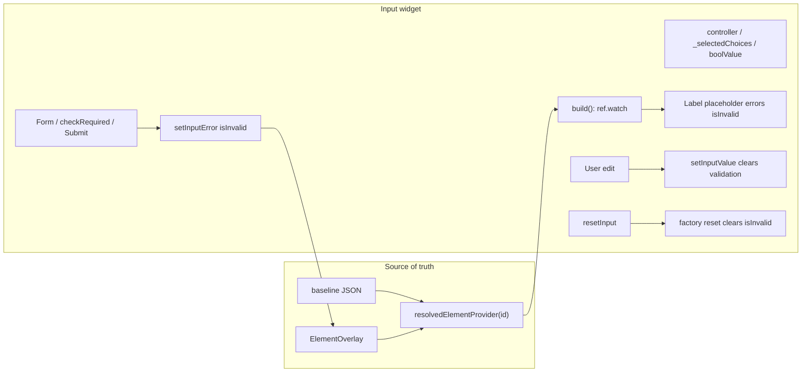

# Input mixin: resolved-only state via Riverpod

## Phase 1 — completed

[`AdaptiveInputMixin`](packages/flutter_adaptive_cards_fs/lib/src/adaptive_mixins.dart) and all six inputs migrated to **`ConsumerStatefulWidget`** + **`watchResolvedInput()`** / **`readResolvedInput()`**. Cached overlay mirrors removed (`value`, `label`, `placeholder`, `isRequired`, `errorMessage`, etc.). Controllers and selection state remain local edit buffers.

See [`resolved_input_state.dart`](packages/flutter_adaptive_cards_fs/lib/src/resolved_input_state.dart).

## Phase 2 — all validation via notifier (next)

**User decision:** Remove **`stateHasError`**. Route **all** validation (host, Form required, ChoiceSet `checkRequired`, Submit/Execute required scan) through document notifier **`isInvalid`** / **`errorMessage`** overlays. Display errors via **`input.isInvalid`** from `watchResolvedInput()` only.

Full spec: [All validation via notifier](statehaserror_vs_isinvalid_ae92fdbe.plan.md).

### Phase 2 architecture

### What changes in Phase 2

| Remove                                            | Replace with                                                          |
| ------------------------------------------------- | --------------------------------------------------------------------- |
| `stateHasError` on mixin                          | Nothing — no widget-local validation flag                             |
| `showValidationErrorFor(input)`                   | `input.isInvalid` from `watchResolvedInput()`                         |
| Validator `setState(() { stateHasError = true })` | `setLocalValidationError()` → notifier `setInputError`                |
| ChoiceSet `stateHasError` in `checkRequired`      | `setLocalValidationError()` / `clearLocalValidationError()`           |
| Submit/Execute silent `return` on invalid         | `setInputError(id, isInvalid: true)` per failing input, then `return` |
| `loadErrorMessage(..., stateHasError: …)`         | `loadErrorMessage(..., showError: input.isInvalid)`                   |

**Reset:** Existing factory reset on `resetInput` / `resetAllInputs` already clears **`errorMessage`** and **`isInvalid`** overlays — no extra work beyond removing `stateHasError` cleanup in widget overrides.

### Phase 1 target (unchanged, done)

| API                               | Use                                             |
| --------------------------------- | ----------------------------------------------- |
| `watchResolvedInput()`            | Start of `build()`                              |
| `readResolvedInput()`             | `checkRequired()`, `resetInput()`, init seeding |
| `listenForResolvedValueChanges()` | Sync controllers on value overlay changes       |

**Removed in Phase 1:**

- Cached fields: `value`, `inputLabel`, `placeholder`, `errorMessage`, `overlayValidationError`, `isRequired`
- `_inputValueSubscription`, `_syncInputStateFromBaseline()`

**Removed in Phase 2 (additional):**

- `stateHasError`, `showValidationErrorFor`

### Widget local state after both phases

| File         | Local state only                  |
| ------------ | --------------------------------- |
| Text, Number | `TextEditingController`           |
| Date         | `selectedDateTime`, controller    |
| Time         | `selectedTime`                    |
| Toggle       | `boolValue`, `valueOn`/`valueOff` |
| ChoiceSet    | `_selectedChoices`, controller    |

**No** cached overlay fields. **No** `stateHasError`.

## Docs / skills (Phase 2 updates)

- [`docs/reactive-riverpod.md`](docs/reactive-riverpod.md) — validation is overlay-only; `setInputValue` / reset clear `isInvalid`
- [`.agents/skills/adaptive-cards-element-registry/SKILL.md`](.agents/skills/adaptive-cards-element-registry/SKILL.md) — `setLocalValidationError` in validators

## Verification

**Phase 1:** `fvm flutter test test/inputs/ test/riverpod/` — 94 tests passed.

**Phase 2:**

- `fvm flutter test test/inputs/` (especially `input_error_overlay_test.dart`, `action_reset_inputs_test.dart`)
- `fvm flutter test test/actions/submit_required_overlay_test.dart`
- `fvm flutter analyze`

## Non-goals

- Refactor `AdaptiveVisibilityMixin` / `AdaptiveActionStateMixin` (separate follow-up)
- Change factory-reset field set beyond existing validation clear

## Risk notes

- Validators must not call notifier from `build()` — only from validate/checkRequired/Submit paths
- `ref.watch` for `input.isInvalid` in build drives error UI reactively after notifier writes
