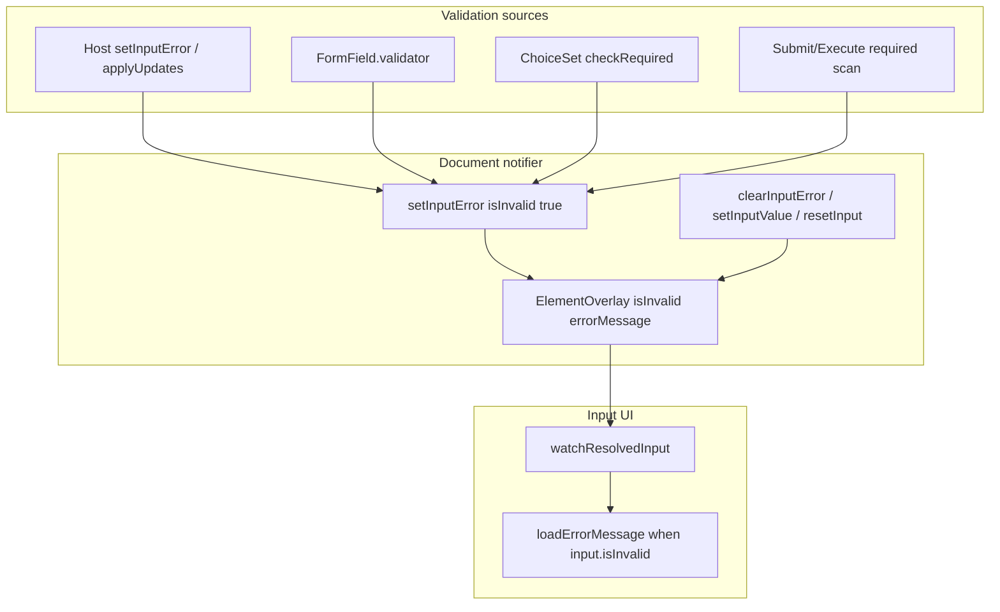

# All validation via notifier (remove `stateHasError`)

**Decision:** Adopt unified overlay validation. **`stateHasError` is removed.** All validation display uses resolved **`isInvalid`** (and **`errorMessage`**) from `resolvedElementProvider(id)`.

Follow-on to the completed [input resolved-only refactor](input_resolved-only_refactor_a09f674a.plan.md) (Phase 2).

## Target architecture



## Single validation channel

| Concern | Mechanism |
| --- | --- |
| **Set invalid** | `setInputError(id, errorMessage:, isInvalid: true)` or mixin helper `setLocalValidationError()` |
| **Clear invalid** | User edit → `setInputValue` (already clears validation overlays); host → `clearInputError`; **reset** → `resetInput` / `resetAllInputs` factory reset (already clears `errorMessage` + `isInvalid`) |
| **Show error UI** | `loadErrorMessage(..., showError: input.isInvalid)` with `errorMessage: input.errorMessage` |
| **No widget-local flag** | Remove `stateHasError`, remove `showValidationErrorFor` |

## Mixin changes ([`adaptive_mixins.dart`](packages/flutter_adaptive_cards_fs/lib/src/adaptive_mixins.dart))

**Remove:**

- `bool stateHasError`
- `showValidationErrorFor(ResolvedInputState input)`

**Add:**

```dart
void setLocalValidationError({String? errorMessage}) {
  ref.read(adaptiveCardDocumentProvider.notifier).setInputError(
    _inputId,
    errorMessage: errorMessage,
    isInvalid: true,
  );
}

void clearLocalValidationError() {
  ref.read(adaptiveCardDocumentProvider.notifier).clearInputError(_inputId);
}
```

- On required failure: `setLocalValidationError()` — omit `errorMessage` to use baseline JSON message via resolved merge.
- On validation pass: `clearLocalValidationError()`.

## Input widget changes

| File | Change |
| --- | --- |
| [`text.dart`](packages/flutter_adaptive_cards_fs/lib/src/cards/inputs/text.dart) | Validator calls `setLocalValidationError` / `clearLocalValidationError`; `loadErrorMessage(..., showError: input.isInvalid)` |
| [`number.dart`](packages/flutter_adaptive_cards_fs/lib/src/cards/inputs/number.dart) | Same |
| [`date.dart`](packages/flutter_adaptive_cards_fs/lib/src/cards/inputs/date.dart) | Same |
| [`choice_set.dart`](packages/flutter_adaptive_cards_fs/lib/src/cards/inputs/choice_set.dart) | `checkRequired` uses notifier helpers; remove `stateHasError` |
| [`time.dart`](packages/flutter_adaptive_cards_fs/lib/src/cards/inputs/time.dart) | If required validation added later, same pattern |
| [`toggle.dart`](packages/flutter_adaptive_cards_fs/lib/src/cards/inputs/toggle.dart) | No change unless required semantics added |

Remove all `stateHasError = false` from `resetInput`, `onDocumentValueChanged` — factory reset + `setInputValue` already clear overlays.

## Submit / Execute ([`default_actions.dart`](packages/flutter_adaptive_cards_fs/lib/src/action/default_actions.dart))

Today Submit/Execute scan required inputs via notifier but **`return` early without `setInputError`** — no error UI for that path.

**Add:** for each failing required input id, call `setInputError(id, isInvalid: true)` (optional message from resolved baseline `errorMessage`) before `return`. Keeps validation fully notifier-driven without walking widgets.

## `loadErrorMessage` ([`utils.dart`](packages/flutter_adaptive_cards_fs/lib/src/utils/utils.dart))

Rename parameter for clarity:

```dart
Widget loadErrorMessage({
  required BuildContext context,
  String? errorMessage,
  bool showError = false, // was stateHasError
}) {
  if (errorMessage == null || !showError) return const SizedBox();
  ...
}
```

Call sites pass `showError: input.isInvalid`.

## Reset semantics (unchanged contract, now sufficient)

[`resetInput`](packages/flutter_adaptive_cards_fs/lib/src/riverpod/adaptive_card_document_notifier.dart) / [`resetAllInputs`](packages/flutter_adaptive_cards_fs/lib/src/riverpod/adaptive_card_document_notifier.dart) already clear **`errorMessage`** and **`isInvalid`** overlays on inputs. With unified validation, reset clears **all** validation state — no separate `stateHasError` to clear.

## Tests

- [`input_error_overlay_test.dart`](packages/flutter_adaptive_cards_fs/test/inputs/input_error_overlay_test.dart) — add case: Form required failure sets overlay `isInvalid`; typing clears via `setInputValue`
- [`action_reset_inputs_test.dart`](packages/flutter_adaptive_cards_fs/test/inputs/action_reset_inputs_test.dart) — assert validation overlays cleared after reset
- Submit required path shows error message when Execute/Submit blocked
- Remove any assertions on `stateHasError`

## Docs

- [`docs/reactive-riverpod.md`](docs/reactive-riverpod.md) — remove “only stateHasError is widget-local”; state all validation is overlay-backed
- [`.agents/skills/adaptive-cards-element-registry/SKILL.md`](.agents/skills/adaptive-cards-element-registry/SKILL.md) — validators call `setLocalValidationError`, not local flags

## Non-goals

- Change factory-reset field set (validation already cleared)
- Remove Flutter `Form` validators — still used for submit flow; they **write** to notifier instead of `stateHasError`

## Risk notes

- Validators calling notifier during `Form.validate()` — safe (not during build); UI updates via `ref.watch` on next frame
- Avoid calling `setLocalValidationError` from `build()` — only from validators, `checkRequired`, Submit/Execute scan
