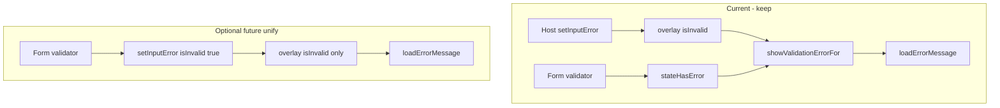

# Should `stateHasError` be removed in favor of overlay `isInvalid`?

**Short answer: No** — not as part of the resolved-only input refactor. Keep both, combined via `showValidationErrorFor(input)`.

## Two validation channels (by design)

| Flag | Source | Set by | Cleared by | Persisted in notifier? |
| --- | --- | --- | --- | --- |
| **`input.isInvalid`** (resolved overlay) | Host / server / `applyUpdates` | `setInputError`, `applyUpdates` | `clearInputError`, `setInputValue` (user edit), factory reset | Yes — `ElementOverlay.isInvalid` |
| **`stateHasError`** (widget-local) | Client-side Form / `checkRequired` | `TextFormField.validator`, ChoiceSet `checkRequired()` | Same validators on re-validate; `resetInput`; `onDocumentValueChanged` | No — ephemeral submit-attempt state |

Current merge in [`adaptive_mixins.dart`](packages/flutter_adaptive_cards_fs/lib/src/adaptive_mixins.dart):

```dart
bool showValidationErrorFor(ResolvedInputState input) =>
    stateHasError || input.isInvalid;
```

[`loadErrorMessage`](packages/flutter_adaptive_cards_fs/lib/src/utils/utils.dart) shows text when **both** `errorMessage != null` and the show flag is true:

```dart
if (errorMessage == null || !stateHasError) return const SizedBox();
```

Inputs pass `showValidationErrorFor(input)` so host overlay errors and local required failures both gate display.

## Why they are not redundant

### Host validation (`isInvalid`)

- After submit, host calls `setInputError(id, message:, isInvalid: true)` or `applyUpdates(..., isInvalid: true)`.
- Survives rebuilds via `resolvedElementProvider`.
- User typing clears it through `setInputValue` → notifier clears overlay validation ([`adaptive_card_document_notifier.dart`](packages/flutter_adaptive_cards_fs/lib/src/riverpod/adaptive_card_document_notifier.dart) lines 51–59).

### Client validation (`stateHasError`)

- On Submit/Execute, `FormField.validator` runs (Text, Number, Date) or ChoiceSet `checkRequired()` runs.
- Sets **`stateHasError = true`** only — **does not** write `setInputError` to the notifier today.
- Uses resolved **`input.errorMessage`** (baseline JSON or overlay) as the message text, but needs a separate “show now” flag because baseline `errorMessage` is not invalid until the user fails validation.

Example from [`text.dart`](packages/flutter_adaptive_cards_fs/lib/src/cards/inputs/text.dart):

```dart
validator: (value) {
  if (!input.isRequired) return null;
  if (value == null || value.isEmpty) {
    setState(() { stateHasError = true; });
    return '';
  }
  setState(() { stateHasError = false; });
  return null;
},
// ...
loadErrorMessage(
  errorMessage: input.errorMessage,
  stateHasError: showValidationErrorFor(input),
),
```

Removing `stateHasError` without other changes would **break required-field error display** on submit unless validators also write to the overlay.

## What removing `stateHasError` would require (optional follow-up, not this plan)

To unify on overlay-only validation:

1. On local validation failure → `setInputError(id, isInvalid: true)` (message optional; falls back to baseline `errorMessage` in resolved map).
2. On local validation success → `clearInputError(id)` or rely on existing clear paths.
3. Replace `showValidationErrorFor` with **`input.isInvalid` only**.
4. Update ChoiceSet `checkRequired`, all Form validators, and tests.
5. Decide semantics: local required failures become part of document overlays (cleared by reset, typing, `clearInputError`) — usually desirable but is a **behavior contract** change.



## Recommendation for the attached plan

The [input resolved-only refactor plan](input_resolved-only_refactor_a09f674a.plan.md) is **correct** to:

- Remove cached overlay mirrors (`value`, `label`, `placeholder`, `isRequired`, `errorMessage`, …)
- **Keep `stateHasError`** as the only intentional widget-local field alongside resolved reads

Do **not** fold `stateHasError` into `isInvalid` unless you explicitly want a follow-up “all validation through notifier” initiative.

## Docs alignment

[`docs/reactive-riverpod.md`](docs/reactive-riverpod.md) already states: “Only **`stateHasError`** is widget-local (Form validators).” No code change needed unless you pursue unified overlay validation.
