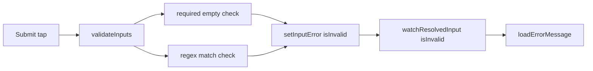

# Input.Text regex validation + ac-qv-event tests

## Context

- [`text.dart`](packages/flutter_adaptive_cards_fs/lib/src/cards/inputs/text.dart) validates **`isRequired` only** today; `regex` is ignored.
- [`ac-qv-event.json`](widgetbook/lib/samples/pnp_templates/ac-qv-event.json) phone field (`id: "phone"`) has `regex: "(000) 000-0000"`, `isRequired: true`, `errorMessage: "Enter your phone number."`.
- The registration form lives in container **`Reg_form`**, which is **`isVisible: false` on load** — tests must tap the **Register** `Action.ToggleVisibility` first.
- Validation is **overlay-backed** (Phase 2): failures call `setLocalValidationError()`; UI uses `loadErrorMessage(..., showError: input.isInvalid)`.
- **User choice:** trigger validation by **tapping Submit** (not `Form.validate()`).



## 1. Shared validation logic

Add a small helper (new file recommended: [`input_text_validation.dart`](packages/flutter_adaptive_cards_fs/lib/src/cards/inputs/input_text_validation.dart)) with pure functions:

```dart
bool textInputValueIsValid({
  required String? value,
  required bool isRequired,
  required String? regexPattern,
});
```

Rules (per [AC Input Validation spec](https://learn.microsoft.com/en-us/adaptive-cards/authoring-cards/input-validation)):

| Check | Fail when |
| --- | --- |
| `isRequired` | value is null or empty string |
| `regex` | pattern present **and** value is non-empty **and** `RegExp(pattern).hasMatch(value)` is false |
| Invalid regex pattern | treat as pass (or debug-log only) — avoid crashing cards with bad author regex |

Export via `flutter_adaptive_cards_fs.dart` only if needed elsewhere; keep internal if used solely by text + actions.

## 2. Wire into Input.Text

In [`text.dart`](packages/flutter_adaptive_cards_fs/lib/src/cards/inputs/text.dart):

- Read `regex` from `adaptiveMap['regex']` (baseline; not overlay-driven today).
- Extend `TextFormField.validator` to call shared helper; on failure `setLocalValidationError()`, on success `clearLocalValidationError()` (same pattern as required-only today).

Optional: add `regex` getter on [`ResolvedInputState`](packages/flutter_adaptive_cards_fs/lib/src/resolved_input_state.dart) for consistency — low priority since regex is baseline-only.

## 3. Wire into Submit / Execute

Refactor [`default_actions.dart`](packages/flutter_adaptive_cards_fs/lib/src/action/default_actions.dart):

- Rename/expand `validateRequiredInputs` → **`validateInputs`** (or keep name but extend behavior).
- For each `Input.Text` node: read baseline `regex` from `doc.nodesById[id]`, resolved `isRequired` from `resolvedElementProvider`, value from `collectInputValues()`.
- On any failure: `notifier.setInputError(id, isInvalid: true)` (omit message → baseline `errorMessage` shows, same as required path).
- Continue scanning **all** failing inputs (don’t break early).

This ensures the user’s Submit-tap test exercises the same regex path as production Submit.

## 4. Copy test fixture

Copy unchanged:

`widgetbook/lib/samples/pnp_templates/ac-qv-event.json` → [`packages/flutter_adaptive_cards_fs/test/samples/ac-qv-event.json`](packages/flutter_adaptive_cards_fs/test/samples/ac-qv-event.json)

Load via existing `getTestWidgetFromPath(path: 'ac-qv-event.json', listView: true)`.

## 5. Widget test — `test/inputs/input_text_regex_test.dart`

Flow:

1. Pump card (`listView: true`).
2. **Assert no error on load:** `find.text('Enter your phone number.')` → `findsNothing`.
3. Tap **Register** (`find.text('Register')`) to reveal `Reg_form`; `pumpAndSettle`.
4. Fill other required fields so Submit isolates phone regex failure:
   - Enter company name (`generateWidgetKeyFromId('company_name')`).
   - Toggle privacy policy (`accept_policy`).
   - (First/last name are pre-filled `"John"` / `"Doe"`.)
5. Enter `'AAA'` into phone field (`generateWidgetKeyFromId('phone')`).
6. Tap **Submit**; `pump`.
7. Assert:
   - `onSubmit` mock **not** called (pass mock to `getTestWidgetFromPath`).
   - `find.text('Enter your phone number.')` → `findsOneWidget`.
   - `resolvedElementProvider('phone')?['isInvalid']` → `isTrue`.

Use key-first finders per [`adaptive-cards-testing` skill](.agents/skills/adaptive-cards-testing/SKILL.md).

## 6. Golden test — `test/golden_input_text_regex_test.dart`

Tagged `golden`; reuse same fixture and setup:

1. `configureTestView()` with fixed viewport (e.g. `Size(500, 700)` — match [`golden_sample_test.dart`](packages/flutter_adaptive_cards_fs/test/golden_sample_test.dart)).
2. Pump with `key: ValueKey('paint')`, `listView: true`.
3. Tap Register → fill company + toggle → enter `'AAA'` in phone → tap Submit → `pump`.
4. `scrollUntilVisible` phone field + error region if needed so error text is in frame.
5. `expectLater(find.byKey(key), matchesGoldenFile(getGoldenPath('ac-qv-event_phone_invalid.png')))`.

Generate baseline PNG via:

```bash
cd packages/flutter_adaptive_cards_fs
fvm flutter test test/golden_input_text_regex_test.dart --update-goldens --tags golden
```

Commit **`test/gold_files/linux/ac-qv-event_phone_invalid.png`** (CI source of truth per [`test/gold_files/README.md`](packages/flutter_adaptive_cards_fs/test/gold_files/README.md)).

## 7. Unit tests (small, fast)

Add focused unit tests for `textInputValueIsValid` in e.g. `test/inputs/input_text_validation_test.dart`:

- `(000) 000-0000` pattern: `'(123) 456-7890'` passes, `'AAA'` fails.
- Empty + required fails; empty + not required + regex passes.
- Non-empty + regex mismatch fails.

## 8. Docs / cleanup

- Remove TODO in [`README.md`](packages/flutter_adaptive_cards_fs/README.md) lines 254–255 once implemented.
- Brief note in [`.agents/skills/adaptive-cards-element-registry/SKILL.md`](.agents/skills/adaptive-cards-element-registry/SKILL.md) under validation: `regex` on `Input.Text`, Submit runs `validateInputs`.

## Verification

```bash
cd packages/flutter_adaptive_cards_fs
fvm flutter test test/inputs/input_text_validation_test.dart test/inputs/input_text_regex_test.dart
fvm flutter test --exclude-tags golden   # CI-style fast run
fvm flutter test test/golden_input_text_regex_test.dart --tags golden
fvm flutter analyze
```

## Risks / notes

- **Hidden form:** both tests must tap Register before phone is in the tree.
- **Long card:** `listView: true` + scroll for golden framing.
- **Network images:** global `MyTestHttpOverrides` in [`flutter_test_config.dart`](packages/flutter_adaptive_cards_fs/test/flutter_test_config.dart) already mocks HTTP for stable renders.
- **`associatedInputs: "none"`** on Submit is not implemented in this library; Submit still runs full input validation today — matches test intent.
