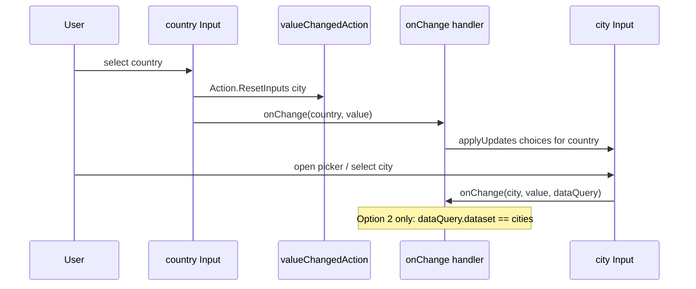

# Dependent ChoiceSet Widgetbook demos (Phase 1) + associatedInputs (Phase 2)

## Goal

**Phase 1 (this implementation):** Demonstrate the Teams/Bot Framework dependent-input pattern in Widgetbook with **two side-by-side use cases**:


| Use case                        | JSON                                                                                                                               | What it teaches                                                                             |
| ------------------------------- | ---------------------------------------------------------------------------------------------------------------------------------- | ------------------------------------------------------------------------------------------- |
| **Option 1 — host cascade**     | Existing `[value_changed_action_filtered.json](widgetbook/lib/samples/inputs/input_choice_set/value_changed_action_filtered.json)` | Card `valueChangedAction` resets city; **host** repopulates choices via `applyUpdates`      |
| **Option 2 — Teams Data.Query** | New copy with `choices.data`                                                                                                       | Same reset + host cascade, plus Teams-shaped dynamic city field (`filtered` + `Data.Query`) |


Phase 1 is **Widgetbook + host handler** work, plus a **library fix** for filtered ChoiceSet (search/display **titles**, submit/`onChange` **values**) so Option 2 UX matches Teams expectations.

**Phase 2 (implemented):** `Data.Query.associatedInputs` and Submit/Execute `associatedInputs` shipped in **0.10.0** via [`docs/superpowers/plans/2026-06-07-backend-host-integration.plan.md`](../superpowers/plans/2026-06-07-backend-host-integration.plan.md). Option 2 handlers use `invoke.dataQuery?.parameters?['country']` on city `onChange`.

---

## Implementation status


| Phase                    | Status       | Notes                                                                                                                                                                                                                                                                 |
| ------------------------ | ------------ | --------------------------------------------------------------------------------------------------------------------------------------------------------------------------------------------------------------------------------------------------------------------- |
| **Phase 1 (core)**       | **Complete** | JSON samples, `DependentChoiceSetDemoPage`, two Widgetbook use cases, handler + post-frame `applyUpdates`                                                                                                                                                             |
| **Phase 1 (follow-ups)** | **Complete** | Package tests, Submit/`isRequired` on samples, filtered title/value fix, docs + sequence diagram in [`form-inputs.md`](docs/form-inputs.md)                                                                                                                         |
| **Phase 1 docs**         | **Complete** | [Shared handler](#shared-handler-option-1-vs-option-2); dart comments in [`dependent_choice_set_demo_page.dart`](widgetbook/lib/dependent_choice_set_demo_page.dart)                                                                                                  |
| **Phase 2**              | **Complete** | `associatedInputs` parse + merge; Option 2 handler uses `dataQuery.parameters['country']` ([backend-host plan](../superpowers/plans/2026-06-07-backend-host-integration.plan.md))                                                                                    |
| **Phase 2b (optional)**  | **Open**     | Typeahead `onChange` on keystroke — deferred per backend-host spec                                                                                                                                                                                                    |
| **Phase 2b (optional)**  | **Open**     | `onChange` on filtered search keystroke (Teams invoke-on-type parity) — deferred                                                                                                                                                                                      |


---

## How it works (both demos)




**Card-side (already implemented):** `[valueChangedAction](packages/flutter_adaptive_cards_fs/lib/src/adaptive_mixins.dart)` runs embedded `Action.ResetInputs` → city value returns to baseline.

**Host-side (new Widgetbook code):** `onChange` calls `cardState.applyUpdates` with country-specific `Choice` lists (pattern from `[cascade_choice_set_test.dart](packages/flutter_adaptive_cards_fs/test/inputs/cascade_choice_set_test.dart)`).

---

## Shared handler: Option 1 vs Option 2

Both Widgetbook use cases use the same widget ([`DependentChoiceSetDemoPage`](widgetbook/lib/dependent_choice_set_demo_page.dart)) and the same static handler **`handleDependentChoiceSetChange`**. The only difference is **`assetPath`** (which JSON is loaded):


| Use case                                | JSON asset                                  |
| --------------------------------------- | ------------------------------------------- |
| Value changed action (host cascade)     | `value_changed_action_filtered.json`        |
| Value changed action (Teams Data.Query) | `value_changed_action_dependent_query.json` |


Both wire `onChange: handleDependentChoiceSetChange` on `AdaptiveCardsCanvas.asset`.

### What differs in JSON (not in the handler)


|                         | Option 1                                | Option 2                                                          |
| ----------------------- | --------------------------------------- | ----------------------------------------------------------------- |
| City `style`            | `compact` (dropdown)                    | `filtered` (search modal)                                         |
| City baseline `choices` | Static Paris/Lyon (+ empty placeholder) | Empty `[]`                                                        |
| City `choices.data`     | Absent                                  | `Data.Query` with `dataset: "cities"`, `associatedInputs: "auto"` |


### What each `if` branch does (shared handler)


| Branch                                           | When it runs                                         | Option 1                                                                    | Option 2                                                                         |
| ------------------------------------------------ | ---------------------------------------------------- | --------------------------------------------------------------------------- | -------------------------------------------------------------------------------- |
| `id == 'country'`                                | User changes country                                 | **Yes** — `applyUpdates` loads `citiesByCountry[country]` into city overlay | **Yes** — same cascade logic                                                     |
| `id == 'city' && dataQuery?.dataset == 'cities'` | User selects city and ChoiceSet passes a `DataQuery` | **No** — city has no `choices.data`, so `dataQuery` is always `null`        | **Yes** — debug log only in Phase 1; choices already preloaded on country change |


**Takeaway:** The cascade (country → repopulate city choices) is identical for both demos. Option 2 additionally exercises the `Data.Query` `onChange` path when the user picks a city; Option 1 never hits the second branch because its city field is a plain compact ChoiceSet without `choices.data`.

**Sequence diagram** copied to [`docs/form-inputs.md` § Dependent ChoiceSet](docs/form-inputs.md#dependent-choiceset-country--city).

---

## Phase 1 follow-ups (completed)

Work after the original Phase 1 todos:

| Area | Delivered |
| --- | --- |
| **Package tests** | [`test/samples/value_changed_action_*.json`](packages/flutter_adaptive_cards_fs/test/samples/), [`dependent_choice_set_test.dart`](packages/flutter_adaptive_cards_fs/test/inputs/dependent_choice_set_test.dart) (3 widget tests), [`dependent_choice_set_handler.dart`](packages/flutter_adaptive_cards_fs/test/utils/dependent_choice_set_handler.dart) |
| **Sample polish** | `Action.Submit` + `isRequired` / `errorMessage` on **country** and **city** in all four JSON files (widgetbook + test copies) |
| **Filtered ChoiceSet** | [`choice_set.dart`](packages/flutter_adaptive_cards_fs/lib/src/cards/inputs/choice_set.dart) + [`choice_filter.dart`](packages/flutter_adaptive_cards_fs/lib/src/cards/inputs/choice_filter.dart): modal search/list **titles**; stored/submitted **values**; tests in `choice_set_test.dart`, `choice_filter_test.dart` |
| **Handler ordering** | Post-frame `applyUpdates` in handler so cascade runs after `valueChangedAction` reset |
| **Docs** | `form-inputs.md` (dependent + filtered + mermaid diagram), `Implementation-Status.md`, package README, CHANGELOG `[0.9.0]`, widgetbook README, testing skill, related plans |

---

## File changes

### 1. New JSON — Teams-shaped (Option 2)

**Path:** `[widgetbook/lib/samples/inputs/input_choice_set/value_changed_action_dependent_query.json](widgetbook/lib/samples/inputs/input_choice_set/value_changed_action_dependent_query.json)`

Copy from `[value_changed_action_filtered.json](widgetbook/lib/samples/inputs/input_choice_set/value_changed_action_filtered.json)`, then:

- Replace the “Not fully functional…” `TextBlock` with a short explanation that city choices are loaded by the Widgetbook host handler.
- Keep `country` as-is (`style: "filtered"`, static choices, `valueChangedAction` → `targetInputIds: ["city"]`).
- Change `city` to Teams canonical shape:

```json
{
  "type": "Input.ChoiceSet",
  "id": "city",
  "style": "filtered",
  "label": "City",
  "placeholder": "Type to search for a city in the selected country",
  "isRequired": true,
  "errorMessage": "Please select a city",
  "choices": [],
  "choices.data": {
    "type": "Data.Query",
    "dataset": "cities",
    "associatedInputs": "auto"
  }
}
```

No static Paris/Lyon list — baseline choices are empty; host overlay supplies them after country selection.

Assets are already covered by `[widgetbook/pubspec.yaml](widgetbook/pubspec.yaml)` (`lib/samples/inputs/input_choice_set/` directory).

### 2. Light edit to existing JSON (Option 1)

Update the warning `TextBlock` in `[value_changed_action_filtered.json](widgetbook/lib/samples/inputs/input_choice_set/value_changed_action_filtered.json)` to note that reset is card-driven and choice repopulation is host-driven (Widgetbook handler fills cities). Keep compact city dropdown and static baseline French cities in JSON.

### 3. Shared demo page + mock data

**File:** `[widgetbook/lib/dependent_choice_set_demo_page.dart](widgetbook/lib/dependent_choice_set_demo_page.dart)` (**implemented**)

- `DependentChoiceSetDemoPage({required String assetPath})` — same widget for both use cases; only `assetPath` differs
- `AdaptiveCardsCanvas.asset` with `onChange: handleDependentChoiceSetChange` (static method, shared by both demos)
- Public `citiesByCountry` mock dataset keyed by country value (`usa`, `france`, `india`)

**Not implemented (optional from original draft):** `GlobalKey<RawAdaptiveCardState>` for Widgetbook remount survival — not required for these demos.

**Shared mock dataset:**

```dart
const citiesByCountry = <String, List<Choice>>{
  'usa': [Choice(title: 'New York', value: 'nyc'), ...],
  'france': [Choice(title: 'Paris', value: 'paris'), ...],
  'india': [Choice(title: 'Mumbai', value: 'mumbai'), ...],
};
```

**Handler logic** (`handleDependentChoiceSetChange` — see also [Shared handler](#shared-handler-option-1-vs-option-2)):

```dart
static void handleDependentChoiceSetChange(...) {
  // Option 1 and Option 2: when country changes, repopulate city choices.
  // Runs after card valueChangedAction resets city value to baseline.
  if (id == 'country') {
    SchedulerBinding.instance.addPostFrameCallback((_) {
      cardState.applyUpdates(elements: [
        AdaptiveElementUpdate(id: 'city', choices: ..., clearValue: true, clearError: true),
      ]);
    });
    return;
  }

  // Option 2 only: city has choices.data (dataset "cities").
  // Option 1: dataQuery is null — this branch never runs.
  // Phase 1: debug log only. Phase 2: use dataQuery.parameters['country'].
  if (id == 'city' && dataQuery?.dataset == 'cities') { ... }
}
```

**Reading country for Option 2 (Phase 1 workaround):** Until Phase 2 `associatedInputs` support lands, the handler uses the **country `onChange` path** to preload city choices before the user opens the filtered picker. After Phase 2, the city handler can read country from `dataQuery.parameters` instead. The city field’s filtered UI (`[choice_set.dart](packages/flutter_adaptive_cards_fs/lib/src/cards/inputs/choice_set.dart)` `_buildFiltered` → `searchList`) filters from **resolved choices**, not live bot invoke — document this limitation in the demo page doc comment.

**Initial state:** Optionally seed empty city choices on first frame if no country selected (placeholder-only), or leave empty until country picked.

### 4. Widgetbook use cases

Update `[widgetbook/lib/adaptive_cards_use_cases.dart](widgetbook/lib/adaptive_cards_use_cases.dart)`:


| Use case name                             | Widget                                                                                   | JSON     |
| ----------------------------------------- | ---------------------------------------------------------------------------------------- | -------- |
| `Value changed action (host cascade)`     | `DependentChoiceSetDemoPage(assetPath: '.../value_changed_action_filtered.json')`        | Option 1 |
| `Value changed action (Teams Data.Query)` | `DependentChoiceSetDemoPage(assetPath: '.../value_changed_action_dependent_query.json')` | Option 2 |


Rename the existing `@widgetbook.UseCase(name: 'Value changed action', ...)` entry to avoid ambiguity.

Regenerate directories:

```bash
cd widgetbook && fvm dart run build_runner build --delete-conflicting-outputs
```

### 5. Documentation

**Implemented** in [`dependent_choice_set_demo_page.dart`](widgetbook/lib/dependent_choice_set_demo_page.dart):

- File header links to [Teams dependent inputs](https://learn.microsoft.com/en-us/microsoftteams/platform/task-modules-and-cards/cards/dynamic-search#dependent-inputs) and [`docs/form-inputs.md`](docs/form-inputs.md)
- Class doc: both use cases share this widget and `handleDependentChoiceSetChange`; only `assetPath` differs
- Method doc on `handleDependentChoiceSetChange`: Option 1 vs Option 2 JSON difference; two branches
- Inline comments on each `if` branch explaining which option(s) hit the branch and Phase 2 intent

**Implemented** in repo docs:

- [`docs/form-inputs.md`](docs/form-inputs.md) — Dependent ChoiceSet (sequence diagram, handler table, Phase 2 gap); Filtered ChoiceSet style (titles vs values)
- [`docs/Implementation-Status.md`](docs/Implementation-Status.md), [`docs/reactive-riverpod.md`](docs/reactive-riverpod.md), package README, CHANGELOG, widgetbook README, testing skill

**Implemented** in this plan: [Shared handler: Option 1 vs Option 2](#shared-handler-option-1-vs-option-2) section (JSON differences + branch matrix).

No separate Phase 1 spec file. Phase 2 spec todo: `docs/superpowers/specs/…-data-query-associated-inputs-design.md`.

---

## What each demo shows in Widgetbook

### Option 1 — `value_changed_action_filtered.json`

- Country: filtered searchable droplist (static choices, required)
- City: **compact** dropdown with baseline Paris/Lyon in JSON (required)
- **Submit** action collects `{country, city}` values
- User picks France → city resets to `""` → handler replaces choices with Paris/Lyon (same list, value cleared)
- User picks USA → city resets → handler replaces with New York / Los Angeles (visible change)

### Option 2 — `value_changed_action_dependent_query.json`

- Country: same as Option 1 (required)
- City: **filtered** field with empty baseline + `choices.data` (`dataset: "cities"`, `associatedInputs: "auto"`, required)
- **Submit** action collects values after both fields filled
- User must pick country first → handler loads country-specific cities into overlay
- User taps city → modal search over loaded cities (filters **titles**, submits **values**)
- `onChange` for city includes non-null `DataQuery` with `dataset: "cities"` (no sibling values in `parameters` yet)

---

## Out of scope for Phase 1

- Live typeahead invoke on each keystroke (Teams bot `application/search` / `application/vnd.microsoft.search.searchResponse`) — deferred to Phase 2b
- Changes to [`GenericPage`](widgetbook/lib/generic_page.dart) — other samples keep log-only `onChange`
- Library `associatedInputs` merge — **done** (Phase 2, 0.10.0)

**Was optional, now done:** package test mirror ([`dependent_choice_set_test.dart`](packages/flutter_adaptive_cards_fs/test/inputs/dependent_choice_set_test.dart)); reset semantics still covered by [`value_changed_action_reset_test.json`](packages/flutter_adaptive_cards_fs/test/samples/value_changed_action_reset_test.json) / targeted reset tests

---

## Phase 2: Library `associatedInputs` ✅

**Status:** **Implemented** (0.10.0). Spec and plan: [`docs/archive/specs/2026-06-07-backend-host-integration-design.md`](../archive/specs/2026-06-07-backend-host-integration-design.md), [`docs/superpowers/plans/2026-06-07-backend-host-integration.plan.md`](../superpowers/plans/2026-06-07-backend-host-integration.plan.md).

**Was the problem (pre-0.10.0):** [`DataQuery`](packages/flutter_adaptive_cards_fs/lib/src/models/data_query.dart) did not parse or apply `associatedInputs`. When a filtered ChoiceSet with `associatedInputs: "auto"` fired `onChange`, the host did not receive other card input values — unlike Teams, which includes them in the invoke payload:

```json
"data": { "country": "<value of the country input>" }
```

Phase 1 works around this by preloading city choices in the **country** `onChange` handler (post-frame `applyUpdates`). Phase 2 removes that workaround for the Option 2 demo.

### Phase 2 MVP scope

| Step | Work |
| --- | --- |
| **Spec** | `docs/superpowers/specs/…-data-query-associated-inputs-design.md` — host API (`DataQuery.parameters`), default when omitted, exclude self, when to merge |
| **Model** | Parse `associatedInputs` on `DataQuery` (`"auto"` \| `"none"`) |
| **Merge** | On ChoiceSet `changeValue`, if `associatedInputs == "auto"`, merge other inputs from `collectInputValues()` into `parameters` (exclude firing input id) |
| **Tests** | Extend `choice_set_data_query_test.dart` / `dependent_choice_set_test.dart`: city `onChange` receives `parameters['country']` |
| **Demo** | Option 2 handler loads cities from `dataQuery.parameters['country']`; sync [`dependent_choice_set_handler.dart`](packages/flutter_adaptive_cards_fs/test/utils/dependent_choice_set_handler.dart) |
| **Docs** | Close gap paragraphs in `form-inputs.md`, `Implementation-Status.md`, `reactive-riverpod.md` |

### Phase 2 scope (detail)


| Area                     | Work                                                                                                                                                                                                                      |
| ------------------------ | ------------------------------------------------------------------------------------------------------------------------------------------------------------------------------------------------------------------------- |
| **Model**                | Parse and expose `associatedInputs` on `DataQuery` (`"auto"` | `"none"`; default Teams behavior when omitted TBD in spec)                                                                                                 |
| **ChoiceSet**            | When building `changeValue(..., dataQuery:)`, if `associatedInputs == "auto"`, merge resolved `inputValue` (or baseline `value`) from all other `Input.`* ids into `DataQuery.parameters` or a documented host-facing map |
| **Filtered / typeahead** | Phase **2b** (optional todo): fire `onChange` when opening filtered search / on keystroke with query text in `DataQuery.value` |
| **Tests**                | Extend `[choice_set_data_query_test.dart](packages/flutter_adaptive_cards_fs/test/inputs/choice_set_data_query_test.dart)`: country+city card, city `onChange` receives `dataQuery.parameters['country']` (or equivalent) |
| **Docs**                 | Update `[docs/form-inputs.md](docs/form-inputs.md)`, `[docs/reactive-riverpod.md](docs/reactive-riverpod.md)`, `[Implementation-Status.md](docs/Implementation-Status.md)`; reference Teams dependent-inputs doc          |
| **Spec**                 | New `docs/superpowers/specs/YYYY-MM-DD-data-query-associated-inputs-design.md` before coding (brainstorming → writing-plans workflow)                                                                                     |


### Phase 2 integration with Widgetbook Option 2 demo

After Phase 2 ships, update `[dependent_choice_set_demo_page.dart](widgetbook/lib/dependent_choice_set_demo_page.dart)` Option 2 handler:

- **Remove** country-driven preload of city choices (or keep as fallback only when `associatedInputs` absent).
- **Add** city `onChange` handler branch: read `dataQuery.parameters['country']` (or resolved sibling values from library), filter `_citiesByCountry`, call `applyUpdates` / `loadInput`.

This makes the Option 2 JSON (`associatedInputs: "auto"`) a living regression test for library behavior.

### Explicitly still out of scope for Phase 2

- Full Teams bot invoke protocol (`application/search` request/response wiring inside the library)
- Server-side choice fetching — hosts/bots still supply choices via `loadInput` / `applyUpdates`

### Phase 2 verification

1. New unit/widget tests in `packages/flutter_adaptive_cards_fs/test/inputs/`
2. `fvm flutter analyze` + test suite in package
3. Re-run Widgetbook Option 2 demo; handler uses `dataQuery.parameters` instead of manual country tracking

---

## Verification (Phase 1)

1. `fvm flutter analyze` in `widgetbook/` and `packages/flutter_adaptive_cards_fs/` — **passed**
2. `fvm flutter test test/inputs/dependent_choice_set_test.dart` — **3 tests passed**
3. Run Widgetbook app; open both Input.ChoiceSet use cases under `[Components]`
4. Manually verify:
   - Changing country clears city selection
   - Option 1: compact city list changes when switching USA ↔ France; Submit returns value keys
   - Option 2: city picker empty until country chosen; after country, filtered list shows correct cities; debug log shows `DataQuery` on city select; Submit requires both fields
5. Confirm handler comments, [Shared handler](#shared-handler-option-1-vs-option-2), and [`form-inputs.md`](docs/form-inputs.md) sequence diagram match runtime behavior

---

## Todo list

| ID | Task | Phase | Status |
| --- | --- | --- | --- |
| `new-json` | Create `value_changed_action_dependent_query.json` | 1 | completed |
| `edit-json` | Update TextBlock in `value_changed_action_filtered.json` | 1 | completed |
| `demo-page` | Add `dependent_choice_set_demo_page.dart` + handler | 1 | completed |
| `use-cases` | Wire two Widgetbook use cases + `build_runner` | 1 | completed |
| `verify` | Analyze widgetbook + manual smoke test | 1 | completed |
| `handler-docs` | Plan shared-handler section + dart branch comments | 1 | completed |
| `package-tests` | Package sample JSON + `dependent_choice_set_test.dart` + handler util | 1 | completed |
| `sample-polish` | Submit + isRequired on all four JSON samples | 1 | completed |
| `filtered-choiceset-titles` | Filtered search/display titles; submit values | 1 | completed |
| `docs-sync` | form-inputs diagram + filtered section + related docs | 1 | completed |
| `phase2-spec` | Design spec for `Data.Query associatedInputs` | 2 | pending |
| `phase2-library` | Parse + merge `associatedInputs` in library + tests | 2 | pending |
| `phase2-demo` | Simplify Option 2 handler to use `dataQuery.parameters` | 2 | pending |
| `phase2b-typeahead` | (Optional) onChange on filtered search keystroke | 2b | pending |


