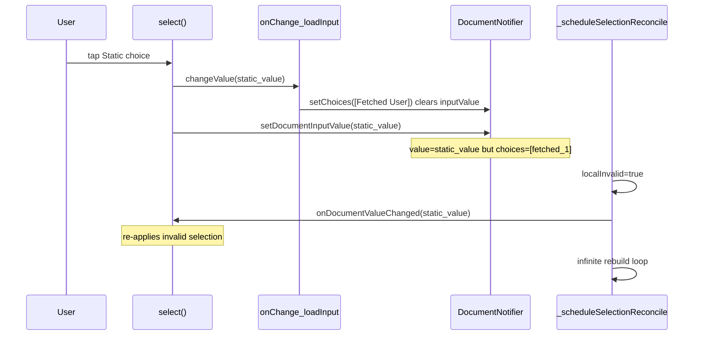

# Fix ChoiceSet selection reconcile regression

## Root cause

The host-cascade fix added `_scheduleSelectionReconcile` in [`choice_set.dart`](packages/flutter_adaptive_cards_fs/lib/src/cards/inputs/choice_set.dart). It detects when `_selectedChoices` is not in the current resolved `choices` list and schedules a post-frame sync via `onDocumentValueChanged(readResolvedInput().valueRaw)`.

That breaks the Data.Query + `loadInput` flow exercised by [`choice_set_data_query_test.dart`](packages/flutter_adaptive_cards_fs/test/inputs/choice_set_data_query_test.dart) (`onChange with Data.Query then loadInput replaces choices in UI`):



**Why only one test fails:** Other tests either don’t replace choices after selection, or don’t call `loadInput` inside `onChange` before `setDocumentInputValue` runs in `select()`.

**Why host cascade still needs the fix:** After country change, document value is correctly cleared (`""`) but local `_selectedChoices` briefly holds `nyc` while choices change — reconcile must clear local state, not re-import an invalid document value.

## Fix (minimal change in one file)

Update `_scheduleSelectionReconcile` in [`choice_set.dart`](packages/flutter_adaptive_cards_fs/lib/src/cards/inputs/choice_set.dart):

1. **Compute valid intersection** between resolved document value(s) and current choice values:
   - `validResolved = resolvedValues ∩ choiceValues`
2. **Detect invalid document value** (`docInvalid`: any resolved value not in current choices).
3. **Reconcile target** = `validResolved` (empty set → `''`), never the raw invalid document value.
4. **Post-frame actions** when `localInvalid || docMismatch || docInvalid`:
   - If document holds invalid value(s): `setDocumentInputValue(target)` to clear the stale overlay
   - Always: `onDocumentValueChanged(target)` to sync local `_selectedChoices`

Keep existing guards unchanged:

- `_singleChoiceValueFor` — prevents DropdownButton assertion on the stale frame
- `_selectionReconcileScheduled` — prevents duplicate callbacks per frame

### Pseudocode

```dart
final validResolved = resolvedValues.where(choiceValues.contains);
final target = validResolved.isEmpty ? '' : validResolved.join(',');
final docInvalid = resolvedValues.any((v) => !choiceValues.contains(v));

if (!localInvalid && !docMismatch && !docInvalid) return;

// post-frame:
if (docInvalid || docMismatch) setDocumentInputValue(target);
onDocumentValueChanged(target);
```

No changes needed to tests or Widgetbook demo code — behavior matches intended semantics: a selected value that no longer exists in the choice list should be cleared.

## Verification

Run from `packages/flutter_adaptive_cards_fs`:

```bash
fvm flutter test test/inputs/choice_set_data_query_test.dart
fvm flutter test test/inputs/dependent_choice_set_test.dart
fvm flutter test test/inputs/cascade_choice_set_test.dart
fvm dart format lib/src/cards/inputs/choice_set.dart
fvm flutter analyze lib/src/cards/inputs/choice_set.dart
```

Manual smoke (optional): Widgetbook **Input.ChoiceSet → Value changed action (host cascade)** — country → city → change country (no crash, city cleared).

## Files touched

| File                                                                                         | Change                                    |
| -------------------------------------------------------------------------------------------- | ----------------------------------------- |
| [`choice_set.dart`](packages/flutter_adaptive_cards_fs/lib/src/cards/inputs/choice_set.dart) | Refine `_scheduleSelectionReconcile` only |
