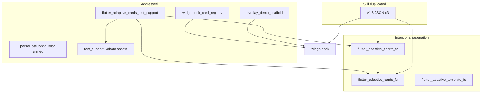

# Redundancy & Dead-Code Remediation Plan

## Current status (updated)

| Phase | Status | Notes |
|-------|--------|-------|
| **1** Quick wins | **Done** | Dead files removed, unused deps trimmed, orphans deleted, legacy docs archived |
| **2** Lib consolidation | **Done** | `parseIsVisible`, `parseHostConfigColor`, merged `isVisible` tests |
| **3** Test infrastructure (Option A) | **Done** | [`flutter_adaptive_cards_test_support`](packages/flutter_adaptive_cards_test_support/) created; cards + template migrated; charts goldens passing (registry wiring fix) |
| **6.1–6.2** Docs/skills | **Done** | [`AGENTS.md`](AGENTS.md) paths fixed; monorepo skill dependency graph corrected |
| **4** Fixtures/fonts | **Partial** | §4.2 Roboto fonts consolidated in test_support (~10 MB saved, merged #27/#28); §4.1 v1.6 JSON still triplicated |
| **5** Widgetbook/explorer | **Done** | §5.1 [`widgetbook_card_registry.dart`](../../widgetbook/lib/widgetbook_card_registry.dart); §5.2 [`overlay_demo_scaffold.dart`](../../widgetbook/lib/overlay_demo_scaffold.dart); §5.3 explorer README; docs/skill updated |
| **6.3–6.4** | **Out of scope** | README boilerplate + generic skills dedup (explicit decision) |
| **7** CI | Pending | Optional matrix + analyze step |

**Verification (latest):**

```text
fvm flutter analyze  (widgetbook)
→ No issues found

fvm flutter analyze packages/flutter_adaptive_cards_test_support packages/flutter_adaptive_cards_fs packages/flutter_adaptive_charts_fs
→ No issues found

fvm flutter test --exclude-tags=golden  (flutter_adaptive_cards_fs)
→ 360 passed

fvm flutter test  (flutter_adaptive_template_fs)
→ 94 passed

fvm flutter test test/golden_v1_6_test.dart  (flutter_adaptive_charts_fs)
→ 7 golden tests passed (no RenderFlex overflow)
```

**Charts golden follow-up — resolved:** Failures were caused by calling shared `getV16SampleForGoldenTest`, which uses the default `CardTypeRegistry` (no `Chart.*` types). Unregistered chart elements rendered as debug `ErrorWidget`s (~99k px overflow in the card `Column`). Fix: route chart goldens through charts-local `getChartTestWidgetFromPath` / `getChartSampleForGoldenTest`, which injects `CardChartsRegistry`.

**Optional Phase 3 polish (non-blocking):** Hide `getV16SampleForGoldenTest` from charts re-export to prevent regression. Template tools (`generate_example_outputs.dart` / `fix_outputs.dart`) still duplicate expand logic.

**Remaining work:** §4.1 v1.6 JSON canonicalization; Phase 7 CI (optional). Phases 1–3, §4.2, §5, and §6.1–6.2 are merged or ready to PR (widgetbook §5.1–5.2 may be uncommitted in working tree).

---

## Scope summary

The monorepo’s **package boundaries are sound** (`flutter_adaptive_cards_fs`, `flutter_adaptive_template_fs`, `flutter_adaptive_charts_fs` are complementary, not overlapping). Redundancy is concentrated in:

- ~~**Dead legacy source files** and **unused pubspec deps**~~ (Phase 1 done)
- ~~**Copy-pasted test harness** across cards + charts~~ (Phase 3 done via test support package)
- ~~**Triplicated HostConfig color parsing**~~ (Phase 2 done)
- **Triplicated v1.6 JSON fixtures** (cards tests, charts tests, widgetbook) — Phase 4 §4.1
- ~~**Duplicated font assets** (~10 MB Roboto trees in cards + charts)~~ (§4.2 done — single copy in test_support)
- ~~**Boilerplate in widgetbook** (chart registry wiring, overlay-retry pages)~~ (Phase 5 done)
- ~~**Documentation / skill path drift** (`doc/` vs `docs/`, stale skill references)~~ (§6.1–6.2 done; overlay-demos doc updated for §5.2)



---

## Phase 1 — Quick wins ✅ Complete

**Goal:** Remove confirmed dead code and unused dependencies with no behavioral change.

### Done

- Deleted [`adaptive_element.dart`](packages/flutter_adaptive_cards_fs/lib/src/adaptive_element.dart), [`basic_markdown.dart`](packages/flutter_adaptive_cards_fs/lib/src/basic_markdown.dart)
- Updated [`registry.dart`](packages/flutter_adaptive_cards_fs/lib/src/registry.dart) doc comments (`ElementCreator` instead of `AdaptiveElement`)
- Removed unused deps: `mockito` (cards), `http`/`intl`/`uuid` (charts), `cupertino_icons`/`path` (explorer), `cupertino_icons` (widgetbook)
- Deleted orphan fixtures and placeholder test; merged root [`is_visible_test.dart`](packages/flutter_adaptive_cards_fs/test/is_visible_test.dart) into [`elements/is_visible_test.dart`](packages/flutter_adaptive_cards_fs/test/elements/is_visible_test.dart)
- Archived [`CHANGELOG_ORIG.md`](docs/archive/CHANGELOG_ORIG.md) and [`README_orig.md`](docs/archive/README_orig.md); updated attribution link in package README

---

## Phase 2 — Internal library consolidation ✅ Complete

### Done

- **`parseIsVisible()`** in [`utils.dart`](packages/flutter_adaptive_cards_fs/lib/src/utils/utils.dart) — used by [`adaptive_mixins.dart`](packages/flutter_adaptive_cards_fs/lib/src/adaptive_mixins.dart) and [`adaptive_card_document_notifier.dart`](packages/flutter_adaptive_cards_fs/lib/src/riverpod/adaptive_card_document_notifier.dart)
- **`parseHostConfigColor()`** in `utils.dart` — replaces 3× `_parseColor` in HostConfig models
- **[`test/utils/parse_helpers_test.dart`](packages/flutter_adaptive_cards_fs/test/utils/parse_helpers_test.dart)** — unit coverage for both helpers
- Static `isVisible` cases migrated to [`test/elements/is_visible_test.dart`](packages/flutter_adaptive_cards_fs/test/elements/is_visible_test.dart)

---

## Phase 3 — Test infrastructure deduplication ✅ Complete (Option A)

### Implemented: `packages/flutter_adaptive_cards_test_support/`

Unpublished workspace package ([`README.md`](packages/flutter_adaptive_cards_test_support/README.md)) exporting:

| Module | Purpose |
|--------|---------|
| `http_overrides.dart` | `MyTestHttpOverrides`, `TransparentImage`, `Blue8x8Image` (Fake-based; replaces charts mockito mocks) |
| `test_widget_helpers.dart` | `getTestWidgetFromMap` / `getTestWidgetFromPath` / `getTestWidgetFromString` with optional `CardTypeRegistry` |
| `golden_helpers.dart` | `configureTestView`, `getGoldenPath`, `getV16SampleForGoldenTest`, `getSampleForGoldenTest` |
| `flutter_test_config.dart` | `adaptiveCardsTestExecutable` (HTTP overrides + Roboto font loading) |

**Consumers:**

- [`flutter_adaptive_cards_fs/test/utils/test_utils.dart`](packages/flutter_adaptive_cards_fs/test/utils/test_utils.dart) — re-exports test support; goldens use `getV16SampleForGoldenTest` (default registry includes built-in v1.6 elements)
- [`flutter_adaptive_charts_fs/test/utils/test_utils.dart`](packages/flutter_adaptive_charts_fs/test/utils/test_utils.dart) — thin wrapper: `chartCardTypeRegistry`, `getChartTestWidgetFromPath`, `getChartSampleForGoldenTest` (re-exports test_support; **not** shared `getV16SampleForGoldenTest` for goldens)
- Cards [`flutter_test_config.dart`](packages/flutter_adaptive_cards_fs/test/flutter_test_config.dart) delegates to `adaptiveCardsTestExecutable`
- Charts golden tests: all 7 passing after registry wiring fix

**Additional changes:**

- Exported [`InheritedAdaptiveCardHandlers`](packages/flutter_adaptive_cards_fs/lib/src/action/action_handler.dart) from [`flutter_adaptive_cards_fs.dart`](packages/flutter_adaptive_cards_fs/lib/flutter_adaptive_cards_fs.dart) (avoids `implementation_imports` in test support)
- Added to root workspace [`pubspec.yaml`](pubspec.yaml)
- **Charts:** `mockito` removed; golden registry wiring via `chartCardTypeRegistry`

### Template package test dedup ✅

- [`ms_template_fixture_test_helper.dart`](packages/flutter_adaptive_template_fs/test/ms_template_fixture_test_helper.dart) — shared `registerMicrosoftTemplateFixtureTests()`
- [`ms_template_sample_test.dart`](packages/flutter_adaptive_template_fs/test/ms_template_sample_test.dart) and [`ms_template_examples_test.dart`](packages/flutter_adaptive_template_fs/test/ms_template_examples_test.dart) — thin callers

### Resolved follow-up

- **Charts golden tests:** ~~`RenderFlex overflowed by 99404 pixels`~~ — fixed by ensuring chart goldens load samples through `getTestWidgetFromPath` with `CardChartsRegistry` (avoid shared `getV16SampleForGoldenTest`)

### Remaining (Phase 3 polish, lower priority)

- **Charts re-export:** hide `getV16SampleForGoldenTest` from charts `test_utils.dart` re-export to prevent regression
- **Template tools:** `tool/generate_example_outputs.dart` / `tool/fix_outputs.dart` still duplicate expand logic

---

## Phase 4 — Fixture & asset deduplication (~1 PR) — Partial (§4.2 done)

### 4.1 v1.6 sample JSON (triplicated) — Pending

Canonical copies still exist in:

- `packages/flutter_adaptive_cards_fs/test/samples/v1.6/`
- `packages/flutter_adaptive_charts_fs/test/samples/v1.6/`
- `widgetbook/lib/samples/v1.6/`

**Recommended approach:** Create `fixtures/adaptive_card_samples/v1.6/` at repo root (or under cards as canonical). Add `tool/sync_samples.dart` or CI drift check.

### 4.2 Duplicated Roboto font assets ✅ Complete

#### Implemented (2026-06)

| Location | Status |
|----------|--------|
| [`packages/flutter_adaptive_cards_test_support/assets/fonts/Roboto/`](packages/flutter_adaptive_cards_test_support/assets/fonts/Roboto/) | **Canonical** — 10 `.ttf` faces + `LICENSE.txt` (~1.4 MB) |
| [`packages/flutter_adaptive_cards_fs/assets/fonts/`](packages/flutter_adaptive_cards_fs/assets/fonts/) | **Deleted** |
| [`packages/flutter_adaptive_charts_fs/assets/fonts/`](packages/flutter_adaptive_charts_fs/assets/fonts/) | **Deleted** (was byte-identical copy) |

**Migration approach:** `git mv` of the 10 loaded faces from cards → test_support (preserves git history on those paths); `git rm` of charts duplicate tree and unused variants (`material_fonts/`, italic/black faces).

**`loadAdaptiveCardsTestFonts()`:** Removed cwd-relative `fontsRoot` parameter. Fonts resolve via [`package_config`](https://pub.dev/packages/package_config) to the test_support package root, then load with `FontLoader` + `File`. This works while test_support remains a **dev_dependency** (dev-dependency assets are not merged into the Flutter test asset bundle, so `rootBundle.load('packages/flutter_adaptive_cards_test_support/...')` alone fails).

**Also added:** `flutter: assets:` entries in test_support `pubspec.yaml`; [`tool/check_no_duplicate_fonts.sh`](tool/check_no_duplicate_fonts.sh) CI guard.

**Verification (2026-06):**

```text
cd packages/flutter_adaptive_cards_fs && fvm flutter test --tags=golden   # 19 passed
cd packages/flutter_adaptive_charts_fs && fvm flutter test --tags=golden  # 8 passed
tool/check_no_duplicate_fonts.sh                                          # OK
```

No golden PNG regeneration required (same font bytes).

#### Original plan notes (archived)

<details>
<summary>Pre-migration state and design options</summary>

#### Former state

| Location | Size | Used by |
|----------|------|---------|
| [`packages/flutter_adaptive_cards_fs/assets/fonts/`](packages/flutter_adaptive_cards_fs/assets/fonts/) | ~5.2 MB | Golden/widget tests (via `File('assets/fonts/Roboto/...')`) |
| [`packages/flutter_adaptive_charts_fs/assets/fonts/`](packages/flutter_adaptive_charts_fs/assets/fonts/) | ~5.2 MB | **Byte-identical copy** for charts golden tests |

Phase 3 centralized **loading** in [`loadAdaptiveCardsTestFonts()`](packages/flutter_adaptive_cards_test_support/lib/src/flutter_test_config.dart), but each package still kept its own on-disk tree because loading used a **cwd-relative** path:

```dart
File('assets/fonts/Roboto/Roboto-Regular.ttf')  // resolves per package when `flutter test` runs
```

Neither library `pubspec.yaml` declared these as Flutter `assets:` — they existed only for test `File` I/O. HostConfig maps font names to `'Roboto'` (see [`code_block.dart`](packages/flutter_adaptive_cards_fs/lib/src/cards/elements/code_block.dart)); golden tests must register that family via `FontLoader` or text metrics drift across platforms.

**Subset actually loaded:** test support loads **10** files (Regular/Bold/Light/Medium/Thin + RobotoMono variants). Each package tree contained **22** `.ttf` files plus unused `material_fonts/` / `material_symbols_outlined/` subtrees (commented out in the old config).

#### Recommended approach: single copy in `flutter_adaptive_cards_test_support`

Store fonts once in the test-support package. Original plan preferred **`rootBundle`**; implementation uses **package_config + File** because test_support is a dev_dependency.

```text
packages/flutter_adaptive_cards_test_support/
  assets/fonts/Roboto/
    Roboto-Regular.ttf
    Roboto-Bold.ttf
    … (10 files only — drop unreferenced variants)
  pubspec.yaml          ← flutter: assets: [assets/fonts/Roboto/…]
  lib/src/flutter_test_config.dart
```

</details>

#### Alternative approaches (not used)

| Option | How | Pros | Cons |
|--------|-----|------|------|
| **B. Cards canonical + path param** | Keep fonts only under cards; charts `adaptiveCardsTestExecutable(fontsRoot: '../flutter_adaptive_cards_fs/assets/fonts/Roboto')` | Minimal file moves | Still cwd-sensitive; breaks if test cwd changes; charts depends on cards filesystem layout |
| **C. Repo-root `fixtures/fonts/`** | `fixtures/fonts/Roboto/` + test_support resolves via monorepo-relative path | Visible “shared fixtures” folder | Fragile outside monorepo; still `File`-based; doesn’t work on pub.dev consumers |
| **D. Git symlinks** | `charts/assets/fonts` → `../flutter_adaptive_cards_fs/assets/fonts` | No duplicate bytes locally | Poor Windows/checkout support; easy to break |
| **E. Trim only** | Delete charts copy; charts tests always run from cards path | Quick | Doesn’t fix duplication at source; charts CI must run from specific cwd |

#### Migration checklist (Phase 4 PR) — §4.2 done

1. ~~Copy the **10 loaded** `.ttf` files into `flutter_adaptive_cards_test_support/assets/fonts/Roboto/`.~~ **Done** (`git mv` from cards)
2. ~~Add `flutter: assets:` entries to test_support `pubspec.yaml`.~~ **Done**
3. ~~Refactor `loadAdaptiveCardsTestFonts()` to resolve test_support package path (package_config + File; rootBundle blocked by dev_dependency).~~ **Done**
4. ~~Remove `fontsRoot` from `adaptiveCardsTestExecutable()`.~~ **Done**
5. ~~Delete duplicate font trees from cards and charts packages.~~ **Done**
6. ~~Run golden suites for cards + charts.~~ **Done** — no PNG regen needed
7. ~~Add CI guard: `tool/check_no_duplicate_fonts.sh`.~~ **Done**

**Savings:** ~10 MB repo checkout size (two ~5.2 MB trees → one ~1.4 MB subset of 10 files).

---

## Phase 5 — Widgetbook & explorer cleanup ✅ Complete

### 5.1 Extract widgetbook chart registry ✅

[`widgetbook/lib/widgetbook_card_registry.dart`](../../widgetbook/lib/widgetbook_card_registry.dart):

- `widgetbookCardTypeRegistry` — chart elements (default for generic, network, chart knobs, dependent choice set, and non-chart-overlay pages)
- `widgetbookChartOverlayCardTypeRegistry` — chart elements + `CardChartsRegistry.overlayExtensions` (chart overlay demo)

Replaced inline `CardTypeRegistry(addedElements: CardChartsRegistry…)` in 9 widgetbook consumers. `CardChartsRegistry` references now live only in the registry module.

### 5.2 Overlay demo scaffold ✅

[`widgetbook/lib/overlay_demo_scaffold.dart`](../../widgetbook/lib/overlay_demo_scaffold.dart) — `OverlayDemoPageState<T>` mixin:

| API | Purpose |
|-----|---------|
| `loadOverlayCardAsset` | Bundle load; optional `injectIds` (text_block) |
| `scheduleOverlayApply` / `runWhenCardReady` | Post-frame queue + 30-attempt retry until `documentContainer` ready |
| `buildOverlayCard` | Loading spinner + `RawAdaptiveCard` shell |

All five `*_overlay_page.dart` demos refactored; per-page knob sync and overlay apply logic remain in each page. [`docs/widgetbook-overlay-demos.md`](../widgetbook-overlay-demos.md) and widgetbook-overlay-demos skill updated.

### 5.3 Fix adaptive_explorer documentation drift ✅

[`adaptive_explorer/README.md`](adaptive_explorer/README.md) no longer lists charts as a supported library. The intro documents **cards + template** only; chart element types are called out as unsupported in explorer (use widgetbook). Matches [`main.dart`](adaptive_explorer/lib/main.dart), which uses the default `CardTypeRegistry` without `flutter_adaptive_charts_fs`.

---

## Phase 6 — Documentation & skills hygiene

**In scope:** §6.1 and §6.2 only. **Out of scope:** §6.3 README boilerplate, §6.4 generic skills deduplication.

### 6.1 Fix broken paths in [`AGENTS.md`](AGENTS.md) ✅

Updated `doc/` → `docs/` links (`AdaptiveWidget-Key-Generation.md`, `form-inputs.md`, `reactive-riverpod.md`).

### 6.2 Fix stale skill reference ✅

[`.agents/skills/adaptive-cards-monorepo-workspace/SKILL.md`](.agents/skills/adaptive-cards-monorepo-workspace/SKILL.md) — separate dependency excerpts for `adaptive_explorer` (cards + template) vs `widgetbook` (cards + charts).

### ~~6.3 README boilerplate~~ (out of scope)

### ~~6.4 Generic skills duplication~~ (out of scope)

---

## Phase 7 — CI hardening (optional) — Pending

[`.github/workflows/test.yml`](.github/workflows/test.yml) still duplicates cards/charts blocks and omits `fvm flutter analyze`, widgetbook tests, and consistent artifact action versions.

---

## Explicit non-goals (do not “fix”)

| Item | Reason |
|------|--------|
| `MediaSource`, `factsFromJsonList`, `actionIdFromMap` exports | May be used by external pub.dev consumers |
| Cards vs template package split | Intentional per [`docs/adaptive-template-design.md`](docs/adaptive-template-design.md) |
| widgetbook + adaptive_explorer both previewing cards | Different UX goals; only dedupe shared wiring |
| README boilerplate across root/package READMEs (§6.3) | Explicitly out of scope |
| Generic skills vendored in `.agents/skills/` (§6.4) | Explicitly out of scope |
| 15 repetitive HostConfig deserialization tests | Low ROI |

---

## Suggested PR sequence (revised)

| PR | Contents | Status |
|----|----------|--------|
| **PR1** | Phase 1 | **Merged** |
| **PR2** | Phase 2 | **Merged** |
| **PR3** | Phase 3 + §6.1–6.2 + test-support README | **Merged** |
| **PR4a** | Phase 4 §4.2 fonts (#27, #28) | **Merged** |
| **PR4b** | Phase 4 §4.1 v1.6 JSON canonicalization | **Next** |
| **PR5** | Phase 5 widgetbook registry + overlay scaffold + CHANGELOG | Ready to commit (if not yet PR’d) |
| **PR6** | Phase 7 CI matrix | Not started |

**Verification commands** (per AGENTS.md):

```bash
fvm flutter analyze
cd packages/flutter_adaptive_cards_fs && fvm flutter test --exclude-tags=golden
cd packages/flutter_adaptive_template_fs && fvm flutter test
cd packages/flutter_adaptive_charts_fs && fvm flutter test test/golden_v1_6_test.dart
```

---

## Success metrics

| Metric | Target | Current |
|--------|--------|---------|
| Duplicated test code consolidated | ~500+ lines | **Done** (test support package) |
| Font duplication removed | ~10 MB → single ~1.4 MB subset in test_support | **Done** (§4.2, #27/#28) |
| Widgetbook registry/scaffold deduped | Single registry + overlay mixin | **Done** (§5.1–5.2) |
| JSON fixtures canonicalized | 27+ files | Pending (Phase 4 §4.1) |
| Dead source files | 0 | **Done** |
| AGENTS.md links resolve | Yes | **Done** |
| Test regressions | None | Cards 360 ✓; template 94 ✓; charts golden 7/7 ✓; widgetbook analyze ✓ |
