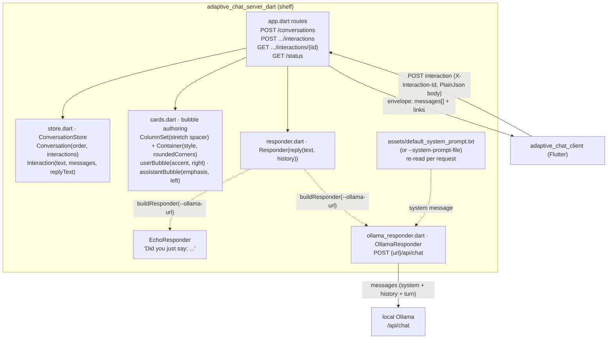
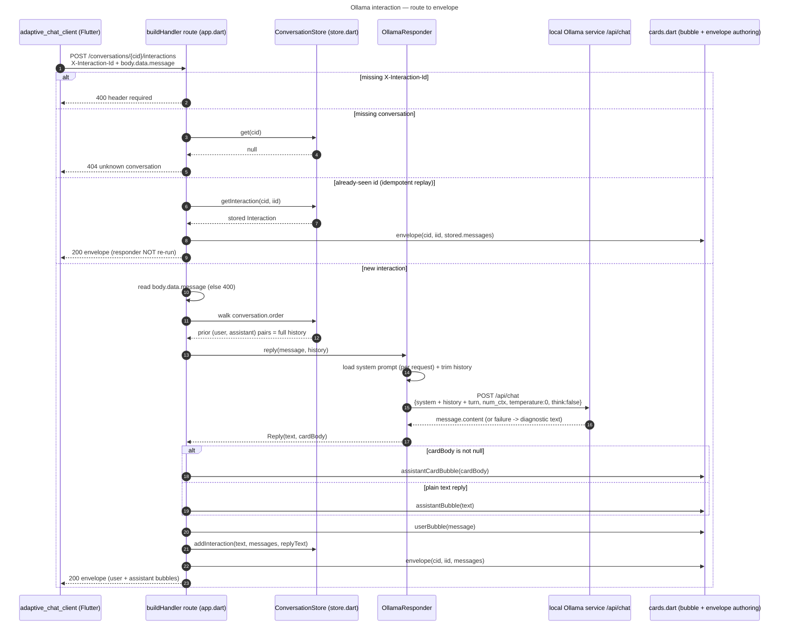
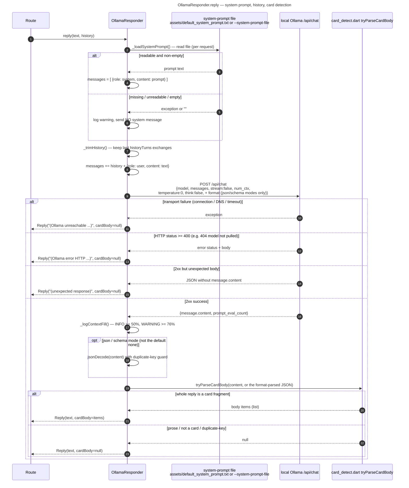

# adaptive_chat_server_dart Implementation Plan

> **For agentic workers:** REQUIRED SUB-SKILL: Use superpowers:subagent-driven-development (recommended) or superpowers:executing-plans to implement this plan task-by-task. Steps use checkbox (`- [ ]`) syntax for tracking.

**Goal:** Build `adaptive_chat_server_dart`, a Dart/shelf port of `adaptive_chat_server` (Python/FastAPI) that is wire-compatible with `adaptive_chat_client` and behaviorally identical (routes, CLI flags, responder logic, `/status` payload), so the demo has a Dart backend option alongside the existing Python one.

**Architecture:** A `shelf` + `shelf_router` HTTP server (`lib/src/app.dart`) fronting an in-memory `ConversationStore`, a pluggable `Responder` (echo or Ollama), server-authored Adaptive Card bubbles, and a `GET /status` operator snapshot — each concern in its own file mirroring the Python `app/` module boundaries 1:1. `bin/server.dart` is the CLI entrypoint (`args`-based flag parsing, asset-path resolution, `shelf_io.serve`).

**Tech Stack:** Dart (SDK `^3.12.0`, no Flutter dependency), `shelf`, `shelf_router`, `args`, `http`, `crypto`, `logging`, `path`; `package:test` + `http/testing.dart`'s `MockClient` for tests.

**Reference implementation (read, don't copy verbatim — behavior source of truth):** `adaptive_chat_server/app/*.py` and `adaptive_chat_server/tests/*.py`. **Design spec:** `docs/superpowers/specs/2026-08-09-adaptive-chat-server-dart-design.md`.

## Global Constraints

- Dart SDK constraint: `^3.12.0` (matches root `pubspec.yaml`).
- Prefix every `dart`/`flutter` shell command with `fvm` (repo-wide rule, AGENTS.md § Package Management) — e.g. `fvm dart test`, `fvm dart pub get`, `fvm dart analyze`.
- Lint config: `include: package:very_good_analysis/analysis_options.yaml` plus `avoid_print: true`, `prefer_single_quotes: true`, `always_use_package_imports: true` (AGENTS.md § Analysis Options). **`always_use_package_imports` means every intra-package import in `lib/` must be `package:adaptive_chat_server_dart/src/xxx.dart`, never a relative `'xxx.dart'`.** Every code block in this plan already follows that — don't relax it.
- Naming: `PascalCase` classes, `camelCase` members/functions, `snake_case` files (AGENTS.md § Code Quality).
- No `print()` calls. Logging goes through `package:logging`'s `Logger`, sunk to `stdout.writeln` in `bin/server.dart` (not `dart:developer.log`, which targets DevTools/Observatory rather than a console a server operator is tailing — this is a deliberate, narrow deviation from AGENTS.md's general "use `dart:developer` log" guidance, scoped to this CLI server's need for operator-visible console output; it still satisfies `avoid_print` since `stdout.writeln` isn't `print()`).
- Git commit gate: per AGENTS.md's standing exception for subagent-driven plan execution, each task below may `git commit` to the current feature branch (`feat/adaptive-chat-server-dart`) without asking — do **not** `git push`, merge, or touch `main`.
- Local tooling: `curl` and local Ollama calls (`http://127.0.0.1:11434`) don't require asking permission (AGENTS.md § Local tooling permissions).
- No `CHANGELOG.md` package-gate applies (`adaptive_chat_server_dart/` is a top-level demo app, not under `packages/`) and no `tool/coverage_floors.yaml` entry is needed — see the design spec's Non-goals.
- Every new/changed top-level directory this plan touches: `adaptive_chat_server_dart/` (new), `pubspec.yaml` (root workspace list), `README.md` (root, pointer note), `.github/workflows/adaptive_chat.yml` (new CI job).

---

## Task 1: Scaffold the package

**Files:**
- Create: `adaptive_chat_server_dart/pubspec.yaml`
- Create: `adaptive_chat_server_dart/analysis_options.yaml`
- Create: `adaptive_chat_server_dart/CHANGELOG.md`
- Create: `adaptive_chat_server_dart/assets/default_system_prompt.txt`
- Create: `adaptive_chat_server_dart/assets/card_system_prompt.txt`
- Create: `adaptive_chat_server_dart/assets/card_schema.json`
- Modify: `pubspec.yaml:7-9` (root workspace list)

**Interfaces:**
- Produces: the `adaptive_chat_server_dart` package (importable as `package:adaptive_chat_server_dart/src/...`), and three bundled asset files later tasks read via `File`.

- [ ] **Step 1: Create the package manifest**

`adaptive_chat_server_dart/pubspec.yaml`:

```yaml
name: adaptive_chat_server_dart
description: Dart port of the Adaptive Chat SDUI demo backend (adaptive_chat_server).
publish_to: none
version: 0.1.0

environment:
  sdk: ^3.12.0

resolution: workspace

dependencies:
  shelf: ^1.4.2
  shelf_router: ^1.1.4
  args: ^2.6.0
  http: ^1.2.2
  crypto: ^3.0.5
  logging: ^1.2.0
  path: ^1.9.0

dev_dependencies:
  test: ^1.25.0
  very_good_analysis: ^10.3.0
```

- [ ] **Step 2: Create the analysis options**

`adaptive_chat_server_dart/analysis_options.yaml`:

```yaml
include: package:very_good_analysis/analysis_options.yaml

linter:
  rules:
    avoid_print: true
    prefer_single_quotes: true
    always_use_package_imports: true
```

- [ ] **Step 3: Create an empty changelog**

`adaptive_chat_server_dart/CHANGELOG.md`:

```markdown
# Changelog

## [Unreleased]

- Initial Dart port of `adaptive_chat_server` (echo + Ollama responders, card
  detection, `/status` endpoint).
```

- [ ] **Step 4: Copy the bundled prompt/schema assets from the Python server verbatim**

Run:

```bash
mkdir -p adaptive_chat_server_dart/assets
cp adaptive_chat_server/app/default_system_prompt.txt adaptive_chat_server_dart/assets/default_system_prompt.txt
cp adaptive_chat_server/app/card_system_prompt.txt adaptive_chat_server_dart/assets/card_system_prompt.txt
cp adaptive_chat_server/app/card_schema.json adaptive_chat_server_dart/assets/card_schema.json
```

These three files are content-identical to the Python originals — the prompts and the schema are the behavioral spec for the model, not something to reinterpret per-language.

- [ ] **Step 5: Add the package to the root pub workspace**

Modify `pubspec.yaml` at repo root — add `adaptive_chat_server_dart` to the `workspace:` list (matches the existing `adaptive_chat_client` entry):

```yaml
workspace:
  - packages/flutter_adaptive_cards_fs
  - packages/flutter_adaptive_cards_host_fs
  - packages/flutter_adaptive_cards_test_support
  - packages/flutter_adaptive_charts_fs
  - packages/flutter_adaptive_template_fs
  - widgetbook
  - adaptive_explorer
  - adaptive_chat_client
  - adaptive_chat_server_dart
```

- [ ] **Step 6: Resolve dependencies and verify the scaffold**

Run: `fvm dart pub get` (from repo root — resolves the whole workspace)
Expected: exits 0, `pubspec.lock` updates to include `shelf`, `shelf_router`, `args`, `http`, `crypto`, `logging`, `path`, `test`, `very_good_analysis` for `adaptive_chat_server_dart`.

- [ ] **Step 7: Commit**

```bash
git add adaptive_chat_server_dart/pubspec.yaml adaptive_chat_server_dart/analysis_options.yaml \
  adaptive_chat_server_dart/CHANGELOG.md adaptive_chat_server_dart/assets pubspec.yaml pubspec.lock
git commit -m "feat(adaptive-chat-server-dart): scaffold package and bundle prompt assets"
```

---

## Task 2: `lib/src/stats.dart` — token/timing stats

**Files:**
- Create: `adaptive_chat_server_dart/lib/src/stats.dart`
- Test: `adaptive_chat_server_dart/test/stats_test.dart`

**Interfaces:**
- Produces: `class InteractionStats` (`{promptTokens, replyTokens, totalMs, loadMs, promptEvalMs, evalMs}`, all `int`, `const` constructor), `InteractionStats? fromOllamaResponse(Map<String, dynamic> data)`, `Map<String, dynamic> statsToJson(InteractionStats stats)`.

- [ ] **Step 1: Write the test file**

`adaptive_chat_server_dart/test/stats_test.dart`:

```dart
import 'package:adaptive_chat_server_dart/src/stats.dart';
import 'package:test/test.dart';

void main() {
  group('fromOllamaResponse', () {
    test('full body populates all fields with ns-to-ms conversion', () {
      final stats = fromOllamaResponse({
        'prompt_eval_count': 120,
        'eval_count': 45,
        'total_duration': 8200000000,
        'load_duration': 12000000,
        'prompt_eval_duration': 900000000,
        'eval_duration': 7200000000,
      });
      expect(stats, isNotNull);
      expect(stats!.promptTokens, 120);
      expect(stats.replyTokens, 45);
      expect(stats.totalMs, 8200);
      expect(stats.loadMs, 12);
      expect(stats.promptEvalMs, 900);
      expect(stats.evalMs, 7200);
    });

    test('missing prompt_eval_count returns null', () {
      expect(fromOllamaResponse({'eval_count': 45}), isNull);
    });

    test('non-int eval_count returns null', () {
      expect(
        fromOllamaResponse({'prompt_eval_count': 10, 'eval_count': '45'}),
        isNull,
      );
    });

    test('missing duration fields default to 0, tokens preserved', () {
      final stats = fromOllamaResponse({
        'prompt_eval_count': 10,
        'eval_count': 5,
      });
      expect(stats, isNotNull);
      expect(stats!.totalMs, 0);
      expect(stats.loadMs, 0);
      expect(stats.promptEvalMs, 0);
      expect(stats.evalMs, 0);
    });

    test('non-int duration field defaults to 0 rather than throwing', () {
      final stats = fromOllamaResponse({
        'prompt_eval_count': 10,
        'eval_count': 5,
        'total_duration': 'not-a-number',
      });
      expect(stats!.totalMs, 0);
    });
  });

  group('statsToJson', () {
    test('derives totalTokens and tokensPerSecond', () {
      const stats = InteractionStats(
        promptTokens: 100,
        replyTokens: 50,
        totalMs: 1000,
        loadMs: 10,
        promptEvalMs: 200,
        evalMs: 500,
      );
      final json = statsToJson(stats);
      expect(json['totalTokens'], 150);
      expect(json['tokensPerSecond'], 100.0);
      expect(json['promptTokens'], 100);
      expect(json['replyTokens'], 50);
    });

    test('evalMs == 0 yields tokensPerSecond 0.0, no division error', () {
      const stats = InteractionStats(
        promptTokens: 10,
        replyTokens: 5,
        totalMs: 0,
        loadMs: 0,
        promptEvalMs: 0,
        evalMs: 0,
      );
      expect(statsToJson(stats)['tokensPerSecond'], 0.0);
    });

    test('tokensPerSecond rounds to one decimal place', () {
      const stats = InteractionStats(
        promptTokens: 1,
        replyTokens: 10,
        totalMs: 0,
        loadMs: 0,
        promptEvalMs: 0,
        evalMs: 3000,
      );
      expect(statsToJson(stats)['tokensPerSecond'], 3.3);
    });
  });
}
```

- [ ] **Step 2: Run the test to verify it fails**

Run: `cd adaptive_chat_server_dart && fvm dart test test/stats_test.dart`
Expected: FAIL — `lib/src/stats.dart` doesn't exist yet (import error).

- [ ] **Step 3: Write the implementation**

`adaptive_chat_server_dart/lib/src/stats.dart`:

```dart
/// Per-interaction Ollama usage: token counts plus where the time went.
///
/// Ollama returns these numbers on every `/api/chat` response. Capturing
/// them makes "what did that turn cost" and "how large has this conversation
/// grown" answerable after the fact, via `GET /status`.
library;

const _nsPerMs = 1000000;

/// What one Ollama turn cost: tokens in and out, plus the timing breakdown.
///
/// Stores only what Ollama reported. Derived figures (total tokens,
/// generation speed) are computed in [statsToJson] so this record stays a
/// faithful copy.
class InteractionStats {
  const InteractionStats({
    required this.promptTokens,
    required this.replyTokens,
    required this.totalMs,
    required this.loadMs,
    required this.promptEvalMs,
    required this.evalMs,
  });

  /// Ollama `prompt_eval_count` — tokens sent.
  final int promptTokens;

  /// Ollama `eval_count` — tokens generated.
  final int replyTokens;

  /// `total_duration`, in milliseconds.
  final int totalMs;

  /// `load_duration` — model load, ~0 when already warm.
  final int loadMs;

  /// `prompt_eval_duration` — time reading the prompt.
  final int promptEvalMs;

  /// `eval_duration` — time generating.
  final int evalMs;
}

int _ms(Map<String, dynamic> data, String key) {
  final value = data[key];
  if (value is! int) return 0;
  return value ~/ _nsPerMs;
}

/// Builds stats from an Ollama `/api/chat` body, or `null` if unusable.
///
/// Both token counts are required: a record without them answers no
/// question worth asking, so a body missing them yields `null` rather than a
/// half-filled record. Durations are supplementary — a missing or malformed
/// one defaults to 0 instead of discarding usable token counts.
InteractionStats? fromOllamaResponse(Map<String, dynamic> data) {
  final promptTokens = data['prompt_eval_count'];
  final replyTokens = data['eval_count'];
  if (promptTokens is! int || replyTokens is! int) return null;
  return InteractionStats(
    promptTokens: promptTokens,
    replyTokens: replyTokens,
    totalMs: _ms(data, 'total_duration'),
    loadMs: _ms(data, 'load_duration'),
    promptEvalMs: _ms(data, 'prompt_eval_duration'),
    evalMs: _ms(data, 'eval_duration'),
  );
}

/// Serializes for the `/status` payload, deriving totals and speed.
///
/// `tokensPerSecond` is generation speed (reply tokens over generation
/// time), not end-to-end throughput — it excludes model load and prompt
/// evaluation, so it stays comparable across warm and cold turns. Zero when
/// `evalMs` is 0.
Map<String, dynamic> statsToJson(InteractionStats stats) {
  var tokensPerSecond = 0.0;
  if (stats.evalMs > 0) {
    final raw = stats.replyTokens / (stats.evalMs / 1000);
    tokensPerSecond = (raw * 10).round() / 10;
  }
  return {
    'promptTokens': stats.promptTokens,
    'replyTokens': stats.replyTokens,
    'totalTokens': stats.promptTokens + stats.replyTokens,
    'totalMs': stats.totalMs,
    'loadMs': stats.loadMs,
    'promptEvalMs': stats.promptEvalMs,
    'evalMs': stats.evalMs,
    'tokensPerSecond': tokensPerSecond,
  };
}
```

- [ ] **Step 4: Run the test to verify it passes**

Run: `fvm dart test test/stats_test.dart`
Expected: PASS, all 8 tests green.

- [ ] **Step 5: Commit**

```bash
git add adaptive_chat_server_dart/lib/src/stats.dart adaptive_chat_server_dart/test/stats_test.dart
git commit -m "feat(adaptive-chat-server-dart): port stats.py to stats.dart"
```

---

## Task 3: `lib/src/store.dart` — in-memory conversation state

**Files:**
- Create: `adaptive_chat_server_dart/lib/src/store.dart`
- Test: `adaptive_chat_server_dart/test/store_test.dart`

**Interfaces:**
- Consumes: `InteractionStats` from Task 2 (`package:adaptive_chat_server_dart/src/stats.dart`).
- Produces: `class Message {role, card}`, `class Interaction {interactionId, text, messages, replyText, stats}`, `class Conversation {conversationId, interactions, order}`, `class ConversationStore` with `create()`, `get(cid)`, `hasInteraction(cid, iid)`, `addInteraction(cid, interaction)`, `getInteraction(cid, iid)`, `listConversations()`.

- [ ] **Step 1: Write the test file**

`adaptive_chat_server_dart/test/store_test.dart`:

```dart
import 'package:adaptive_chat_server_dart/src/stats.dart';
import 'package:adaptive_chat_server_dart/src/store.dart';
import 'package:test/test.dart';

void main() {
  group('ConversationStore', () {
    test('create returns a conversation with a c_ prefixed id, discoverable via get', () {
      final store = ConversationStore();
      final conv = store.create();
      expect(conv.conversationId, startsWith('c_'));
      expect(store.get(conv.conversationId), same(conv));
    });

    test('create returns distinct ids across calls', () {
      final store = ConversationStore();
      final a = store.create();
      final b = store.create();
      expect(a.conversationId, isNot(b.conversationId));
    });

    test('get returns null for an unknown id', () {
      final store = ConversationStore();
      expect(store.get('missing'), isNull);
    });

    test('addInteraction then getInteraction round-trips including stats', () {
      final store = ConversationStore();
      final conv = store.create();
      const stats = InteractionStats(
        promptTokens: 1,
        replyTokens: 2,
        totalMs: 3,
        loadMs: 0,
        promptEvalMs: 1,
        evalMs: 2,
      );
      final interaction = Interaction(
        interactionId: 'i_0001',
        text: 'hi',
        messages: const [],
        replyText: 'hello',
        stats: stats,
      );
      store.addInteraction(conv.conversationId, interaction);

      final fetched = store.getInteraction(conv.conversationId, 'i_0001');
      expect(fetched, isNotNull);
      expect(fetched!.text, 'hi');
      expect(fetched.replyText, 'hello');
      expect(fetched.stats, same(stats));
      expect(conv.order, ['i_0001']);
    });

    test('an Interaction round-trips with stats: null (echo mode)', () {
      final store = ConversationStore();
      final conv = store.create();
      store.addInteraction(
        conv.conversationId,
        const Interaction(
          interactionId: 'i_0001',
          text: 'hi',
          messages: [],
          replyText: 'Did you just say: hi',
        ),
      );
      expect(store.getInteraction(conv.conversationId, 'i_0001')!.stats, isNull);
    });

    test('hasInteraction is false for an unknown conversation or interaction', () {
      final store = ConversationStore();
      expect(store.hasInteraction('missing', 'i_0001'), isFalse);
      final conv = store.create();
      expect(store.hasInteraction(conv.conversationId, 'i_0001'), isFalse);
    });

    test('hasInteraction is true once the interaction is added', () {
      final store = ConversationStore();
      final conv = store.create();
      store.addInteraction(
        conv.conversationId,
        const Interaction(interactionId: 'i_0001', text: 'hi', messages: []),
      );
      expect(store.hasInteraction(conv.conversationId, 'i_0001'), isTrue);
    });

    test('listConversations preserves creation order', () {
      final store = ConversationStore();
      final a = store.create();
      final b = store.create();
      final c = store.create();
      expect(
        store.listConversations().map((conv) => conv.conversationId).toList(),
        [a.conversationId, b.conversationId, c.conversationId],
      );
    });

    test('listConversations is empty for a fresh store', () {
      expect(ConversationStore().listConversations(), isEmpty);
    });
  });
}
```

- [ ] **Step 2: Run the test to verify it fails**

Run: `fvm dart test test/store_test.dart`
Expected: FAIL — `lib/src/store.dart` doesn't exist yet.

- [ ] **Step 3: Write the implementation**

`adaptive_chat_server_dart/lib/src/store.dart`:

```dart
/// In-memory conversation state for the Adaptive Chat demo.
library;

import 'dart:math';

import 'package:adaptive_chat_server_dart/src/stats.dart';

/// One rendered bubble: an author role plus its Adaptive Card map.
class Message {
  const Message({required this.role, required this.card});

  final String role;
  final Map<String, dynamic> card;
}

/// One send/response cycle within a conversation.
class Interaction {
  const Interaction({
    required this.interactionId,
    required this.text,
    required this.messages,
    this.replyText = '',
    this.stats,
  });

  final String interactionId;
  final String text;
  final List<Message> messages;
  final String replyText;

  /// `null` whenever the reply cost no measurable tokens: echo mode, or any
  /// Ollama failure. The interaction still counts — it happened.
  final InteractionStats? stats;
}

/// A session: ordered interactions keyed by client-supplied id.
class Conversation {
  Conversation({required this.conversationId})
      : interactions = {},
        order = [];

  final String conversationId;
  final Map<String, Interaction> interactions;
  final List<String> order;
}

final _idRandom = Random.secure();

String _newConversationId() {
  final bytes = List<int>.generate(6, (_) => _idRandom.nextInt(256));
  final hex = bytes.map((b) => b.toRadixString(16).padLeft(2, '0')).join();
  return 'c_$hex';
}

/// Process-lifetime store of conversations (lost on restart).
class ConversationStore {
  final Map<String, Conversation> _conversations = {};

  Conversation create() {
    final conv = Conversation(conversationId: _newConversationId());
    _conversations[conv.conversationId] = conv;
    return conv;
  }

  Conversation? get(String cid) => _conversations[cid];

  bool hasInteraction(String cid, String iid) {
    final conv = _conversations[cid];
    return conv != null && conv.interactions.containsKey(iid);
  }

  void addInteraction(String cid, Interaction interaction) {
    final conv = _conversations[cid]!;
    conv.interactions[interaction.interactionId] = interaction;
    conv.order.add(interaction.interactionId);
  }

  Interaction? getInteraction(String cid, String iid) =>
      _conversations[cid]?.interactions[iid];

  /// Every live conversation, in creation order.
  ///
  /// Insertion order is guaranteed by [Map] (a `LinkedHashMap` by default),
  /// the same guarantee the Python store relies on for `dict`.
  List<Conversation> listConversations() => _conversations.values.toList();
}
```

- [ ] **Step 4: Run the test to verify it passes**

Run: `fvm dart test test/store_test.dart`
Expected: PASS, all 9 tests green.

- [ ] **Step 5: Commit**

```bash
git add adaptive_chat_server_dart/lib/src/store.dart adaptive_chat_server_dart/test/store_test.dart
git commit -m "feat(adaptive-chat-server-dart): port store.py to store.dart"
```

---

## Task 4: `lib/src/cards.dart` — bubble + envelope authoring

**Files:**
- Create: `adaptive_chat_server_dart/lib/src/cards.dart`
- Test: `adaptive_chat_server_dart/test/cards_test.dart`

**Interfaces:**
- Consumes: `Message` from Task 3 (`package:adaptive_chat_server_dart/src/store.dart`).
- Produces: `Map<String, dynamic> userBubble(String text)`, `Map<String, dynamic> assistantBubble(String text)`, `Map<String, dynamic> assistantCardBubble(List<Map<String, dynamic>> bodyItems)`, `Map<String, dynamic> envelope(String cid, String iid, List<Message> messages)`.

- [ ] **Step 1: Write the test file**

`adaptive_chat_server_dart/test/cards_test.dart`:

```dart
import 'package:adaptive_chat_server_dart/src/cards.dart';
import 'package:adaptive_chat_server_dart/src/store.dart';
import 'package:test/test.dart';

void main() {
  group('userBubble', () {
    test('is right-aligned accent style with the text in a spacer/content ColumnSet', () {
      final card = userBubble('hello');
      expect(card['type'], 'AdaptiveCard');
      final body = card['body'] as List;
      final columnSet = body[1] as Map<String, dynamic>;
      final columns = columnSet['columns'] as List;
      expect(columns, hasLength(2));
      // spacer (weight 1) first, content (weight 3) second, for right alignment.
      expect((columns[0] as Map)['width'], 1);
      expect((columns[1] as Map)['width'], 3);
      final container =
          ((columns[1] as Map)['items'] as List).single as Map<String, dynamic>;
      expect(container['style'], 'accent');
      expect(container['roundedCorners'], true);
      final textBlock = (container['items'] as List).single as Map<String, dynamic>;
      expect(textBlock['text'], 'hello');
    });
  });

  group('assistantBubble', () {
    test('is left-aligned emphasis style', () {
      final card = assistantBubble('hi there');
      final body = card['body'] as List;
      final columnSet = body[1] as Map<String, dynamic>;
      final columns = columnSet['columns'] as List;
      // content (weight 3) first, spacer (weight 1) second, for left alignment.
      expect((columns[0] as Map)['width'], 3);
      expect((columns[1] as Map)['width'], 1);
      final container =
          ((columns[0] as Map)['items'] as List).single as Map<String, dynamic>;
      expect(container['style'], 'emphasis');
    });
  });

  group('assistantCardBubble', () {
    test('renders full-width with no ColumnSet, embedding the given body items', () {
      final bodyItems = [
        {'type': 'TextBlock', 'text': 'card content', 'wrap': true},
      ];
      final card = assistantCardBubble(bodyItems);
      final body = card['body'] as List;
      expect(body[0], {'type': 'TextBlock', 'text': 'assistant', 'wrap': true});
      final container = body[1] as Map<String, dynamic>;
      expect(container['type'], 'Container');
      expect(container['style'], 'emphasis');
      expect(container['roundedCorners'], true);
      expect(container['items'], bodyItems);
      // No ColumnSet anywhere in a card reply.
      expect(body.any((item) => (item as Map)['type'] == 'ColumnSet'), isFalse);
    });
  });

  group('envelope', () {
    test('carries conversationId, interactionId, message cards, and links', () {
      final messages = [
        Message(role: 'user', card: userBubble('hi')),
        Message(role: 'assistant', card: assistantBubble('hello')),
      ];
      final result = envelope('c_abc', 'i_0001', messages);
      expect(result['conversationId'], 'c_abc');
      expect(result['interactionId'], 'i_0001');
      expect(result['messages'], [messages[0].card, messages[1].card]);
      expect(result['links'], {
        'self': '/conversations/c_abc/interactions/i_0001',
        'postNext': '/conversations/c_abc/interactions',
      });
    });
  });
}
```

- [ ] **Step 2: Run the test to verify it fails**

Run: `fvm dart test test/cards_test.dart`
Expected: FAIL — `lib/src/cards.dart` doesn't exist yet.

- [ ] **Step 3: Write the implementation**

`adaptive_chat_server_dart/lib/src/cards.dart`:

```dart
/// Server-authored Adaptive Card bubbles and the response envelope.
///
/// All bubble alignment and fill live here, in the card JSON, so the client
/// stays "dumb" and renders each card full-width and stacked.
library;

import 'package:adaptive_chat_server_dart/src/store.dart';

const _version = '1.5';

// Chat bubbles span ~75% of the row: weighted columns 3:1 (= 75% / 25%). The
// empty spacer column pushes the bubble to one side.
const _bubbleWeight = 3;
const _spacerWeight = 1;

Map<String, dynamic> _bubble(
  List<Map<String, dynamic>> items, {
  required String style,
  required bool alignRight,
}) {
  final label = alignRight ? 'user' : 'assistant';
  final container = <String, dynamic>{
    'type': 'Container',
    'style': style,
    'roundedCorners': true,
    'items': items,
  };
  final content = <String, dynamic>{
    'type': 'Column',
    'width': _bubbleWeight,
    'items': [container],
  };
  final spacer = <String, dynamic>{
    'type': 'Column',
    'width': _spacerWeight,
    'items': <dynamic>[],
  };
  final columns = alignRight ? [spacer, content] : [content, spacer];
  final labelBlock = <String, dynamic>{
    'type': 'TextBlock',
    'text': label,
    'wrap': true,
    if (alignRight) 'horizontalAlignment': 'Right',
  };
  return {
    'type': 'AdaptiveCard',
    'version': _version,
    'body': [
      labelBlock,
      {'type': 'ColumnSet', 'columns': columns},
    ],
  };
}

/// A single full-width styled container — no ColumnSet, so it spans the row.
///
/// Used for card replies. The 75% [_bubble] layout relies on `ColumnSet`,
/// whose columns are wrapped in `IntrinsicHeight` by the renderer; a
/// `Carousel` inside gates its subtree behind a `LayoutBuilder` that cannot
/// answer the intrinsic-height pass, so the card renders blank / asserts.
/// Card replies skip the ColumnSet and render full-width instead.
Map<String, dynamic> _fullWidthBubble(
  List<Map<String, dynamic>> items, {
  required String style,
}) {
  final container = <String, dynamic>{
    'type': 'Container',
    'style': style,
    'roundedCorners': true,
    'items': items,
  };
  return {
    'type': 'AdaptiveCard',
    'version': _version,
    'body': [
      {'type': 'TextBlock', 'text': 'assistant', 'wrap': true},
      container,
    ],
  };
}

List<Map<String, dynamic>> _textItems(String text) => [
      {'type': 'TextBlock', 'text': text, 'wrap': true},
    ];

/// Right-aligned accent bubble for the user's message.
Map<String, dynamic> userBubble(String text) =>
    _bubble(_textItems(text), style: 'accent', alignRight: true);

/// Left-aligned emphasis bubble for a Markdown text assistant reply.
///
/// The `TextBlock` renders GitHub-flavored Markdown, so this is the default
/// reply shape used before the card path existed.
Map<String, dynamic> assistantBubble(String text) =>
    _bubble(_textItems(text), style: 'emphasis', alignRight: false);

/// Full-width emphasis container holding a model card fragment.
Map<String, dynamic> assistantCardBubble(List<Map<String, dynamic>> bodyItems) =>
    _fullWidthBubble(bodyItems, style: 'emphasis');

/// Wire envelope: pre-styled cards plus self/postNext links.
Map<String, dynamic> envelope(String cid, String iid, List<Message> messages) => {
      'conversationId': cid,
      'interactionId': iid,
      'messages': messages.map((m) => m.card).toList(),
      'links': {
        'self': '/conversations/$cid/interactions/$iid',
        'postNext': '/conversations/$cid/interactions',
      },
    };
```

- [ ] **Step 4: Run the test to verify it passes**

Run: `fvm dart test test/cards_test.dart`
Expected: PASS, all 4 tests green.

- [ ] **Step 5: Commit**

```bash
git add adaptive_chat_server_dart/lib/src/cards.dart adaptive_chat_server_dart/test/cards_test.dart
git commit -m "feat(adaptive-chat-server-dart): port cards.py to cards.dart"
```

---

## Task 5: `lib/src/responder.dart` — `Reply`, `Responder`, `EchoResponder`

**Files:**
- Create: `adaptive_chat_server_dart/lib/src/responder.dart`
- Test: `adaptive_chat_server_dart/test/responder_test.dart`

**Interfaces:**
- Consumes: `InteractionStats` from Task 2.
- Produces: `class Reply {text, cardBody, stats}`; `abstract interface class Responder` with `Future<Reply> reply(String text, List<(String, String)> history)` and `Map<String, dynamic> describe()`; `class EchoResponder implements Responder`.
- **Deviation from the design spec's sketch, noted deliberately:** `reply()` is `Future<Reply>`, not a bare `Reply`. Dart's `http.Client.post` (used by `OllamaResponder` in Task 8) has no synchronous form — Python's `httpx.Client` does. Every `Responder` implementation, including the trivial `EchoResponder`, is therefore async, and every caller `await`s it.

- [ ] **Step 1: Write the test file**

`adaptive_chat_server_dart/test/responder_test.dart`:

```dart
import 'package:adaptive_chat_server_dart/src/responder.dart';
import 'package:test/test.dart';

void main() {
  group('EchoResponder', () {
    test('echoes the text back with the fixed prefix', () async {
      final reply = await EchoResponder().reply('hello', const []);
      expect(reply.text, 'Did you just say: hello');
    });

    test('ignores history entirely', () async {
      final history = [('user', 'earlier'), ('assistant', 'earlier reply')];
      final reply = await EchoResponder().reply('now', history);
      expect(reply.text, 'Did you just say: now');
    });

    test('never returns a card body', () async {
      final reply = await EchoResponder().reply('hello', const []);
      expect(reply.cardBody, isNull);
    });

    test('never returns stats', () async {
      final reply = await EchoResponder().reply('hello', const []);
      expect(reply.stats, isNull);
    });

    test('describe reports kind: echo', () {
      expect(EchoResponder().describe(), {'kind': 'echo'});
    });
  });
}
```

- [ ] **Step 2: Run the test to verify it fails**

Run: `fvm dart test test/responder_test.dart`
Expected: FAIL — `lib/src/responder.dart` doesn't exist yet.

- [ ] **Step 3: Write the implementation**

`adaptive_chat_server_dart/lib/src/responder.dart`:

```dart
/// Reply strategies and the value type they return.
library;

import 'package:adaptive_chat_server_dart/src/stats.dart';

/// A responder's answer: raw text (for history) plus an optional card body.
///
/// [text] is always the model's raw output and is what threads into Ollama
/// conversation history. [cardBody] holds the parsed Adaptive Card body
/// items when the reply is *only* a card (rendered inside the assistant
/// bubble); `null` means render [text] as a Markdown text bubble.
///
/// [stats] carries the responder's token/timing usage for this turn, or
/// `null` when the reply cost nothing measurable (echo mode, or any failure
/// path). It never affects what the user sees — it exists for `GET /status`.
class Reply {
  const Reply({required this.text, this.cardBody, this.stats});

  final String text;
  final List<Map<String, dynamic>>? cardBody;
  final InteractionStats? stats;
}

/// Turns a user message (plus prior turns) into a [Reply].
abstract interface class Responder {
  Future<Reply> reply(String text, List<(String, String)> history);

  /// Effective configuration of this responder, for `GET /status`.
  ///
  /// Reports what the process is *actually* running, not what it was asked
  /// for — a responder may resolve or downgrade its own settings at
  /// construction, and it is the only component that knows the difference.
  /// Keys are camelCase because the result is served verbatim as JSON.
  Map<String, dynamic> describe();
}

/// v1 responder: echoes the user's text back. Ignores history; never a card.
class EchoResponder implements Responder {
  @override
  Future<Reply> reply(String text, List<(String, String)> history) async =>
      Reply(text: 'Did you just say: $text');

  @override
  Map<String, dynamic> describe() => {'kind': 'echo'};
}
```

- [ ] **Step 4: Run the test to verify it passes**

Run: `fvm dart test test/responder_test.dart`
Expected: PASS, all 5 tests green.

- [ ] **Step 5: Commit**

```bash
git add adaptive_chat_server_dart/lib/src/responder.dart adaptive_chat_server_dart/test/responder_test.dart
git commit -m "feat(adaptive-chat-server-dart): port responder.py to responder.dart"
```

---

## Task 6: `lib/src/card_detect.dart` — card-vs-text detection

**Files:**
- Create: `adaptive_chat_server_dart/lib/src/card_detect.dart`
- Test: `adaptive_chat_server_dart/test/card_detect_test.dart`

**Interfaces:**
- Produces: `List<Map<String, dynamic>>? tryParseCardBody(String raw)`, `String? cardParseFailureReason(String raw)`.

- [ ] **Step 1: Write the test file**

`adaptive_chat_server_dart/test/card_detect_test.dart`:

```dart
import 'package:adaptive_chat_server_dart/src/card_detect.dart';
import 'package:test/test.dart';

void main() {
  group('tryParseCardBody — accepted shapes', () {
    test('a full AdaptiveCard object returns its body', () {
      const raw = '{"type":"AdaptiveCard","body":[{"type":"TextBlock","text":"hi"}]}';
      expect(tryParseCardBody(raw), [
        {'type': 'TextBlock', 'text': 'hi'},
      ]);
    });

    test('a bare non-empty array of objects is returned as-is', () {
      const raw = '[{"type":"TextBlock","text":"hi"},{"type":"Badge","text":"New"}]';
      expect(tryParseCardBody(raw), [
        {'type': 'TextBlock', 'text': 'hi'},
        {'type': 'Badge', 'text': 'New'},
      ]);
    });

    test('a single element object is wrapped as a one-item body', () {
      const raw = '{"type":"Input.ChoiceSet","id":"x"}';
      expect(tryParseCardBody(raw), [
        {'type': 'Input.ChoiceSet', 'id': 'x'},
      ]);
    });

    test('a balanced ```json fence is stripped before parsing', () {
      const raw = '```json\n{"type":"TextBlock","text":"hi"}\n```';
      expect(tryParseCardBody(raw), [
        {'type': 'TextBlock', 'text': 'hi'},
      ]);
    });

    test('a bare ``` fence (no language tag) is stripped', () {
      const raw = '```\n{"type":"TextBlock","text":"hi"}\n```';
      expect(tryParseCardBody(raw), isNotNull);
    });

    test('an unbalanced opening fence is stripped', () {
      const raw = '```json\n{"type":"TextBlock","text":"hi"}';
      expect(tryParseCardBody(raw), isNotNull);
    });

    test('an unbalanced closing fence is stripped', () {
      const raw = '{"type":"TextBlock","text":"hi"}\n```';
      expect(tryParseCardBody(raw), isNotNull);
    });

    test('leading/trailing decoration (=== headers) is stripped', () {
      const raw = '=== \n{"type":"TextBlock","text":"hi"}\n ===';
      expect(tryParseCardBody(raw), isNotNull);
    });
  });

  group('tryParseCardBody — rejected shapes', () {
    test('surrounding prose is not stripped, so it is rejected', () {
      const raw = 'Sure, here you go: {"type":"TextBlock","text":"hi"}';
      expect(tryParseCardBody(raw), isNull);
    });

    test('plain prose with no JSON returns null', () {
      expect(tryParseCardBody('Just a normal reply.'), isNull);
    });

    test('an empty array returns null', () {
      expect(tryParseCardBody('[]'), isNull);
    });

    test('a mixed array (non-object element) returns null', () {
      expect(tryParseCardBody('[{"type":"TextBlock"}, "not an object"]'), isNull);
    });

    test('a dict with no type key returns null', () {
      expect(tryParseCardBody('{"foo":"bar"}'), isNull);
    });

    test('a full AdaptiveCard with an empty body returns null', () {
      expect(tryParseCardBody('{"type":"AdaptiveCard","body":[]}'), isNull);
    });

    test('a scalar JSON value returns null', () {
      expect(tryParseCardBody('42'), isNull);
      expect(tryParseCardBody('"just a string"'), isNull);
    });

    test('invalid JSON returns null', () {
      expect(tryParseCardBody('{not valid json'), isNull);
    });
  });

  group('cardParseFailureReason', () {
    test('returns null for a valid card', () {
      expect(
        cardParseFailureReason('{"type":"AdaptiveCard","body":[{"type":"TextBlock"}]}'),
        isNull,
      );
    });

    test('returns null for plain prose (not an attempted card)', () {
      expect(cardParseFailureReason('Just a normal reply.'), isNull);
    });

    test('returns a reason for invalid JSON that looked like a card', () {
      expect(cardParseFailureReason('{"type": "AdaptiveCard", "body": [}'), isNotNull);
    });

    test('returns a reason for valid JSON that is not a renderable card', () {
      expect(cardParseFailureReason('{"type":"AdaptiveCard","body":[]}'), isNotNull);
    });
  });
}
```

- [ ] **Step 2: Run the test to verify it fails**

Run: `fvm dart test test/card_detect_test.dart`
Expected: FAIL — `lib/src/card_detect.dart` doesn't exist yet.

- [ ] **Step 3: Write the implementation**

`adaptive_chat_server_dart/lib/src/card_detect.dart`:

```dart
/// Decide whether a model reply is *only* an Adaptive Card, and extract its
/// body.
///
/// The entire reply (after stripping an optional code fence) must be the
/// card, or it is treated as text. Three fragment shapes are accepted,
/// because local models emit all three:
///   1. a full card object `{"type": "AdaptiveCard", "body": [...]}` -> its
///      body
///   2. a bare array `[{...}, {...}]` -> as-is
///   3. a single element `{"type": "Input.ChoiceSet", ...}` -> `[element]`
/// A dict with no `type` string, a scalar, or an empty/mixed array is
/// treated as text.
library;

import 'dart:convert';

// Matches a whole reply wrapped in a balanced ```json ... ``` (or bare ```)
// fence.
final _fence = RegExp(
  r'^\s*```(?:json)?\s*(.*?)\s*```\s*$',
  dotAll: true,
  caseSensitive: false,
);

// Unbalanced fence markers a model leaves when it opens a fence but never
// closes it (or vice versa).
final _openFence = RegExp(r'^```[^\n{\[]*\r?\n?');
final _closeFence = RegExp(r'\r?\n?```[^\n]*$');

// Leading/trailing decoration a local model wraps around the JSON:
// whitespace and runs of section/Markdown delimiters.
final _decoration = RegExp(r'^[\s=\-#*_~]+|[\s=\-#*_~]+$');

String _stripFence(String raw) {
  var text = raw.trim();
  final match = _fence.firstMatch(text);
  if (match != null) {
    return match.group(1)!;
  }
  text = text.replaceFirst(_openFence, '');
  text = text.replaceFirst(_closeFence, '');
  return text.trim();
}

String _stripDecoration(String text) => text.replaceAll(_decoration, '');

/// Returns Adaptive Card body items if [raw] is *only* a card, else `null`.
List<Map<String, dynamic>>? tryParseCardBody(String raw) {
  final text = _stripDecoration(_stripFence(raw));
  dynamic parsed;
  try {
    parsed = jsonDecode(text);
  } on FormatException {
    return null;
  }
  if (parsed is List) {
    if (parsed.isNotEmpty && parsed.every((item) => item is Map)) {
      return parsed.cast<Map<String, dynamic>>();
    }
    return null;
  }
  if (parsed is Map) {
    final map = Map<String, dynamic>.from(parsed);
    if (map['type'] == 'AdaptiveCard') {
      final body = map['body'];
      return body is List && body.isNotEmpty
          ? body.cast<Map<String, dynamic>>()
          : null;
    }
    final elementType = map['type'];
    if (elementType is String && elementType.isNotEmpty) {
      return [map];
    }
  }
  return null;
}

/// Explains why a reply that *looked like* a card was not rendered as one.
///
/// Diagnostic/logging aid only. Returns `null` when [raw] is a valid card
/// or is plainly prose (does not begin with `{`/`[` after decoration
/// stripping). Returns a short reason when the reply *began* like JSON but
/// could not be used.
String? cardParseFailureReason(String raw) {
  final text = _stripDecoration(_stripFence(raw));
  if (text.isEmpty || !(text.startsWith('{') || text.startsWith('['))) {
    return null;
  }
  try {
    jsonDecode(text);
  } on FormatException catch (e) {
    return 'invalid JSON: $e';
  }
  if (tryParseCardBody(raw) != null) return null;
  return "valid JSON but not a renderable card "
      "(empty body, missing 'type', or empty/mixed array)";
}
```

- [ ] **Step 4: Run the test to verify it passes**

Run: `fvm dart test test/card_detect_test.dart`
Expected: PASS, all 20 tests green.

- [ ] **Step 5: Commit**

```bash
git add adaptive_chat_server_dart/lib/src/card_detect.dart adaptive_chat_server_dart/test/card_detect_test.dart
git commit -m "feat(adaptive-chat-server-dart): port card_detect.py to card_detect.dart"
```

---

## Task 7: `lib/src/status.dart` — `/status` payload assembly

**Files:**
- Create: `adaptive_chat_server_dart/lib/src/status.dart`
- Test: `adaptive_chat_server_dart/test/status_test.dart`

**Interfaces:**
- Consumes: `ConversationStore`, `Conversation` from Task 3; `Responder` from Task 5; `statsToJson` from Task 2.
- Produces: `String conversationRef(String conversationId)`, `Map<String, dynamic> buildStatus(ConversationStore store, Responder responder)`.

- [ ] **Step 1: Write the test file**

`adaptive_chat_server_dart/test/status_test.dart`:

```dart
import 'package:adaptive_chat_server_dart/src/responder.dart';
import 'package:adaptive_chat_server_dart/src/stats.dart';
import 'package:adaptive_chat_server_dart/src/status.dart';
import 'package:adaptive_chat_server_dart/src/store.dart';
import 'package:test/test.dart';

class _StubResponder implements Responder {
  _StubResponder(this._describeImpl);
  final Map<String, dynamic> Function() _describeImpl;

  @override
  Future<Reply> reply(String text, List<(String, String)> history) async =>
      const Reply(text: 'unused');

  @override
  Map<String, dynamic> describe() => _describeImpl();
}

void main() {
  test('empty store reports zero conversations', () {
    final result = buildStatus(ConversationStore(), EchoResponder());
    expect(result['conversationCount'], 0);
    expect(result['conversations'], isEmpty);
    expect(result['responder'], {'kind': 'echo'});
  });

  test('a responder whose describe() throws degrades to kind: unknown, never raises', () {
    final result = buildStatus(
      ConversationStore(),
      _StubResponder(() => throw StateError('boom')),
    );
    expect(result['responder'], {'kind': 'unknown'});
  });

  test('conversation with no interactions reports lastInteraction: null', () {
    final store = ConversationStore();
    store.create();
    final result = buildStatus(store, EchoResponder());
    final row = (result['conversations'] as List).single as Map<String, dynamic>;
    expect(row['interactionCount'], 0);
    expect(row['lastInteraction'], isNull);
  });

  test('totals sum only interactions with non-null stats', () {
    final store = ConversationStore();
    final conv = store.create();
    const stats1 = InteractionStats(
      promptTokens: 10,
      replyTokens: 5,
      totalMs: 0,
      loadMs: 0,
      promptEvalMs: 0,
      evalMs: 0,
    );
    store.addInteraction(
      conv.conversationId,
      const Interaction(
        interactionId: 'i_0001',
        text: 'a',
        messages: [],
        stats: stats1,
      ),
    );
    store.addInteraction(
      conv.conversationId,
      const Interaction(interactionId: 'i_0002', text: 'b', messages: []),
    );
    final result = buildStatus(store, EchoResponder());
    final row = (result['conversations'] as List).single as Map<String, dynamic>;
    expect(row['interactionCount'], 2);
    expect(row['totals'], {
      'promptTokens': 10,
      'replyTokens': 5,
      'totalTokens': 15,
    });
    // Last interaction (i_0002) has no stats.
    expect((row['lastInteraction'] as Map)['stats'], isNull);
  });

  test('conversationRef is a stable 12-char, non-reversible label', () {
    final refA = conversationRef('c_abc123');
    final refB = conversationRef('c_abc123');
    final refC = conversationRef('c_different');
    expect(refA, refB);
    expect(refA, isNot(refC));
    expect(refA, hasLength(12));
    expect(refA, isNot(contains('c_abc123')));
  });

  test('conversations appear in creation order', () {
    final store = ConversationStore();
    final a = store.create();
    final b = store.create();
    final result = buildStatus(store, EchoResponder());
    final refs = (result['conversations'] as List)
        .map((row) => (row as Map)['conversationRef'])
        .toList();
    expect(refs, [conversationRef(a.conversationId), conversationRef(b.conversationId)]);
  });
}
```

- [ ] **Step 2: Run the test to verify it fails**

Run: `fvm dart test test/status_test.dart`
Expected: FAIL — `lib/src/status.dart` doesn't exist yet.

- [ ] **Step 3: Write the implementation**

`adaptive_chat_server_dart/lib/src/status.dart`:

```dart
/// Assembles the `GET /status` payload from the store and the live
/// responder.
///
/// Deliberately carries no message text: the endpoint is unauthenticated
/// and CORS is wide open, so conversation content must not be reachable
/// through it.
library;

import 'dart:convert';

import 'package:adaptive_chat_server_dart/src/responder.dart';
import 'package:adaptive_chat_server_dart/src/stats.dart';
import 'package:adaptive_chat_server_dart/src/store.dart';
import 'package:crypto/crypto.dart';

/// Stable, non-reversible label for correlating a conversation across polls.
///
/// The raw `conversationId` is the bearer credential for
/// `GET/POST /conversations/{cid}/interactions`, which return message text.
/// Since this endpoint is unauthenticated and CORS is wide open, leaking the
/// id here would hand any web page the developer visits a way to read the
/// transcript. Truncating the hash keeps it short while leaving it useless
/// for guessing the original id.
String conversationRef(String conversationId) {
  final digest = sha256.convert(utf8.encode(conversationId));
  return digest.toString().substring(0, 12);
}

/// Effective responder config, or a placeholder when it cannot report one.
///
/// A test double's `describe()` must not be able to turn `/status` into a
/// 500, so a throwing `describe()` degrades to `{'kind': 'unknown'}` instead
/// of propagating.
Map<String, dynamic> _describeResponder(Responder responder) {
  try {
    return responder.describe();
  } on Object {
    return {'kind': 'unknown'};
  }
}

Map<String, dynamic> _conversationRow(Conversation conversation) {
  var promptTokens = 0;
  var replyTokens = 0;
  for (final iid in conversation.order) {
    final stats = conversation.interactions[iid]!.stats;
    if (stats != null) {
      promptTokens += stats.promptTokens;
      replyTokens += stats.replyTokens;
    }
  }

  Map<String, dynamic>? last;
  if (conversation.order.isNotEmpty) {
    final lastIid = conversation.order.last;
    final lastStats = conversation.interactions[lastIid]!.stats;
    last = {'stats': lastStats != null ? statsToJson(lastStats) : null};
  }

  return {
    'conversationRef': conversationRef(conversation.conversationId),
    'interactionCount': conversation.order.length,
    'totals': {
      'promptTokens': promptTokens,
      'replyTokens': replyTokens,
      'totalTokens': promptTokens + replyTokens,
    },
    'lastInteraction': last,
  };
}

/// Operator snapshot of the running server.
Map<String, dynamic> buildStatus(ConversationStore store, Responder responder) {
  final conversations = store.listConversations();
  return {
    'responder': _describeResponder(responder),
    'conversationCount': conversations.length,
    'conversations': conversations.map(_conversationRow).toList(),
  };
}
```

- [ ] **Step 4: Run the test to verify it passes**

Run: `fvm dart test test/status_test.dart`
Expected: PASS, all 6 tests green.

- [ ] **Step 5: Commit**

```bash
git add adaptive_chat_server_dart/lib/src/status.dart adaptive_chat_server_dart/test/status_test.dart
git commit -m "feat(adaptive-chat-server-dart): port status.py to status.dart"
```

---

## Task 8: `lib/src/ollama_responder.dart` — the Ollama-backed responder

**Files:**
- Create: `adaptive_chat_server_dart/lib/src/ollama_responder.dart`
- Test: `adaptive_chat_server_dart/test/ollama_responder_test.dart`

**Interfaces:**
- Consumes: `Reply`, `Responder` from Task 5; `tryParseCardBody`, `cardParseFailureReason` from Task 6; `fromOllamaResponse` from Task 2.
- Produces: `const defaultOllamaModel`, `defaultHistoryTurns`, `defaultNumCtx`, `defaultJsonFormat`; `class OllamaResponder implements Responder`, constructed with named params `{required String ollamaUrl, required String defaultSystemPromptPath, required String cardSchemaPath, String model, http.Client? client, String? systemPromptFile, int historyTurns, int numCtx, String jsonFormat}`.
- **Deviation from the design spec, noted deliberately:** the spec's Python-derived sketch resolved the default system prompt / card schema paths internally via `Path(__file__)`-style resolution. Dart's `Platform.script` resolution is fragile inside a library and untestable without touching the real filesystem relative to the test runner's location, so this task takes `defaultSystemPromptPath` and `cardSchemaPath` as **required constructor parameters**, resolved once by the caller (Task 10's `bin/server.dart`, via `buildResponder` in Task 9). This keeps `OllamaResponder` a pure, easily-testable unit — tests pass their own temp-file paths.

- [ ] **Step 1: Write the test file**

`adaptive_chat_server_dart/test/ollama_responder_test.dart`:

```dart
import 'dart:convert';
import 'dart:io';

import 'package:adaptive_chat_server_dart/src/ollama_responder.dart';
import 'package:http/http.dart' as http;
import 'package:http/testing.dart';
import 'package:test/test.dart';

void main() {
  late Directory tempDir;
  late String promptPath;
  late String schemaPath;

  setUp(() {
    tempDir = Directory.systemTemp.createTempSync('ollama_responder_test');
    promptPath = '${tempDir.path}/prompt.txt';
    File(promptPath).writeAsStringSync('You are helpful.');
    schemaPath = '${tempDir.path}/card_schema.json';
    File(schemaPath).writeAsStringSync(jsonEncode({r'$defs': {}, 'oneOf': []}));
  });

  tearDown(() => tempDir.deleteSync(recursive: true));

  OllamaResponder makeResponder({
    required http.Client client,
    String jsonFormat = 'none',
    int historyTurns = defaultHistoryTurns,
    String? systemPromptFile,
  }) {
    return OllamaResponder(
      ollamaUrl: 'http://127.0.0.1:11434',
      defaultSystemPromptPath: promptPath,
      cardSchemaPath: schemaPath,
      client: client,
      jsonFormat: jsonFormat,
      historyTurns: historyTurns,
      systemPromptFile: systemPromptFile,
    );
  }

  http.Response okResponse(String content, {Map<String, dynamic> extra = const {}}) {
    return http.Response(
      jsonEncode({
        'message': {'content': content},
        'prompt_eval_count': 10,
        'eval_count': 5,
        ...extra,
      }),
      200,
    );
  }

  test('transport failure returns an unreachable diagnostic, no stats', () async {
    final client = MockClient((request) async => throw const SocketException('refused'));
    final reply = await makeResponder(client: client).reply('hi', const []);
    expect(reply.text, contains('Ollama unreachable'));
    expect(reply.cardBody, isNull);
    expect(reply.stats, isNull);
  });

  test('HTTP 404 returns an error diagnostic naming the status', () async {
    final client = MockClient((request) async => http.Response('model not found', 404));
    final reply = await makeResponder(client: client).reply('hi', const []);
    expect(reply.text, contains('Ollama error HTTP 404'));
  });

  test('2xx with missing message.content returns an unexpected-response diagnostic', () async {
    final client = MockClient((request) async => http.Response(jsonEncode({'ok': true}), 200));
    final reply = await makeResponder(client: client).reply('hi', const []);
    expect(reply.text, contains('unexpected response'));
  });

  test('success with plain text captures stats and sets no card', () async {
    final client = MockClient((request) async => okResponse('Hello there'));
    final reply = await makeResponder(client: client).reply('hi', const []);
    expect(reply.text, 'Hello there');
    expect(reply.cardBody, isNull);
    expect(reply.stats, isNotNull);
    expect(reply.stats!.promptTokens, 10);
  });

  test('success with a full card fragment sets cardBody', () async {
    final cardJson = jsonEncode({
      'type': 'AdaptiveCard',
      'body': [
        {'type': 'TextBlock', 'text': 'hi', 'wrap': true},
      ],
    });
    final client = MockClient((request) async => okResponse(cardJson));
    final reply = await makeResponder(client: client).reply('hi', const []);
    expect(reply.cardBody, isNotNull);
    expect(reply.cardBody!.single['type'], 'TextBlock');
    // reply.text is always the raw model output, even for a card reply.
    expect(reply.text, cardJson);
  });

  test('history is trimmed to the last historyTurns exchanges', () async {
    late Map<String, dynamic> capturedPayload;
    final client = MockClient((request) async {
      capturedPayload = jsonDecode(request.body) as Map<String, dynamic>;
      return okResponse('ok');
    });
    final responder = makeResponder(client: client, historyTurns: 1);
    final history = [
      ('user', 'turn1'),
      ('assistant', 'reply1'),
      ('user', 'turn2'),
      ('assistant', 'reply2'),
    ];
    await responder.reply('turn3', history);
    final messages = capturedPayload['messages'] as List;
    // system + last 1 turn (2 entries) + current turn = 4.
    expect(messages.length, 4);
    expect(messages.last['content'], 'turn3');
    expect(messages[1]['content'], 'turn2');
  });

  test('historyTurns <= 0 sends no prior history', () async {
    late Map<String, dynamic> capturedPayload;
    final client = MockClient((request) async {
      capturedPayload = jsonDecode(request.body) as Map<String, dynamic>;
      return okResponse('ok');
    });
    final responder = makeResponder(client: client, historyTurns: 0);
    await responder.reply('turn', [('user', 'earlier'), ('assistant', 'earlier reply')]);
    final messages = capturedPayload['messages'] as List;
    // system + current turn only = 2.
    expect(messages.length, 2);
  });

  test('missing system prompt file sends no system message and logs a warning', () async {
    late Map<String, dynamic> capturedPayload;
    final client = MockClient((request) async {
      capturedPayload = jsonDecode(request.body) as Map<String, dynamic>;
      return okResponse('ok');
    });
    final responder = OllamaResponder(
      ollamaUrl: 'http://127.0.0.1:11434',
      defaultSystemPromptPath: '${tempDir.path}/does_not_exist.txt',
      cardSchemaPath: schemaPath,
      client: client,
    );
    await responder.reply('hi', const []);
    final messages = capturedPayload['messages'] as List;
    expect(messages.first['role'], isNot('system'));
  });

  test('json_format=schema with an unusable schema file downgrades to none', () {
    final responder = OllamaResponder(
      ollamaUrl: 'http://127.0.0.1:11434',
      defaultSystemPromptPath: promptPath,
      cardSchemaPath: '${tempDir.path}/missing_schema.json',
      client: MockClient((request) async => http.Response('', 200)),
      jsonFormat: 'schema',
    );
    final described = responder.describe();
    expect(described['jsonFormat'], 'none');
    expect(described['jsonFormatRequested'], 'schema');
  });

  test('describe() reports a bare filename for systemPromptFile, not a path', () {
    final responder = makeResponder(client: MockClient((r) async => http.Response('', 200)));
    expect(responder.describe()['systemPromptFile'], 'prompt.txt');
  });

  test('describe() omits jsonFormatRequested when no downgrade occurred', () {
    final responder = makeResponder(client: MockClient((r) async => http.Response('', 200)));
    expect(responder.describe().containsKey('jsonFormatRequested'), isFalse);
  });

  test('a duplicate JSON object key falls back to a text reply, not a crash', () async {
    // Two "pages" keys on the same object — legal JSON, but the second
    // silently overwrites the first under plain jsonDecode, which is exactly
    // the data loss this guard exists to catch.
    const duplicateKeyContent = '{"type":"Carousel","pages":[1],"pages":[1,2]}';
    final client = MockClient((request) async => okResponse(duplicateKeyContent));
    final responder = makeResponder(client: client, jsonFormat: 'json');
    final reply = await responder.reply('hi', const []);
    expect(reply.cardBody, isNull);
    expect(reply.text, duplicateKeyContent);
  });

  test('json_format=json unwraps a plain JSON string reply to prose', () async {
    final client = MockClient((request) async => okResponse(jsonEncode('Here is your answer.')));
    final responder = makeResponder(client: client, jsonFormat: 'json');
    final reply = await responder.reply('hi', const []);
    expect(reply.text, 'Here is your answer.');
    expect(reply.cardBody, isNull);
  });

  test('json_format=json with a card-shaped value sets cardBody', () async {
    final inner = jsonEncode({
      'type': 'AdaptiveCard',
      'body': [
        {'type': 'TextBlock', 'text': 'hi'},
      ],
    });
    final client = MockClient((request) async => okResponse(inner));
    final responder = makeResponder(client: client, jsonFormat: 'json');
    final reply = await responder.reply('hi', const []);
    expect(reply.cardBody, isNotNull);
  });
}
```

- [ ] **Step 2: Run the test to verify it fails**

Run: `fvm dart test test/ollama_responder_test.dart`
Expected: FAIL — `lib/src/ollama_responder.dart` doesn't exist yet.

- [ ] **Step 3: Write the implementation**

`adaptive_chat_server_dart/lib/src/ollama_responder.dart`:

```dart
/// Responder that calls a local Ollama chat model over HTTP.
///
/// Opt-in: only constructed when the server is started with `--ollama-url`.
/// Never raises to the caller — on any failure it logs the full context and
/// returns a short diagnostic string, so a missing/unreachable/misconfigured
/// Ollama never crashes a request.
library;

import 'dart:convert';
import 'dart:io';

import 'package:adaptive_chat_server_dart/src/card_detect.dart';
import 'package:adaptive_chat_server_dart/src/responder.dart';
import 'package:adaptive_chat_server_dart/src/stats.dart';
import 'package:http/http.dart' as http;
import 'package:logging/logging.dart';
import 'package:path/path.dart' as p;

final _log = Logger('adaptive_chat_server_dart.ollama');

/// qwen2.5-coder:7b is the recommended default: it cleared every documented
/// card failure mode at temperature 0 and fits a 16 GB Mac.
const defaultOllamaModel = 'qwen2.5-coder:7b';

/// Prior interactions (user+assistant exchanges) replayed to Ollama by
/// default. Bounds only the outbound prompt — the server store keeps full
/// history.
const defaultHistoryTurns = 10;

/// Context window (tokens) requested from Ollama via `options.num_ctx`.
const defaultNumCtx = 16384;

/// `none` (prompt-only), `json` (generic valid-JSON grammar), or `schema`
/// (grammar-constrained against the bundled card schema).
const defaultJsonFormat = 'none';

/// Sampling temperature sent on every Ollama request. 0 = deterministic
/// decoding, the highest-leverage setting for minimizing malformed card
/// JSON.
const defaultCardTemperature = 0.0;

Map<String, dynamic>? _loadCardSchema(String path) {
  Map<String, dynamic> schema;
  try {
    schema = jsonDecode(File(path).readAsStringSync()) as Map<String, dynamic>;
  } on FormatException catch (e) {
    _log.severe('Card schema unusable (invalid JSON: $e) at $path — '
        'falling back to json_format=none for this process.');
    return null;
  } on IOException catch (e) {
    _log.severe('Card schema unusable ($e) at $path — falling back to '
        'json_format=none for this process.');
    return null;
  }
  if (!schema.containsKey('oneOf') || !schema.containsKey(r'$defs')) {
    _log.severe("Card schema at $path missing expected 'oneOf'/'\$defs' "
        'keys — falling back to json_format=none for this process.');
    return null;
  }
  return schema;
}

/// A JSON object had a repeated key at the same nesting level.
///
/// Legal JSON syntax, but `jsonDecode` silently keeps only the last value
/// for a repeated key. Observed against a real Ollama under
/// schema-constrained decoding: the model sometimes re-emits an object
/// property key (e.g. Carousel's `pages`, Table's `rows`) once per item
/// instead of appending items to one array.
class DuplicateJsonKeyException implements Exception {
  DuplicateJsonKeyException(this.key);
  final String key;

  @override
  String toString() => 'duplicate key "$key"';
}

/// Minimal scanner (not a full parser) that throws
/// [DuplicateJsonKeyException] if any JSON object literal in [text] repeats
/// a key at its own nesting level. Assumes [text] is syntactically valid
/// JSON (validated separately via [jsonDecode]); it only needs to track
/// string boundaries and `{}`/`[]` nesting to find key positions.
void checkNoDuplicateJsonKeys(String text) {
  final containers = <String>[];
  final keySets = <Set<String>>[];
  var expectKey = false;
  var i = 0;
  while (i < text.length) {
    final ch = text[i];
    switch (ch) {
      case '"':
        final start = i + 1;
        i++;
        while (i < text.length && text[i] != '"') {
          if (text[i] == r'\') i++;
          i++;
        }
        final value = text.substring(start, i);
        i++; // consume closing quote
        if (expectKey && containers.isNotEmpty && containers.last == '{') {
          if (!keySets.last.add(value)) {
            throw DuplicateJsonKeyException(value);
          }
          expectKey = false;
        }
        continue;
      case '{':
        containers.add('{');
        keySets.add(<String>{});
        expectKey = true;
        i++;
        continue;
      case '[':
        containers.add('[');
        keySets.add(<String>{});
        expectKey = false;
        i++;
        continue;
      case '}':
      case ']':
        if (containers.isNotEmpty) {
          containers.removeLast();
          keySets.removeLast();
        }
        i++;
        continue;
      case ',':
        if (containers.isNotEmpty && containers.last == '{') {
          expectKey = true;
        }
        i++;
        continue;
      default:
        i++;
    }
  }
}

/// Calls `POST {ollamaUrl}/api/chat` with the conversation history.
class OllamaResponder implements Responder {
  OllamaResponder({
    required String ollamaUrl,
    required String defaultSystemPromptPath,
    required String cardSchemaPath,
    String model = defaultOllamaModel,
    http.Client? client,
    String? systemPromptFile,
    int historyTurns = defaultHistoryTurns,
    int numCtx = defaultNumCtx,
    String jsonFormat = defaultJsonFormat,
  })  : _ollamaUrl = ollamaUrl,
        _model = model,
        _client = client ?? http.Client(),
        _historyTurns = historyTurns,
        _numCtx = numCtx,
        _systemPromptPath = systemPromptFile ?? defaultSystemPromptPath,
        _jsonFormat = jsonFormat,
        _requestedJsonFormat = jsonFormat {
    if (_jsonFormat == 'schema') {
      _cardSchema = _loadCardSchema(cardSchemaPath);
      if (_cardSchema == null) {
        _jsonFormat = 'none';
      }
    }
  }

  final String _ollamaUrl;
  final String _model;
  final http.Client _client;
  final int _historyTurns;
  final int _numCtx;
  final String _systemPromptPath;
  final String _requestedJsonFormat;
  String _jsonFormat;
  Map<String, dynamic>? _cardSchema;

  @override
  Map<String, dynamic> describe() {
    final config = <String, dynamic>{
      'kind': 'ollama',
      'url': _ollamaUrl,
      'model': _model,
      'numCtx': _numCtx,
      'historyTurns': _historyTurns,
      'jsonFormat': _jsonFormat,
      'systemPromptFile': p.basename(_systemPromptPath),
    };
    if (_requestedJsonFormat != _jsonFormat) {
      config['jsonFormatRequested'] = _requestedJsonFormat;
    }
    return config;
  }

  String? _loadSystemPrompt() {
    String prompt;
    try {
      prompt = File(_systemPromptPath).readAsStringSync().trim();
    } on IOException catch (e) {
      _log.warning('System prompt file unreadable ($e) at $_systemPromptPath '
          '— sending no system message.');
      return null;
    }
    if (prompt.isEmpty) {
      _log.warning('System prompt file is empty at $_systemPromptPath — '
          'sending no system message.');
      return null;
    }
    return prompt;
  }

  List<(String, String)> _trimHistory(List<(String, String)> history) {
    if (_historyTurns <= 0) return const [];
    final keep = 2 * _historyTurns;
    return history.length <= keep ? history : history.sublist(history.length - keep);
  }

  void _logContextFill(Map<String, dynamic> data) {
    final promptTokens = data['prompt_eval_count'];
    if (promptTokens is! int || _numCtx <= 0) return;
    final pct = promptTokens / _numCtx;
    if (pct >= 0.76) {
      _log.warning('Ollama context near limit: prompt=$promptTokens/$_numCtx '
          '(${(pct * 100).toStringAsFixed(0)}%) — Ollama silently drops '
          'oldest tokens above num_ctx; lower --history-turns or raise '
          '--num-ctx.');
    } else if (pct >= 0.50) {
      _log.info('Ollama context filling: prompt=$promptTokens/$_numCtx '
          '(${(pct * 100).toStringAsFixed(0)}%).');
    }
  }

  @override
  Future<Reply> reply(String text, List<(String, String)> history) async {
    final messages = <Map<String, String>>[];
    final systemPrompt = _loadSystemPrompt();
    if (systemPrompt != null) {
      messages.add({'role': 'system', 'content': systemPrompt});
    }
    for (final (role, content) in _trimHistory(history)) {
      messages.add({'role': role, 'content': content});
    }
    messages.add({'role': 'user', 'content': text});

    final endpoint = '$_ollamaUrl/api/chat';
    final options = <String, dynamic>{
      'num_ctx': _numCtx,
      'temperature': defaultCardTemperature,
    };
    final payload = <String, dynamic>{
      'model': _model,
      'messages': messages,
      'stream': false,
      'options': options,
      'think': false,
    };
    if (_jsonFormat == 'json') {
      payload['format'] = 'json';
    } else if (_jsonFormat == 'schema') {
      payload['format'] = _cardSchema;
    }

    _log.info('Ollama request: POST $endpoint (model=$_model, '
        '${messages.length} messages)');

    http.Response response;
    try {
      response = await _client.post(
        Uri.parse(endpoint),
        headers: {'content-type': 'application/json'},
        body: jsonEncode(payload),
      );
    } catch (exc) {
      _log.severe('Ollama CONNECTION FAILED: $exc\n  endpoint=$endpoint '
          'model=$_model\n  Is `ollama serve` running and listening there? '
          'On macOS, `localhost` can resolve to IPv6 (::1) while Ollama '
          'binds IPv4 127.0.0.1 — try --ollama-url http://127.0.0.1:11434.');
      return Reply(
        text: '(Ollama unreachable at $_ollamaUrl — ${exc.runtimeType}: $exc)',
      );
    }

    if (response.statusCode >= 400) {
      final body =
          response.body.length > 1000 ? response.body.substring(0, 1000) : response.body;
      _log.severe('Ollama HTTP ${response.statusCode} for $endpoint '
          '(model=$_model):\n  $body\n  A 404 usually means the model '
          "isn't pulled — run `ollama pull $_model`.");
      return Reply(
        text: '(Ollama error HTTP ${response.statusCode} at $_ollamaUrl: $body)',
      );
    }

    Map<String, dynamic> data;
    String content;
    try {
      data = jsonDecode(response.body) as Map<String, dynamic>;
      content = (data['message'] as Map<String, dynamic>)['content'] as String;
    } catch (exc) {
      final body =
          response.body.length > 1000 ? response.body.substring(0, 1000) : response.body;
      _log.severe('Ollama response could not be parsed ($exc):\n  $body');
      return Reply(text: '(Ollama returned an unexpected response: ${exc.runtimeType})');
    }
    _logContextFill(data);
    final stats = fromOllamaResponse(data);

    var replyText = content;
    List<Map<String, dynamic>>? cardBody;
    var usedFormatPath = false;
    var duplicateKeyDetected = false;
    if (_jsonFormat != 'none') {
      try {
        checkNoDuplicateJsonKeys(content);
        final parsed = jsonDecode(content);
        usedFormatPath = true;
        if (parsed is String) {
          replyText = parsed;
        } else {
          cardBody = tryParseCardBody(jsonEncode(parsed));
        }
      } on DuplicateJsonKeyException {
        duplicateKeyDetected = true;
      } on FormatException {
        // Unexpected: format guarantee failed; fall through to the generic
        // detection path below, same as the raw-content path would.
      }
    }
    if (!usedFormatPath && !duplicateKeyDetected) {
      cardBody = tryParseCardBody(content);
    }

    if (duplicateKeyDetected) {
      _log.warning('Model reply had a duplicate JSON object key (model=$_model, '
          '${content.length} chars) — rendered as text instead, since a '
          'repeated key silently drops all but its last value. Reason: '
          'duplicate key in JSON object');
    } else if (cardBody == null) {
      final reason = cardParseFailureReason(content);
      if (reason != null) {
        _log.warning('Model reply looked like an Adaptive Card but was not '
            'usable (model=$_model, ${content.length} chars) — rendered as '
            'text instead. Reason: $reason');
      }
    }
    _log.fine('Ollama content (model=$_model, ${content.length} chars, '
        'detected_card=${cardBody != null}):\n$content');
    return Reply(text: replyText, cardBody: cardBody, stats: stats);
  }
}
```

- [ ] **Step 4: Run the test to verify it passes**

Run: `fvm dart test test/ollama_responder_test.dart`
Expected: PASS, all 15 tests green.

- [ ] **Step 5: Port the remaining Python edge cases for full parity**

Cross-check `adaptive_chat_server/tests/test_ollama_responder.py` (856 lines) against the test file above and add any case not yet covered — in particular: the exact wording of each diagnostic string if `adaptive_chat_client`-side snapshot tests depend on it (they don't today, but check), the `think: false` / `temperature: 0` payload fields being present in every `json_format` mode, and context-fill log tiers at exactly 50%/76% boundaries. Add each as its own `test(...)` in `test/ollama_responder_test.dart`, following the existing patterns in that file.

Run: `fvm dart test test/ollama_responder_test.dart`
Expected: PASS with the added cases.

- [ ] **Step 6: Commit**

```bash
git add adaptive_chat_server_dart/lib/src/ollama_responder.dart adaptive_chat_server_dart/test/ollama_responder_test.dart
git commit -m "feat(adaptive-chat-server-dart): port ollama_responder.py to ollama_responder.dart"
```

---

## Task 9: `lib/src/app.dart` — routes, CORS, responder selection

**Files:**
- Create: `adaptive_chat_server_dart/lib/src/app.dart`
- Test: `adaptive_chat_server_dart/test/api_test.dart`

**Interfaces:**
- Consumes: `ConversationStore`, `Conversation`, `Interaction`, `Message` (Task 3); `userBubble`, `assistantBubble`, `assistantCardBubble`, `envelope` (Task 4); `Reply`, `Responder`, `EchoResponder` (Task 5); `OllamaResponder` + its defaults (Task 8); `buildStatus` (Task 7).
- Produces: `Responder buildResponder({String? ollamaUrl, required String model, required String defaultSystemPromptPath, required String cardSchemaPath, String? systemPromptFile, int numCtx, int historyTurns, String jsonFormat})`; `Handler buildHandler({required ConversationStore store, required Responder responder})` (a `shelf.Handler`) — consumed by Task 10's `bin/server.dart`.

- [ ] **Step 1: Write the test file**

`adaptive_chat_server_dart/test/api_test.dart`:

```dart
import 'dart:convert';

import 'package:adaptive_chat_server_dart/src/app.dart';
import 'package:adaptive_chat_server_dart/src/responder.dart';
import 'package:adaptive_chat_server_dart/src/store.dart';
import 'package:shelf/shelf.dart';
import 'package:test/test.dart';

class _CountingResponder implements Responder {
  _CountingResponder(this.onCall);
  final void Function() onCall;

  @override
  Future<Reply> reply(String text, List<(String, String)> history) async {
    onCall();
    return const Reply(text: 'ok');
  }

  @override
  Map<String, dynamic> describe() => {'kind': 'counting'};
}

void main() {
  late ConversationStore store;
  late Handler handler;

  setUp(() {
    store = ConversationStore();
    handler = buildHandler(store: store, responder: EchoResponder());
  });

  Future<Map<String, dynamic>> decode(Response response) async {
    final body = await response.readAsString();
    return jsonDecode(body) as Map<String, dynamic>;
  }

  Future<String> startConversation(Handler h) async {
    final response = await h(Request('POST', Uri.parse('http://localhost/conversations')));
    final json = await decode(response);
    return json['conversationId'] as String;
  }

  test('POST /conversations returns a conversationId and a matching postNext link', () async {
    final response = await handler(Request('POST', Uri.parse('http://localhost/conversations')));
    expect(response.statusCode, 200);
    final json = await decode(response);
    expect(json['conversationId'], startsWith('c_'));
    expect(json['links']['postNext'], '/conversations/${json['conversationId']}/interactions');
  });

  test('POST interaction without X-Interaction-Id returns 400', () async {
    final cid = await startConversation(handler);
    final response = await handler(Request(
      'POST',
      Uri.parse('http://localhost/conversations/$cid/interactions'),
      body: jsonEncode({
        'data': {'message': 'hi'},
      }),
    ));
    expect(response.statusCode, 400);
  });

  test('POST interaction against an unknown conversation returns 404', () async {
    final response = await handler(Request(
      'POST',
      Uri.parse('http://localhost/conversations/missing/interactions'),
      headers: {'x-interaction-id': 'i_0001'},
      body: jsonEncode({
        'data': {'message': 'hi'},
      }),
    ));
    expect(response.statusCode, 404);
  });

  test('POST interaction with missing data.message returns 400', () async {
    final cid = await startConversation(handler);
    final response = await handler(Request(
      'POST',
      Uri.parse('http://localhost/conversations/$cid/interactions'),
      headers: {'x-interaction-id': 'i_0001'},
      body: jsonEncode({'data': <String, dynamic>{}}),
    ));
    expect(response.statusCode, 400);
  });

  test('a full send + replay round-trip with the echo responder', () async {
    final cid = await startConversation(handler);

    final send = await handler(Request(
      'POST',
      Uri.parse('http://localhost/conversations/$cid/interactions'),
      headers: {'x-interaction-id': 'i_0001'},
      body: jsonEncode({
        'data': {'message': 'hello'},
      }),
    ));
    expect(send.statusCode, 200);
    final envelope = await decode(send);
    expect(envelope['conversationId'], cid);
    expect(envelope['interactionId'], 'i_0001');
    expect(envelope['messages'], hasLength(2));

    final replay = await handler(
      Request('GET', Uri.parse('http://localhost/conversations/$cid/interactions/i_0001')),
    );
    expect(replay.statusCode, 200);
    expect(await decode(replay), envelope);
  });

  test('GET replay of an unknown interaction returns 404', () async {
    final cid = await startConversation(handler);
    final response = await handler(
      Request('GET', Uri.parse('http://localhost/conversations/$cid/interactions/missing')),
    );
    expect(response.statusCode, 404);
  });

  test('a repeated X-Interaction-Id replays the stored envelope without re-running the responder',
      () async {
    var callCount = 0;
    final countingHandler = buildHandler(store: store, responder: _CountingResponder(() => callCount++));
    final cid = await startConversation(countingHandler);
    Request makeRequest() => Request(
          'POST',
          Uri.parse('http://localhost/conversations/$cid/interactions'),
          headers: {'x-interaction-id': 'i_0001'},
          body: jsonEncode({
            'data': {'message': 'hello'},
          }),
        );
    final first = await countingHandler(makeRequest());
    final second = await countingHandler(makeRequest());
    expect(await decode(first), await decode(second));
    expect(callCount, 1);
  });

  test('GET /status returns 2-space indented JSON reporting the echo responder', () async {
    final response = await handler(Request('GET', Uri.parse('http://localhost/status')));
    expect(response.statusCode, 200);
    final body = await response.readAsString();
    expect(body, contains('\n  "'));
    final json = jsonDecode(body) as Map<String, dynamic>;
    expect(json['responder'], {'kind': 'echo'});
    expect(json['conversationCount'], 0);
  });

  test('an OPTIONS preflight request gets wide-open CORS headers', () async {
    final response = await handler(Request('OPTIONS', Uri.parse('http://localhost/conversations')));
    expect(response.headers['access-control-allow-origin'], '*');
  });

  test('a normal response also carries CORS headers', () async {
    final response = await handler(Request('POST', Uri.parse('http://localhost/conversations')));
    expect(response.headers['access-control-allow-origin'], '*');
  });
}
```

- [ ] **Step 2: Run the test to verify it fails**

Run: `fvm dart test test/api_test.dart`
Expected: FAIL — `lib/src/app.dart` doesn't exist yet.

- [ ] **Step 3: Write the implementation**

`adaptive_chat_server_dart/lib/src/app.dart`:

```dart
/// shelf app: routes, CORS, and responder selection for the Adaptive Chat
/// backend (echo or Ollama responder).
library;

import 'dart:convert';

import 'package:adaptive_chat_server_dart/src/cards.dart';
import 'package:adaptive_chat_server_dart/src/ollama_responder.dart';
import 'package:adaptive_chat_server_dart/src/responder.dart';
import 'package:adaptive_chat_server_dart/src/status.dart';
import 'package:adaptive_chat_server_dart/src/store.dart';
import 'package:logging/logging.dart';
import 'package:shelf/shelf.dart';
import 'package:shelf_router/shelf_router.dart';

final _log = Logger('adaptive_chat_server_dart');

const _jsonHeaders = {'content-type': 'application/json'};

const _corsHeaders = {
  'Access-Control-Allow-Origin': '*',
  'Access-Control-Allow-Methods': '*',
  'Access-Control-Allow-Headers': '*',
};

Middleware _cors() {
  return (Handler innerHandler) {
    return (Request request) async {
      if (request.method == 'OPTIONS') {
        return Response.ok('', headers: _corsHeaders);
      }
      final response = await innerHandler(request);
      return response.change(headers: _corsHeaders);
    };
  };
}

Response _error(int status, String detail) =>
    Response(status, body: jsonEncode({'detail': detail}), headers: _jsonHeaders);

/// Selects the responder for this process: Ollama if a URL is set, else
/// echo.
Responder buildResponder({
  String? ollamaUrl,
  required String model,
  required String defaultSystemPromptPath,
  required String cardSchemaPath,
  String? systemPromptFile,
  int numCtx = defaultNumCtx,
  int historyTurns = defaultHistoryTurns,
  String jsonFormat = defaultJsonFormat,
}) {
  if (ollamaUrl != null && ollamaUrl.isNotEmpty) {
    _log.info('Responder: OllamaResponder (url=$ollamaUrl, model=$model, '
        'system_prompt=${systemPromptFile ?? "default"}, num_ctx=$numCtx, '
        'history_turns=$historyTurns, json_format=$jsonFormat)');
    return OllamaResponder(
      ollamaUrl: ollamaUrl,
      model: model,
      defaultSystemPromptPath: defaultSystemPromptPath,
      cardSchemaPath: cardSchemaPath,
      systemPromptFile: systemPromptFile,
      numCtx: numCtx,
      historyTurns: historyTurns,
      jsonFormat: jsonFormat,
    );
  }
  _log.info('Responder: EchoResponder (no --ollama-url set)');
  return EchoResponder();
}

/// Builds the shelf [Handler] serving the four Adaptive Chat routes.
Handler buildHandler({required ConversationStore store, required Responder responder}) {
  final router = Router();

  router.post('/conversations', (Request request) {
    final conv = store.create();
    final cid = conv.conversationId;
    return Response.ok(
      jsonEncode({
        'conversationId': cid,
        'links': {'postNext': '/conversations/$cid/interactions'},
      }),
      headers: _jsonHeaders,
    );
  });

  router.post('/conversations/<cid>/interactions', (Request request, String cid) async {
    final interactionId = request.headers['x-interaction-id'];
    if (interactionId == null || interactionId.isEmpty) {
      return _error(400, 'X-Interaction-Id header required');
    }
    if (store.get(cid) == null) {
      return _error(404, 'unknown conversation');
    }

    final existing = store.getInteraction(cid, interactionId);
    if (existing != null) {
      return Response.ok(
        jsonEncode(envelope(cid, interactionId, existing.messages)),
        headers: _jsonHeaders,
      );
    }

    final rawBody = await request.readAsString();
    final body = rawBody.isEmpty ? <String, dynamic>{} : jsonDecode(rawBody) as Map<String, dynamic>;
    final data = body['data'] as Map<String, dynamic>?;
    final message = data?['message'] as String?;
    if (message == null || message.isEmpty) {
      return _error(400, 'data.message required');
    }

    final conversation = store.get(cid)!;
    final history = <(String, String)>[];
    for (final priorIid in conversation.order) {
      final prior = conversation.interactions[priorIid]!;
      history.add(('user', prior.text));
      history.add(('assistant', prior.replyText));
    }

    final reply = await responder.reply(message, history);
    final assistantCard =
        reply.cardBody != null ? assistantCardBubble(reply.cardBody!) : assistantBubble(reply.text);
    final messages = [
      Message(role: 'user', card: userBubble(message)),
      Message(role: 'assistant', card: assistantCard),
    ];
    store.addInteraction(
      cid,
      Interaction(
        interactionId: interactionId,
        text: message,
        messages: messages,
        replyText: reply.text,
        stats: reply.stats,
      ),
    );
    return Response.ok(jsonEncode(envelope(cid, interactionId, messages)), headers: _jsonHeaders);
  });

  router.get('/conversations/<cid>/interactions/<iid>', (Request request, String cid, String iid) {
    if (store.get(cid) == null) {
      return _error(404, 'unknown conversation');
    }
    final interaction = store.getInteraction(cid, iid);
    if (interaction == null) {
      return _error(404, 'unknown interaction');
    }
    return Response.ok(jsonEncode(envelope(cid, iid, interaction.messages)), headers: _jsonHeaders);
  });

  router.get('/status', (Request request) {
    const encoder = JsonEncoder.withIndent('  ');
    final body = '${encoder.convert(buildStatus(store, responder))}\n';
    return Response.ok(body, headers: {'content-type': 'application/json; charset=utf-8'});
  });

  return const Pipeline().addMiddleware(_cors()).addHandler(router.call);
}
```

- [ ] **Step 4: Run the test to verify it passes**

Run: `fvm dart test test/api_test.dart`
Expected: PASS, all 10 tests green.

- [ ] **Step 5: Commit**

```bash
git add adaptive_chat_server_dart/lib/src/app.dart adaptive_chat_server_dart/test/api_test.dart
git commit -m "feat(adaptive-chat-server-dart): port main.py routes to app.dart"
```

---

## Task 10: `bin/server.dart` — CLI entrypoint

**Files:**
- Create: `adaptive_chat_server_dart/bin/server.dart`

**Interfaces:**
- Consumes: `buildResponder`, `buildHandler` (Task 9); `defaultOllamaModel`, `defaultNumCtx`, `defaultHistoryTurns`, `defaultJsonFormat` (Task 8); `ConversationStore` (Task 3).
- Produces: the runnable CLI (`dart run bin/server.dart [flags]`). No other task consumes this file — it's the top of the dependency graph.

- [ ] **Step 1: Write the entrypoint**

`adaptive_chat_server_dart/bin/server.dart`:

```dart
import 'dart:io';

import 'package:adaptive_chat_server_dart/src/app.dart';
import 'package:adaptive_chat_server_dart/src/ollama_responder.dart';
import 'package:adaptive_chat_server_dart/src/store.dart';
import 'package:args/args.dart';
import 'package:logging/logging.dart';
import 'package:path/path.dart' as p;
import 'package:shelf/shelf_io.dart' as shelf_io;

const _jsonFormatChoices = ['none', 'json', 'schema'];
const _logLevelChoices = ['critical', 'error', 'warning', 'info', 'debug', 'trace'];

Level _resolveLogLevel(String name) {
  switch (name) {
    case 'critical':
      return Level.SHOUT;
    case 'error':
      return Level.SEVERE;
    case 'warning':
      return Level.WARNING;
    case 'debug':
      return Level.FINE;
    case 'trace':
      return Level.FINEST;
    case 'info':
    default:
      return Level.INFO;
  }
}

ArgParser _buildParser() {
  return ArgParser()
    ..addOption(
      'ollama-url',
      help: 'Base URL of a running Ollama server, e.g. http://127.0.0.1:11434. '
          'Omit to run the echo demo.',
    )
    ..addOption(
      'ollama-model',
      defaultsTo: defaultOllamaModel,
      help: 'Ollama model name (default: $defaultOllamaModel).',
    )
    ..addOption(
      'system-prompt-file',
      help: 'Path to a text file whose contents are sent as the system prompt '
          'on every Ollama request. Re-read per request, so edits apply without '
          'a restart. Omit to use the bundled default prompt.',
    )
    ..addOption(
      'num-ctx',
      defaultsTo: '$defaultNumCtx',
      help: 'Ollama context window in tokens (default: $defaultNumCtx). Sent as '
          'options.num_ctx; prompt fill is logged against it.',
    )
    ..addOption(
      'history-turns',
      defaultsTo: '$defaultHistoryTurns',
      help: 'Number of prior exchanges replayed to Ollama (default: '
          '$defaultHistoryTurns). Bounds only the outbound prompt; the server '
          'keeps full history.',
    )
    ..addOption(
      'json-format',
      defaultsTo: defaultJsonFormat,
      allowed: _jsonFormatChoices,
      help: "Constrain Ollama's output via its format field (default: "
          '$defaultJsonFormat).',
    )
    ..addOption('host', defaultsTo: '127.0.0.1')
    ..addOption('port', defaultsTo: '8000')
    ..addOption(
      'log-level',
      defaultsTo: 'info',
      allowed: _logLevelChoices,
      help: 'Log level (default: info). Use "debug" to surface the '
          'OllamaResponder debug log of the raw model response content and '
          'card-detection result.',
    );
}

Future<void> main(List<String> arguments) async {
  final args = _buildParser().parse(arguments);

  Logger.root.level = _resolveLogLevel(args['log-level'] as String);
  Logger.root.onRecord.listen((record) {
    stdout.writeln('${record.level.name}: ${record.loggerName}: ${record.message}');
  });

  final scriptDir = p.dirname(Platform.script.toFilePath());
  final assetsDir = p.normalize(p.join(scriptDir, '..', 'assets'));

  final responder = buildResponder(
    ollamaUrl: args['ollama-url'] as String?,
    model: args['ollama-model'] as String,
    defaultSystemPromptPath: p.join(assetsDir, 'default_system_prompt.txt'),
    cardSchemaPath: p.join(assetsDir, 'card_schema.json'),
    systemPromptFile: args['system-prompt-file'] as String?,
    numCtx: int.parse(args['num-ctx'] as String),
    historyTurns: int.parse(args['history-turns'] as String),
    jsonFormat: args['json-format'] as String,
  );

  final handler = buildHandler(store: ConversationStore(), responder: responder);

  final server = await shelf_io.serve(handler, args['host'] as String, int.parse(args['port'] as String));
  Logger('adaptive_chat_server_dart').info('Serving at http://${server.address.host}:${server.port}');
}
```

- [ ] **Step 2: Verify it starts in echo mode**

Run: `cd adaptive_chat_server_dart && fvm dart run bin/server.dart --port 8010`
Expected: logs `Responder: EchoResponder (no --ollama-url set)` then `Serving at http://127.0.0.1:8010`. Leave it running for the next step.

- [ ] **Step 3: Smoke-test the echo path with curl (no permission needed — pre-authorized local tooling)**

Run (in a second terminal, server from Step 2 still running):

```bash
CID=$(curl -s -X POST http://127.0.0.1:8010/conversations | python3 -c 'import json,sys;print(json.load(sys.stdin)["conversationId"])')
curl -s -X POST "http://127.0.0.1:8010/conversations/$CID/interactions" \
  -H "X-Interaction-Id: i_0001" -H "Content-Type: application/json" \
  -d '{"data":{"message":"hello"}}'
curl -s http://127.0.0.1:8010/status
```

Expected: the interaction call returns an envelope with two messages (user bubble echoing "hello", assistant bubble "Did you just say: hello"); `/status` returns indented JSON with `"kind": "echo"` and `"conversationCount": 1`. Stop the server (`Ctrl-C`) once confirmed.

- [ ] **Step 4: Commit**

```bash
git add adaptive_chat_server_dart/bin/server.dart
git commit -m "feat(adaptive-chat-server-dart): add CLI entrypoint (bin/server.dart)"
```

---

## Task 11: `README.md` for `adaptive_chat_server_dart`

**Files:**
- Create: `adaptive_chat_server_dart/README.md`

**Interfaces:**
- None — documentation only, but must accurately name every file/route/flag introduced in Tasks 1–10.

- [ ] **Step 1: Write the README**

`adaptive_chat_server_dart/README.md`:

````markdown
# adaptive_chat_server_dart

A Dart/`shelf` backend for the **Adaptive Chat** SDUI demo — a wire-compatible
port of [`adaptive_chat_server`](../adaptive_chat_server) (Python/FastAPI). It
authors the chat bubbles as Adaptive Cards, keeps conversation state in
memory, and answers either with a simple **echo** (default) or a local
**Ollama** chat model. Pairs with the Flutter client in
[`../adaptive_chat_client`](../adaptive_chat_client) — either backend serves
the same wire contract, so the client needs no changes to talk to this one
instead of the Python original.

Design notes: [`docs/superpowers/specs/2026-08-09-adaptive-chat-server-dart-design.md`](../docs/superpowers/specs/2026-08-09-adaptive-chat-server-dart-design.md).

## Architecture

The server is **authoritative for everything on screen**: it emits pre-styled
Adaptive Cards and the client renders them verbatim. Bubble alignment, fill,
and rounded corners live in the card JSON, so the look is a server concern.



### Wire contract

| Method & path                                 | Purpose                        | In                                                                | Out                                       |
| ---------------------------------------------- | ------------------------------- | ------------------------------------------------------------------ | ------------------------------------------ |
| `POST /conversations`                          | Start a session                 | —                                                                   | `{ conversationId, links: { postNext } }` |
| `POST /conversations/{cid}/interactions`       | Send one interaction             | header `X-Interaction-Id`; PlainJson invoke body (`data.message`) | `200` + **envelope**                       |
| `GET /conversations/{cid}/interactions/{iid}`  | Replay one interaction           | —                                                                   | **envelope**                               |
| `GET /status`                                  | Server + conversation snapshot   | —                                                                   | **status payload**                         |

Identical shape to `adaptive_chat_server`'s wire contract — see that
package's README for the full envelope/idempotency description, which applies
unchanged here.

### Components (`lib/src/`)

| File                     | Responsibility                                                                                                                                                  |
| ------------------------ | ------------------------------------------------------------------------------------------------------------------------------------------------------------- |
| `app.dart`                | shelf `Router`, CORS middleware, the `buildResponder`/`buildHandler` factories used by `bin/server.dart`.                                                     |
| `store.dart`              | In-memory `ConversationStore`; `Interaction` keeps the user `text`, the rendered `messages`, and the plain `replyText` (so chat history can be rebuilt).       |
| `cards.dart`              | Bubble authoring: `userBubble` (accent, right), `assistantBubble` (emphasis, left, Markdown text), `assistantCardBubble` (emphasis, left, embedded card), and `envelope(...)`. |
| `responder.dart`          | `Reply(text, cardBody, stats)`, the `Responder` interface (`Future<Reply> reply(text, history)`, `describe()`), and `EchoResponder`.                          |
| `card_detect.dart`        | `tryParseCardBody(raw) -> List<Map>?` — strict text-vs-card detection, same rules as the Python original.                                                     |
| `stats.dart`               | `InteractionStats` — one Ollama turn's token counts and timing breakdown; `fromOllamaResponse`, `statsToJson`.                                                |
| `status.dart`              | `buildStatus(store, responder)` — assembles the `GET /status` payload.                                                                                          |
| `ollama_responder.dart`    | `OllamaResponder` — system prompt, history trim, `POST /api/chat`, card-vs-text detection, duplicate-JSON-key guard, diagnostic error strings.                 |
| `assets/default_system_prompt.txt` | Bundled default system prompt (content-identical to the Python original).                                                                             |
| `assets/card_system_prompt.txt`    | Bundled **card** system prompt — select via `--system-prompt-file assets/card_system_prompt.txt`.                                                     |
| `assets/card_schema.json`          | Bundled schema for `--json-format schema`.                                                                                                             |
| `bin/server.dart`          | CLI entrypoint (`dart run bin/server.dart ...`) that selects the responder from `--ollama-url` and starts `shelf_io.serve`.                                    |

### Responder selection

`buildResponder(...)` returns an `OllamaResponder` when `--ollama-url` is
given, otherwise an `EchoResponder` — same rule as the Python original, minus
the env-var bridging trick (that existed only to survive uvicorn's `--reload`
subprocess re-import; this server has no `--reload` flag to begin with).

### Conversation context, context-fill logging, system prompt, card replies
(display-only), and structured output (`--json-format`)

All identical in behavior to `adaptive_chat_server` — see that package's
README sections of the same names for the full explanation (history
threading, `num_ctx`/`--history-turns` trimming, the three accepted card
fragment shapes, and the `none`/`json`/`schema` `--json-format` modes). This
port changes no behavior here, only the implementation language.

### Status endpoint

`GET /status` is a read-only operator snapshot, rendered **indented**
(`JsonEncoder.withIndent('  ')`) for human `curl`/browser reading; the chat
routes stay compact. Example payload:

```json
{
  "responder": {
    "kind": "ollama",
    "url": "http://127.0.0.1:11434",
    "model": "qwen2.5-coder:7b",
    "numCtx": 16384,
    "historyTurns": 10,
    "jsonFormat": "none",
    "systemPromptFile": "default_system_prompt.txt"
  },
  "conversationCount": 1,
  "conversations": [
    {
      "conversationRef": "9f2a7c1e4b03",
      "interactionCount": 1,
      "totals": { "promptTokens": 120, "replyTokens": 45, "totalTokens": 165 },
      "lastInteraction": {
        "stats": {
          "promptTokens": 120,
          "replyTokens": 45,
          "totalTokens": 165,
          "totalMs": 900,
          "loadMs": 0,
          "promptEvalMs": 100,
          "evalMs": 800,
          "tokensPerSecond": 56.3
        }
      }
    }
  ]
}
```

No message text and no usable conversation id appear in this payload —
`conversationRef` is a truncated sha256 of the conversation id, and
`systemPromptFile` is reduced to a bare filename. Unauthenticated, CORS
`allow_origins: *` — fine bound to `127.0.0.1` (the default); binding to
`0.0.0.0` would expose configuration metadata and conversation-volume data to
the network.

### Request flow





## Run

```bash
fvm dart pub get
fvm dart run bin/server.dart
```

CORS is enabled for local dev so the Flutter web client can reach it.

## Test

```bash
fvm dart test
```

Covers the store, bubble authoring, the routes (start/send/replay/status,
idempotency, validation), responder selection, card detection, token-stats
capture and the status payload, and the Ollama responder (mocked HTTP — no
live Ollama).

## Ollama (optional)

By default the server runs the echo demo (every reply is `"Did you just say:
..."`). To answer with a local [Ollama](https://ollama.com) chat model
instead:

```bash
ollama pull qwen2.5-coder:7b   # once, if you haven't already (the default model)
ollama serve                   # if it isn't already running

fvm dart run bin/server.dart --ollama-url http://127.0.0.1:11434 [--ollama-model qwen2.5-coder:7b]
```

**Use `127.0.0.1`, not `localhost`** — same IPv4/IPv6 caveat as
`adaptive_chat_server` on macOS.

```bash
fvm dart run bin/server.dart --ollama-url http://127.0.0.1:11434 \
  --system-prompt-file assets/card_system_prompt.txt \
  --json-format none \
  --num-ctx 16384 \
  --history-turns 10 \
  --port 8000
```

- `--num-ctx` (default 16384) — context window sent as `options.num_ctx`.
- `--history-turns` (default 10) — prior exchanges replayed to the model.
- `--json-format` (default `none`) — `none`/`json`/`schema`.
- `--host`/`--port` default to `127.0.0.1`/`8000`. `--log-level` defaults to
  `info`; use `debug` to see the raw model response content and
  card-detection result for each turn.

Omit `--ollama-url` to keep the echo demo.
````

- [ ] **Step 2: Verify the mermaid fences and internal links are well-formed**

Run: `fvm dart format --output=none --set-exit-if-changed adaptive_chat_server_dart/README.md 2>/dev/null; echo "(README is markdown, not Dart — this check is a no-op; visually confirm mermaid code fences are balanced and the two relative links resolve)"`

Manually confirm: the two relative links (`../adaptive_chat_client`, `../docs/superpowers/specs/2026-08-09-adaptive-chat-server-dart-design.md`) point at real paths from `adaptive_chat_server_dart/README.md`.

- [ ] **Step 3: Commit**

```bash
git add adaptive_chat_server_dart/README.md
git commit -m "docs(adaptive-chat-server-dart): add README with architecture diagrams and wire contract"
```

---

## Task 12: Root README pointer + CI job

**Files:**
- Modify: `README.md:120-201` (root — "adaptive_chat_server + adaptive_chat_client" section)
- Modify: `.github/workflows/adaptive_chat.yml`

**Interfaces:** None — documentation and CI only.

- [ ] **Step 1: Add a pointer note in the root README**

In `README.md`, immediately after the existing paragraph that starts
"[`adaptive_chat_server`](adaptive_chat_server/) (a Python FastAPI backend)
and [`adaptive_chat_client`](adaptive_chat_client/) (a Flutter app) together
are an **end-to-end server-driven UI (SDUI) demo**..." (root `README.md`
around line 122-127), insert a new paragraph:

```markdown
A Dart port of the backend,
[`adaptive_chat_server_dart`](adaptive_chat_server_dart/), implements the same
wire contract and CLI flags and can be used interchangeably with
`adaptive_chat_client` — see
[`adaptive_chat_server_dart/README.md`](adaptive_chat_server_dart/README.md).
It currently runs alongside the Python original rather than replacing it.
```

- [ ] **Step 2: Add a `dart-server` CI job**

Modify `.github/workflows/adaptive_chat.yml`, adding a new job after the
existing `server:` job (Python):

```yaml
  dart-server:
    name: Adaptive Chat server (Dart)
    runs-on: ubuntu-24.04
    timeout-minutes: 10
    steps:
      - uses: actions/checkout@v6
      - uses: dart-lang/setup-dart@v1
        with:
          sdk: "3.9" # should sync with fvm's pinned Flutter release's Dart version

      - run: dart --version

      # Resolve from the repo root: adaptive_chat_server_dart is a workspace
      # member, so its dependencies are resolved by the root pub get, same as
      # the other workspace-member jobs.
      - run: dart pub get

      - name: Run adaptive_chat_server_dart tests
        run: dart test
        working-directory: ./adaptive_chat_server_dart
```

Update the file's top comment (currently "Runs the Adaptive Chat demo tests:
the Flutter client (adaptive_chat_client) and the Python FastAPI backend
(adaptive_chat_server)...") to also mention `adaptive_chat_server_dart`.

- [ ] **Step 3: Verify the workflow YAML is well-formed**

Run: `python3 -c "import yaml; yaml.safe_load(open('.github/workflows/adaptive_chat.yml'))"`
Expected: no output, exit code 0 (valid YAML). If `pyyaml` isn't installed, instead visually diff the new job's indentation against the existing `server:`/`client:` jobs in the same file — they must match (2-space YAML indentation throughout).

- [ ] **Step 4: Commit**

```bash
git add README.md .github/workflows/adaptive_chat.yml
git commit -m "docs+ci(adaptive-chat-server-dart): link from root README, add CI job"
```

---

## Task 13: Final verification

**Files:** None created — this task only runs checks across everything built in Tasks 1–12.

- [ ] **Step 1: Format**

Run: `fvm dart format adaptive_chat_server_dart`
Expected: reformats any file whose hand-typed spacing/line-wrapping/trailing
commas drifted from `dart format`'s canonical output (AGENTS.md requires
`dart_format` be used). If any file changed, `git add` and amend into the
relevant task's commit is unnecessary — just stage and commit here:

```bash
git add -u adaptive_chat_server_dart
git commit -m "style(adaptive-chat-server-dart): dart format" --allow-empty
```

(`--allow-empty` so this step is a no-op commit, not a failure, when nothing
needed reformatting.)

- [ ] **Step 2: Full analyze**

Run: `fvm dart analyze adaptive_chat_server_dart`
Expected: `No issues found!`

- [ ] **Step 3: Full test suite**

Run: `cd adaptive_chat_server_dart && fvm dart test`
Expected: all tests across all 8 test files pass (0 failures).

- [ ] **Step 4: Root workspace sanity check**

Run: `fvm dart pub get` (from repo root)
Expected: exits 0 — confirms `adaptive_chat_server_dart`'s addition to the workspace list (Task 1) didn't break resolution for any other workspace member.

- [ ] **Step 5: Manual echo-mode smoke test (repeat of Task 10 Step 3, now against the fully-wired app)**

Run: `cd adaptive_chat_server_dart && fvm dart run bin/server.dart --port 8010 &` then, once "Serving at" is logged:

```bash
curl -s http://127.0.0.1:8010/status
CID=$(curl -s -X POST http://127.0.0.1:8010/conversations | python3 -c 'import json,sys;print(json.load(sys.stdin)["conversationId"])')
curl -s -X POST "http://127.0.0.1:8010/conversations/$CID/interactions" \
  -H "X-Interaction-Id: i_0001" -H "Content-Type: application/json" \
  -d '{"data":{"message":"final check"}}'
curl -s http://127.0.0.1:8010/status
```

Expected: first `/status` shows `conversationCount: 0`; the interaction call returns a 2-message envelope; second `/status` shows `conversationCount: 1` with `interactionCount: 1` and a `conversationRef`. Stop the background server (`kill %1` or find and kill the PID).

- [ ] **Step 6: Optional live-Ollama smoke test, if Ollama is installed and running locally**

Run: `curl -s http://127.0.0.1:11434/api/tags` to check whether a local Ollama is reachable (pre-authorized, no need to ask). If it responds:

```bash
cd adaptive_chat_server_dart
fvm dart run bin/server.dart --ollama-url http://127.0.0.1:11434 --port 8010 &
sleep 1
CID=$(curl -s -X POST http://127.0.0.1:8010/conversations | python3 -c 'import json,sys;print(json.load(sys.stdin)["conversationId"])')
curl -s -X POST "http://127.0.0.1:8010/conversations/$CID/interactions" \
  -H "X-Interaction-Id: i_0001" -H "Content-Type: application/json" \
  -d '{"data":{"message":"Say hello in one short sentence."}}'
curl -s http://127.0.0.1:8010/status
kill %1
```

Expected: the assistant bubble contains a real model reply (not a diagnostic
"(Ollama unreachable...)" string), and `/status` reports non-null
`lastInteraction.stats` with nonzero `promptTokens`/`replyTokens`. If no
model matching `--ollama-model`'s default (`qwen2.5-coder:7b`) is pulled,
either `ollama pull qwen2.5-coder:7b` first or skip this step — it's optional
verification, not a blocking gate for the plan.

- [ ] **Step 7: Confirm branch state**

Run: `git status && git log --oneline main..HEAD`
Expected: working tree clean; the log shows one commit per task from Tasks
1–12 (12 commits) plus the Step 1 format commit above (13 total), all on
`feat/adaptive-chat-server-dart`, none on `main`. Also confirms the earlier
`feat/adaptive-chat-server-dart` commit from the design-spec phase (AGENTS.md
policy + spec doc) is still the branch's base commit, unaffected.

Report the verification results to the user and stop; per the design
spec's Non-goals, retiring `adaptive_chat_server` (Python) and pushing/merging
this branch are explicitly out of scope and require a separate, explicitly
requested follow-up.
