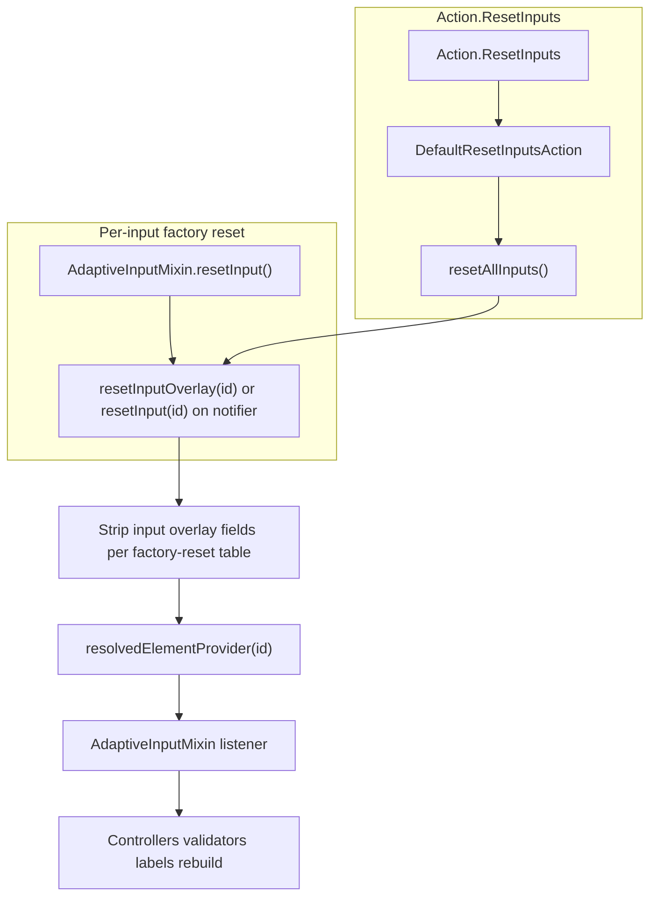

# Overlay Reset Semantics (`resetInput` vs `resetAllInputs`)

**Date:** 2026-06-03
**Status:** Approved — documentation and code aligned (2026-06-03)
**Related:** [Dynamic property updates](2026-06-03-dynamic-property-updates-design.md), [`docs/reactive-riverpod.md`](../../reactive-riverpod.md)

## Summary

Two similarly named APIs reset input state at different layers. This spec defines the **factory-reset contract**: **`resetInput(id)`** and **`resetAllInputs()`** both restore **`Input.*` fields to baseline JSON**, including **`value`**, **`choices`**, validation state, **`isRequired`**, **`label`**, and **`placeholder`**. Documentation updates are **in scope** for this work (see [In scope](#in-scope)).

## Problem

| API                                             | Layer             | Used by                                                          |
| ----------------------------------------------- | ----------------- | ---------------------------------------------------------------- |
| `AdaptiveInputMixin.resetInput()`               | Widget / mixin    | Per-input overrides; **not** wired to `Action.ResetInputs` today |
| `AdaptiveCardDocumentNotifier.resetAllInputs()` | Document notifier | `DefaultResetInputsAction`, host code, tests                     |

Hosts and implementers conflate these names. Docs mention `resetAllInputs` in one-line summaries but do not explain preservation rules or the role of `resetInput`. [`docs/reactive-riverpod.md`](../../reactive-riverpod.md) lists an outdated preservation set (omits `label`, `placeholder`, `isRequired`). [`packages/flutter_adaptive_cards_fs/README.md`](../../../packages/flutter_adaptive_cards_fs/README.md) still references overriding `resetInputs()` from the pre-Riverpod tree-walk model.

**Current code gap:** `resetAllInputs()` **preserves** overlay `label`, `placeholder`, and `isRequired` on input ids. The intended contract below is **stricter** — those fields are cleared so resolved values fall back to baseline JSON.

## Intended contract: factory reset to baseline

**Both `resetInput(id)` and `resetAllInputs()` use the same rules.** Each affected `Input.*` id drops runtime overlay patches so the **resolved** map matches **baseline JSON** for the fields below.

### Cleared — resolved value returns to baseline JSON

| Overlay field  | Resolved JSON key |
| -------------- | ----------------- |
| `inputValue`   | `value`           |
| `choices`      | `choices`         |
| `errorMessage` | `errorMessage`    |
| `isInvalid`    | `isInvalid`       |
| `isRequired`   | `isRequired`      |
| `label`        | `label`           |
| `placeholder`  | `placeholder`     |

Including **`label`**, **`placeholder`**, and **`isRequired`** is required: a reset must undo host-driven `applyUpdates` / validation / conditional-required / dynamic-label changes, not only typed values.

### Preserved on that input id

| Overlay field                                | Rationale                                                  |
| -------------------------------------------- | ---------------------------------------------------------- |
| `isVisible`                                  | Reset is “clear form values”, not “hide/show layout”       |
| `queryCount`, `querySkip`, `querySearchText` | Typeahead **session** state; distinct from submitted value |

### Out of scope (never modified by input reset)

| Target             | Examples                                            |
| ------------------ | --------------------------------------------------- |
| Non-input elements | TextBlock `text`, Image `url`, Container visibility |
| Action overlays    | `isEnabled`, `title`, `tooltip`, …                  |
| Baseline JSON      | Host map is never mutated                           |

### Re-seed after reset

Hosts restore runtime state with `initInput`, `applyUpdates`, or `applyUpdatesFromMap` — same as after initial load. Document this in host-facing guides.

## Architecture

### `resetInput()` (mixin — **strict factory reset**)

**Today:** Sets local `value` from baseline `adaptiveMap` only; does **not** clear notifier overlays; **not** called by `Action.ResetInputs`.

**Target behavior:**

1. Delegate to document notifier **`resetInput(id)`** (or `resetInputOverlay(id)`) implementing the factory-reset table for that id.
2. Mixin `resetInput()` remains overridable for input-specific UI (controllers, ChoiceSet selection sets) but **must not** be the only reset path — overlay clear drives truth via `resolvedElementProvider`.
3. Default mixin implementation: call notifier reset, then sync local state from resolved map (or rely on existing listener).

### `resetAllInputs()` (notifier — batch factory reset)

**Target behavior:** For every `Input.*` id in `nodesById`, apply the **same** factory-reset policy as `resetInput(id)`. Single revision bump.

`Action.ResetInputs` continues to call only `resetAllInputs()` — no widget-tree walk.

## Documentation plan (layered)

Recommendation: **layered docs**, one canonical contract, audience-specific summaries.

| Audience               | Location                                                                                                                      | Content                                                                                                     |
| ---------------------- | ----------------------------------------------------------------------------------------------------------------------------- | ----------------------------------------------------------------------------------------------------------- |
| **Canonical contract** | [`docs/reactive-riverpod.md`](../../reactive-riverpod.md) — new `### Reset semantics`                                         | Full factory-reset table, flow diagram, re-seed notes, explicit “`resetInput` clears overlays via notifier” |
| **Hosts**              | [`docs/form-inputs.md`](../../form-inputs.md) — “Reset behavior”                                                              | Short summary + link to reactive-riverpod; `Action.ResetInputs` behavior only                               |
| **Implementers**       | [`.agents/skills/adaptive-cards-element-registry/SKILL.md`](../../../.agents/skills/adaptive-cards-element-registry/SKILL.md) | `resetInput()` override for extra UI sync; do not reimplement overlay clear locally                         |
| **Public API**         | Dartdoc on `resetAllInputs`, `resetInput` (notifier + mixin)                                                                  | Link to reactive-riverpod anchor                                                                            |
| **Cleanup**            | `packages/flutter_adaptive_cards_fs/README.md`, `docs/Implementation-Status.md`                                               | Remove/stale `resetInputs()` override guidance; cross-link reset semantics                                  |

Do **not** use `docs/plans/*` or superpowers specs as the day-to-day manual — link from reactive-riverpod instead.

## In scope

Deliverables for this initiative (documentation **and** code/tests):

| #   | Deliverable                                                                                                                                                            | Status           |
| --- | ---------------------------------------------------------------------------------------------------------------------------------------------------------------------- | ---------------- |
| 1   | **[`docs/reactive-riverpod.md`](../../reactive-riverpod.md)** — `### Reset semantics`, updated runtime-writes row                                                      | Documented       |
| 2   | **[`docs/form-inputs.md`](../../form-inputs.md)** — host “Reset behavior” section                                                                                      | Documented       |
| 3   | **[`.agents/skills/adaptive-cards-element-registry/SKILL.md`](../../../.agents/skills/adaptive-cards-element-registry/SKILL.md)** — reset paragraph + test matrix note | Documented       |
| 4   | Notifier **`resetInput(id)`** + **`resetAllInputs()`** shared helper; clear `label`, `placeholder`, `isRequired` overlays                                              | Code — done      |
| 5   | **`AdaptiveInputMixin.resetInput()`** delegates to notifier                                                                                                            | Code — done      |
| 6   | Tests: factory reset clears `label` / `placeholder` / `isRequired`; update tests that assumed preservation                                                             | Tests — done     |
| 7   | Dartdoc on notifier/mixin reset APIs; README cleanup                                                                                                                   | Docs/code — done |

## Implementation follow-ups (code plan)

Documentation items 1–3 are complete in-repo. Remaining code work:

1. Add **`resetInput(String id)`** on `AdaptiveCardDocumentNotifier` (factory reset for one id).
2. Change **`resetAllInputs()`** to use shared helper; **clear** `label`, `placeholder`, `isRequired` (and other cleared fields above).
3. Wire **`AdaptiveInputMixin.resetInput()`** to notifier `resetInput(id)`; keep subclass overrides for controller sync only.
4. Optional: **`RawAdaptiveCardState.resetInput(String id)`** host helper delegating to notifier.
5. Tests per [Test matrix](#test-matrix-acceptance); fix any tests expecting overlay preservation of `label` / `placeholder` / `isRequired`.
6. Dartdoc + README cleanup (item 7 in [In scope](#in-scope)).

## Non-goals

- Resetting TextBlock text, Image url, or action overlays as part of `Action.ResetInputs`.
- Per-id reset action in Adaptive Cards spec (host API only unless spec extension added later).
- Removing `resetInput()` overrides on input widgets — only clarifying their role.

## Test matrix (acceptance)

| Case                                                | Expected after factory reset                            |
| --------------------------------------------------- | ------------------------------------------------------- |
| User-typed value                                    | Baseline `value`                                        |
| `loadInput` / `setChoices` overlay                  | Baseline `choices`                                      |
| `setInputError`                                     | No overlay error; baseline `errorMessage` / `isInvalid` |
| `applyUpdates` `isRequired: true` on optional field | Baseline `isRequired`                                   |
| Overlay `label` / `placeholder`                     | Baseline label / placeholder                            |
| `setVisibility(false)` on input                     | Still hidden                                            |
| Typeahead `querySkip` session                       | Still set                                               |
| TextBlock `setText`                                 | Unchanged                                               |
| Action `setActionEnabled(false)`                    | Unchanged                                               |

## Open questions

None for v1 — factory reset policy is fixed as above. If product later wants “soft reset” (preserve conditional required/labels), add a separate `softResetInput` API; do not overload `resetInput`.

**Related:** targeted reset via `Action.ResetInputs` **`targetInputIds`** and input **`valueChangedAction`** — [`2026-06-04-action-resetinputs-targetinputids-design.md`](2026-06-04-action-resetinputs-targetinputids-design.md).
