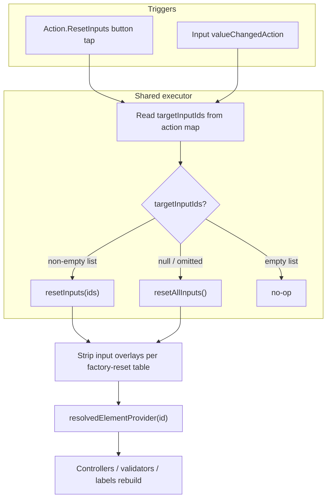

# Action.ResetInputs `targetInputIds` and `valueChangedAction`

**Date:** 2026-06-04
**Status:** Implemented (2026-06-04)
**Related:** [Overlay reset semantics](2026-06-03-overlay-reset-semantics-design.md), [Teams dependent inputs](https://learn.microsoft.com/en-us/microsoftteams/platform/task-modules-and-cards/cards/dynamic-search#dependent-inputs), [`docs/reactive-riverpod.md`](../../reactive-riverpod.md), [`docs/form-inputs.md`](../../form-inputs.md)

## Summary

Implement **`targetInputIds`** on `Action.ResetInputs` so reset can target specific inputs instead of always resetting the whole card. Wire **`valueChangedAction`** on input elements so changing one field can reset dependent fields (Teams dependent-input pattern). Both paths share one reset executor and the existing factory-reset overlay semantics from [overlay reset semantics](2026-06-03-overlay-reset-semantics-design.md).

## Problem

| Gap | Today |
| --- | --- |
| `targetInputIds` | Ignored — `DefaultResetInputsAction` always calls `resetAllInputs()` |
| `valueChangedAction` | Not implemented — noted in `Implementation-Status.md` only |
| Tests / samples | Full-card reset only; no targeted reset or `valueChangedAction` coverage |
| Docs | Reset docs describe `resetAllInputs()` / `resetInput(id)` but not action-level targeting |

Per-input factory reset already exists on `AdaptiveCardDocumentNotifier.resetInput(id)`. This work connects action JSON and input change events to that machinery.

## Spec references

- [Teams — Action.ResetInputs / dependent inputs](https://learn.microsoft.com/en-us/microsoftteams/platform/task-modules-and-cards/cards/dynamic-search#actionresetinputs)
- [Bot Framework cards actions](https://learn.microsoft.com/en-us/microsoftteams/platform/task-modules-and-cards/cards/cards-actions)

`Action.ResetInputs` is a Teams/Bot Framework extension (not core adaptivecards.io schema). `valueChangedAction` is defined on input elements and embeds an `Action.ResetInputs` object.

## `targetInputIds` semantics

| `targetInputIds` on the action map | Behavior |
| --- | --- |
| **Omitted or null** | `resetAllInputs()` — reset every `Input.*` id (current default) |
| **Non-empty array of strings** | Factory-reset **only** the listed input ids |
| **Empty array `[]`** | Reset **nothing** (explicit empty target set) |

For each id in a non-empty list:

- Resolve against `nodesById`; **skip silently** if id is missing or not `Input.*`.
- Apply the same factory-reset rules as `resetInput(id)` (see [overlay reset semantics](2026-06-03-overlay-reset-semantics-design.md)).

Non-string or null entries in `targetInputIds` are skipped (only string ids are processed).

## Architecture



### Approach (chosen)

**Shared reset executor + mixin hook** (not per-widget duplication, not parse-time indexing):

1. **`executeResetInputsAction(BuildContext context, Map<String, dynamic> actionMap)`** — parses `targetInputIds`, dispatches to notifier.
2. **`DefaultResetInputsAction.tap()`** — calls executor with the action’s `adaptiveMap`.
3. **`AdaptiveInputMixin.notifyUserInputValueChanged(...)`** — reads `valueChangedAction` from the input baseline map; when rules pass, calls executor with that nested map.
4. **`AdaptiveCardDocumentNotifier.resetInputs(List<String> ids)`** — batch factory reset in **one revision** (same overlay logic as repeated `resetInput` calls).

Location for the executor: `lib/src/action/reset_inputs_executor.dart` (or equivalent next to `default_actions.dart`).

## Button tap path

No change to `AdaptiveActionResetInputs` widget wiring. `DefaultResetInputsAction.tap()` replaces direct `resetAllInputs()` with the shared executor.

Custom `GenericActionResetInputs` implementations may bypass the executor; document that default behavior follows this spec.

## `valueChangedAction` path

### JSON shape

On any input element baseline map:

```json
"valueChangedAction": {
  "type": "Action.ResetInputs",
  "targetInputIds": ["dependentFieldId"]
}
```

If `type` is not `Action.ResetInputs`, ignore (no-op). Other action types in `valueChangedAction` are out of scope.

### When the action runs

| Input type | Fire when |
| --- | --- |
| `Input.ChoiceSet`, `Input.Date`, `Input.Time`, `Input.Toggle` | Immediately after user changes the stored value |
| `Input.Text`, `Input.Number` | On **committed** change: focus loss or editing complete — **not** each keystroke |

### When the action must NOT run

- Document-driven updates: `onDocumentValueChanged`, `resetInput`, `resetAllInputs`, `resetInputs`, `initInput`, `applyUpdates`, `applyUpdatesFromMap`
- Initial value sync on first build
- User value unchanged since the last `valueChangedAction` execution for this input (dedupe)

### Mixin API

```dart
void notifyUserInputValueChanged(
  Object? value, {
  required bool committed,
});
```

- **`committed: true`** — discrete inputs on selection change; Text/Number on focus loss / `onEditingComplete`.
- **`committed: false`** — ignored for Text/Number; discrete inputs always pass `committed: true`.

Implementation reads `_inputAdaptiveMap['valueChangedAction']`, validates type, dedupes, then calls `executeResetInputsAction`.

Each input widget invokes the mixin from its existing user-interaction path (e.g. ChoiceSet after selection; Text/Number via `FocusNode` listener or `TextFormField.onEditingComplete`).

## Notifier: `resetInputs(List<String> ids)`

```dart
void resetInputs(List<String> ids);
```

- Single `revision` bump.
- For each id: same logic as `resetInput(id)` — skip unknown/non-input ids.
- If no overlays change, no revision bump (match `resetAllInputs` / `resetInput` behavior).

## Samples and tests

### Sample: targeted button reset

**File:** `packages/flutter_adaptive_cards_fs/test/samples/action_reset_inputs_targeted.json`
**Mirror:** `widgetbook/lib/samples/v1.6/action_reset_inputs_targeted.json`

Card contents:

- Four `Input.Text` fields: `fieldA`, `fieldB`, `fieldC`, `fieldD` with distinct baseline values (mix of empty and non-empty).
- Two card actions:
  - `"Reset A & B"` — `targetInputIds: ["fieldA", "fieldB"]`
  - `"Reset C & D"` — `targetInputIds: ["fieldC", "fieldD"]`

### Test: targeted button reset

**File:** `packages/flutter_adaptive_cards_fs/test/inputs/action_reset_inputs_targeted_test.dart`

1. Pump targeted sample; enter distinct values in all four fields.
2. Tap `"Reset A & B"` — assert A/B match baseline; C/D still hold entered values.
3. Re-enter A/B; tap `"Reset C & D"` — assert C/D match baseline; A/B unchanged.

Extend existing `action_reset_inputs_test.dart` only if a small assertion fits; prefer dedicated file for clarity.

### Test: `valueChangedAction`

**File:** `packages/flutter_adaptive_cards_fs/test/inputs/value_changed_action_reset_test.json` + test

Minimal country/city pattern:

- `Input.ChoiceSet` `country` with static choices and `valueChangedAction` targeting `city`.
- `Input.ChoiceSet` `city` with a selected value.
- Change `country` — assert `city` resets to baseline (empty or initial value).
- Assert `valueChangedAction` does **not** run when `city` is reset programmatically from document sync (no infinite loop).

Optional: Text field with `valueChangedAction` — assert action fires on focus loss after edit, not on every `enterText` pump before unfocus.

### Widgetbook

New use case in `widgetbook/lib/adaptive_cards_use_cases.dart`:

- **Name:** `Actions.Reset (targeted)`
- **JSON:** `lib/samples/v1.6/action_reset_inputs_targeted.json`

Keep existing `Actions.Reset` full-reset sample unchanged.

**Dependent ChoiceSet (implemented):** under **Input.ChoiceSet** in Widgetbook:

- **Value changed action (host cascade)** — `lib/samples/inputs/input_choice_set/value_changed_action_filtered.json` + `lib/dependent_choice_set_demo_page.dart`
- **Value changed action (Teams Data.Query)** — `lib/samples/inputs/input_choice_set/value_changed_action_dependent_query.json` (same page/handler)

See [form-inputs.md § Dependent ChoiceSet](../../form-inputs.md#dependent-choiceset-country--city).

## Documentation updates

| Document | Updates |
| --- | --- |
| [`docs/form-inputs.md`](../../form-inputs.md) | `targetInputIds`, `valueChangedAction`, committed-change rules for Text/Number; filtered ChoiceSet title search / value submit |
| [`docs/reactive-riverpod.md`](../../reactive-riverpod.md) | `resetInputs(ids)` API; extend call-paths table; link this spec |
| [`docs/actions-architecture.md`](../../actions-architecture.md) | `Action.ResetInputs` section: `targetInputIds`, executor, Teams extension note |
| [`docs/Implementation-Status.md`](../../Implementation-Status.md) | `Action.ResetInputs` tests ✅; `valueChangedAction` ✅ |
| [`2026-06-03-overlay-reset-semantics-design.md`](2026-06-03-overlay-reset-semantics-design.md) | Short cross-link to targeted reset / `valueChangedAction` |
| [`packages/flutter_adaptive_cards_fs/CHANGELOG.md`](../../../packages/flutter_adaptive_cards_fs/CHANGELOG.md) | Feature entry under `[0.8.0]` Added (updated with spec) |

## Out of scope

- `valueChangedAction` with action types other than `Action.ResetInputs`
- Host `onChange` callback changes (remains separate from internal reset)
- `requires` / `fallback` gating for Teams capabilities
- Dynamic typeahead / `associatedInputs` (separate feature; complementary to dependent inputs)

## Error handling

- Unknown `targetInputIds` entries: skip, no throw, no user-visible error.
- Malformed `valueChangedAction` (wrong type, missing map): no-op.
- Empty `targetInputIds` on button tap: no-op (not full reset).

## Testing checklist (implementation)

- [ ] Notifier unit test: `resetInputs` partial reset, empty list, unknown ids
- [ ] Widget test: targeted two-button sample
- [ ] Widget test: `valueChangedAction` ChoiceSet dependent reset
- [ ] Widget test: Text `valueChangedAction` fires on unfocus, not per keystroke
- [ ] Existing `action_reset_inputs_test.dart` still passes (full reset unchanged)
- [ ] `fvm flutter analyze` clean in `flutter_adaptive_cards_fs`
