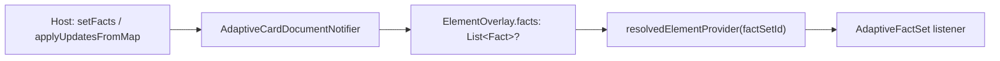

# FactSet Facts Runtime Overlay (Full List Replacement)

**Date:** 2026-06-06
**Status:** Implemented
**Package:** `flutter_adaptive_cards_fs`
**Related:** [Dynamic property updates](2026-06-03-dynamic-property-updates-design.md), [`docs/reactive-riverpod.md`](../../reactive-riverpod.md)

## Summary

Hosts can replace a `FactSet`'s effective `facts` array at runtime via sparse **overlays** on the Riverpod document notifier — without mutating baseline JSON. Updates use **pattern A: full list replacement** at the `FactSet` element id, mirroring the existing `choices` overlay on `Input.ChoiceSet`.

Individual `Fact` objects have no Adaptive Cards id; only the parent `FactSet` is addressable. Store **`List<Fact>?`** on `ElementOverlay` — not a separate per-fact overlay map or `FactOverlay` storage type.

**Implementation:** Shipped in `flutter_adaptive_cards_fs` (notifier, `AdaptiveFactSet` listener, `RawAdaptiveCardState.setFacts` / `clearFacts`, tests, docs). Widgetbook demo at **FactSet → Facts overlay (knob)**; knob uses a `baseline` enum preset and `_syncPresetKnob` (see [Widgetbook demo](#widgetbook-demo-factset-overlay-knob)).

## Problem (pre-implementation)

Previously `AdaptiveFactSet` parsed `facts` once from baseline `adaptiveMap` and did not watch `resolvedElementProvider`. Visibility updates worked via `AdaptiveVisibilityMixin`, but fact titles/values were static after first frame.

Hosts that received refreshed summary data (order status, KPIs, templated expansions) had to replace the entire card JSON to change facts — losing overlay state elsewhere on the card.

## Decision

| Topic                        | Choice                                                   |
| ---------------------------- | -------------------------------------------------------- |
| Update granularity           | **Full list replacement** at FactSet id (pattern A)      |
| Storage                      | `List<Fact>? facts` on **`ElementOverlay`**              |
| Per-fact overlay map         | **Out of scope** — no `FactOverlay` layer                |
| Merge semantics              | Overlay list **replaces** baseline `facts` when non-null |
| Append / patch-one-fact APIs | **Out of scope** for v1                                  |

### Why `ElementOverlay.facts`, not `FactOverlay`

1. **Id model:** Document overlays are keyed by element id. Facts are anonymous `{title, value}` entries; only `FactSet` has an id.
2. **Precedent:** `List<Choice>? choices` on `ElementOverlay` with `setChoices`, `applyUpdates`, and JSON merge at the provider boundary.
3. **Simplicity:** Set overlay → replace effective list; `clearFacts` → revert to baseline. No index/title merge rules.
4. **Typed model:** `Fact` already exists with `factsFromJsonList`; add `factsToJsonList` for resolved JSON output.

A future convenience helper (e.g. `updateFactValue(factSetId, matchTitle, value)`) may read effective facts, patch one entry, and call `setFacts` — still without a separate overlay store.

## Architecture



Baseline JSON is unchanged. Widgets read merged maps only.

## Data model

### `ElementOverlay`

Add:

```dart
/// Overrides baseline `"facts"` on `FactSet` when non-null.
final List<Fact>? facts;
```

Extend `copyWith` with `facts`, `clearFacts`.

### `AdaptiveElementUpdate`

Add:

```dart
/// Replaces `FactSet` `"facts"`.
final List<Fact>? facts;

/// Clears the `facts` overlay.
final bool clearFacts;
```

### `fact.dart`

Add symmetric helper:

```dart
List<Map<String, dynamic>> factsToJsonList(List<Fact> facts) =>
    facts.map((f) => f.toJson()).toList();
```

## Notifier API

| Method                                        | Behavior                                                          |
| --------------------------------------------- | ----------------------------------------------------------------- |
| `setFacts(String id, List<Fact> facts)`       | Store typed list in overlay for FactSet id                        |
| `clearFacts(String id)`                       | Remove `facts` from overlay; effective list reverts to baseline   |
| `applyUpdates(...)`                           | Merge `facts` / `clearFacts` via `_mergeElementUpdate`            |
| `updatesFromPatchMap` / `applyUpdatesFromMap` | Parse `{ factSetId: { facts: [...] } }` using `factsFromJsonList` |

**Validation:** Unknown ids are ignored (same as other `applyUpdates` fields). No requirement that target type is `FactSet` at merge time — overlay is inert until a FactSet widget reads it.

**Reset interaction:** `resetInput` / `resetAllInputs` do **not** clear `facts` overlays (inputs only). Full-card overlay wipe (if any host API exists) follows existing document reset rules; document baseline refresh via new `widget.map` replaces baseline facts independently.

## Resolved merge

In `resolvedElementProvider` (`providers.dart`):

```dart
if (overlay?.facts != null) {
  merged['facts'] = factsToJsonList(overlay!.facts!);
}
```

Effective rule: overlay `facts` if set, else baseline `"facts"`.

## Widget changes

`AdaptiveFactSet` follows `AdaptiveTextBlock`:

1. No one-time `initState` fact parsing; facts start empty and load from the resolved provider.
2. In `didChangeDependencies`, subscribe to `resolvedElementProvider(id)` via `container.listen` (`fireImmediately: true`).
3. On each emission, `factsFromJsonList(next['facts'])` → `setState` when `listEquals` detects a change.
4. `AdaptiveVisibilityMixin` unchanged; subscription disposed in `dispose`.

## Host usage

### Typed bulk update

```dart
cardState.applyUpdates(elements: [
  AdaptiveElementUpdate(
    id: 'orderSummary',
    facts: const [
      Fact(title: 'Status', value: 'Shipped'),
      Fact(title: 'ETA', value: 'Jun 10'),
    ],
  ),
]);
```

### Server-style map

```dart
cardState.applyUpdatesFromMap({
  'orderSummary': {
    'facts': [
      {'title': 'Status', 'value': 'Shipped'},
      {'title': 'ETA', 'value': 'Jun 10'},
    ],
  },
});
```

### Dedicated helper on `RawAdaptiveCardState`

```dart
void setFacts(String id, List<Fact> facts);
void clearFacts(String id);
```

Implemented — mirrors `setText` / `setChoices` delegation to the document notifier.

## Documentation updates

| File                                                                   | Status                                                                 |
| ---------------------------------------------------------------------- | ---------------------------------------------------------------------- |
| `docs/reactive-riverpod.md`                                            | Done — `facts` overlay field, merge rules, runtime-writes table        |
| `docs/superpowers/specs/2026-06-03-dynamic-property-updates-design.md` | Done — `facts` added to dynamic property updates                       |
| `packages/flutter_adaptive_cards_fs/README.md`                         | Done — host API table includes `setFacts` / `clearFacts`               |
| `docs/Implementation-Status.md`                                        | Done — FactSet runtime `facts` overlay noted                           |
| `widgetbook/lib/fact_set_overlay_page.dart`                            | Done — knob-driven `setFacts` / `clearFacts` demo (see Widgetbook)     |
| `widgetbook/lib/adaptive_cards_use_cases.dart`                         | Done — **Facts overlay (knob)** use case registered                    |
| `widgetbook/lib/samples/fact_set/facts_overlay_demo.json`              | Done — baseline card with `id: demoFactSet` and four generic facts     |

## Testing

Implemented in:

- `packages/flutter_adaptive_cards_fs/test/riverpod/adaptive_card_document_notifier_test.dart` — `facts overlay` group
- `packages/flutter_adaptive_cards_fs/test/containers/fact_set_overlay_test.dart` — widget tests
- `packages/flutter_adaptive_cards_fs/test/models/fact_test.dart` — `factsToJsonList` round-trip

| Area       | Cases                                                             |
| ---------- | ----------------------------------------------------------------- |
| Notifier   | `setFacts` stores `List<Fact>`; resolved JSON has merged facts    |
| Notifier   | `clearFacts` restores baseline facts                              |
| Notifier   | `applyUpdates` / `applyUpdatesFromMap` parse facts array          |
| Notifier   | Unknown id ignored                                                |
| Widget     | FactSet UI updates when overlay facts change without card remount |
| Widget     | Baseline facts shown when no overlay                              |
| Regression | Visibility overlay on same FactSet still works                    |

## Widgetbook demo (FactSet overlay knob)

Interactive proof that runtime `facts` overlays work, mirroring the existing **TextBlock → Text overlay (knob)** use case (`text_block_overlay_page.dart`).

### Use case

Add a second FactSet entry under `[Components]` (keep static **Example 1** unchanged):

| Field   | Value                                            |
| ------- | ------------------------------------------------ |
| Name    | `Facts overlay (knob)`                           |
| Type    | `widget_types.FactSet`                           |
| Builder | `FactSetOverlayPage(key: factSetOverlayPageKey)` |

Register in `widgetbook/lib/adaptive_cards_use_cases.dart` and regenerate directories (`fvm dart run build_runner build --delete-conflicting-outputs` in `widgetbook/`).

### Sample JSON

Add `widgetbook/lib/samples/fact_set/facts_overlay_demo.json` (or extend `example1.json` only for the demo asset — do not break static Example 1):

- FactSet **`id`: `demoFactSet`** (required for overlay targeting)
- Baseline **four** facts (e.g. `Fact 1` … `Fact 4` from current `example1.json`) so **no overlay** is visually distinct from overlay presets

Load JSON as-is; demo asset uses explicit `"id": "demoFactSet"` (no `injectIds` call).

### Knob

Uses `context.knobs.object.dropdown` with an explicit **`baseline`** enum value (not a nullable knob option):

```dart
enum FactSetOverlayPreset { baseline, colors, cities, foods }

final preset = context.knobs.object.dropdown<FactSetOverlayPreset>(
  label: 'Baseline restores to preset',
  options: FactSetOverlayPreset.values,
  initialOption: FactSetOverlayPreset.baseline,
  labelBuilder: (value) => switch (value) {
    FactSetOverlayPreset.baseline => 'Baseline',
    FactSetOverlayPreset.colors => 'Colors',
    FactSetOverlayPreset.cities => 'Cities',
    FactSetOverlayPreset.foods => 'Foods',
  },
);
_syncPresetKnob(preset);
```

| Knob value | Host action                             | Effective facts                 |
| ---------- | --------------------------------------- | ------------------------------- |
| `baseline` | `clearFacts('demoFactSet')`             | Baseline JSON (4 generic facts) |
| `colors`   | `setFacts('demoFactSet', _colorsFacts)` | 4 color facts                   |
| `cities`   | `setFacts('demoFactSet', _citiesFacts)` | 4 city facts                    |
| `foods`    | `setFacts('demoFactSet', _foodsFacts)`  | 4 food facts                    |

**Why not `objectOrNull`:** Widgetbook’s non-nullable object dropdown serializes more reliably in the workbench; baseline is modeled as a fourth preset that maps to `clearFacts` instead of a `null` knob value.

### Preset fact lists (4 each)

Define as `const List<Fact>` on the page (or a small private helper file):

**Colors**

| Title  | Value     |
| ------ | --------- |
| Red    | `#FF0000` |
| Blue   | `#0000FF` |
| Green  | `#00FF00` |
| Yellow | `#FFFF00` |

**Cities**

| Title    | Value     |
| -------- | --------- |
| New York | USA       |
| Paris    | France    |
| Tokyo    | Japan     |
| Sydney   | Australia |

**Foods**

| Title | Value  |
| ----- | ------ |
| Pizza | Italy  |
| Sushi | Japan  |
| Tacos | Mexico |
| Pasta | Italy  |

### Page implementation

File: `widgetbook/lib/fact_set_overlay_page.dart`

Follows `TextBlockOverlayPage` patterns with knob-specific lifecycle guards:

1. **`factSetOverlayPageKey`** — `GlobalKey` so Widgetbook knob URL changes do not remount the card and wipe document overlays.
2. Load demo JSON from assets; **`GlobalKey<RawAdaptiveCardState>`** on `RawAdaptiveCard.fromMap`.
3. Post-frame apply queue (`_queueFactsOverlay` / `_flushPendingOverlay`) with retry until `documentContainer` is ready (same `_maxApplyAttempts` pattern as text overlay).
4. Track `_lastAppliedPreset` to avoid redundant notifier calls.
5. **`_syncPresetKnob`** — on first build, record knob value only (do not apply); on subsequent builds, queue overlay only when the knob value **changes**. Avoids re-applying `setFacts` / `clearFacts` on every Widgetbook rebuild.
6. On `preset == FactSetOverlayPreset.baseline` → `cardState.clearFacts(_factSetId)`.
7. On other presets → `cardState.setFacts(_factSetId, factsForPreset(preset)!)` where `factsForPreset` returns `null` for baseline.
8. `showDebugJson: true` (matches text overlay demo).

```dart
// Host-only demo: calls package-internal RawAdaptiveCardState.setFacts.
// ignore_for_file: implementation_imports
import 'package:flutter_adaptive_cards_fs/src/flutter_raw_adaptive_card.dart';
```

### Manual verification (Widgetbook)

1. Open **FactSet → Facts overlay (knob)**.
2. Confirm baseline shows 4 generic facts from JSON.
3. Select **Colors** / **Cities** / **Foods** — FactSet updates to 4 matching facts without remounting the card.
4. Select **Baseline** — facts revert to JSON baseline (not the last preset).
5. Toggle presets — each switch replaces the full list.

## Out of scope

- Per-fact sparse patches by index or title
- `appendFacts` merge semantics
- Fact-level `isVisible` (not in AC schema)
- Templating `$data` expansion at runtime (template package concern)
- `json_serializable` migration for `Fact`

## Self-review checklist

| Requirement                                   | Implemented |
| --------------------------------------------- | ----------- |
| Pattern A full list replace                   | Yes         |
| `List<Fact>?` on `ElementOverlay`             | Yes         |
| No `FactOverlay` storage layer                | Yes         |
| Resolved merge + reactive widget              | Yes         |
| Host APIs aligned with `choices` / `text`     | Yes         |
| Tests and docs                                | Yes         |
| Widgetbook knob demo (`clearFacts` + presets) | Yes — baseline enum + `_syncPresetKnob` |
