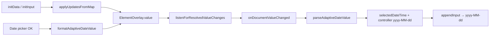

# Input.Date initData Seeding Fix

**Date:** 2026-06-07  
**Status:** Approved  
**Package:** `flutter_adaptive_cards_fs`  
**Related:** [Dynamic property updates](2026-06-03-dynamic-property-updates-design.md), Widgetbook `Form with initData` (`ac-qv-faqs.json` `bookingdate`)

## Summary

Fix `Input.Date` so host `initData` / `initInput` values appear in the field, pass required validation correctly, survive submit, and match other inputs' Riverpod overlay semantics. Submit, overlay, and callbacks use spec format `yyyy-MM-dd`.

## Problem

| Issue | Location | Effect |
| ----- | -------- | ------ |
| Empty state writes **placeholder into `controller.text`** | `date.dart` `onDocumentValueChanged` | Field looks filled while `selectedDateTime` stays `null`; `appendInput` omits the id on submit |
| **Placeholder in controller breaks required validation** | `date.dart` `TextFormField` validator | Validator checks `controller.text.isEmpty`; placeholder text passes required check even though `selectedDateTime` is `null` |
| **`onDocumentValueChanged` does not call `setState`** | `date.dart` | UI may not repaint after overlay seed (Time input calls `setState`) |
| **`appendInput` and picker commit emit ISO-8601 datetime** | `date.dart` `appendInput`, `onTap` | Spec expects `yyyy-MM-dd`; round-trip with `initData` is inconsistent |
| **No overlay-level widget test for Date** | `init_data_overlay_test.dart` | Regression gap |

Symptom reference: `packages/flutter_adaptive_cards_fs/README.md` — "`initData` does not appear to be working on date fields"; Widgetbook seeds `'bookingdate': '2023-05-08'`.

Display via `initData` often works when overlay listen fires; the durable failures are placeholder bleed on empty state, false-positive required validation, and ISO submit/overlay format.

## Decisions

| Topic | Choice |
| ----- | ------ |
| Placeholder | `hintText` only; `controller.text` is `''` or a real `yyyy-MM-dd` value |
| Submit / overlay / `onChange` | `yyyy-MM-dd` via shared formatter |
| Widget sync | `setState` in `onDocumentValueChanged` (mirror `time.dart`) |
| `yyyy-MM-dd` parsing | `DateFormat.parseStrict('yyyy-MM-dd')` |
| ISO datetime `initData` | **Behavior A:** calendar date only — extract date portion before `T` or space; ignore time and timezone |
| Lifecycle / notifier | No changes; widget sync is sufficient |
| Locale-aware display | Out of scope (separate README item) |
| `Input.Time` | Out of scope unless same placeholder pattern found |

### ISO initData semantics (Behavior A)

Hosts may send ISO datetimes where the **calendar date** is intended (e.g. `'2023-05-08T00:00:00Z'` means May 8 everywhere). Time and timezone offsets are **ignored**.

| Input | Parsed date |
| ----- | ----------- |
| `'2023-05-08'` | `2023-05-08` |
| `'2023-05-08T00:00:00Z'` | `2023-05-08` |
| `'2023-05-08T23:00:00.000Z'` | `2023-05-08` (not May 9) |
| `'2023-05-08 14:30:00'` | `2023-05-08` |
| `'not-a-date'` | `null` → empty field, id omitted on submit |

Do **not** use `DateTime.parse` + `.toLocal()` for ISO fallback — that maps instants to local calendar days and varies by device.

### Breaking change note

Picker commit and `appendInput` currently write ISO-8601 into overlay and `onChange`. After this fix they emit `yyyy-MM-dd`. Document in CHANGELOG under Fixed (with note for hosts that depended on ISO in callbacks).

## Architecture



### New module: `date_input_utils.dart`

Shared parse/format for `Input.Date` runtime values. **Not** merged into `date_time_utils.dart` (that file handles TextBlock `{{DATE}}` / `{{TIME}}` macros only).

```dart
DateTime? parseAdaptiveDateValue(Object? raw);
String formatAdaptiveDateValue(DateTime date);
```

**Parse algorithm:**

1. Trim `raw.toString()`; return `null` if empty.
2. If string contains `T`, take substring before `T`; else if contains space, take substring before space; else use whole string.
3. `parseStrict('yyyy-MM-dd')` on date portion; return `null` on `FormatException`.

**Format:** `DateFormat('yyyy-MM-dd').format(date)`.

### `AdaptiveDateInput` changes

1. Import `date_input_utils.dart`.
2. Keep existing `inputFormat` field for `min` / `max` parsing in `initState` only (card JSON attributes are spec `yyyy-MM-dd`).
3. `onDocumentValueChanged`: parse with helper; empty → `selectedDateTime = null`, `controller.text = ''`; valid → set both; wrap in `setState`; early-return when unchanged.
4. `appendInput`: `formatAdaptiveDateValue(selectedDateTime!)` instead of `toIso8601String()`.
5. `onTap` after picker: format controller and overlay/callbacks as `yyyy-MM-dd`; never write placeholder to controller.

### Invariants after fix

- `controller.text` is never placeholder text.
- `selectedDateTime != null` iff `controller.text` is non-empty and parseable.
- Overlay `value`, `appendInput`, and committed `onChange` all use `yyyy-MM-dd`.
- `resetInput` clears to empty controller + `hintText` placeholder.

## Testing

| Test file | Coverage |
| --------- | -------- |
| `test/utils/date_input_utils_test.dart` | Strict parse, ISO date-portion (including `T23:00:00.000Z` → May 8), invalid/empty |
| `test/inputs/date_edgecases_test.dart` | Empty controller + hintText; required validation; appendInput `yyyy-MM-dd` |
| `test/inputs/init_data_overlay_test.dart` | initData overlay + controller + `appendInput`; programmatic `initInput` |
| `test/inputs/date_input_test.dart` | Exact `yyyy-MM-dd` in `appendInput` |
| Existing picker tests | Should continue to pass (assert controller text only today) |

Assert `selectedDateTime` in initData overlay tests where useful. Optional follow-up: overlay assertion after picker commit.

## Documentation

- **README:** Remove open issue; note `initData` accepts `yyyy-MM-dd` or ISO datetimes (date portion only).
- **CHANGELOG:** `[Unreleased]` / Fixed entry; note callback format change from ISO.
- **Implementation-Status:** One-line note under Inputs.

## Out of scope

- Locale-aware date display in picker field.
- `Input.Time` initData changes.
- `initData` seed timing in `_AdaptiveCardDocumentLifecycle`.
- Overlay assertion after picker in `date_picker_integration_test.dart` (optional follow-up).
