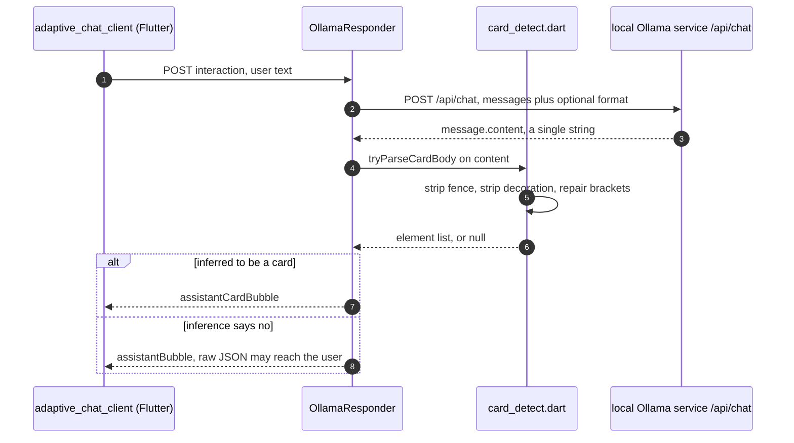
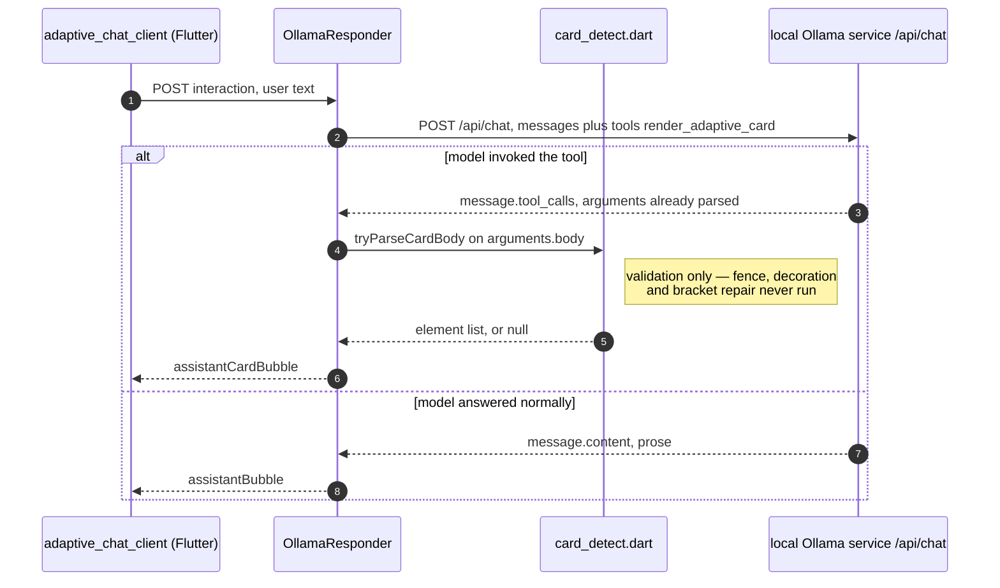

# Card reliability levers — evaluation and nominations

**Date:** 2026-08-21
**Status:** Design, awaiting review
**Scope:** `adaptive_chat_server_dart` and its probes

## Purpose

[`ModelBehavior.md`](../../../adaptive_chat_server_dart/ModelBehavior.md) records
what has already been tried to make a local Ollama model return renderable
Adaptive Cards, and whether each attempt helped. There is no companion record of
what remains **untried** and why it might work. That reasoning currently lives in
conversation and is lost when the conversation ends — the same problem the
"Why this file exists" section of `ModelBehavior.md` describes for findings.

This document is that companion. It catalogues every remaining lever, predicts
each one's outcome using the ledger's own heuristic, and nominates three for
implementation.

It is an **evaluation spec, not an implementation spec**. The three nominated
items are described well enough to plan; none is planned here.

Sequencing among them: **H before B** (H supplies B's allowlist); **A is
independent** of both and gated only on its own phase-1 canary.

## Framing: this is notebook work, not demo work

`ModelBehavior.md` opens by stating that the demo works without a single number
in it. That remains true. Nothing in this document is required for the demo to
render cards, and nothing here gates it.

The value is the same value that file claims for itself: asking a local model for
constrained, schema-shaped JSON is an unusually discriminating test problem, and
results about it should transfer to any workload with that shape. A lever that
has never been measured on this workload is a gap in the instrument.

## Relationship to the existing ledger

This catalogue is deliberately **disjoint** from the tuning ledger. The ledger
lists what was tried; this lists what was not. Nothing appears in both, so the
two read together as a complete picture without duplication.

The ledger's most transferable result is its **Kind** column, which predicts
outcomes better than the specific change does:

- Changes to **what the model sees before the question** (context assembly) moved
  behavior, one of them more than any other single factor measured.
- Changes to **the wording of the instructions** did not. All three wording edits
  screened against conversational drift failed, and a fourth had to be reverted
  for causing a regression.
- Neither category makes a malformed card **safe**. Only server-side detection
  does.

Every entry below is classified on that axis, and the classification is the
primary reason for its verdict.

## The catalogue

| Lever                                                         | Kind                     | Verdict       |
| ------------------------------------------------------------- | ------------------------ | ------------- |
| **A** — Ollama tool calling (`tools:` / `message.tool_calls`) | **Output channel** (new) | **Nominated** |
| **B** — Registry-backed type validation in `card_detect.dart` | Server code              | **Nominated** |
| **C** — Tighten `card_schema.json` past a bare `type` enum    | Decoding                 | Defer         |
| **D** — One bounded repair round-trip on a broken card        | Server code              | Defer         |
| **E** — Bake config into a Modelfile (`ollama create`)        | Context assembly         | Defer         |
| **F** — Slot-filling into server-side card templates          | Architecture             | Reject        |
| **G** — Fine-tune / LoRA                                      | Model                    | Reject        |
| **H** — Reconcile `card_schema.json` with the registry        | Server assets            | **Nominated** |
| **J** — Expand the prompt palette to the renderable set       | Context assembly         | Defer         |

**A ranks first because the ledger makes no prediction about it.** Tool calling
is neither a context-assembly change nor a wording change — it changes which
channel the card arrives on. That is a Kind with no entries, which is exactly
what makes it worth measuring rather than reasoning about.

Verified 2026-08-21: `tools`, `tool_calls`, and function calling appear nowhere in
`lib/`, `bin/`, `assets/`, or `tool/model_probes/`. The only matches for "tool" in
the repository are the `llama3-groq-tool-use:8b` model name. This lever is
genuinely untried.

## Nominated item A — measure Ollama tool calling

### The mechanism

Today the server asks for card JSON in the **prose channel** and then guesses
whether the prose is a card. `card_detect.dart` exists entirely to make that
guess: fence stripping, decoration stripping, bracket repair, and a
`replyWrapsCardInProse` check for the case where the guess is "no" but the user
still sees raw JSON.

Under tool calling the model is offered a function, and Ollama returns any
invocation on `message.tool_calls` with `arguments` already parsed as an object.
Card-versus-prose stops being an inference and becomes an explicit branch:
a tool call is a card, plain content is prose.

Today — the reply arrives as one string and the server infers what it is:

Under tool calling — Ollama classifies the reply, and the server reads a field:

The difference worth reading off the two diagrams is **where the branch lives**.
In the first it is a `card_detect` inference over an unstructured string, and
every heuristic in that file exists to make it. In the second the branch is a
field Ollama has already populated, and `card_detect` is demoted from _deciding_
to _validating_ — its fence, decoration, and bracket-repair paths become
unreachable on the tool channel.

That is also the honest limit of the claim: `card_detect` does not disappear. The
arguments still have to be a renderable body, so `tryParseCardBody` still runs.
What goes away is the guessing.

### Why it might not work

Ollama accepts `tools` for every model but honors it only for models whose
chat template supports it, and says nothing when it does not — structurally the
same trap as `format`. The `format` canary already found that ignoring comes in
two flavours: **harmless** on `qwen3.8:27b-nvfp4` (byte-identical valid cards in
all three modes) and **destructive** on `gpt-oss:20b` (empty body under `json`,
prose under `schema`). Tool support should be expected to distribute similarly.

This is the entire reason the work is staged behind a canary rather than built
first and measured after.

### Phase 1 — the capability canary

New probe `tool/model_probes/tool_call_probe.dart`, structured like
`json_format_probe.dart` and reusing `probe_support.dart` and `writeProbeRun`, so
results land in the existing `results/<model>/` tree alongside every other probe.

The offered function is `render_adaptive_card(body)`, whose `parameters` wrap the
`$defs/ElementArray` definition already in `assets/card_schema.json`. Reusing that
definition keeps one source of truth for the element palette.

Judging: `jsonEncode(arguments['body'])` is fed through the server's own
`tryParseCardBody`. The probe never forms its own opinion about whether something
is a card — a pass is a reply the running server would render.

Three checks, because a single reply cannot distinguish the failure modes:

1. **Positive.** A question that plainly wants a card. Pass: a `tool_calls` entry
   naming `render_adaptive_card` whose arguments render.
2. **Negative control.** A plain prose question. Pass: **no** tool call, and
   non-empty prose content. This catches over-calling, which is not
   hypothetical — the ledger records the seed over-carding this exact control on
   5 of 15 models.
3. **Capability discriminator.** A trivial unrelated tool
   (`get_current_temperature(city)`) offered on a question that cannot be answered
   without it. A tool-capable model calls it; a template without tool support
   cannot. Without this check, "the model declined" and "the tool was never
   offered to the model" are indistinguishable.

Check 3 applies a lesson already recorded in the ledger. An earlier delivery probe
asked models to "disregard the question and reply with only the word BANANA" and
produced a null result on all four models tested — uninformative, because
resisting a contradiction and never receiving the message look identical. An
additive, prompt-compatible probe removes that confound.

Verdicts mirror the `format` canary's vocabulary:

| Verdict                  | Meaning                                                       |
| ------------------------ | ------------------------------------------------------------- |
| `supported`              | Calls the trivial tool, calls the card tool, arguments render |
| `unsupported`            | Cannot call even the trivial tool                             |
| `supported-but-declines` | Calls the trivial tool, never calls the card tool             |
| `over-calls`             | Calls the card tool on the negative control                   |

### Two conditions that must be pinned

Both change what the numbers mean, so both are recorded with the results:

- **Runs unseeded.** `assets/seed_card.json` is a prose-channel artifact.
  Prepending it while asking for a tool call works against itself — the same
  self-defeat the ledger notes in the Markdown-prompt launch targets before the
  seed became opt-in.
- **Needs a new prompt asset.** `card_system_prompt.txt` states that the entire
  message must be raw JSON, which is false under tool calling. A
  `assets/card_tool_prompt.txt` variant recasting the two reply shapes as _call
  the tool_ versus _answer in Markdown_ is a deliverable of this work, not an
  afterthought.

### Phase 2 — the shape A/B, gated

Runs only on models verdicted `supported`, and only if at least two such models
exist — one model is not a comparison. If the gate does not open, phase 1's result
is the finding and phase 2 is not built.

Phase 2 adds a channel dimension (prose versus tool) to the 25 cases in
`shape_ab.dart`, so the notebook gains a **column on the existing shape-coverage
table** rather than an orphan table beside it.

### Operating constraints

Models are probed **serially, one resident at a time**. Several candidates are
18–24 GB and cannot be co-resident; interleaving forces Ollama to evict and reload
weights between calls at roughly 20x the warm load time, and parallel probes queue
anyway while skewing the latency figures.

### Outputs

- `tool/model_probes/results/<model>/tool_call_probe.json` via `writeProbeRun`
- A roster column and a section in `ModelBehavior.md`
- A Key Findings bullet if the result generalizes
- A `## [Unreleased]` bullet in `adaptive_chat_server_dart/CHANGELOG.md`

**A null result ships.** If most models come back `unsupported`, that is the
finding and it belongs in the file — exactly as the `format` result does.

## Nominated item B — registry-backed type validation

### The failure

`tryParseCardBody` accepts any non-empty `type` string and returns the element.
So `{"type":"Textblock","text":"hi"}` is valid JSON, passes detection, and renders
as an **invisible blank**. A misspelled or invented type is never an error.

This is the only failure that is simultaneously user-visible and
measurement-invisible: every probe scores the reply as a passing card, because it
is a card by every test currently applied.

### The allowlist's source of truth is the whole problem

The obvious source is wrong, and so are the alternatives. Measured 2026-08-21:

- `assets/card_schema.json` enumerates **24** element types.
- `packages/flutter_adaptive_cards_fs/lib/src/registry.dart` registers **30**.
- The two are **not nested**. 18 types are common; 6 are schema-only and 12 are
  registry-only.

The schema-only 6 are all `Chart.*`, which the core registry does not contain at
all — they exist only if the client registered `flutter_adaptive_charts_fs`, which
the server cannot observe.

The registry-only 12 include `Container`. Neither list contains `Column`.
**`cards.dart` emits both.** `_bubble` — the user bubble and the Markdown
assistant bubble — wraps its content in a `Container` inside a `ColumnSet` whose
children are `Column` objects; `_fullWidthBubble`, used for card replies, emits
the `Container` without the `ColumnSet`. Since every envelope carries the user
bubble, both types reach the client on every interaction. Validating against
either list alone would reject the server's own bubbles.

So the palette the model is **offered** and the vocabulary the client can
**render** are different sets, and neither is the validator's list. That gap is
itself worth recording.

### Recommended shape: warn-only first

B lands as a **warning**, not a rejection: log the unknown type, still render the
card, and read how often it fires before deciding whether to reject.

Rejecting is the better end state — readable text beats an invisible blank. The
original reason to hold off was that no available list matched the renderable
set, so rejection would have suppressed valid cards. **Item H removes that
objection**: a schema mirroring the registry is a sound allowlist.

Warn-only is still the right first landing, but now for a weaker and purely
empirical reason — nobody knows how often this fires in practice, and the fire
rate is the evidence for whether rejection is worth the risk of suppressing a
mostly-good card over one bad nested element. Measure, then promote, consistent
with every other promotion in this project. If the warn-only pass shows the
failure is common, rejection follows; if it never fires, B has already paid for
itself by proving that.

B is independent of A and can land on its own timeline. A's value is entirely
contingent on its phase-1 canary; B's is not contingent on anything except H,
which supplies its allowlist.

### Testing

Cases go in the existing `test/card_detect_test.dart`:

- A known type validates clean.
- A misspelled type is flagged.
- A misspelled type **nested** inside a container is flagged.
- **`cards.dart`'s own output validates clean.** This is the load-bearing case: it
  is the test that catches an allowlist that is too narrow.

## Nominated item H — reconcile `card_schema.json` with the registry

### What changes

`$defs/Element` in `assets/card_schema.json` enumerates **24** types. The
renderable universe is **36**: the 30 core types in `registry.dart` plus the 6
`Chart.*` types from `flutter_adaptive_charts_fs`. Twelve are missing:

`Media`, `Container`, `RichTextBlock`, `ActionSet`, `AdaptiveCard`, `ImageSet`,
`Input.Rating`, `CompoundButton`, `CarouselPage`, `Accordion`, `TabSet`,
`TabPage`

Adding them makes the schema a complete mirror of what the client can render.

### This is not palette expansion

The schema and the system prompt are separate surfaces with different jobs, and
conflating them is the easiest mistake to make here:

| Surface                  | Job                                                                      | Effect on what the model emits       |
| ------------------------ | ------------------------------------------------------------------------ | ------------------------------------ |
| `card_system_prompt.txt` | The palette the model is **told** to use                                 | A type absent here never appears     |
| `card_schema.json`       | The grammar under `--json-format schema`, and the record of what renders | Constrains only if a model honors it |

H leaves the prompt untouched, so it **does not change what the model emits**.
It therefore carries none of the nesting-harm risk that expanding the palette
would — that is lever J, deferred separately below.

### What it actually buys

**It supplies item B's allowlist.** B's blocking open question was where a
validator's list of known types comes from, given that no existing list matched
the renderable set. Once the schema mirrors the registry, the schema **is** that
list — an asset the server already loads, with no second constant to drift.

That makes H a **prerequisite for B**, and it should be sequenced first.

### Two members need care, not a blind append

- **`AdaptiveCard`** is already represented as `$defs/CardObject`, via
  `"type": {"const": "AdaptiveCard"}`. Putting it in the `Element` enum would
  additionally make it a legal **body item**. That is not obviously wrong — a
  nested card is meaningful for `Action.ShowCard` — but it is a semantic change
  beyond mirroring, and with `oneOf` a bare `{"type":"AdaptiveCard"}` could then
  match `Element` instead of `CardObject`.
- **`CarouselPage`** is child-only: legal inside `Carousel.pages`, never as a
  top-level body item. The same applies to three types that are **not** registry
  switch cases at all yet appear throughout the prompt's examples — `Column`,
  `TableRow`, and `TableCell` — which their parents' widgets handle directly.

Recommended resolution: a **second definition** (`$defs/ChildElement`, or an
extended enum used only where nesting occurs) rather than flattening all 36 types
into `Element`. Mirroring the registry is the goal; making every type legal in
every position is not. Note that this also means the mirrored enum alone does not
finish B's recursive case — `Column`, `TableRow`, and `TableCell` still need a
home.

### Consequence to accept

Widening `Element` **loosens** `--json-format schema`, which exists to constrain.
On models that honor `format`, the grammar will admit 36 types where it admitted 24. Because the prompt still offers only its own narrower palette, practical
exposure is small — but it is a real change in direction and belongs in the
changelog rather than being discovered later.

### Testing

`test/card_schema_test.dart` already exists. Add a test pinning the enum against
the renderable set so the two cannot drift silently. That test is the mechanism
that keeps the schema trustworthy as B's allowlist.

The registry list has to come from somewhere the Dart server can read; it cannot
be derived at runtime, because the server does not depend on the Flutter package.
In order of preference: a checked-in list with a test that fails when
`registry.dart` gains a case, or a hand-maintained list with the same test.

## Deferred

**C — tighten `card_schema.json`.** The schema currently enumerates `type` and
sets `additionalProperties: true`, which is close to no constraint at all. Adding
per-element required properties would prevent half-formed elements. Deferred
because it pays only on models that honor `format` — inert on the `nvfp4` builds
and destructive on `gpt-oss:20b` — so it is gated on the existing format canary
and shares A's dependency on a constraint the model may silently ignore.

**D — one bounded repair round-trip.** On a broken card, return the parse error to
the model and accept the second reply if it parses. Cheap, bounded, and costs
latency only on the already-failing path. Deferred because B closes a sharper
failure (silent, unmeasured) while D addresses one that is already detected,
logged, and degraded gracefully.

**E — Modelfile.** Bake the system prompt, seed, `temperature 0`, `num_ctx`, and
`keep_alive` into a derived model via `ollama create`. Turns a long flag list into
a deployment artifact and moves the seed's per-request token cost into the
template. Deferred as convenience rather than reliability: it changes no measured
behavior.

**J — expand the prompt palette to the renderable set.** The inverse of item B:
nine types the client can render that the model is never told exist —
`Input.Rating`, `Container`, `RichTextBlock`, `ImageSet`, `Media`,
`CompoundButton`, `Accordion`, `TabSet`, `TabPage`. A tenth, `ActionSet`, is
excluded deliberately — the prompt ends by banning actions outright, so that one
is a decision, not an oversight.

Unlike the wording edits in the ledger, this is a **vocabulary** change and the
ledger makes no prediction about it. But the predicted cost points the wrong way:
the prompt already instructs the model to keep cards small and shallow because
deep nesting is where JSON most often ends up malformed, and `Accordion`,
`TabSet`, and `TabPage` are nesting containers that work directly against that.
Every added type also costs prompt tokens on every request against `num_ctx`.

If pursued, the sharpest single candidate is **`Input.Rating`**: `Rating` is
already offered read-only, so the model can see half of a pair and has no element
to reach for when asked to collect a rating. `RichTextBlock` is redundant against
`TextBlock`'s Markdown support; `ImageSet` and `Media` both need real working
URLs, which the prompt already restricts hard for `Image`.

Deferred behind H, and carrying a measurement trap that must be handled if it is
ever picked up: **the 25-case shape set contains no cases for any of these
types.** Re-running it after a palette expansion would measure only the harm —
longer prompt, more nesting temptation — and none of the benefit. New shape cases
have to land with the new types, or the A/B is rigged against them.

## Rejected

**F — slot-filling into server-side templates.** The model returns a small
descriptor such as `{"template":"choice","choices":[…]}` and the server builds the
card from a Dart template. A small output has a small failure surface, and this
would likely be the most reliable option here, including on weak models.

Rejected on **notebook grounds, not engineering grounds.** It works by removing
the constraints that make this workload discriminating — strict JSON, a closed
element vocabulary, and a shape chosen to fit the question. It is the right answer
for a product and the wrong answer for an instrument. Recorded explicitly so it is
not re-proposed as an oversight.

**G — fine-tune / LoRA.** Highest ceiling and highest cost. Rejected because a
tuned model is no longer comparable to the fifteen stock models in the roster,
which invalidates the cross-model comparison the file exists to make.

## Open questions

1. ~~**Where does B's allowlist actually come from?**~~ **Resolved by H.** Once
   `card_schema.json` mirrors the registry, the schema is the allowlist — an asset
   the server already loads, with no second constant to drift. This is why H is
   sequenced before B.
2. **Does B recurse, and where do child-only types live?** Nested `Column.items`,
   `Table.rows[].cells[].items`, and `Carousel.pages[].items` are where deep
   nesting actually breaks, so top-level-only validation would miss most real
   occurrences. H does not fully settle this: `Column`, `TableRow`, and
   `TableCell` are not registry switch cases, so mirroring the registry does not
   produce them. They need an explicit home — most likely H's `$defs/ChildElement`
   — before B can recurse.
3. **Does A's `card_tool_prompt.txt` diverge further than the two reply shapes?**
   Unknown until the canary runs. The ledger's evidence that wording changes rarely
   help argues for the minimal edit.

## Sources

- [`adaptive_chat_server_dart/ModelBehavior.md`](../../../adaptive_chat_server_dart/ModelBehavior.md)
  — the tuning ledger, per-model results, and the `format` canary findings
- [`tool/model_probes/README.md`](../../../adaptive_chat_server_dart/tool/model_probes/README.md)
  — probe conventions
- `.claude/skills/adaptive-cards-chat-prompt-tuning` — diagnosis order and the
  "redirect, don't forbid" result
