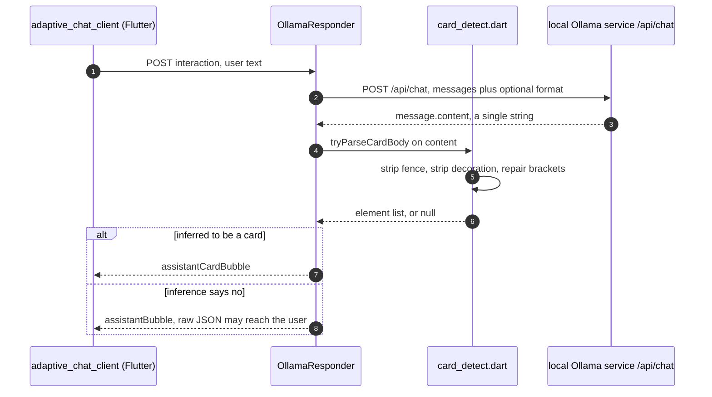
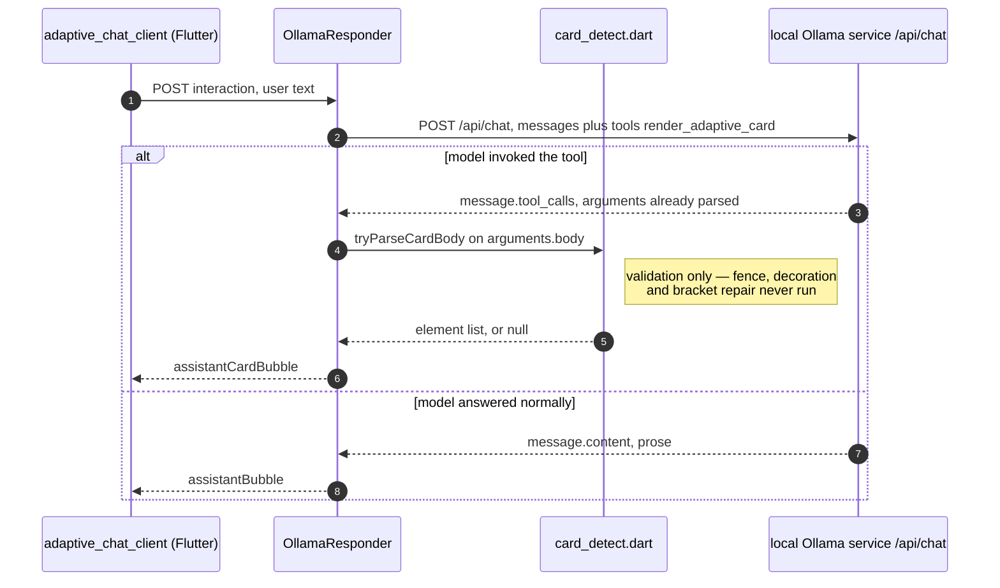

# Card reliability levers — evaluation and nominations

**Date:** 2026-08-21
**Status:** Design, awaiting review
**Scope:** `adaptive_chat_server_dart` and its probes

## Purpose

[`ModelBehavior.md`](../../../adaptive_chat_server_dart/ModelBehavior.md) records
what has already been tried to make a local Ollama model return renderable
Adaptive Cards, and whether each attempt helped. There is no companion record of
what remains **untried** and why it might work. That reasoning currently lives in
conversation and is lost when the conversation ends — the same problem the
"Why this file exists" section of `ModelBehavior.md` describes for findings.

This document is that companion. It catalogues the remaining levers, predicts
each one's outcome using the ledger's own heuristic, and nominates three for
implementation.

It does **not** claim to be exhaustive. An adversarial review of the first draft
found three levers it had missed — K, L, and M below — each derivable from a
finding already recorded in the ledger. Treat the catalogue as the levers
identified so far, and add to it rather than assuming a gap means a dead end.

It is an **evaluation spec, not an implementation spec**. The three nominated
items are described well enough to plan; none is planned here.

Sequencing among them: **H before B** (H supplies B's allowlist); **A is
independent** of both and gated only on its own phase-1 canary.

## Framing: this is notebook work, not demo work

`ModelBehavior.md` opens by stating that the demo works without a single number
in it. That remains true. Nothing in this document is required for the demo to
render cards, and nothing here gates it.

The value is the same value that file claims for itself: asking a local model for
constrained, schema-shaped JSON is an unusually discriminating test problem, and
results about it should transfer to any workload with that shape. A lever that
has never been measured on this workload is a gap in the instrument.

## Relationship to the existing ledger

This catalogue is deliberately **disjoint** from the tuning ledger. The ledger
lists what was tried; this lists what was not. Nothing appears in both, so the
two read together as a complete picture without duplication.

The ledger's most transferable result is its **Kind** column, which predicts
outcomes better than the specific change does:

- Changes to **what the model sees before the question** (context assembly) moved
  behavior, one of them more than any other single factor measured.
- Changes to **the wording of the instructions** did not. All three wording edits
  screened against conversational drift failed, and a fourth had to be reverted
  for causing a regression.
- Neither category makes a malformed card **safe**. Only server-side detection
  does.

Every entry below is classified on that axis, and the classification is the
primary reason for its verdict.

## The catalogue

| Lever                                                         | Kind                    | Verdict       |
| ------------------------------------------------------------- | ----------------------- | ------------- |
| **A** — Ollama tool calling (`tools:` / `message.tool_calls`) | **Unknown** — see below | **Nominated** |
| **B** — Registry-backed type validation in `card_detect.dart` | Server code             | **Nominated** |
| **C** — Tighten `card_schema.json` past a bare `type` enum    | Decoding                | Defer         |
| **D** — One bounded repair round-trip on a broken card        | Server code             | Defer         |
| **E** — Bake config into a Modelfile (`ollama create`)        | Context assembly        | Defer         |
| **F** — Slot-filling into server-side card templates          | Architecture            | Reject        |
| **G** — Fine-tune / LoRA                                      | Model                   | Reject        |
| **H** — Reconcile `card_schema.json` with the registry        | Server assets           | **Nominated** |
| **J** — Expand the prompt palette to the renderable set       | Context assembly        | Defer         |
| **K** — Fall back to a second model when a reply fails        | Server code + model     | Defer         |
| **L** — Tell the model to always fence, instead of never      | Prompt wording          | Defer         |
| **M** — Best-of-N sampling, take the first reply that parses  | Decoding                | Defer         |

**A ranks first because the ledger's prediction for it is unclear.** The
appealing framing is that tool calling changes which _channel_ the card arrives
on, making it a Kind with no entries. That framing should not be trusted
uncritically, and the strongest objection is this: the tool definition is itself
content injected into the model's context before the question, and several
Ollama chat templates implement tool support by rendering the tool list into the
prompt rather than through any separate path. If that is what happens here, "did
the model call the tool" is mechanically much closer to "did the model follow an
instruction in its context" — the axis the ledger already has extensive and
mostly negative data on.

So A is not ranked first because a new Kind is established. It is ranked first
because **which Kind it belongs to is itself unknown, and cheap to find out**.
The phase-1 canary answers that as a side effect of answering whether tool
calling works at all.

Verified 2026-08-21: `tools`, `tool_calls`, and function calling appear nowhere in
`lib/`, `bin/`, `assets/`, or `tool/model_probes/`. The only matches for "tool" in
the repository are the `llama3-groq-tool-use:8b` model name. This lever is
genuinely untried.

## Nominated item A — measure Ollama tool calling

### The mechanism

Today the server asks for card JSON in the **prose channel** and then guesses
whether the prose is a card. `card_detect.dart` exists entirely to make that
guess: fence stripping, decoration stripping, bracket repair, and a
`replyWrapsCardInProse` check for the case where the guess is "no" but the user
still sees raw JSON.

Under tool calling the model is offered a function, and Ollama returns any
invocation on `message.tool_calls` with `arguments` already parsed as an object.
Card-versus-prose stops being an inference and becomes an explicit branch:
a tool call is a card, plain content is prose.

Today — the reply arrives as one string and the server infers what it is:

Under tool calling — Ollama classifies the reply, and the server reads a field:

The difference worth reading off the two diagrams is **where the branch lives**.
In the first it is a `card_detect` inference over an unstructured string, and
every heuristic in that file exists to make it. In the second the branch is a
field Ollama has already populated, and `card_detect` is demoted from _deciding_
to _validating_ — its fence, decoration, and bracket-repair paths become
unreachable on the tool channel.

That is also the honest limit of the claim: `card_detect` does not disappear. The
arguments still have to be a renderable body, so `tryParseCardBody` still runs.
What goes away is the guessing.

### Why it might not work

Ollama accepts `tools` for every model but honors it only for models whose
chat template supports it, and says nothing when it does not — structurally the
same trap as `format`. The `format` canary already found that ignoring comes in
two flavours: **harmless** on `qwen3.8:27b-nvfp4` (byte-identical valid cards in
all three modes) and **destructive** on `gpt-oss:20b` (empty body under `json`,
prose under `schema`). Tool support should be expected to distribute similarly.

This is the entire reason the work is staged behind a canary rather than built
first and measured after.

### Phase 1 — the capability canary

New probe `tool/model_probes/tool_call_probe.dart`, structured like
`json_format_probe.dart` and reusing `probe_support.dart` and `writeProbeRun`, so
results land in the existing `results/<model>/` tree alongside every other probe.

The offered function is `render_adaptive_card(body)`, whose `parameters` wrap the
`$defs/ElementArray` definition already in `assets/card_schema.json`. Reusing that
definition keeps one source of truth for the element palette.

Judging: `jsonEncode(arguments['body'])` is fed through the server's own
`tryParseCardBody`. The probe never forms its own opinion about whether something
is a card — a pass is a reply the running server would render.

Three checks, because a single reply cannot distinguish the failure modes:

1. **Positive.** A question that plainly wants a card. Pass: a `tool_calls` entry
   naming `render_adaptive_card` whose arguments render.
2. **Negative control.** A plain prose question. Pass: **no** tool call, and
   non-empty prose content. This catches over-calling, which is not
   hypothetical — the ledger records the seed over-carding this exact control on
   5 of 15 models.
3. **Capability discriminator.** A trivial unrelated tool
   (`get_current_temperature(city)`) offered on a question that cannot be answered
   without it. A tool-capable model calls it; a template without tool support
   cannot. Without this check, "the model declined" and "the tool was never
   offered to the model" are indistinguishable.

Check 3 applies a lesson already recorded in the ledger. An earlier delivery probe
asked models to "disregard the question and reply with only the word BANANA" and
produced a null result on all four models tested — uninformative, because
resisting a contradiction and never receiving the message look identical. An
additive, prompt-compatible probe removes that confound.

Verdicts mirror the `format` canary's vocabulary:

| Verdict                  | Meaning                                                       |
| ------------------------ | ------------------------------------------------------------- |
| `supported`              | Calls the trivial tool, calls the card tool, arguments render |
| `unsupported`            | Cannot call even the trivial tool                             |
| `supported-but-declines` | Calls the trivial tool, never calls the card tool             |
| `over-calls`             | Calls the card tool on the negative control                   |

### Two conditions that must be pinned

Both change what the numbers mean, so both are recorded with the results:

- **Runs unseeded.** `assets/seed_card.json` is a prose-channel artifact.
  Prepending it while asking for a tool call works against itself — the same
  self-defeat the ledger notes in the Markdown-prompt launch targets before the
  seed became opt-in.
- **Needs a new prompt asset.** `card_system_prompt.txt` states that the entire
  message must be raw JSON, which is false under tool calling. A
  `assets/card_tool_prompt.txt` variant recasting the two reply shapes as _call
  the tool_ versus _answer in Markdown_ is a deliverable of this work, not an
  afterthought.

### Phase 1 result — the gate opened

Measured 2026-08-21 across all fifteen roster models, `--samples 2`, unseeded,
`t=0`. Per-model detail lives in
[`ModelBehavior.md`](../../../adaptive_chat_server_dart/ModelBehavior.md#not-a-card-test-the-tool-calling-canary);
this is only what the gate turned on:

**`supported` 8 · `supportedButDeclines` 3 · `overCalls` 2 · `unsupported` 2.**

Three results shape everything below:

- **The compiled-in default cannot use the channel at all.** `qwen2.5-coder:7b`
  failed to call even a trivial unrelated tool. Whatever tool calling turns out to
  be worth, it cannot be the server's only path.
- **"Can call tools" and "uses the tool channel correctly" are separate
  capabilities.** Five models call tools and still get this workload wrong — three
  never reach for the card tool, two fire it on a prose question. The three-check
  design exists precisely to tell those apart, and it earned its place.
- **Tool-use training did not predict tool-channel capability.**
  `llama3-groq-tool-use:8b`, the only model in the roster fine-tuned for tool use,
  scored `supportedButDeclines`.

### Phase 2 — the shape A/B, gated

The gate required at least two `supported` models, because one model is not a
comparison. Eight qualified, so phase 2 is warranted.

Phase 2 adds a channel dimension (prose versus tool) to the 25 cases in
`shape_ab.dart`, so the notebook gains a **column on the existing shape-coverage
table** rather than an orphan table beside it.

**Only the tool arm is run.** `shape_ab-unaided.json` already exists for all
fifteen models, so the prose baseline is on disk and re-running it would burn
hours to reproduce numbers we have. That halves the work to roughly 8 models × 25
cases × 2 samples ≈ 400 calls.

**The baseline must be the _unaided_ prose run, not the seeded one.** The tool arm
runs unseeded because the seed card is a prose-channel artifact — a synthetic
assistant turn containing raw card JSON, which is not what a tool-channel history
looks like. Comparing an unseeded tool arm against a seeded prose arm would hand
prose an advantage the tool arm structurally cannot have, and would produce a
confidently wrong conclusion. This is the single easiest way to get phase 2 wrong.

Scoring carries over unchanged: `collectElementTypes` and `cardContainsAnyType`
already operate on a parsed body, so only the **source** of that body changes —
`tool_calls[].function.arguments.body` instead of `message.content`. A reply with
no tool call is prose, which passes only the one negative-control case whose
`accepted` set is empty. That control does double duty here, since failing it is
exactly the `overCalls` behavior phase 1 found on two models.

### Phase 3 — multi-turn, and the question phases 1 and 2 cannot reach

Every case in phases 1 and 2 is **single-turn**. The ledger's most expensive
multi-turn finding is that a conversation answered once in Markdown tends to stay
in Markdown — "warm-start prose drift" — and the entire reason `--seed-card-file`
exists is to pre-empt it. So a channel that looks clean cold-start may still erode
across a real conversation, and nothing measured so far would see it.

Phase 3 asks three questions, in increasing order of how much they could change
the design:

1. **Does tool calling survive prose turns?** Replay N prose exchanges, then ask a
   pick-from-a-set question. Reuses the existing `--history` mechanism.
2. **Does cascade editing still work?** `cascade_ab.dart` asks a model to widen the
   card it just sent ("more than one of _those_") without restating the items. In
   the prose channel this axis did **not** discriminate — fourteen of fifteen
   models scored 3/3 — so it is a regression check there. On the tool channel it is
   genuinely open, for the reason below.
3. **Is there a tool-channel equivalent of the seed card, and does it help?** The
   seed is the one mechanism that ever moved warm-start drift; three prompt edits
   and a message-assembly alternative all failed. Its tool-channel analogue would
   be a synthetic `tool_calls` turn rather than an assistant text turn. Whether
   that works is unmeasured and is the finding most likely to generalize.

**Phase 3 has a correctness prerequisite the earlier phases do not.** The server
today stores a card reply's raw JSON as `replyText` and replays it verbatim as an
assistant text turn. That representation is wrong for the tool channel: a prior
tool call belongs in history as an assistant message carrying `tool_calls`, not as
text that happens to contain JSON. Replaying it as text would measure a model
reading its own output in the wrong format, which answers no useful question. Any
phase 3 work must settle the history representation **before** it collects a
single number, or the numbers are meaningless.

Phase 3 is gated on phase 2 the way phase 2 was gated on phase 1: if the tool
channel does not hold up single-turn, its multi-turn behavior is moot.

### Operating constraints

Models are probed **serially, one resident at a time**. Several candidates are
18–24 GB and cannot be co-resident; interleaving forces Ollama to evict and reload
weights between calls at roughly 20x the warm load time, and parallel probes queue
anyway while skewing the latency figures.

### Outputs

- `tool/model_probes/results/<model>/tool_call_probe.json` via `writeProbeRun`
- A roster column and a section in `ModelBehavior.md`
- A Key Findings bullet if the result generalizes
- A `## [Unreleased]` bullet in `adaptive_chat_server_dart/CHANGELOG.md`

**A null result ships.** If most models come back `unsupported`, that is the
finding and it belongs in the file — exactly as the `format` result does.

## Nominated item B — registry-backed type validation

### The failure

`tryParseCardBody` accepts any non-empty `type` string and returns the element.
So `{"type":"Textblock","text":"hi"}` is valid JSON, passes detection, and renders
as an **invisible blank**. A misspelled or invented type is never an error.

This is the only failure that is simultaneously user-visible and
measurement-invisible: every probe scores the reply as a passing card, because it
is a card by every test currently applied.

### The allowlist's source of truth is the whole problem

The obvious source is wrong, and so are the alternatives. Measured 2026-08-21:

- `assets/card_schema.json` enumerates **24** element types.
- `packages/flutter_adaptive_cards_fs/lib/src/registry.dart` registers **30**.
- `flutter_adaptive_charts_fs` registers **8**, so the renderable universe is
  **38**.
- No two of these are nested. 18 types are common to the schema and the core
  registry; 6 are schema-only, 12 are core-registry-only, and 2 more are
  chart-registry-only.

The schema-only 6 are all `Chart.*`, which the core registry does not contain at
all — they exist only if the client registered `flutter_adaptive_charts_fs`, which
the server cannot observe.

The chart-registry-only 2 are `Chart.VerticalBar.Grouped` and
`Chart.HorizontalBar.Stacked`. **These are absent from the schema on purpose**,
not by oversight: they need a nested `{legend, values:[{x,y}]}` shape, the card
system prompt states outright that "there is no grouped or stacked chart here",
and `card_schema_test.dart` already carries a test asserting the schema rejects
them. They are counted here because a mirror of the registry has to account for
every renderable type — including the ones it deliberately declines.

A caution this number cost to learn: a naive `Chart\.[A-Za-z]+` regex silently
truncates `Chart.HorizontalBar.Stacked` to `Chart.HorizontalBar` and dedupes it
away, yielding 6. Any tooling that counts chart types must match the
multi-segment form, as the existing `_chartTypesInPrompt()` helper already does.

The registry-only 12 include `Container`. Neither list contains `Column`.
**`cards.dart` emits both.** `_bubble` — the user bubble and the Markdown
assistant bubble — wraps its content in a `Container` inside a `ColumnSet` whose
children are `Column` objects; `_fullWidthBubble`, used for card replies, emits
the `Container` without the `ColumnSet`. Since every envelope carries the user
bubble, both types reach the client on every interaction. Validating against
either list alone would reject the server's own bubbles.

So the palette the model is **offered** and the vocabulary the client can
**render** are different sets, and neither is the validator's list. That gap is
itself worth recording.

### Recommended shape: warn-only first

B lands as a **warning**, not a rejection: log the unknown type, still render the
card, and read how often it fires before deciding whether to reject.

Rejecting is the better end state — readable text beats an invisible blank. The
original reason to hold off was that no available list matched the renderable
set, so rejection would have suppressed valid cards. **Item H removes that
objection**: a schema mirroring the registry is a sound allowlist.

Warn-only is still the right first landing, but now for a weaker and purely
empirical reason — nobody knows how often this fires in practice, and the fire
rate is the evidence for whether rejection is worth the risk of suppressing a
mostly-good card over one bad nested element. Measure, then promote, consistent
with every other promotion in this project. If the warn-only pass shows the
failure is common, rejection follows; if it never fires, B has already paid for
itself by proving that.

B is independent of A and can land on its own timeline. A's value is entirely
contingent on its phase-1 canary; B's is not contingent on anything except H,
which supplies its allowlist.

### Testing

Cases go in the existing `test/card_detect_test.dart`:

- A known type validates clean.
- A misspelled type is flagged.
- A misspelled type **nested** inside a container is flagged.
- **`cards.dart`'s own output validates clean.** This is the load-bearing case: it
  is the test that catches an allowlist that is too narrow.

## Nominated item H — reconcile `card_schema.json` with the registry

### What changes

`$defs/Element` in `assets/card_schema.json` enumerates **24** types. The
renderable universe is **38**: the 30 core types in `registry.dart` plus the 8
`Chart.*` types in `flutter_adaptive_charts_fs`. **Fourteen** are missing, and
they do not all get the same treatment:

| Missing type                                                                                                            | Where it goes                            |
| ----------------------------------------------------------------------------------------------------------------------- | ---------------------------------------- |
| `Media`, `Container`, `RichTextBlock`, `ActionSet`, `ImageSet`, `Input.Rating`, `CompoundButton`, `Accordion`, `TabSet` | Added to `Element` — 24 → **33**         |
| `CarouselPage`, `TabPage`                                                                                               | `$defs/ChildElement` — child-only        |
| `AdaptiveCard`                                                                                                          | Already `$defs/CardObject` — stays there |
| `Chart.VerticalBar.Grouped`, `Chart.HorizontalBar.Stacked`                                                              | **Deliberately excluded** — see below    |

So "complete mirror" means the schema **accounts for** every renderable type,
not that every type lands in one flat enum.

### This is not palette expansion

The schema and the system prompt are separate surfaces with different jobs, and
conflating them is the easiest mistake to make here:

| Surface                  | Job                                                                      | Effect on what the model emits       |
| ------------------------ | ------------------------------------------------------------------------ | ------------------------------------ |
| `card_system_prompt.txt` | The palette the model is **told** to use                                 | A type absent here never appears     |
| `card_schema.json`       | The grammar under `--json-format schema`, and the record of what renders | Constrains only if a model honors it |

H leaves the prompt untouched, so it **does not change what the model emits**.
It therefore carries none of the nesting-harm risk that expanding the palette
would — that is lever J, deferred separately below.

### What it actually buys

**It supplies item B's allowlist.** B's blocking open question was where a
validator's list of known types comes from, given that no existing list matched
the renderable set. Once the schema mirrors the registry, the schema **is** that
list — an asset the server already loads, with no second constant to drift.

The dependency is sharper than "B needs a list to exist." B needs a list that
covers **the server's own output**. `cards.dart` emits `Container` and `Column`
in every envelope, and neither is in the schema today. Wire B up against the
current schema and every single reply logs a false-positive warning on the
server's own bubble — which does not merely look untidy, it destroys the
fire-rate signal that is B's entire reason for landing warn-only first.

That makes H a **prerequisite for B**, and it should be sequenced first.

### Four members need care, not a blind append

- **`AdaptiveCard`** is already represented as `$defs/CardObject`, via
  `"type": {"const": "AdaptiveCard"}`. Putting it in the `Element` enum would
  additionally make it a legal **body item**. That is not obviously wrong — a
  nested card is meaningful for `Action.ShowCard` — but it is a semantic change
  beyond mirroring, and with `oneOf` a bare `{"type":"AdaptiveCard"}` could then
  match `Element` instead of `CardObject`.
- **`CarouselPage`** is child-only: legal inside `Carousel.pages`, never as a
  top-level body item. The same applies to three types that are **not** registry
  switch cases at all yet appear throughout the prompt's examples — `Column`,
  `TableRow`, and `TableCell` — which their parents' widgets handle directly.

- **The two multi-series chart types** — `Chart.VerticalBar.Grouped` and
  `Chart.HorizontalBar.Stacked` — are renderable but stay out. The prompt says
  "there is no grouped or stacked chart here", and `card_schema_test.dart`
  already asserts the schema rejects them. H must add them to an **explicitly
  excluded** set with that reason attached, so the next person reading a
  registry-vs-schema diff finds a decision rather than a gap.
- **`ActionSet` is admitted, and the tension is real.** It is the one addition
  that reopens a capability the prompt deliberately shut off — it ends by
  banning actions outright, and lever J treats that ban as a decision rather
  than an oversight. Because `Element` sets `additionalProperties: true`, the
  schema does not constrain an `ActionSet`'s `actions` array at all, so under
  `--json-format schema` a model that honors the constraint could emit real
  action content.

  It is admitted anyway, for two reasons. The schema records what the **client
  can render**; the prompt governs what the **model is asked to produce**, and
  those are the two surfaces H exists to stop conflating. And the practical
  exposure is small: the model is never told `ActionSet` exists, `--json-format`
  defaults to `none`, and only some models honor it at all. Constraining
  `ActionSet` to an empty `actions` array would be more precise, but that is the
  first per-element property schema in the file — which is lever C, deferred.

Recommended resolution: a **second definition** (`$defs/ChildElement`, or an
extended enum used only where nesting occurs) rather than flattening every type
into `Element`. Mirroring the registry is the goal; making every type legal in
every position is not. Note that this also means the mirrored enum alone does not
finish B's recursive case — `Column`, `TableRow`, and `TableCell` still need a
home.

### Consequence to accept

Widening `Element` **loosens** `--json-format schema`, which exists to constrain.
On models that honor `format`, the grammar will admit 33 types where it admitted 24. Because the prompt still offers only its own narrower palette, practical
exposure is small — but it is a real change in direction and belongs in the
changelog rather than being discovered later.

**H also breaks an existing test, and the break is informative.**
`test/shape_cases_test.dart` pins the probe's shape coverage to the `Element`
enum, on the assumption that the enum means "the types we ask the model for."
H changes it to mean "the types the client can render." Those are different
sets, and H is what forces them apart.

The fix is not to widen the exclusion list until the test goes quiet. It is to
**repoint the pin at the prompt palette**, which is what shape coverage was
always about — `card_schema_test.dart` already computes `promptTypes()` for its
own checks. A shape case for `Accordion` would fail on every model forever,
because the model is never told `Accordion` exists. Any work implementing H must
carry this repoint in the same change, or the suite goes red between tasks.

### Testing

`test/card_schema_test.dart` already exists. Add a test pinning the enum against
the renderable set so the two cannot drift silently. That test is the mechanism
that keeps the schema trustworthy as B's allowlist.

The registry list has to come from somewhere the Dart server can read; it cannot
be derived at runtime, because the server does not depend on the Flutter package.
In order of preference: a checked-in list with a test that fails when
`registry.dart` gains a case, or a hand-maintained list with the same test.

## Deferred

**C — tighten `card_schema.json`.** The schema currently enumerates `type` and
sets `additionalProperties: true`, which is close to no constraint at all. Adding
per-element required properties would prevent half-formed elements. Deferred
because it pays only on models that honor `format` — inert on the `nvfp4` builds
and destructive on `gpt-oss:20b` — so it is gated on the existing format canary
and shares A's dependency on a constraint the model may silently ignore.

**D — one bounded repair round-trip.** On a broken card, return the parse error to
the model and accept the second reply if it parses. Cheap, bounded, and costs
latency only on the already-failing path. Deferred because B closes a sharper
failure (silent, unmeasured) while D addresses one that is already detected,
logged, and degraded gracefully.

**E — Modelfile.** Bake the system prompt, seed, `temperature 0`, `num_ctx`, and
`keep_alive` into a derived model via `ollama create`. Turns a long flag list into
a deployment artifact and moves the seed's per-request token cost into the
template. Deferred as convenience rather than reliability: it changes no measured
behavior.

**J — expand the prompt palette to the renderable set.** The inverse of item B:
nine types the client can render that the model is never told exist —
`Input.Rating`, `Container`, `RichTextBlock`, `ImageSet`, `Media`,
`CompoundButton`, `Accordion`, `TabSet`, `TabPage`. A tenth, `ActionSet`, is
excluded deliberately — the prompt ends by banning actions outright, so that one
is a decision, not an oversight.

Unlike the wording edits in the ledger, this is a **vocabulary** change and the
ledger makes no prediction about it. But the predicted cost points the wrong way:
the prompt already instructs the model to keep cards small and shallow because
deep nesting is where JSON most often ends up malformed, and `Accordion`,
`TabSet`, and `TabPage` are nesting containers that work directly against that.
Every added type also costs prompt tokens on every request against `num_ctx`.

If pursued, the sharpest single candidate is **`Input.Rating`**: `Rating` is
already offered read-only, so the model can see half of a pair and has no element
to reach for when asked to collect a rating. `RichTextBlock` is redundant against
`TextBlock`'s Markdown support; `ImageSet` and `Media` both need real working
URLs, which the prompt already restricts hard for `Image`.

Deferred behind H, and carrying a measurement trap that must be handled if it is
ever picked up: **the 25-case shape set contains no cases for any of these
types.** Re-running it after a palette expansion would measure only the harm —
longer prompt, more nesting temptation — and none of the benefit. New shape cases
have to land with the new types, or the A/B is rigged against them.

**K — fall back to a second model when a reply fails.** Lever D retries the
**same** model; this routes a failed reply to a different one — most obviously
the launch set's strongest performer. It is a standard reliability pattern and a
Kind the catalogue otherwise has no entry for, combining server code with model
selection. Deferred because it doubles worst-case latency and resident-memory
pressure on a host that already cannot hold two mid-size models at once, which
is a real constraint rather than a tuning preference.

**L — tell the model to always fence, instead of never.** The ledger's own
generalizable result is _redirect a behavior rather than forbidding it_, proven
on the code-explanation case (6/10 → 15/15). The same file separately records
that `qwen2.5-coder:7b`, the compiled-in default, fences its card anyway despite
the prompt forbidding it in two places — harmless only because `_stripFence`
recovers it, and fence-stripping has regressed before. Leaning into the pattern
rather than fighting it is the exact move the ledger says works, applied to a
quirk the ledger already documents. Deferred, not rejected, because it is a
wording change and every wording change in the ledger needs `prompt_ab.dart`
plus a stress re-run before it can be believed.

**M — best-of-N sampling.** Key Findings states that `t=0` is not deterministic
and that a broken card "never self-heals" on retry — so a broken card at `t=0`
stays broken, but N samples at `t>0` might not all break the same way. Fire N in
parallel, take the first that parses. Deferred because it multiplies cost per
reply by N against a single local Ollama that serializes the calls anyway, which
makes it far more attractive on hosted inference than here.

## Rejected

**F — slot-filling into server-side templates.** The model returns a small
descriptor such as `{"template":"choice","choices":[…]}` and the server builds the
card from a Dart template. A small output has a small failure surface, and this
would likely be the most reliable option here, including on weak models.

Rejected on **notebook grounds, not engineering grounds.** It works by removing
the constraints that make this workload discriminating — strict JSON, a closed
element vocabulary, and a shape chosen to fit the question. It is the right answer
for a product and the wrong answer for an instrument. Recorded explicitly so it is
not re-proposed as an oversight.

**G — fine-tune / LoRA.** Highest ceiling and highest cost. Rejected because a
tuned model is no longer comparable to the fifteen stock models in the roster,
which invalidates the cross-model comparison the file exists to make.

## Open questions

1. ~~**Where does B's allowlist actually come from?**~~ **Resolved by H.** Once
   `card_schema.json` mirrors the registry, the schema is the allowlist — an asset
   the server already loads, with no second constant to drift. This is why H is
   sequenced before B.
2. **Does B recurse, and where do child-only types live?** Nested `Column.items`,
   `Table.rows[].cells[].items`, and `Carousel.pages[].items` are where deep
   nesting actually breaks, so top-level-only validation would miss most real
   occurrences. H does not fully settle this: `Column`, `TableRow`, and
   `TableCell` are not registry switch cases, so mirroring the registry does not
   produce them. They need an explicit home — most likely H's `$defs/ChildElement`
   — before B can recurse.
3. **Does A's `card_tool_prompt.txt` diverge further than the two reply shapes?**
   Unknown until the canary runs. The ledger's evidence that wording changes rarely
   help argues for the minimal edit.

## Sources

- [`adaptive_chat_server_dart/ModelBehavior.md`](../../../adaptive_chat_server_dart/ModelBehavior.md)
  — the tuning ledger, per-model results, and the `format` canary findings
- [`tool/model_probes/README.md`](../../../adaptive_chat_server_dart/tool/model_probes/README.md)
  — probe conventions
- `.claude/skills/adaptive-cards-chat-prompt-tuning` — diagnosis order and the
  "redirect, don't forbid" result
