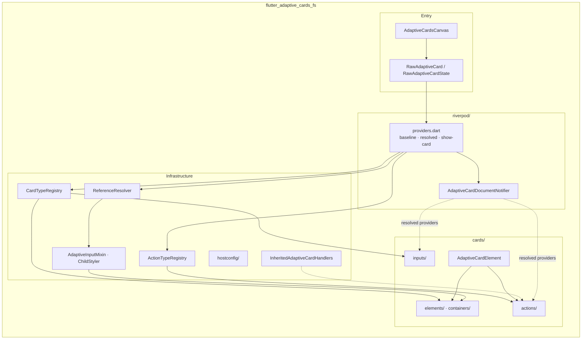
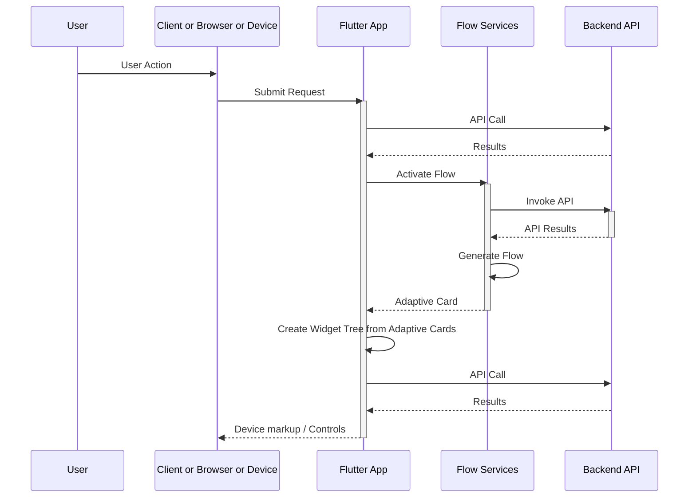
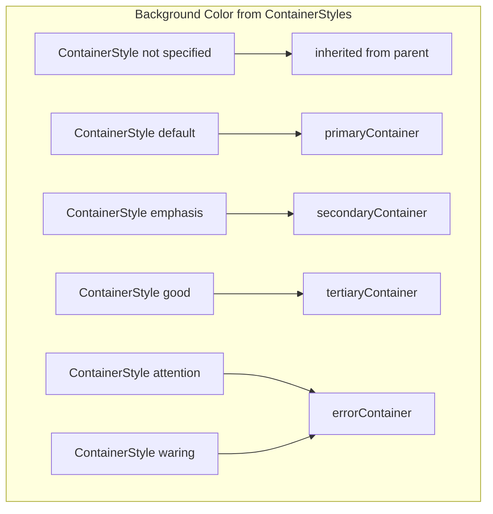
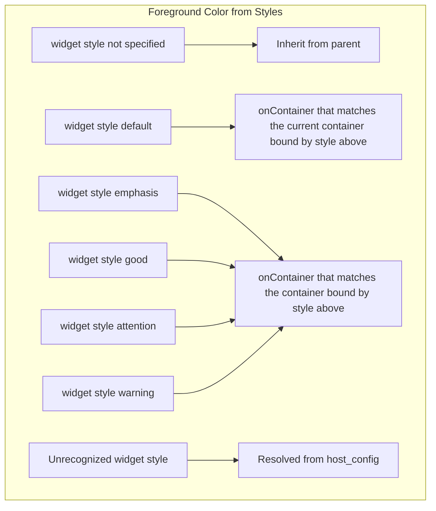
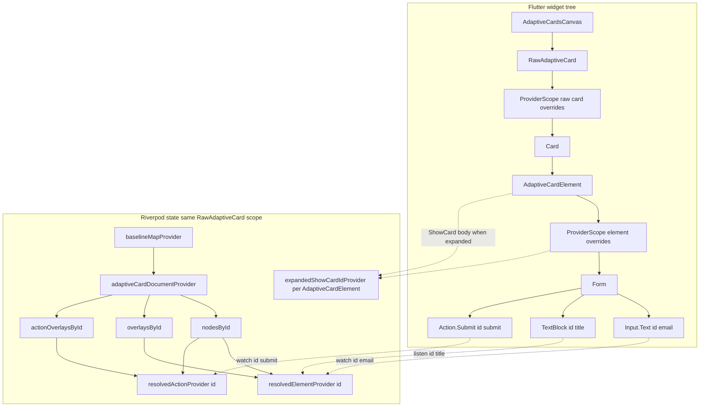
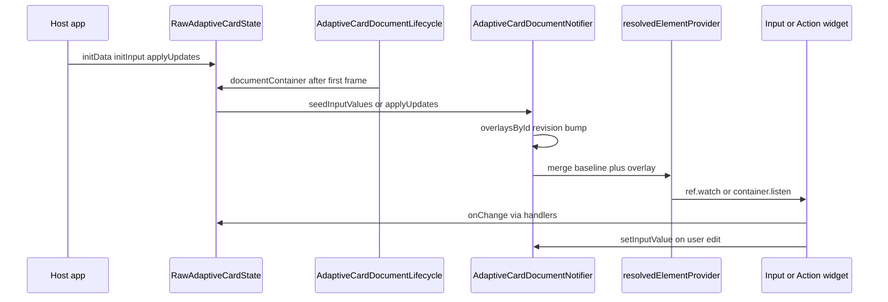
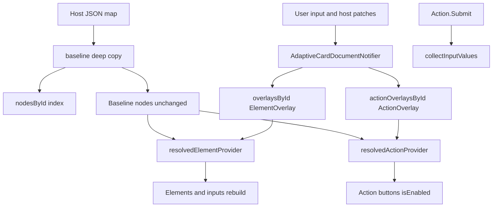
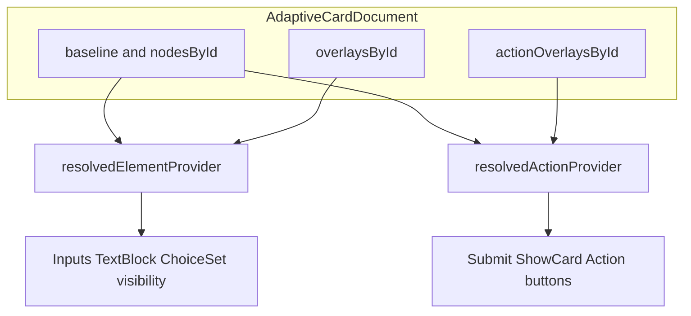
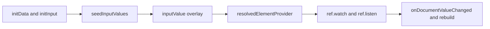
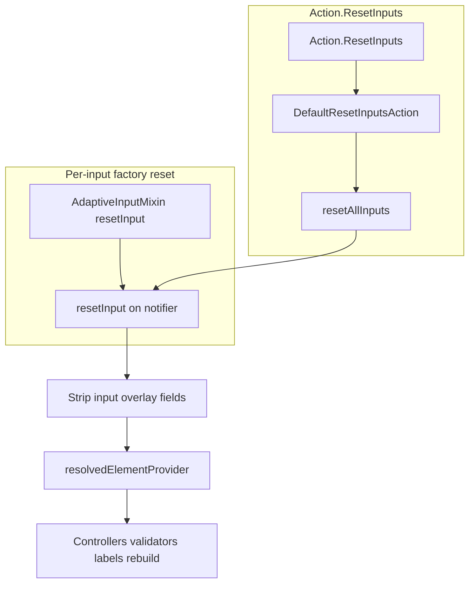

# Adaptive Cards in Flutter

This is an Adaptive Card implementation for Flutter that is built from a fork of a fork of a library that is no longer available on GitHub. The intermediate forking chain is pretty much all abandoned. This is available on [pub.dev](https://pub.dev/packages/flutter_adaptive_cards_fs) and is hosted on GitHub at [freemansoft Flutter-AdaptiveCards](/packages/flutter_adaptive_cards_fs)

## Microsoft Adaptive Cards

This project is in no way associated with Microsoft. It is an open source project to create an adaptive card implementation for Flutter.


### References

- [New AdaptiveCards Hub](https://adaptivecards.microsoft.com/)
- [Legacy Adaptive Cards website](https://adaptivecards.io/)
- [Legacy Adaptive Cards Schema Docs](https://adaptivecards.io/explorer)
- [The main GitHub repo with samples](https://github.com/microsoft/AdaptiveCards)
  - [The v1.5 samples on the main GitHub repo](https://github.com/microsoft/AdaptiveCards/tree/main/samples/v1.5/Scenarios)
  - [Template samples](https://github.com/microsoft/AdaptiveCards/tree/main/samples/Templates/Scenarios).
- [Description of Active Cards](https://github.com/MicrosoftDocs/AdaptiveCards)
- [Another example repo containing samples/templates](https://github.com/pnp/AdaptiveCards-Templates)

### Flutter-AdaptiveCards mono repo

Libraries avaiable on pub.dev from this repository include:

| Package / Library                                         | Location                                                                                  |
| --------------------------------------------------------- | ----------------------------------------------------------------------------------------- |
| The core of Adaptive Cards is supported via               | [flutter_adaptive_cards_fs](https://pub.dev/packages/flutter_adaptive_cards_fs)           |
| Supplemental Adaptive Card based charts are supported via | [flutter_adaptive_charts_fs](https://pub.dev/packages/flutter_adaptive_charts_fs)         |
| Templating is supported via the                           | [flutter_adaptive_template_fs](https://pub.dev/packages/flutter_adaptive_template_fs)     |
| Backend invoke bridge is supported via                    | [flutter_adaptive_cards_host_fs](https://pub.dev/packages/flutter_adaptive_cards_host_fs) |

Utility programs available in this repository that are not published to pub.dev include:

| Design time utility                                      | Location                                                                                                |
| -------------------------------------------------------- | ------------------------------------------------------------------------------------------------------- |
| The Adaptive Card Explorer Editor                        | ([adaptive_explorer](https://github.com/freemansoft/Flutter-AdaptiveCards/tree/main/adaptive_explorer)) |
| A Widgetbook for demonstrating cards and their features: | ([widgetbook](https://github.com/freemansoft/Flutter-AdaptiveCards/tree/main/widgetbook))               |

## Package structure

Major modules under `lib/src/` and how they connect at runtime. For the monorepo-wide view and a single diagram of state + style + actions + registries, see [`docs/Architecture-Overview.md`](../../docs/Architecture-Overview.md#core-library-component-model).



| Area | Responsibility |
| ---- | -------------- |
| `flutter_raw_adaptive_card.dart` | Card-scoped `ProviderScope`, baseline cache, `initData` lifecycle |
| `riverpod/` | Baseline + overlays, `resolvedElementProvider` / `resolvedActionProvider` |
| `cards/` | JSON type → widget (`CardTypeRegistry` / `ActionTypeRegistry` dispatch) |
| `reference_resolver.dart` + `hostconfig/` | HostConfig + theme → colors, fonts, spacing |
| `InheritedAdaptiveCardHandlers` | Host callbacks (Submit, Execute, OpenUrl, Refresh, onChange) |

## Consumption Patterns

Adaptive Cards are intended to be served up via some presentation service or API letting the service control the UX flow. It is possible to just use them with local JSON templates but that's not the intended use.

Teams often create a presentation or flow management service layer in front of the core business services that acts a bridge to the UI. It coughs up Adaptive Cards as the response to user actions. The cannonical flow would be



## Adaptive Card Color handling has changed

It used to be there were 3 background styles and 5 foreground styles plus light/dark. Then Microsoft defined 5 background styles that align with the 5 foregound styles. This library makes the assumption that the 'default' foreground color for a style should align with the background color for that style. This means we can map the Flutter `container` styles and `onContainer` styles to the Adaptive Card styles. So if you pick a container style then you will automatically get the right foreground color for that style if you don't specify anything.

Adaptive Card Container ColorStyles now map to themed Flutter container styles.



The CardStyle foreground color comes from the containers when the foreground style is 'default'.
All other foreground styles are retrieved from the host_config.



## How runtime overlays work

Host card JSON is stored as a **baseline** (deep-copied when the card loads; not mutated in place at runtime). User edits, visibility, validation, dynamic labels, and other runtime changes live in sparse **overlays** keyed by element `id` inside `AdaptiveCardDocumentNotifier`. Widgets render from a **resolved** view: baseline merged with overlays via `resolvedElementProvider(id)` and `resolvedActionProvider(id)`. The library installs a per-card `ProviderScope`; hosts call `RawAdaptiveCardState` APIs and do not need Riverpod in the app.

The implementation keeps **two parallel structures** for each `RawAdaptiveCard`: a Flutter **widget tree** (built from JSON via `CardTypeRegistry`) and a Riverpod **document + overlay state** (indexed by the same element `id`s). They are not the same object — widgets are not updated by mutating `widget.adaptiveMap` at runtime — but they stay aligned because reactive widgets **watch** `resolvedElementProvider(id)` / `resolvedActionProvider(id)` for their `id`.

### Parallel trees: widget tree and Riverpod state

|                    | Widget tree                                                                                                                                                                                     | Riverpod / overlay state                                                                                                             |
| ------------------ | ----------------------------------------------------------------------------------------------------------------------------------------------------------------------------------------------- | ------------------------------------------------------------------------------------------------------------------------------------ |
| **Built from**     | `CardTypeRegistry.getElement` / `getAction` walks baseline JSON once per reload                                                                                                                 | `AdaptiveCardDocumentNotifier` indexes baseline into `nodesById`                                                                     |
| **Structure**      | `AdaptiveCardElement` → `Form` → body/actions children                                                                                                                                          | `baseline` + sparse `overlaysById` / `actionOverlaysById`                                                                            |
| **Runtime values** | `Consumer` inputs call `watchResolvedInput()`; visibility/text/choices listen on `resolvedElementProvider(id)`                                                                                  | Overlay patches merged in family providers                                                                                           |
| **Scope**          | Outer `ProviderScope` on [`RawAdaptiveCard`](lib/src/flutter_raw_adaptive_card.dart); inner scope per [`AdaptiveCardElement`](lib/src/cards/adaptive_card_element.dart) for form + show-card UI | **One document per raw card** (ShowCard nested cards share it); `expandedShowCardIdProvider` is per inner `AdaptiveCardElement` only |
| **Host entry**     | `InheritedAdaptiveCardHandlers` (`onSubmit`, `onChange`, …)                                                                                                                                     | `RawAdaptiveCardState` → `documentContainer` → notifier (`initInput`, `applyUpdates`, …)                                             |



**How they connect:** at build time, the registry instantiates widgets with a baseline `adaptiveMap` snapshot. At runtime, writes go to the notifier only; `resolvedElementProvider("email")` merges `nodesById["email"]` with `overlaysById["email"]`, and `Input.Text` rebuilds from that merged map. Show-card expand/collapse does not use overlays — it uses `expandedShowCardIdProvider` in the inner element scope while the expanded target remains another `AdaptiveCardElement` in the widget tree.

### Host APIs, overlays, and Riverpod together



| Step   | What happens                                                                                                                                    |
| ------ | ----------------------------------------------------------------------------------------------------------------------------------------------- |
| Load   | Host passes JSON → `RawAdaptiveCard` deep-copies **baseline** → registry builds widget tree; notifier builds `nodesById` from the same baseline |
| Seed   | `initData` / `initInput` → `RawAdaptiveCardState` → notifier writes **overlays** (not baseline)                                                 |
| Render | Widget `build` watches **resolved** map for its `id` (label, value, `isVisible`, errors, …)                                                     |
| Edit   | User types → `setInputValue` → overlay → resolved provider → same widget rebuilds                                                               |
| Submit | `Action.Submit` → `collectInputValues()` reads overlay ?? baseline per input id → `onSubmit` handler                                            |



Element overlays and action overlays are separate tables so input reset and merge logic stay isolated from `Action.*` nodes:



### Overlay fields

Per JSON `type` patch keys, typed helpers, and contract tests: [`docs/overlay-properties-by-type.md`](../../docs/overlay-properties-by-type.md). Architecture and reset: [`docs/reactive-riverpod.md`](../../docs/reactive-riverpod.md). Input flow: [`docs/form-inputs.md`](../../docs/form-inputs.md#input-overlay-architecture).

### Seeding values (`initData` / `initInput`)

You can load an Adaptive Card from JSON and pass a separate data map that seeds overlays on the document notifier:

- `initData` is a widget parameter on `RawAdaptiveCard` / `AdaptiveCardsCanvas`.
- On first frame, values are written to the document notifier (scalar entries become `{value: …}` patches; map entries are full per-id patches via `applyUpdatesFromMap`).
- `initInput(map)` on `RawAdaptiveCardState` seeds flat `{id: value}` maps or patch maps when values are objects.
- **`initInput` does not call `setState` on the card** — input widgets rebuild when `resolvedElementProvider` updates. See [Why initInput does not call setState](../../docs/reactive-riverpod.md#why-initinput-does-not-call-setstate-on-the-card).
- `loadInput(id, map)` replaces `Input.ChoiceSet` choices for `id` via `setChoices` (title → value map converted to `Input.Choice` list).
- `Input.Date` accepts `yyyy-MM-dd` or ISO-8601 datetimes in `initData`. Datetime values use the calendar date portion only; time and timezone are ignored. Display and submit use `yyyy-MM-dd`.



### Host APIs without mutating JSON

Hosts patch document state via `RawAdaptiveCardState` (delegates to the document notifier). Bulk patches use typed `AdaptiveElementUpdate` / `AdaptiveActionUpdate` objects:

| API                                                               | Use                                                                    |
| ----------------------------------------------------------------- | ---------------------------------------------------------------------- |
| `applyUpdates(elements:, actions:)`                               | Bulk sparse patches (`AdaptiveElementUpdate` / `AdaptiveActionUpdate`) |
| `applyUpdatesFromMap(byId)`                                       | Server-style `{ id: { value, choices, … } }` payloads                  |
| `setText(id, text)` / `clearText(id)`                             | Replace `TextBlock` display text                                       |
| `setFacts(id, facts)` / `clearFacts(id)`                          | Replace or clear `FactSet` facts overlay                               |
| `setInputError(id, message:, isInvalid:)` / `clearInputError(id)` | Host validation on inputs                                              |
| `setActionEnabled(id, enabled:)` / `setActionsEnabled(map)`       | Enable/disable `Action.*` (AC 1.5)                                     |

### Reset semantics

`resetAllInputs()` and `resetInput(id)` perform a **factory reset** on `Input.*` elements: resolved `value`, `choices`, validation, `isRequired`, `label`, and `placeholder` return to baseline JSON. **Preserved:** `isVisible` and typeahead session fields on that input. **Not reset:** TextBlock `text`, Image `url`, and action overlays (`isEnabled`). Re-seed after reset with `initInput`, `applyUpdates`, or `applyUpdatesFromMap`.



Details: [`docs/reactive-riverpod.md` — Reset semantics](../../docs/reactive-riverpod.md#reset-semantics). Form-focused summary: [`docs/form-inputs.md` — Reset behavior](../../docs/form-inputs.md#reset-behavior-resetallinputs--resetinput--resetinputs).

### Further reading

- [`docs/reactive-riverpod.md`](../../docs/reactive-riverpod.md) — overlay model, provider scopes, reset
- [`docs/overlay-properties-by-type.md`](../../docs/overlay-properties-by-type.md) — patch keys by JSON `type`
- [`docs/form-inputs.md`](../../docs/form-inputs.md) — form inputs, validation, and reset from a host perspective

## Event Handlers

You can insert a `DefaultAdaptiveCardHandlers` in the Widget tree prior to loading the `AdaptiveCard`s. Those handlers will be used for all actions.

Your program can pass it's own handlers to the `AdaptiveCard` constructors. See the `NetworkPage` class in the example app.

## Example Execution

There are two example apps and a bunch of tests that demonstrate card usage.

1. We abused **Widgetbook** [to show the cards](https://github.com/freemansoft/Flutter-AdaptiveCards/tree/main/widgetbook) in a way that is more useful than single adaptive card components. Everything in Widgetbook is a JSON markup sitting in the file system. Many of these ar emodified versions of what is avaialble on the INterenet from Microsoft and others
2. The other example app is the **Adaptive Card Explorer Editor** [which is a full featured editor](https://github.com/freemansoft/Flutter-AdaptiveCards/tree/main/adaptive_explorer) for creating , previewing and testing Adaptive Cards.
3. The tests are in the `test` folder and are run using the standard flutter testing mechanism.

## Tests

There are functional Unit tests and _golden_ unit tests located in the `test` folder. They all use use the standard flutter testing mechanism. Golden tests may load a font so as not to use the `ahem` block font.

- Golden tests load Roboto fonts from [`flutter_adaptive_cards_test_support`](../flutter_adaptive_cards_test_support/) (via `adaptiveCardsTestExecutable`) so they don't render with the block font. Spacing can differ between platforms, so golden images are organized into platform-specific subdirectories (e.g., `gold_files/linux/`, `gold_files/macos/`).
- Golden images are platform-specific. The **Linux (CI)** images are the project's source of truth. Golden tests dynamically select the appropriate subdirectory based on the host OS. See: <https://github.com/flutter/flutter/issues/2943>.

## Compatibility

Compatability changes should be captured in the Changelog section below

- Video player doesn't work on windows because the 3rd party library doesn't support windows fat clients.

## Flutter Version

Flutter versioning is managed with `fvm`. The current Flutter version is as follows..

```powershell
PS C:\dev\flutter> flutter --version
Flutter 3.44.0 • channel stable • https://github.com/flutter/flutter.git
Framework • revision 559ffa3f75 (10 days ago) • 2026-05-15 14:13:13 -0700
Engine • hash fcf463a2242790d1fdcd9d044f533080f5022e18 (revision 4c525dac5e) (10 days ago) • 2026-05-15 19:00:04.000Z
Tools • Dart 3.12.0 • DevTools 2.57.0
```

You can move to this version of flutter by installing fvm and then:

```zsh
fvm install 3.44.0
#fvm use 3.44.0
```

Released Flutter / Dart bundling versions are located here: <https://docs.flutter.dev/release/archive?tab=windows>

## Development Tools

### VS Code

This repo has been reformatted and updated using VS Code extensions. The VS Code Flutter/Dart extension cleaned up some imports and mad other changes that have been comitted to the repository.

Notes:

1. VSCode told me to enable `Developer Mode` in **Windows** settings in order to run the examples. Is that for the Windows app or the Web app?

### Antigravity

A fair amoiunt of development has been done using Antigravity

#### Plugins used during coding

- Flutter
- Dart
- dart-import
- markdownlint
- Markdown Preview Mermaid
- Intellicode
- AdaptiveCards
- GitHub Actions
- GitLens
- Antigravity

## Widget Hierarchy with Flutter-AdaptiveCards

The widgets marked with `(*)` are library-specific, including those under Riverpod `ProviderScope`. For how that widget tree lines up with `adaptiveCardDocumentProvider`, overlays, and `resolvedElementProvider(id)` by the same `id`, see [Parallel trees: widget tree and Riverpod state](#parallel-trees-widget-tree-and-riverpod-state) above.

```txt
Demo Adaptive Card*
├── Selection Area (copy/paste enable)
│   └── Padding
│       └── Column
│           └── AdaptiveCardsCanvas(*)
│               └── RawAdaptiveCard(*)
│                   └── ProviderScope(*)
│                       ├── cardTypeRegistryProvider override
│                       ├── actionTypeRegistryProvider override
│                       ├── styleReferenceResolverProvider override (HostConfig only)
│                       └── adaptiveCardDocumentProvider
│                           └── Card
│                               └── Column
│                                   ├── TextButton
│                                   ├── Divider
│                                   └── AdaptiveCardElement(*)
│                                       └── ProviderScope(*)
│                                           └── expandedShowCardIdProvider
│                                               └── Form
│                                                   └── Container
│                                                       └── Column
|                                                           ├── AdaptiveTextBlock(*)
│                                                           ├.   └── Visble
│                                                           │        └── SeparatorElement
│                                                           │            └── Column
│                                                           │                └── ...
│                                                           └── AdaptiveColumnSet(*)
│                                                               └── SeparatorElement
│                                                                   └── Column
│                                                                       └── SizedBox
│                                                                           └── AdaptiveTapable(*)

```

Taken from the example (deleted) App

## Open TODO and open issues and bugs defects items

TODO for the example programs moved to [example README](example/README.md)

- Currently uses `Provider` for inherited state. Determine if this 3rd party dependency is a good idea given `Provider`` is essentially EOL or frozen.
- ~~There is currently no way to unset a container style inside a child container.~~ **Fixed:** nested containers with `style: "default"` use the default surface background; see [Style inheritance data flow](../../docs/adaptive-style.md#style-inheritance-data-flow).
- Make a single purpose dart file for consumer imports with no code in it in place of `flutter_adaptive_cards_fs.dart` or move the code in that file.
- Inject locale behavior into money, time and dates including parsing
- _Card Elements_ missing implementations and features
  - Add [`RichTextBlock`](https://adaptivecards.io/explorer/RichTextBlock.html)
  - Add [`TextRun`](https://adaptivecards.io/explorer/TextRun.html)
  - [`Media`](https://adaptivecards.io/explorer/Media.html) `poster` attribute does not show poster, possibly with the latest media player update
- _Inputs_ missing implementations and features
- Inputs have been migrated to use Flutter `Form` APIs and standardised keys to improve testing and validation.
  - **Input field keys** are now `ValueKey(id)`. Example: `ValueKey('myText')`.
  - **Parent card keys** for input widgets use `ValueKey('${id}_adaptive')` to avoid collisions with the inner field.
  - **Selector item keys** use `ValueKey('${id}_${itemKey}')` (useful for targeting specific options in tests).
- `RawAdaptiveCard.searchList` accepts an optional `inputId` that is propagated to the modal search `ChoiceFilter` so the modal's search field receives a predictable key.
- **Filtered** `Input.ChoiceSet` (`style: "filtered"`) lists and typeahead-searches choice **titles**; stored/submitted values use choice **values** (see [`docs/form-inputs.md`](../../docs/form-inputs.md#filtered-choiceset-style-style-filtered)).
- Actions missing implementations and features
- _Tests_
  - Font line spacing is subtly different between platforms. You can see this if you use the "fade" view when looking at diffs on a golden png in the repo
  - Using default flutter fonts instead of roboto <https://github.com/flutter/flutter/issues/56383>
  - Golden toolkit fonts loaded but it will show black bars for text inside of text fields instead of text if font isn't loaded <https://pub.dev/packages/golden_toolkit>
- Input reset uses document notifier **`resetAllInputs()`** / **`resetInput(id)`** (factory reset to baseline JSON). Subclass **`resetInput()`** overrides sync controllers only — see [`docs/reactive-riverpod.md`](../../docs/reactive-riverpod.md#reset-semantics).
- mandatory inputs checks may not include all inputs because possible overrides may not be implement
- Visitors are at the raw adaptive card level meaning all adaptive cards and their children are in scope. All forms are impacted at that level.
- Possibly add the deprecated `Action.HTTP`
- markdown bullet point spacing is wrong.
- Material time picker doesn't support min and max time

## Repository History

Everything below this line is from the original README.md

The referenced GitHub repository has vanished. Look at the forking train to figure out where the current repository was forked from or look here:

1. <https://github.com/freemansoft/Flutter-AdaptiveCards> Mine forked from
1. <https://github.com/lannes/Flutter-AdaptiveCards> forked from
1. <https://github.com/juansoilan/Flutter-AdaptiveCards> forked from the original
1. <https://github.com/rodydavis/Flutter-AdaptiveCards> the original but possibly from the no longer here repo
1. <https://github.com/neohelden/Flutter-AdaptiveCards>

---

## Installing

The current release is **0.10.0** under the `_fs` namespace.

Add this to your package's pubspec.yaml file:

```yml
dependencies:
  flutter_adaptive_cards_fs: ^0.10.0
```

```dart
import 'package:flutter_adaptive_cards_fs/flutter_adaptive_cards_fs.dart';
```

## Using

Using Adaptive Cards in Flutter coudn't be simpler: All you need is the `AdaptiveCardsCanvas` widget.

### :warning: Markdown support vs. ColumnSet content alignment

Due to [issue #171](https://github.com/flutter/flutter_markdown/issues/171) of the Flutter Markdown package, the flag `supportMarkdown` was introduced to all Adaptive Card contractors. The default value of this property is `true`, to stay compatible with older versions of this package, which didn't support content alignment in ColumnSets. If the value is set to `false` the content alignment in ColumnSets is working accordingly, but every TextBlock is displayed without Markdown rendering. As soon if the issue is resolved this flag will be removed.

### Loading an AdaptiveCard

There are several constructors which handle loading of the AC from different sources.
`AdaptiveCardsCanvas.network` takes a url to download the payload and display it.
`AdaptiveCardsCanvas.asset` takes an asset path to load the payload from the local data.
`AdaptiveCardsCanvas.map` takes a map (which can be obtained but decoding a string using the json class) and displays it.

### Example

```dart
InheritedAdaptiveCardHandlers(
  onSubmit: (SubmitActionInvoke invoke) {
    sendToServer(invoke.data, actionId: invoke.actionId);
  },
  onExecute: (ExecuteActionInvoke invoke) {
    routeExecute(invoke.verb, invoke.data);
  },
  onOpenUrl: (OpenUrlActionInvoke invoke) {
    launchUrl(Uri.parse(invoke.url));
  },
  onOpenUrlDialog: (OpenUrlDialogActionInvoke invoke) {
    showDialogFor(invoke.url);
  },
  onChange: (InputChangeInvoke invoke) {
    if (invoke.inputId == 'country') {
      invoke.cardState.applyUpdates(/* ... */);
    }
  },
  child: AdaptiveCardsCanvas.network(
    placeholder: Text('Loading, please wait'),
    url: 'https://example.com/card.json',
    hostConfigs: HostConfigs(),
    showDebugJson: true,
  ),
);
```

## Widgetbook

The Widgetbook demonstrates components loaded via JSON. It does not implement any of the controls to change the seettings.

## Running the tests

Test files must end in `_test` , `_test.dart` in order to be recognized by the test jig.

```sh
fvm flutter test
```

to see the result of each test

```sh
fvm flutter test -r expanded
```

Golden tests are platform-specific and stored in subdirectories (e.g., `gold_files/linux/`). If you run tests on a platform without checked-in goldens (like macOS), they will fail unless you generate local goldens. All golden tests are tagged with `@tag golden`. You can run all tests _other than golden_ with:

```sh
fvm flutter test packages/flutter_adaptive_cards_fs --exclude-tags=golden
```

or from a terminal inside the package

```sh
fvm flutter test --exclude-tags=golden
```

This updates or creates the golden files for the current platform in the appropriate subdirectory (e.g., `gold_files/macos/`). For the CI / CD setup, Linux-based goldens are required and should be generated using a Docker container:

```zsh
# run the following command in the root folder of this project
docker run -it -v `pwd`:/app cirrusci/flutter:dev bash

# and inside the container execute
cd /app
flutter test --update-goldens

# afterwards commit the freshly generated sample files (after checking them)
```

## Authors

This has been heavilty rewritten and upgraded for later libraries and Flutter versions including null safety. See [README_orig.md](../../docs/archive/README_orig.md) for origianl attribution

## Contributing

Please read [CONTRIBUTING.md](https://gist.github.com/PurpleBooth/b24679402957c63ec426) for details on our code of conduct, and the process for submitting pull requests to us.

## License

This project is licensed under the MIT License - see the [LICENSE](LICENSE) file for details.
