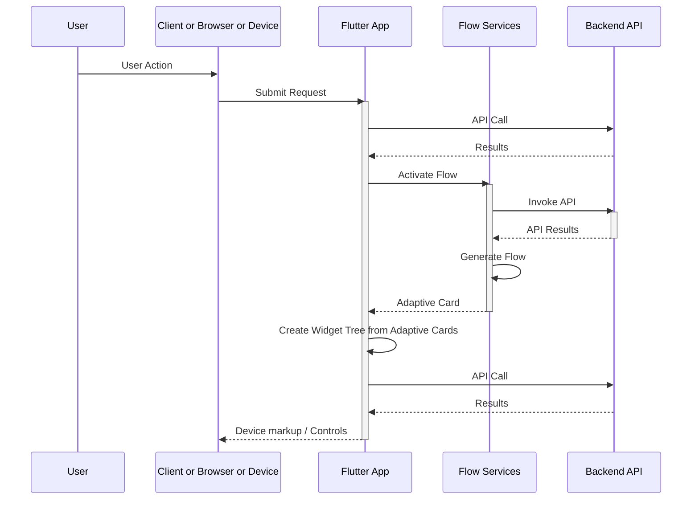
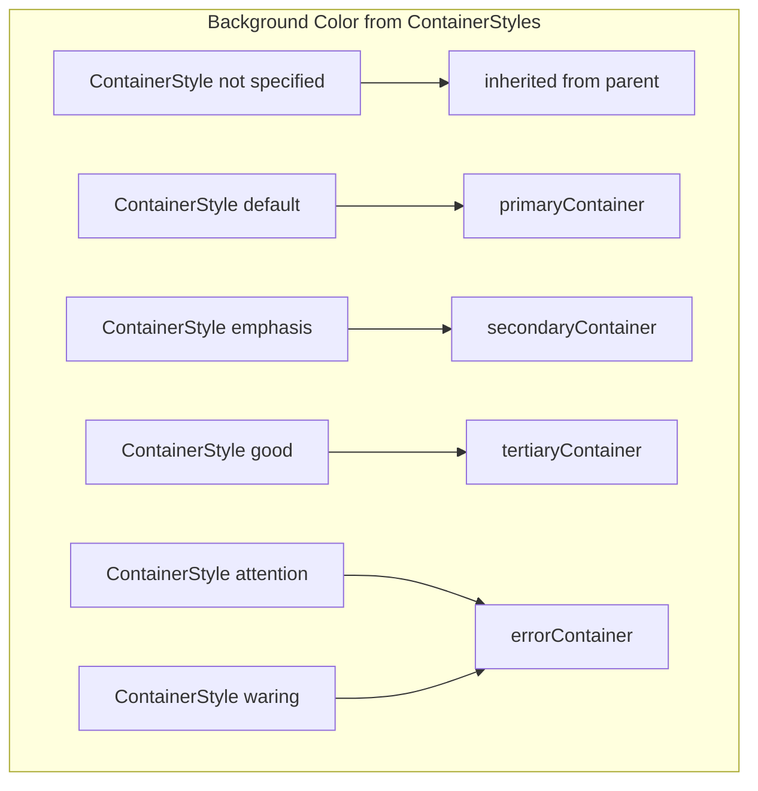

# Adaptive Cards in Flutter

This is an Adaptive Card implementation for Flutter that is built from a fork of a fork of a library that is no longer available on GitHub. The intermediate forking chain is pretty much all abandoned. This is available on [pub.dev](https://pub.dev/packages/flutter_adaptive_cards_fs) and is hosted on GitHub at [freemansoft Flutter-AdaptiveCards](/packages/flutter_adaptive_cards_fs)

## Microsoft Adaptive Cards

This project is in no way associated with Microsoft. It is an open source project to create an adaptive card implementation for Flutter.


### References

- [New AdaptiveCards Hub](https://adaptivecards.microsoft.com/)
- [Legacy Adaptive Cards website](https://adaptivecards.io/)
- [Legacy Adaptive Cards Schema Docs](https://adaptivecards.io/explorer)
- [The main GitHub repo with samples](https://github.com/microsoft/AdaptiveCards)
  - [The v1.5 samples on the main GitHub repo](https://github.com/microsoft/AdaptiveCards/tree/main/samples/v1.5/Scenarios)
  - [Template samples](https://github.com/microsoft/AdaptiveCards/tree/main/samples/Templates/Scenarios).
- [Description of Active Cards](https://github.com/MicrosoftDocs/AdaptiveCards)
- [Another example repo containing samples/templates](https://github.com/pnp/AdaptiveCards-Templates)

### Flutter-AdaptiveCards mono repo

Libraries avaiable on pub.dev from this repository include:

| Package / Library                                         | Location                                                                              |
| --------------------------------------------------------- | ------------------------------------------------------------------------------------- |
| The core of Adaptive Cards is supported via               | [flutter_adaptive_cards_fs](https://pub.dev/packages/flutter_adaptive_cards_fs)       |
| Supplemental Adaptive Card based charts are supported via | [flutter_adaptive_charts_fs](https://pub.dev/packages/flutter_adaptive_charts_fs)     |
| Templating is supported via the                           | [flutter_adaptive_template_fs](https://pub.dev/packages/flutter_adaptive_template_fs) |

Utility programs available in this repository that are not published to pub.dev include:

| Design time utility                                      | Location                                                                                                |
| -------------------------------------------------------- | ------------------------------------------------------------------------------------------------------- |
| The Adaptive Card Explorer Editor                        | ([adaptive_explorer](https://github.com/freemansoft/Flutter-AdaptiveCards/tree/main/adaptive_explorer)) |
| A Widgetbook for demonstrating cards and their features: | ([widgetbook](https://github.com/freemansoft/Flutter-AdaptiveCards/tree/main/widgetbook))               |

## Consumption Patterns

Adaptive Cards are intended to be served up via some presentation service or API letting the service control the UX flow. It is possible to just use them with local JSON templates but that's not the intended use.

Teams often create a presentation or flow management service layer in front of the core business services that acts a bridge to the UI. It coughs up Adaptive Cards as the response to user actions. The cannonical flow would be



## Adaptive Card Color handling has changed

It used to be there were 3 background styles and 5 foreground styles plus light/dark. Then Microsoft defined 5 background styles that align with the 5 foregound styles. This library makes the assumption that the 'default' foreground color for a style should align with the background color for that style. This means we can map the Flutter `container` styles and `onContainer` styles to the Adaptive Card styles. So if you pick a container style then you will automatically get the right foreground color for that style if you don't specify anything.

Adaptive Card Container ColorStyles now map to themed Flutter container styles.



The CardStyle foreground color comes from the containers when the foreground style is 'default'.
All other foreground styles are retrieved from the host_config.

```mermaid
flowchart
  subgraph ForegroundStyles[Foreground Color from Styles]
  notset[widget style not specified] --> inherit[Inherit from parent]
  default[widget style default] --> associatedContainer["onContainer that matches the current container bound by style above" ]
  emphasis[widget style emphasis] --> container["onContainer that matches the container bound by style above"]
  good[widget style good] --> container
  attention[widget style attention] --> container
  warning[widget style warning] --> container
  unrecognized --> <tbd>
  end
```

## Loading Data into fields outside of the AdaptiveCard JSON with `initData` / `initInput`

You can create an AdaptiveCard stack with the AdaptiveCard json and also pass in a data map that will be passed across the AdaptiveCard widget Tree.
`initData` is demonstrated in the sample app on the `initData` button overriding values from the JSON. `loadData` was in the sample app but was removed and needs to be re-added.

- `InitData` / `InitInput` can be used for late binding data into a widget tree
  - `initData` injected directly into a widget tree and visited across the tree in `InitInput`
  - `initInput(initData)` used to replace values in inputs. `initData` is a widget parameter.
  - `initInput` is called if initData exists on component
- `loadInput` used for choice selector lists only, at runtime, in choice set. bound by id

## Event Handlers

You can insert a `DefaultAdaptiveCardHandlers` in the Widget tree prior to loading the `AdaptiveCard`s. Those handlers will be used for all actions.

Your program can pass it's own handlers to the `AdaptiveCard` constructors. See the `NetworkPage` class in the example app.

## Example Execution

There are two example apps and a bunch of tests that demonstrate card usage.

1. We abused **Widgetbook** [to show the cards](https://github.com/freemansoft/Flutter-AdaptiveCards/tree/main/widgetbook) in a way that is more useful than single adaptive card components. Everything in Widgetbook is a JSON markup sitting in the file system. Many of these ar emodified versions of what is avaialble on the INterenet from Microsoft and others
2. The other example app is the **Adaptive Card Explorer Editor** [which is a full featured editor](https://github.com/freemansoft/Flutter-AdaptiveCards/tree/main/adaptive_explorer) for creating , previewing and testing Adaptive Cards.
3. The tests are in the `test` folder and are run using the standard flutter testing mechanism.

## Tests

There are functional Unit tests and _golden_ unit tests located in the `test` folder. They all use use the standard flutter testing mechanism. Golden tests may load a font so as not to use the `ahem` block font.

- The tests load the Roboto fonts so that the golden tests don't just show the block font. Spacing can be off between platforms so the golden tests are organized into platform-specific subdirectories (e.g., `gold_files/linux/`, `gold_files/macos/`).
- Golden images are platform-specific. The **Linux (CI)** images are the project's source of truth. Golden tests dynamically select the appropriate subdirectory based on the host OS. See: <https://github.com/flutter/flutter/issues/2943>.

## Compatibility

Compatability changes should be captured in the Changelog section below

- Video player doesn't work on windows because the 3rd party library doesn't support windows fat clients.

## Flutter Version

Flutter versioning is managed with `fvm`. The current Flutter version is as follows..

```powershell
PS C:\dev\flutter> flutter --version
Flutter 3.41.2 • channel stable • https://github.com/flutter/flutter.git
Framework • revision 90673a4eef (2 months ago) • 2026-02-18 13:54:59 -0800
Engine • hash d96704abcce17ff165bbef9d77123407ef961017 (revision 6c0baaebf7) (2 months ago) • 2026-02-18 19:22:23.000Z
Tools • Dart 3.11.0 • DevTools 2.54.1
```

You can move to this version of flutter by installing fvm and then:

```zsh
fvm install 3.38.5
#fvm use 3.38.5
```

Released Flutter / Dart bundling versions are located here: <https://docs.flutter.dev/release/archive?tab=windows>

## Development Tools

### VS Code

This repo has been reformatted and updated using VS Code extensions. The VS Code Flutter/Dart extension cleaned up some imports and mad other changes that have been comitted to the repository.

Notes:

1. VSCode told me to enable `Developer Mode` in **Windows** settings in order to run the examples. Is that for the Windows app or the Web app?

### Antigravity

A fair amoiunt of development has been done using Antigravity

#### Plugins used during coding

- Flutter
- Dart
- dart-import
- markdownlint
- Markdown Preview Mermaid
- Intellicode
- AdaptiveCards
- GitHub Actions
- GitLens
- Antigravity

## Widget Hierarchy with Flutter-AdaptiveCards

The Widgets marked with `(*)`are Flutter-AdaptiveCars specific including those build using the `Provider` framework.

```txt
Demo Adaptive Card*
├── Selection Area (copy/paste enable)
│   └── Padding
│       └── Column
│           └── AdaptiveCard(*)
│               └── RawAdaptiveCard(*)
│                   ├── Provider<RawAdaptiveCardState>(*)
│                   ├── Provider<CardTypeRegistry>(*)
│                   ├── Provider<ActionTypeRegistry>(*)
│                   └── Provider<ReferenceResolver>(*)
│                               └── Card
│                                   └── Column
│                                       ├── TextButton
│                                       ├── Divider
│                                       └── AdaptiveCardElement(*)
│                                           └── Provider<AdaptiveCardElement>(*)
│                                               └── Form
│                                                   └── Container
│                                                       └── Column
|                                                           ├── AdaptiveTextBlock(*)
│                                                           ├.   └── Visble
│                                                           │        └── SeparatorElement
│                                                           │            └── Column
│                                                           │                └── ...
│                                                           └── AdaptiveColumnSet(*)
│                                                               └── SeparatorElement
│                                                                   └── Column
│                                                                       └── SizedBox
│                                                                           └── AdaptiveTapable(*)

```

Taken from the example (deleted) App

## Open TODO and open issues and bugs defects items

TODO for the example programs moved to [example README](example/README.md)

- `initData` does not appear to be working on date fields. The `initData` button in the sample program demonstrates this
- Currently uses `Provider` for inherited state. Determine if this 3rd party dependency is a good idea given `Provider`` is essentially EOL or frozen.
- Find out if there is any regex validation tag or extension
  - add support for regex validation
- There is currently no way to unset a container style inside a child container. This means you can't get back to a card background color in a nested container if you set it somewhere in the widget tree betwen you and the card.
- Make a single purpose dart file for consumer imports with no code in it in place of `flutter_adaptive_cards_fs.dart` or move the code in that file.
- Inject locale behavior into money, time and dates including parsing
- _Card Elements_ missing implementations and features
  - Add [`RichTextBlock`](https://adaptivecards.io/explorer/RichTextBlock.html)
  - Add [`TextRun`](https://adaptivecards.io/explorer/TextRun.html)
  - Note: [`MediaSource`](https://adaptivecards.io/explorer/MediaSource.html) currently implemented as a map in [`Media`](https://adaptivecards.io/explorer/Media.html)
  - [`Media`](https://adaptivecards.io/explorer/Media.html) `poster` attribute does not show poster, possibly with the latest media player update
- _Inputs_ missing implementations and features
  - Note: [`Input.Choice`](https://adaptivecards.io/explorer/Input.Choice.html) currently implemented as a map in [`ChoiceSet`](https://adaptivecards.io/explorer/Input.ChoiceSet.html)
- Inputs have been migrated to use Flutter `Form` APIs and standardised keys to improve testing and validation.
  - **Input field keys** are now `ValueKey(id)`. Example: `ValueKey('myText')`.
  - **Parent card keys** for input widgets use `ValueKey('${id}_adaptive')` to avoid collisions with the inner field.
  - **Selector item keys** use `ValueKey('${id}_${itemKey}')` (useful for targeting specific options in tests).
- `RawAdaptiveCard.searchList` accepts an optional `inputId` that is propagated to the modal search `ChoiceFilter` so the modal's search field receives a predictable key.
- Actions missing implementations and features
- _Tests_
  - Font line spacing is subtly different between platforms. You can see this if you use the "fade" view when looking at diffs on a golden png in the repo
  - Using default flutter fonts instead of roboto <https://github.com/flutter/flutter/issues/56383>
  - Golden toolkit fonts loaded but it will show black bars for text inside of text fields instead of text if font isn't loaded <https://pub.dev/packages/golden_toolkit>
- resetInputs() needs to be overridden in every input field that needs something other than '' when no value was set in the json.
- mandatory inputs checks may not include all inputs because possible overrides may not be implement
- Visitors are at the raw adaptive card level meaning all adaptive cards and their children are in scope. All forms are impacted at that level.
- Possibly add the deprecated `Action.HTTP`
- markdown bullet point spacing is wrong.
- Material time picker doesn't support min and max time

## Repository History

Everything below this line is from the original README.md

The referenced GitHub repository has vanished. Look at the forking train to figure out where the current repository was forked from or look here:

1. <https://github.com/freemansoft/Flutter-AdaptiveCards> Mine forked from
1. <https://github.com/lannes/Flutter-AdaptiveCards> forked from
1. <https://github.com/juansoilan/Flutter-AdaptiveCards> forked from the original
1. <https://github.com/rodydavis/Flutter-AdaptiveCards> the original but possibly from the no longer here repo
1. <https://github.com/neohelden/Flutter-AdaptiveCards>

---

## Installing

Version 0.3.0 is the first release of this package under the `_fs` namespace.

Add this to your package's pubspec.yaml file:

```yml
dependencies:
  flutter_adaptive_cards_fs: ^0.3.0
```

```dart
import 'package:flutter_adaptive_cards_fs/flutter_adaptive_cards_fs.dart';
```

## Using

Using Adaptive Cards in Flutter coudn't be simpler: All you need is the `AdaptiveCard` widget.

### :warning: Markdown support vs. ColumnSet content alignment

Due to [issue #171](https://github.com/flutter/flutter_markdown/issues/171) of the Flutter Markdown package, the flag `supportMarkdown` was introduced to all Adaptive Card contractors. The default value of this property is `true`, to stay compatible with older versions of this package, which didn't support content alignment in ColumnSets. If the value is set to `false` the content alignment in ColumnSets is working accordingly, but every TextBlock is displayed without Markdown rendering. As soon if the issue is resolved this flag will be removed.

### Loading an AdaptiveCard

There are several constructors which handle loading of the AC from different sources.
`AdaptiveCard.network` takes a url to download the payload and display it.
`AdaptiveCard.asset` takes an asset path to load the payload from the local data.
`AdaptiveCard.memory` takes a map (which can be obtained but decoding a string using the json class) and displays it.

### Example

```dart
AdaptiveCard.network(
  placeholder: Text("Loading, please wait"),
  url: "www.someUrlThatPoints.To/A.json",
  hostConfigPath: "assets/host_config.json",
  onSubmit: (map) {
    // Send to server or handle locally
  },
  onOpenUrl: (url) {
    // Open url using the browser or handle differently
  },
  // If this is set, a button will appear next to each adaptive card which when clicked shows the JSON payload.
  // NOTE: this flag only has impact in development mode, this attribute does change nothing for realease builds.
  // This is very useful for debugging purposes
  showDebugJson: true,
);
```

## Widgetbook

The Widgetbook demonstrates components loaded via JSON. It does not implement any of the controls to change the seettings.

## Running the tests

Test files must end in `_test` , `_test.dart` in order to be recognized by the test jig.

```sh
flutter test
```

to see the result of each test

```sh
flutter test -r expanded
```

Golden tests are platform-specific and stored in subdirectories (e.g., `gold_files/linux/`). If you run tests on a platform without checked-in goldens (like macOS), they will fail unless you generate local goldens. All golden tests are tagged with `@tag golden`. You can run all tests _other than golden_ with:

```sh
flutter test packages/flutter_adaptive_cards_fs --exclude-tags=golden
```

or from a terminal inside the package

```sh
flutter test --exclude-tags=golden
```

This updates or creates the golden files for the current platform in the appropriate subdirectory (e.g., `gold_files/macos/`). For the CI / CD setup, Linux-based goldens are required and should be generated using a Docker container:

```zsh
# run the following command in the root folder of this project
docker run -it -v `pwd`:/app cirrusci/flutter:dev bash

# and inside the container execute
cd /app
flutter test --update-goldens

# afterwards commit the freshly generated sample files (after checking them)
```

## Authors

This has been heavilty rewritten and upgraded for later libraries and Flutter versions including null safety. See [README_orig.md](README_orig.md) for origianl attribution

## Contributing

Please read [CONTRIBUTING.md](https://gist.github.com/PurpleBooth/b24679402957c63ec426) for details on our code of conduct, and the process for submitting pull requests to us.

## License

This project is licensed under the MIT License - see the [LICENSE](LICENSE) file for details.
