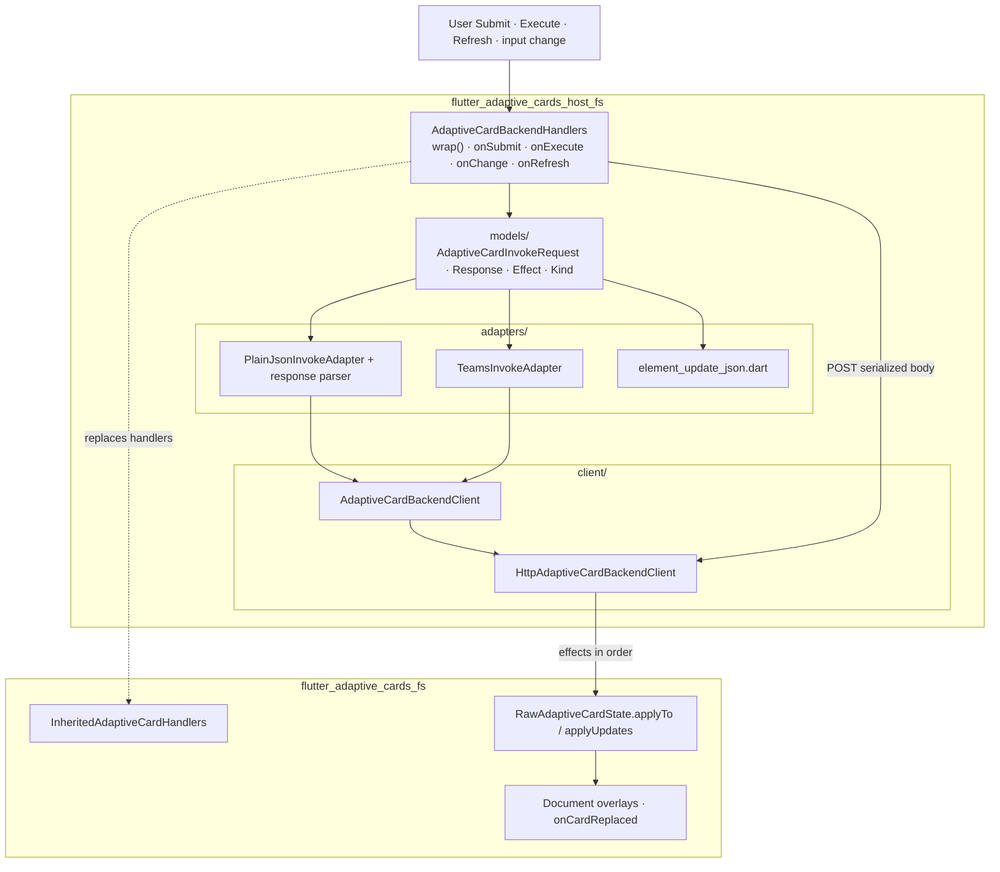

# flutter_adaptive_cards_host_fs

Backend invoke bridge for [pub.dev](https://pub.dev/packages/flutter_adaptive_cards_host_fs) and on GitHub at [flutter_adaptive_cards_fs](../flutter_adaptive_cards_fs) — serialize host callbacks, POST to your flow-service, parse responses, and apply patches to the rendered card.

Published on [pub.dev](https://pub.dev/packages/flutter_adaptive_cards_host_fs) and on gitub at [flutter_adaptive_cards_host_fs](/packages/flutter_adaptive_template_fs/).

## Usage

Import the barrel:

```dart
import 'package:flutter_adaptive_cards_host_fs/flutter_adaptive_cards_host_fs.dart';
```

**Full guide:** [docs/backend-host-integration.md](../../docs/backend-host-integration.md)

## Package structure

Wires core invoke callbacks to your flow-service. Parsing and overlay application delegate to `flutter_adaptive_cards_fs` (`RawAdaptiveCardState.applyUpdates`, document notifier).



## Quick start

```dart
import 'dart:developer';

import 'package:flutter/material.dart';
import 'package:flutter_adaptive_cards_fs/flutter_adaptive_cards_fs.dart';
import 'package:flutter_adaptive_cards_host_fs/flutter_adaptive_cards_host_fs.dart';

final cardKey = GlobalKey<RawAdaptiveCardState>();

AdaptiveCardBackendHandlers(
  client: HttpAdaptiveCardBackendClient(
    endpoint: Uri.parse('https://api.example.com/adaptive-card/invoke'),
  ),
  cardKey: cardKey,
  onError: (error) => log('invoke failed', error: error),
).wrap(
  RawAdaptiveCard.fromMap(
    key: cardKey,
    map: cardJson,
    hostConfigs: HostConfigs(),
  ),
  onCardReplaced: (map) => setState(() => cardJson = map),
);
```

Assign the same `GlobalKey<RawAdaptiveCardState>` to both `AdaptiveCardBackendHandlers` and `RawAdaptiveCard.fromMap`. `InputChangeInvoke` uses `invoke.cardState` directly; Submit, Execute, and Refresh resolve state from `cardKey`.

## Wired callbacks

| Handler     | Invoked when                                                                                                                |
| ----------- | --------------------------------------------------------------------------------------------------------------------------- |
| `onSubmit`  | `Action.Submit`                                                                                                             |
| `onExecute` | `Action.Execute`                                                                                                            |
| `onRefresh` | Root card refresh (manual affordance or auto-expire)                                                                        |
| `onChange`  | Input value changes (includes `Data.Query` with `associatedInputs`)                                                         |
| `onSignin`  | Card `authentication` sign-in button tapped (opens URL via `urlOpener`; call `completeSignin(state:)` after OAuth redirect) |

Pass `onOpenUrl` / `onOpenUrlDialog` on `AdaptiveCardBackendHandlers` when you need non–backend URL handling (defaults to no-op).

## How actions reach your handlers

The callbacks this package wires (`onSubmit`, `onExecute`, …) are the **outbound edge** of a two-layer pipeline in core `flutter_adaptive_cards_fs`. Understanding it tells you exactly when your handler runs — and when it does **not**.

- **`GenericAction`** (core, `generic_action.dart`) — the in-card dispatch strategy resolved by `ActionTypeRegistry` from an `Action.*` element's JSON `type`. Its `.tap()` does the in-card work (collect input values, `validateInputs()`, merge `data`, apply the URI policy) and **then** forwards to a host handler.
- **`InheritedAdaptiveCardHandlers`** (core, `action_handler.dart`) — the host callbacks this package supplies via `AdaptiveCardBackendHandlers.wrap()`.

So for a tapped `Action.Submit`: `DefaultSubmitAction.tap()` runs, and **only if validation passes and a handler is installed** does it call `onSubmit`. They chain — the `GenericAction` is the gatekeeper that may then call your handler.

| JSON `type`               | `GenericAction` default impl (core)      | Handler it forwards to                                             |
| ------------------------- | ---------------------------------------- | ------------------------------------------------------------------ |
| `Action.Submit`           | `DefaultSubmitAction`                    | `onSubmit` — only if `validateInputs()` passes + handler installed |
| `Action.Execute`          | `DefaultExecuteAction`                   | `onExecute` — same gating                                          |
| `Action.OpenUrl`          | `DefaultOpenUrlAction`                   | `onOpenUrl` (else launches the URL itself)                         |
| `Action.OpenUrlDialog`    | `DefaultOpenUrlDialogAction`             | `onOpenUrlDialog` (else shows dialog itself)                       |
| `Action.Http`             | `DefaultHttpAction`                      | `onHttp` — only if non-null                                        |
| `Action.ToggleVisibility` | `DefaultToggleVisibilityAction`          | **none** — done in-card (mutates document state)                   |
| `Action.ResetInputs`      | `DefaultResetInputsAction`               | **none** — in-card reset                                           |
| `Action.Popover`          | `DefaultPopoverAction`                   | **none** — renders nested card in a dialog, in-card                |
| `Action.ShowCard`         | special-cased (root card only)           | **none** — in-card UI toggle                                       |
| root `refresh`            | **no `GenericAction`** (not in registry) | `onRefresh` (direct)                                               |
| root `authentication`     | **no `GenericAction`** (not in registry) | `onSignin` (direct)                                                |

Three cases fall out of this:

1. **Both run (GenericAction → handler):** Submit, Execute, OpenUrl, OpenUrlDialog, Http — the `Default*Action` does in-card work, then calls your callback.
2. **Only the GenericAction:** ToggleVisibility, ResetInputs, Popover, and root-card ShowCard have no matching host callback (handled entirely in-card); Submit/Execute also stop here when validation fails or no handler is installed.
3. **Only the handler (no GenericAction):** root `refresh` → `onRefresh` and root `authentication` → `onSignin` skip the registry and call the handler directly.

> `onSignin` (root `authentication` sign-in) opens the sign-in URL via `urlOpener`; call `completeSignin(state:)` after your app captures the OAuth redirect code to POST the verification and apply the returned card. See [Sign-in (authentication)](../../docs/backend-host-integration.md#sign-in-authentication) in the backend integration guide.

## PlainJson request shape

```json
{
  "kind": "execute",
  "verb": "saveProfile",
  "actionId": "act1",
  "data": { "email": "user@example.com" }
}
```

Input changes include `inputId`, `value`, and optional `dataQuery` (Teams `Data.Query` shape with merged `parameters` when `associatedInputs` is `"auto"`).

Refresh requests use `kind: execute` with the nested refresh action's `verb` and merged input `data`.

## PlainJson response contract

**Patches + validation errors:**

```json
{
  "type": "adaptiveCard.invokeResponse",
  "effects": [
    {
      "type": "applyPatches",
      "elements": [
        {
          "id": "city",
          "choices": [{ "title": "Paris", "value": "paris" }]
        }
      ]
    },
    {
      "type": "setInputErrors",
      "errors": { "email": "Invalid format" }
    }
  ]
}
```

**Full card replacement:**

```json
{
  "type": "adaptiveCard.invokeResponse",
  "card": { "type": "AdaptiveCard", "version": "1.5", "body": [] }
}
```

### Effect apply order

Effects run **in JSON array order**. Recommended server order:

1. **`applyPatches`** — `RawAdaptiveCardState.applyUpdates` (choices, visibility, text, …)
2. **`setInputErrors`** — validation overlays on input ids
3. **`replaceCard`** — calls `onCardReplaced` with full card JSON (**required** when this effect is present)

## Error handling

| Case                                   | Behavior                                               |
| -------------------------------------- | ------------------------------------------------------ |
| Network failure                        | `onError`; card unchanged                              |
| Parse failure                          | `AdaptiveCardInvokeResponseParseException` → `onError` |
| Unknown effect type                    | Skipped (debug log in debug builds)                    |
| `replaceCard` without `onCardReplaced` | `StateError` from `applyTo`                            |

Always implement `onError` in production hosts.

## Security

Backend invoke responses are untrusted. Two guards bound the blast radius:

- **Response size cap.** `HttpAdaptiveCardBackendClient` caps the decoded body at `maxResponseBytes` (default 1 MiB) via `decodeJsonMapWithLimit`, throwing `AdaptiveJsonTooLargeException` on oversized payloads. Lower it for tighter limits:

  ```dart
  HttpAdaptiveCardBackendClient(endpoint: uri, maxResponseBytes: 256 * 1024);
  ```

- **`replaceCard` validation.** Pass a `cardValidator` to reject backend-supplied replacement cards before they render; a rejected card throws `AdaptiveCardInvokeResponseParseException` (routed to `onError`) and is never applied:

  ```dart
  handlers.wrap(child, onCardReplaced: replace, cardValidator: (card) => isTrusted(card));
  ```

Never log `AdaptiveCardBackendException.body` in production — it may contain attacker-controlled content.

## Teams adapter

Use `TeamsInvokeAdapter.toMap` / `TeamsInvokeAdapter.responseFromMap` for Bot Framework–shaped invoke activities:

```dart
AdaptiveCardBackendHandlers(
  client: client,
  cardKey: cardKey,
  requestAdapter: TeamsInvokeAdapter.toMap,
  responseParser: TeamsInvokeAdapter.responseFromMap,
  ...
)
```

## Custom client

Implement `AdaptiveCardBackendClient` for gRPC, WebSocket, or in-memory mocks:

```dart
class MyBackendClient implements AdaptiveCardBackendClient {
  @override
  Future<Map<String, dynamic>> post(Map<String, dynamic> body) async {
    // ...
  }
}
```

## Implementation status

**Complete.** Phase 1 (Teams-correct invoke payloads — `associatedInputs` on Submit/Execute/Data.Query) ships in core `flutter_adaptive_cards_fs`; Phase 2 (serialize → POST → parse → apply effects) is this package: `AdaptiveCardBackendHandlers`, PlainJson + Teams adapters, HTTP client, and `applyPatches` / `setInputErrors` / `replaceCard` effects. Card `authentication` sign-in round-trip (`urlOpener` → `completeSignin`) ships in v0.14.0. See the project-wide [Implementation Status Matrix](https://github.com/freemansoft/Flutter-AdaptiveCards/blob/main/docs/Implementation-Status.md) for the rest of the ecosystem.

## Related documentation

- [Backend host integration guide](../../docs/backend-host-integration.md)
- [Form inputs — associatedInputs](../../docs/form-inputs.md#backend-invoke-round-trips-optional-host-package)
- [Reactive Riverpod — server-driven patches](../../docs/reactive-riverpod.md#server-driven-patches-host-package)
