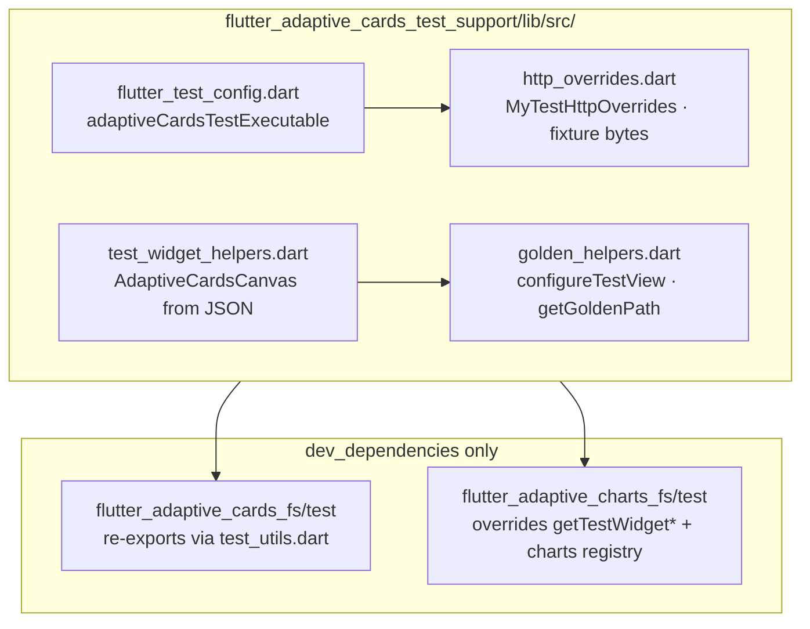

# flutter_adaptive_cards_test_support

Shared **test-only** helpers for the [Flutter-AdaptiveCards](https://github.com/freemansoft/Flutter-AdaptiveCards) monorepo.

This package is **not published** to pub.dev. It exists so `flutter_adaptive_cards_fs`, `flutter_adaptive_charts_fs`, and related packages can reuse the same widget-test harness without copying utilities into each `test/` tree.

## Package structure



## What it provides

| Module                     | Purpose                                                                                             |
| -------------------------- | --------------------------------------------------------------------------------------------------- |
| `http_overrides.dart`      | Fake HTTP client for network image/SVG requests in tests (`MyTestHttpOverrides`, fixture PNG bytes) |
| `test_widget_helpers.dart` | Build `AdaptiveCardsCanvas` widgets from JSON maps, files, or strings with optional action handlers |
| `golden_helpers.dart`      | Golden-test utilities (`configureTestView`, `getGoldenPath`, sample loaders)                        |
| `flutter_test_config.dart` | Shared `adaptiveCardsTestExecutable` bootstrap (HTTP overrides + Roboto font loading)               |

Import the barrel:

```dart
import 'package:flutter_adaptive_cards_test_support/flutter_adaptive_cards_test_support.dart';
```

## Usage in workspace packages

**`flutter_adaptive_cards_fs`** re-exports the package from `test/utils/test_utils.dart` and uses a thin `test/flutter_test_config.dart` wrapper.

**`flutter_adaptive_charts_fs`** re-exports most helpers but overrides `getTestWidgetFromMap` / `getTestWidgetFromPath` to register chart elements via `CardChartsRegistry`.

Each consuming package’s `test/flutter_test_config.dart` should delegate to `adaptiveCardsTestExecutable`:

```dart
import 'dart:async';

import 'package:flutter_adaptive_cards_test_support/flutter_adaptive_cards_test_support.dart';

Future<void> testExecutable(FutureOr<void> Function() testMain) async {
  await adaptiveCardsTestExecutable(testMain);
}
```

Roboto fonts for golden tests live in this package under `assets/fonts/Roboto/` (10 faces).
`loadAdaptiveCardsTestFonts()` resolves that directory via the package URI (so consuming
packages can keep test_support as a **dev_dependency**) and registers each face with
`FontLoader`. Consuming packages do not need their own font asset trees.

## Scope

- **In scope:** duplicated test bootstrap, HTTP mocks, widget builders, golden helpers.
- **Out of scope:** production APIs, sample apps, or host-app integration.

Do not add this package as a dependency of published libraries or sample apps—only of other packages’ `dev_dependencies` (or path dev deps within the workspace).
