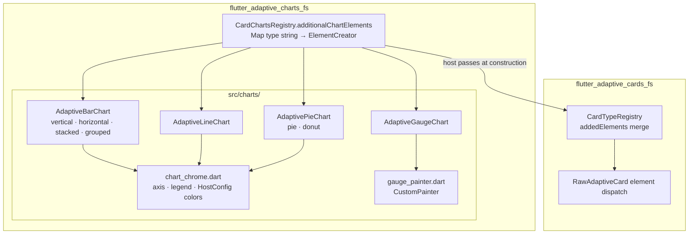

# Flutter Adaptive Charts

A set of adaptive cards that are charts based on the 1.6 Adaptive Cards spec. Packaged as a separate library to remove the dependency on the charting library from the main adaptive cards library. This charting library is available on GitHub [flutter_adaptive_charts_fs](/packages/flutter_adaptive_charts_fs/) and on [pub.dev](https://pub.dev/packages/flutter_adaptive_charts_fs). `flutter_adaptive_charts_fs` is not a standalone library. It requires [flutter_adaptive_cards_fs](/packages/flutter_adaptive_cards_fs/) available on [pub.dev](https://pub.dev/packages/flutter_adaptive_cards_fs).

## Microsoft Adaptive Cards

This project is in no way associated with Microsoft. It is an open source project to create an adaptive card implementation for Flutter.

### Flutter-AdaptiveCards mono repo

Libraries avaiable on pub.dev from this repository include:

| Package / Library                                         | pub.dev                                                                               |
| --------------------------------------------------------- | ------------------------------------------------------------------------------------- |
| The core of Adaptive Cards is supported via               | [flutter_adaptive_cards_fs](https://pub.dev/packages/flutter_adaptive_cards_fs)       |
| Supplemental Adaptive Card based charts are supported via | [flutter_adaptive_charts_fs](https://pub.dev/packages/flutter_adaptive_charts_fs)     |
| Templating is supported via the                           | [flutter_adaptive_template_fs](https://pub.dev/packages/flutter_adaptive_template_fs) |
| Backend invoke bridge is supported via                    | [flutter_adaptive_cards_host_fs](https://pub.dev/packages/flutter_adaptive_cards_host_fs) |

Utility programs available in this repository that are not published to pub.dev include:

| Design time utility                                      | Location                                                                                                |
| -------------------------------------------------------- | ------------------------------------------------------------------------------------------------------- |
| The Adaptive Card Explorer Editor                        | ([adaptive_explorer](https://github.com/freemansoft/Flutter-AdaptiveCards/tree/main/adaptive_explorer)) |
| A Widgetbook for demonstrating cards and their features: | ([widgetbook](https://github.com/freemansoft/Flutter-AdaptiveCards/tree/main/widgetbook))               |

## Package structure

Optional chart elements register with the core renderer via `CardTypeRegistry.addedElements`. This package does not depend on templating or the host bridge.



See [optional-packages-and-extensions.md](../../docs/optional-packages-and-extensions.md) for the consumer checklist.

## Supported Components

- `Chart.VerticalBar` : Vertical Bar Charts
- `chart.HorizontalBar` : Horizontal Bar Charts
- `Chart.Donutz` : Donut Chart
- `Chart.Pie` : Pie Chart
- `Chart.Line` : Line Charts
- `Chart.VerticalBar.Grouped` : Vertical Grouped Bar Charts
- `Chart.HorizontalBar.Stacked` : Horizontal Stacked Bar Charts
- `Chart.Gauge` : Gauge Charts — rendered with `CustomPainter` (not fl_chart)

## Getting started

Merge chart element creators into `CardTypeRegistry.addedElements` when building the card:

```dart
import 'package:flutter_adaptive_cards_fs/flutter_adaptive_cards_fs.dart';
import 'package:flutter_adaptive_charts_fs/flutter_adaptive_charts_fs.dart';

AdaptiveCardsCanvas.map(
  content: cardJson,
  hostConfigs: HostConfigs(),
  cardTypeRegistry: CardTypeRegistry(
    addedElements: CardChartsRegistry.additionalChartElements,
  ),
);
```

Action callbacks (`onSubmit`, `onChange`, …) belong on **`InheritedAdaptiveCardHandlers`** above the canvas — see [optional-packages-and-extensions.md](../../docs/optional-packages-and-extensions.md).

## Color Configuration

The charts package supports theme-aware color resolution via `HostConfig`. You can define a default palette and a default color for all charts in your application by updating the `chartColors` property in your `HostConfig`.

### Example: Injecting a Custom Palette

```dart
import 'package:flutter/material.dart';
import 'package:flutter_adaptive_cards_fs/flutter_adaptive_cards_fs.dart';
import 'package:flutter_adaptive_charts_fs/flutter_adaptive_charts_fs.dart';

final myConfig = HostConfig(
  chartColors: ChartColorsConfig(
    defaultPalette: [
      Colors.indigo,
      Colors.cyan,
      Colors.teal,
      Colors.amber,
    ],
    defaultColor: Colors.blueGrey,
  ),
);

AdaptiveCardsCanvas.map(
  content: cardJson,
  hostConfigs: HostConfigs(light: myConfig),
  cardTypeRegistry: CardTypeRegistry(
    addedElements: CardChartsRegistry.additionalChartElements,
  ),
);
```

### Example: JSON HostConfig

```json
{
  "chartColors": {
    "defaultPalette": ["#3F51B5", "#00BCD4", "#009688", "#FFC107"],
    "defaultColor": "#607D8B"
  }
}
```

Individual data items can still override these colors using the `"color"` property (hex or Teams semantic tokens like `"good"`, `"categoricalBlue"`, or `"divergingRed"`).

Chart JSON may also specify `"colorSet": "categorical" | "sequential" | "diverging"` to select a named palette when a series color is omitted. Per-point colors still win when present.

### Chart chrome (title, legend, axis labels)

Bar, line, pie, donut, and gauge elements support Teams chart chrome properties:

- `title` — chart title above the plot
- `xAxisTitle` / `yAxisTitle` — axis labels (bar and line)
- `showBarValues` — value labels on bars
- `showLegend` — legend for pie, donut, and gauge segments

These are rendered by the shared `ChartChrome` wrapper in this package.

## Usage

Please refer to the examples in the main repository for creating AdaptiveCards JSON that matches the charts 1.6 spec.

## Additional information

This package is part of the [Flutter-AdaptiveCards](https://github.com/freemansoft/Flutter-AdaptiveCards) ecosystem.

For more information, please visit the [Main GitHub Repository](https://github.com/freemansoft/Flutter-AdaptiveCards). There you can find details about how this package integrates with the core library, how to contribute, and how to file issues.
