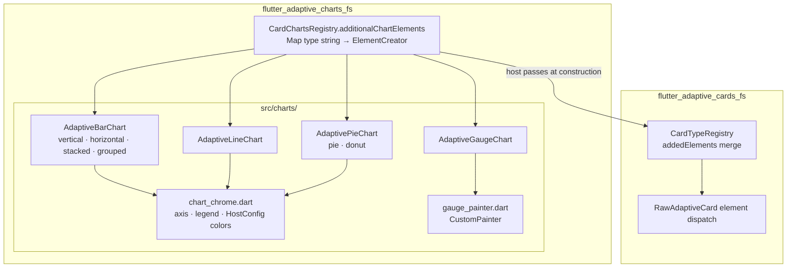

# Flutter Adaptive Charts

A set of adaptive cards that are charts based on the 1.6 Adaptive Cards spec. Packaged as a separate library to remove the dependency on the charting library from the main adaptive cards library. This charting library is available on GitHub [flutter_adaptive_charts_fs](/packages/flutter_adaptive_charts_fs/) and on [pub.dev](https://pub.dev/packages/flutter_adaptive_charts_fs). `flutter_adaptive_charts_fs` is not a standalone library. It requires [flutter_adaptive_cards_fs](/packages/flutter_adaptive_cards_fs/) available on [pub.dev](https://pub.dev/packages/flutter_adaptive_cards_fs).

## Microsoft Adaptive Cards

This project is in no way associated with Microsoft. It is an open source project to create an adaptive card implementation for Flutter.

### Flutter-AdaptiveCards mono repo

Libraries avaiable on pub.dev from this repository include:

| Package / Library                                         | pub.dev                                                                               |
| --------------------------------------------------------- | ------------------------------------------------------------------------------------- |
| The core of Adaptive Cards is supported via               | [flutter_adaptive_cards_fs](https://pub.dev/packages/flutter_adaptive_cards_fs)       |
| Supplemental Adaptive Card based charts are supported via | [flutter_adaptive_charts_fs](https://pub.dev/packages/flutter_adaptive_charts_fs)     |
| Templating is supported via the                           | [flutter_adaptive_template_fs](https://pub.dev/packages/flutter_adaptive_template_fs) |
| Backend invoke bridge is supported via                    | [flutter_adaptive_cards_host_fs](https://pub.dev/packages/flutter_adaptive_cards_host_fs) |

Utility programs available in this repository that are not published to pub.dev include:

| Design time utility                                      | Location                                                                                                |
| -------------------------------------------------------- | ------------------------------------------------------------------------------------------------------- |
| The Adaptive Card Explorer Editor                        | ([adaptive_explorer](https://github.com/freemansoft/Flutter-AdaptiveCards/tree/main/adaptive_explorer)) |
| A Widgetbook for demonstrating cards and their features: | ([widgetbook](https://github.com/freemansoft/Flutter-AdaptiveCards/tree/main/widgetbook))               |

## Package structure

Optional chart elements register with the core renderer via `CardTypeRegistry.addedElements`. This package does not depend on templating or the host bridge.



See [optional-packages-and-extensions.md](../../docs/optional-packages-and-extensions.md) for the consumer checklist.

## Supported Components

- `Chart.VerticalBar` : Vertical Bar Charts
- `chart.HorizontalBar` : Horizontal Bar Charts
- `Chart.Donutz` : Donut Chart
- `Chart.Pie` : Pie Chart
- `Chart.Line` : Line Charts
- `Chart.VerticalBar.Grouped` : Vertical Grouped Bar Charts
- `Chart.HorizontalBar.Stacked` : Horizontal Stacked Bar Charts
- `Chart.Gauge` : Gauge Charts — rendered with `CustomPainter` (not fl_chart)

## Implementation status

Status of `Chart.*` elements against the Microsoft/Teams charts reference. This is the package-specific slice of the project-wide [Implementation Status Matrix](https://github.com/freemansoft/Flutter-AdaptiveCards/blob/main/docs/Implementation-Status.md) (core elements, inputs, actions, and HostConfig live there).

Legend: ✅ complete · ⚠️ partial · ❌ missing

| Chart Type                    | Microsoft Spec                                                                                                                  | Implementation | Tests      | Notes                                                                                                                                                                                                    |
| ----------------------------- | ------------------------------------------------------------------------------------------------------------------------------- | -------------- | ---------- | -------------------------------------------------------------------------------------------------------------------------------------------------------------------------------------------------------- |
| `Chart.Line`                  | [Teams charts](https://learn.microsoft.com/en-us/microsoftteams/platform/task-modules-and-cards/cards/charts-in-adaptive-cards) | ⚠️ Partial     | ⚠️ Limited | Data + axis rendering; `title` / axis titles via [ChartChrome](lib/src/charts/chart_chrome.dart); ISO datetime `x` values parsed to epoch ms (`parseChartXValue`)                                        |
| `Chart.Pie`                   | Teams charts                                                                                                                    | ⚠️ Partial     | ⚠️ Limited | Slice rendering; `title` / `showLegend` via ChartChrome                                                                                                                                                  |
| `Chart.Donut`                 | Teams charts                                                                                                                    | ⚠️ Partial     | ⚠️ Limited | Same as Pie with hole radius + ChartChrome                                                                                                                                                               |
| `Chart.VerticalBar`           | Teams charts                                                                                                                    | ⚠️ Partial     | ⚠️ Limited | Bars + `title`, axis titles, `showBarValues`, `showLegend`, `colorSet`                                                                                                                                   |
| `Chart.HorizontalBar`         | Teams charts                                                                                                                    | ⚠️ Partial     | ⚠️ Limited | Same chrome as vertical bar                                                                                                                                                                              |
| `Chart.VerticalBar.Grouped`   | Teams charts                                                                                                                    | ⚠️ Partial     | ⚠️ Limited | Grouped and stacked (`stacked: true`) modes supported                                                                                                                                                    |
| `Chart.HorizontalBar.Stacked` | Teams charts                                                                                                                    | ⚠️ Partial     | ⚠️ Limited | Stacked horizontal bars                                                                                                                                                                                  |
| `Chart.Gauge`                 | Teams charts                                                                                                                    | ✅ Implemented | ✅ Yes     | `CustomPainter` semicircular gauge (`value`, `min`/`max`, `segments`, `valueFormat`, legend)                                                                                                             |

Microsoft does **not** define a separate `Chart.VerticalBar.Stacked` type; stacked vertical bars use `Chart.VerticalBar.Grouped` with `"stacked": true`.

### Chart property gaps (all chart types)

| Property / area             | Status | Notes                                                                                                                                                                                                                                                |
| --------------------------- | ------ | --------------------------------------------------------------------------------------------------------------------------------------------------------------------------------------------------------------------------------------------------- |
| `data`                      | ✅     | Parsed and rendered for implemented chart types                                                                                                                                                                                                      |
| `color` (per point)         | ⚠️     | Hex + Teams semantic tokens (`good`, `categoricalBlue`, `divergingRed`, …) via [chart_colors_config.dart](https://github.com/freemansoft/Flutter-AdaptiveCards/blob/main/packages/flutter_adaptive_cards_fs/lib/src/hostconfig/chart_colors_config.dart) |
| `colorSet`                  | ✅     | Named palettes (`categorical`, `sequential`, `diverging`) on chart JSON + HostConfig `defaultPalette` fallback                                                                                                                                       |
| `title`                     | ✅     | Rendered via ChartChrome on bar, line, pie, donut, and gauge                                                                                                                                                                                         |
| `xAxisTitle` / `yAxisTitle` | ✅     | Bar and line charts (fl_chart axis titles)                                                                                                                                                                                                           |
| `showBarValues`             | ✅     | Vertical and horizontal bar charts                                                                                                                                                                                                                   |
| `showLegend`                | ✅     | Pie, donut, gauge segment legend; bar/line when enabled                                                                                                                                                                                              |
| `targetWidth`               | ❌     | Responsive layout not implemented                                                                                                                                                                                                                    |
| `grid.area`                 | ❌     | `Layout.AreaGrid` placement not implemented                                                                                                                                                                                                          |
| `height: stretch`           | ❌     | Block height modes not implemented on chart elements                                                                                                                                                                                                 |
| HostConfig `chartColors`    | ✅     | `defaultPalette` and `defaultColor`                                                                                                                                                                                                                  |
| HostConfig `chartsLayout`   | ✅     | Line, bar, pie, and donut layout chrome — see [charts layout plan](https://github.com/freemansoft/Flutter-AdaptiveCards/blob/main/docs/superpowers/plans/2026-06-08-charts-layout-config.plan.md)                                                    |

### Known gaps

`Chart.Gauge`, chart chrome (`ChartChrome`: title, legend, axis labels), and `colorSet` palettes are **implemented**. The remaining cross-cutting chart gaps — responsive `targetWidth`, `grid.area` placement, and block `height: stretch` — are listed in the **Chart property gaps** table above.

## Getting started

Merge chart element creators into `CardTypeRegistry.addedElements` when building the card:

```dart
import 'package:flutter_adaptive_cards_fs/flutter_adaptive_cards_fs.dart';
import 'package:flutter_adaptive_charts_fs/flutter_adaptive_charts_fs.dart';

AdaptiveCardsCanvas.map(
  content: cardJson,
  hostConfigs: HostConfigs(),
  cardTypeRegistry: CardTypeRegistry(
    addedElements: CardChartsRegistry.additionalChartElements,
    overlayExtensions: CardChartsRegistry.overlayExtensions,
  ),
);
```

Action callbacks (`onSubmit`, `onChange`, …) belong on **`InheritedAdaptiveCardHandlers`** above the canvas — see [optional-packages-and-extensions.md](../../docs/optional-packages-and-extensions.md).

## Color Configuration

The charts package supports theme-aware color resolution via `HostConfig`. You can define a default palette and a default color for all charts in your application by updating the `chartColors` property in your `HostConfig`.

### Example: Injecting a Custom Palette

```dart
import 'package:flutter/material.dart';
import 'package:flutter_adaptive_cards_fs/flutter_adaptive_cards_fs.dart';
import 'package:flutter_adaptive_charts_fs/flutter_adaptive_charts_fs.dart';

final myConfig = HostConfig(
  chartColors: ChartColorsConfig(
    defaultPalette: [
      Colors.indigo,
      Colors.cyan,
      Colors.teal,
      Colors.amber,
    ],
    defaultColor: Colors.blueGrey,
  ),
);

AdaptiveCardsCanvas.map(
  content: cardJson,
  hostConfigs: HostConfigs(light: myConfig),
  cardTypeRegistry: CardTypeRegistry(
    addedElements: CardChartsRegistry.additionalChartElements,
    overlayExtensions: CardChartsRegistry.overlayExtensions,
  ),
);
```

### Example: JSON HostConfig

```json
{
  "chartColors": {
    "defaultPalette": ["#3F51B5", "#00BCD4", "#009688", "#FFC107"],
    "defaultColor": "#607D8B"
  }
}
```

Individual data items can still override these colors using the `"color"` property (hex or Teams semantic tokens like `"good"`, `"categoricalBlue"`, or `"divergingRed"`).

Chart JSON may also specify `"colorSet": "categorical" | "sequential" | "diverging"` to select a named palette when a series color is omitted. Per-point colors still win when present.

### Chart chrome (title, legend, axis labels)

Bar, line, pie, donut, and gauge elements support Teams chart chrome properties:

- `title` — chart title above the plot
- `xAxisTitle` / `yAxisTitle` — axis labels (bar and line)
- `showBarValues` — value labels on bars
- `showLegend` — legend for pie, donut, and gauge segments

These are rendered by the shared `ChartChrome` wrapper in this package.

## Usage

Please refer to the examples in the main repository for creating AdaptiveCards JSON that matches the charts 1.6 spec.

## Additional information

This package is part of the [Flutter-AdaptiveCards](https://github.com/freemansoft/Flutter-AdaptiveCards) ecosystem.

For more information, please visit the [Main GitHub Repository](https://github.com/freemansoft/Flutter-AdaptiveCards). There you can find details about how this package integrates with the core library, how to contribute, and how to file issues.
