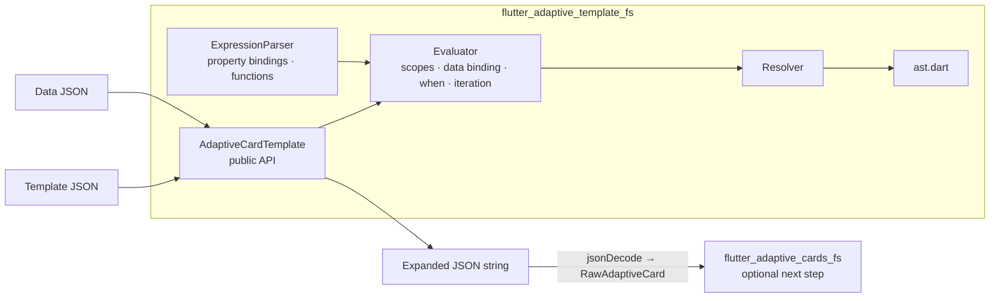

# Flutter Adaptive Template

A template engine for adaptive cards, enabling data binding and dynamic rendering of adaptive card payloads in Flutter available on GitHub [flutter_adaptive_template_fs](/packages/flutter_adaptive_template_fs/) and on [pub.dev](https://pub.dev/packages/flutter_adaptive_template_fs) that is expected to be used with  [pub.dev](https://pub.dev/packages/flutter_adaptive_cards_fs) on GitHub at [flutter_adaptive_cards_fs](/packages/flutter_adaptive_cards_fs/) .

## Microsoft Adaptive Cards

This project is in no way associated with Microsoft. It is an open source project to create an adaptive card implementation for Flutter.

### Flutter-AdaptiveCards mono repo

Libraries avaiable on pub.dev from this repository include:

| Package / Library                                         | pub.dev                                                                                   |
| --------------------------------------------------------- | ----------------------------------------------------------------------------------------- |
| The core of Adaptive Cards is supported via               | [flutter_adaptive_cards_fs](https://pub.dev/packages/flutter_adaptive_cards_fs)           |
| Supplemental Adaptive Card based charts are supported via | [flutter_adaptive_charts_fs](https://pub.dev/packages/flutter_adaptive_charts_fs)         |
| Templating is supported via the                           | [flutter_adaptive_template_fs](https://pub.dev/packages/flutter_adaptive_template_fs)     |
| Backend invoke bridge is supported via                    | [flutter_adaptive_cards_host_fs](https://pub.dev/packages/flutter_adaptive_cards_host_fs) |

Utility programs available in this repository that are not published to pub.dev include:

| Design time utility                                      | Location                                                                                                |
| -------------------------------------------------------- | ------------------------------------------------------------------------------------------------------- |
| The Adaptive Card Explorer Editor                        | ([adaptive_explorer](https://github.com/freemansoft/Flutter-AdaptiveCards/tree/main/adaptive_explorer)) |
| A Widgetbook for demonstrating cards and their features: | ([widgetbook](https://github.com/freemansoft/Flutter-AdaptiveCards/tree/main/widgetbook))               |

## Package structure

Standalone templating — no dependency on `flutter_adaptive_cards_fs`. Output is expanded card JSON for the renderer.



Design detail: [adaptive-template-design.md](../../docs/adaptive-template-design.md).

## Usage

You can use the `AdaptiveCardTemplate` to expand a JSON-based template with a data Map.

```dart
import 'dart:convert';
import 'package:flutter_adaptive_template_fs/flutter_adaptive_template_fs.dart';

void main() {
  // 1. Define your template (usually loaded from a file or asset using jsonDecode)
  final templateJson = {
    'type': 'TextBlock',
    'text': r'Hello, ${name}!'
  };

  // 2. Define your data (usually loaded from an API or local file)
  final data = {
    'name': 'Matt'
  };

  // 3. Create the template instance
  final template = AdaptiveCardTemplate(templateJson);

  // 4. Expand the template with the provided data
  final String mergedPayload = template.expand(data);

  // The output is a JSON string with the expanded placeholders
  print(mergedPayload); // {"type":"TextBlock","text":"Hello, Matt!"}
}
```

## Status: MVP Implemented

Current implementation supports:

- Basic property binding `${prop}`
- Deep property binding `${path.to.prop}`
- Array indexing `${map[0].prop}`
- Scope switching with `$data`
- Iteration with `$data` (applied to lists)
- Conditional rendering with `$when`
- Built-in expressions (e.g., `if()`, `json()`)
- Magic variables: `$root`, `$index`

### Feature coverage

Templating status against the Microsoft templating spec. This is the package-specific slice of the project-wide [Implementation Status Matrix](https://github.com/freemansoft/Flutter-AdaptiveCards/blob/main/docs/Implementation-Status.md). Legend: ✅ complete · ⚠️ partial.

| Feature              | Microsoft Spec                                                                                                           | Implementation | Tests  | Documentation                                                                                                                  | Notes                                                                                                                                                                                                                                                                                                                   |
| -------------------- | ------------------------------------------------------------------------------------------------------------------------ | -------------- | ------ | ----------------------------------------------------------------------------------------------------------------------------- | ----------------------------------------------------------------------------------------------------------------------------------------------------------------------------------------------------------------------------------------------------------------------------------------------------------------------- |
| Template Expansion   | [spec](https://learn.microsoft.com/en-us/adaptive-cards/templating/)                                                     | ✅ Complete    | ✅ Yes | [adaptive-template-design.md](https://github.com/freemansoft/Flutter-AdaptiveCards/blob/main/docs/adaptive-template-design.md) | `Evaluator` in `flutter_adaptive_template_fs`                                                                                                                                                                                                                                                                           |
| `$data` Scoping      | [spec](https://learn.microsoft.com/en-us/adaptive-cards/templating/language)                                             | ✅ Complete    | ✅ Yes | [adaptive-template-design.md](https://github.com/freemansoft/Flutter-AdaptiveCards/blob/main/docs/adaptive-template-design.md) | `_dataStack` in `Evaluator`                                                                                                                                                                                                                                                                                             |
| `$root` Reference    | [spec](https://learn.microsoft.com/en-us/adaptive-cards/templating/language)                                             | ✅ Complete    | ✅ Yes | [adaptive-template-design.md](https://github.com/freemansoft/Flutter-AdaptiveCards/blob/main/docs/adaptive-template-design.md) | Scoped via `_scopeStack`                                                                                                                                                                                                                                                                                                |
| `$index` in Arrays   | [spec](https://learn.microsoft.com/en-us/adaptive-cards/templating/language)                                             | ✅ Complete    | ✅ Yes | [adaptive-template-design.md](https://github.com/freemansoft/Flutter-AdaptiveCards/blob/main/docs/adaptive-template-design.md) | Available during array repetition                                                                                                                                                                                                                                                                                       |
| Array Binding        | [spec](https://learn.microsoft.com/en-us/adaptive-cards/templating/language)                                             | ✅ Complete    | ✅ Yes | [adaptive-template-design.md](https://github.com/freemansoft/Flutter-AdaptiveCards/blob/main/docs/adaptive-template-design.md) | `$data` pointing to array triggers repeater                                                                                                                                                                                                                                                                             |
| `$when` Conditional  | [spec](https://learn.microsoft.com/en-us/adaptive-cards/templating/language)                                             | ✅ Complete    | ✅ Yes | [adaptive-template-design.md](https://github.com/freemansoft/Flutter-AdaptiveCards/blob/main/docs/adaptive-template-design.md) | `null`/`false` → element excluded                                                                                                                                                                                                                                                                                       |
| `json()` Function    | [spec](https://learn.microsoft.com/en-us/adaptive-cards/templating/language)                                             | ✅ Complete    | ✅ Yes | [adaptive-template-design.md](https://github.com/freemansoft/Flutter-AdaptiveCards/blob/main/docs/adaptive-template-design.md) | Parses embedded JSON strings                                                                                                                                                                                                                                                                                            |
| `if()` Expressions   | [spec](https://learn.microsoft.com/en-us/adaptive-cards/templating/language)                                             | ✅ Complete    | ✅ Yes | [adaptive-template-design.md](https://github.com/freemansoft/Flutter-AdaptiveCards/blob/main/docs/adaptive-template-design.md) | Conditional value selection                                                                                                                                                                                                                                                                                             |
| Adaptive Expressions | [spec](https://learn.microsoft.com/en-us/azure/bot-service/adaptive-expressions/adaptive-expressions-prebuilt-functions) | ⚠️ Partial     | ✅ Yes | -                                                                                                                             | Implemented: operators, string, math, logic; date `formatDateTime`/`date`/`year`/`month`/`dayOfMonth`/`utcNow`/`addDays`/`addHours`/`addMinutes`/`addSeconds`/`formatEpoch`/`getPastTime`/`getFutureTime`; collection `join`/`first`/`last`/`sum`/`average`. Missing: `select`/`where` (require lazy lambda evaluation) |

### Known gaps

Adaptive Expressions `select` / `where` are **not implemented** (they require lazy lambda evaluation); all other collection and date functions are. See the **Adaptive Expressions** row in the table above.

## Additional information

This package is part of the [Flutter-AdaptiveCards](https://github.com/freemansoft/Flutter-AdaptiveCards) ecosystem.

For more information, please visit the [Main GitHub Repository](https://github.com/freemansoft/Flutter-AdaptiveCards). There you can find details about how this package integrates with the core library, how to contribute, and how to file issues.

## Demonstration

The [Adaptive Card Explorer Editor](https://github.com/freemansoft/Flutter-AdaptiveCards/tree/main/adaptive_explorer) demonstrates the use of templates.
